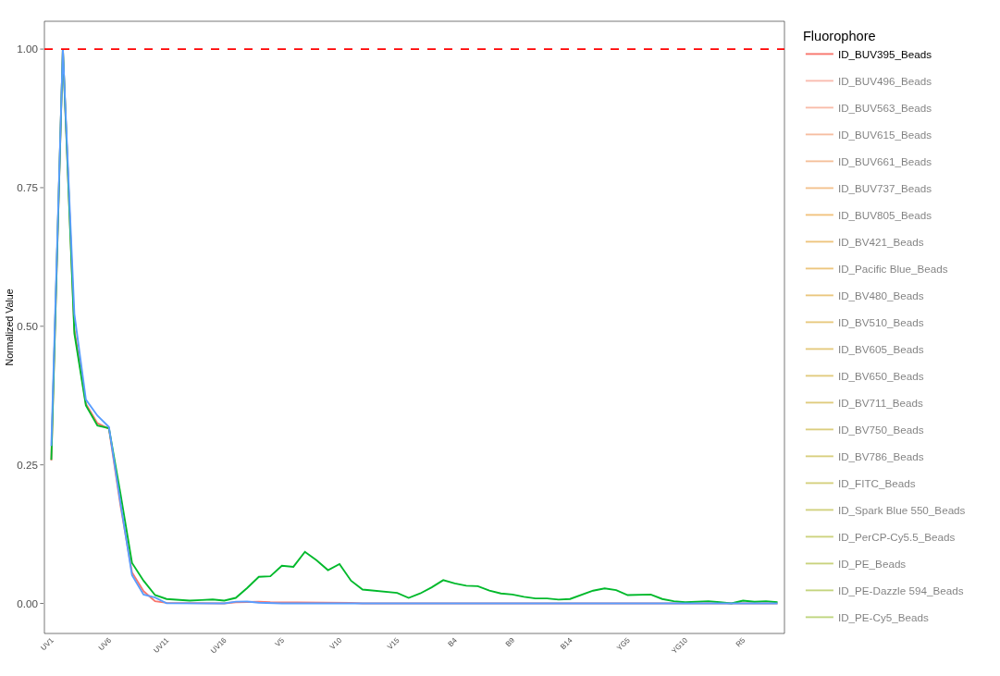
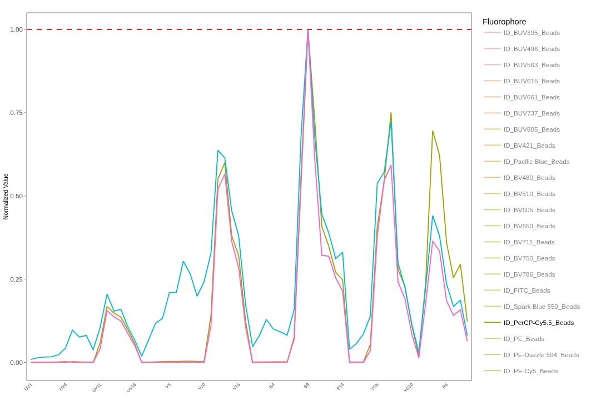
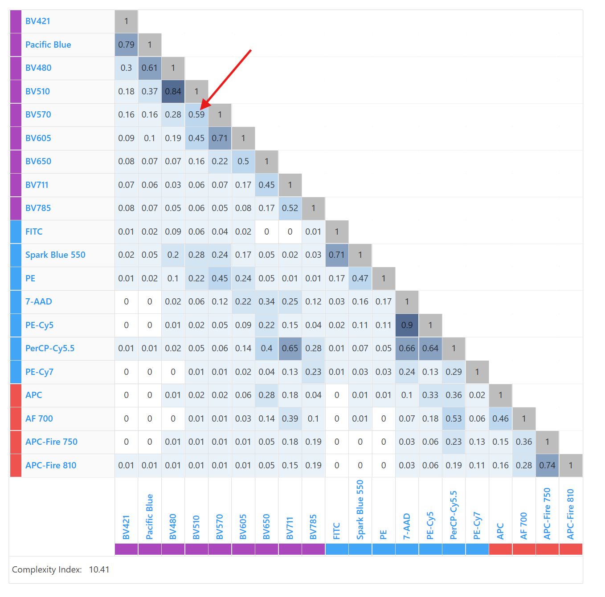
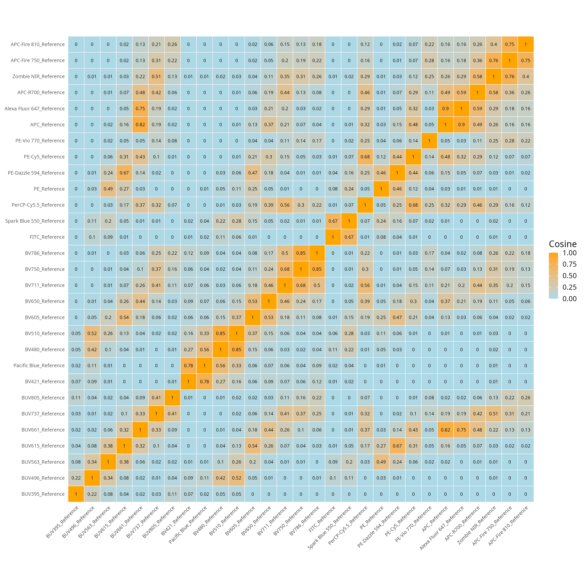
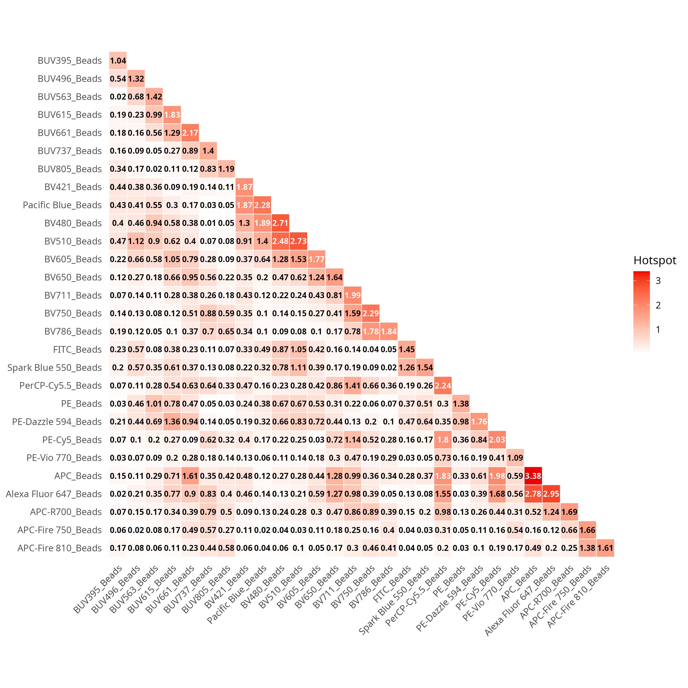
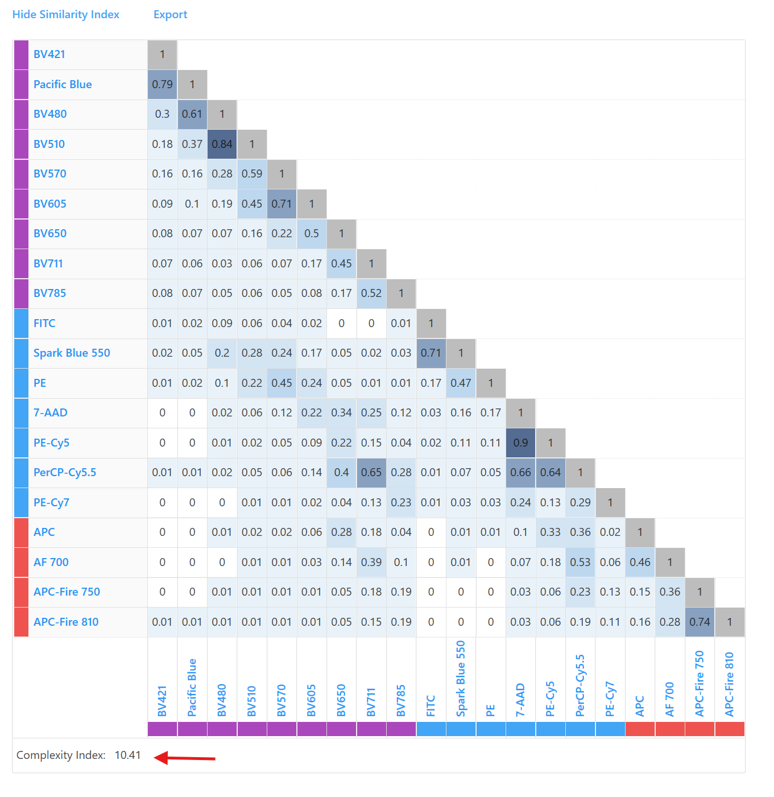
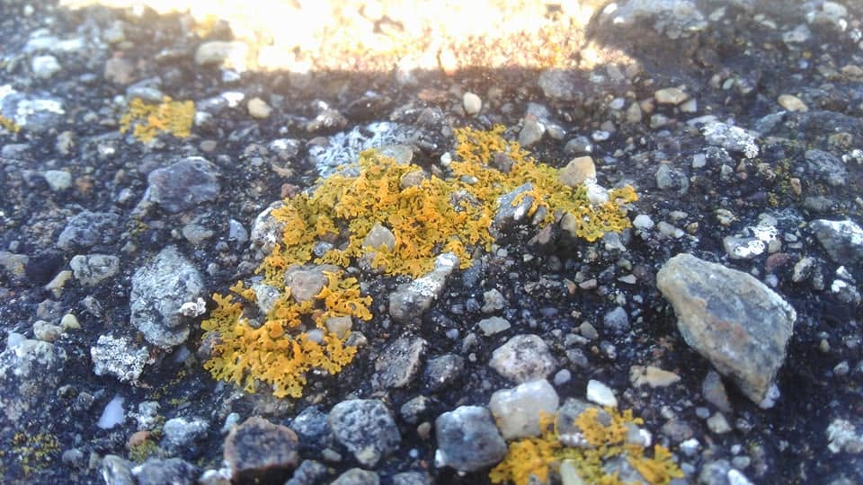

::: {style="text-align: right;"}
[](https://www.gnu.org/licenses/agpl-3.0.en.html) [](http://creativecommons.org/licenses/by-sa/4.0/)
:::

For the YouTube livestream recording, see [here](https://www.youtube.com/live/ljWMwOY0VyY?si=JlArdAhSY1faX0y6&t=162)

For screen-shot slides, click [here](/course/13_SpectralSimilarities/slides.qmd)

<br>

---

# Background

::: {.fragment}
::: {.callout-tip title="."}
Welcome to [Week 13](/Schedule.qmd#similarities-and-hotspots) of the course. Over the past two weeks, we have seen how to [isolate](/course/12_SpectralSignatures/index.qmd) normalized fluorescent signatures from our unmixing controls. We have also explored ways to [make this process](/course/SDY3080/SignatureMatrices.qmd) more feasible (and less painful) to implement when working with all the fluorophores in our panel.
:::
:::

---

::: {.fragment}
::: {.callout-tip title="."}
The focus of today's walkthrough will be to explore the various ways by which we can compare these normalized fluorescent signatures to each other, and try to infer how our proposed fluorophore panels will perform when we factor in regions of signature overlap that are present between the fluorophores. This in turn can lead to improved panel designs (as we try to reduce the extent of the overlap to improve resolution) in future panels. 
:::
:::

---

::: {.fragment}
::: {.callout-tip title="."}
By the end of this primary walkthrough (and the bonus content), you will also hopefully have a better understanding about what goes into the various panel metrics displayed by various commercial vendors. 
:::
:::

---

# Walk Through

## Set Up

::: {.fragment}
::: {.callout-tip title="."}
As always, lets start by loading to our local environment any R packages that we are likely to need today. 
:::
:::


::: {.fragment}
```{r}
library(dplyr)
library(purrr)
library(stringr)
library(ggplot2)
library(Luciernaga)
library(tidyr)
library(tibble)
```

:::

---

::: {.fragment}
::: {.callout-tip title="."}
We will start off by first working with the signature matrices for the bead and cell single-color controls from the [SDY3080](https://www.immport.org/shared/search?text=SDY3080) dataset that we completed retrieving as part of the bonus [Signature Matrices](/course/SDY3080/SignatureMatrices.qmd) walk-through. These were saved as .csv files that can be found in this week's data folder. 
:::
:::


::: {.fragment}
```{r}
#StorageLocation <- file.path("course", "13_SpectralSimilarities", "data")
StorageLocation <- file.path("data")

#OutputLocation <- file.path("course", "13_SpectralSimilarities", "outputs")
OutputLocation <- file.path("outputs")
```

:::

---

::: {.fragment}
::: {.callout-tip title="."}
Lets go ahead and load the signature matrix that we derived from the bead single-color controls. 
:::
:::


::: {.fragment}
```{r}
BeadsPath <- list.files(StorageLocation, pattern="BeadInitialSignature", full.names=TRUE)
BeadData <- read.csv(BeadsPath, check.names=FALSE)
BeadData <- BeadData |> filter(!str_detect(Fluorophore, "Unstained"))
head(BeadData, 3)
```

:::

---

::: {.fragment}
::: {.callout-tip title="."}
And repeat the same process for the signature matrix retrieved from the cell-single color controls. 
:::
:::


::: {.fragment}
```{r}
CellsPath <- list.files(StorageLocation, pattern="CellInitialSignature", full.names=TRUE)
CellsData <- read.csv(CellsPath, check.names=FALSE)
CellsData <- CellsData |> filter(!str_detect(Fluorophore, "Unstained"))
head(CellsData, 3)
```

:::

---

::: {.fragment}
::: {.callout-tip title="."}
Additionally, lets retrieve the reference signatures for our respective fluorophores as they are stored in `Luciernaga()` for easier comparison of the references vs. the signatures we ourselves derived. 
:::
:::


::: {.fragment}
```{r}
OurFluorophores <- CellsData |> pull(Fluorophore)

Data <- Luciernaga:::InstrumentReferences(64) |> filter(Fluorophore %in% OurFluorophores) 

ReferenceData <- Data |> select(-Instrument) |>
      tidyr::pivot_wider(names_from="Detector", values_from="AdjustedY")

head(ReferenceData, 3)
```

:::

---

### Rearranging by Detector

::: {.fragment}
::: {.callout-tip title="."}
Now that we have our 3 signature matrices, to make our lives a little bit easier, lets rearrange the rows so that we see the fluorophores displayed in order of peak detector according to laser and wavelength. We can first modify the tidying code we had to retrieve the `Luciernaga` references to instead retrieve the peak detectors for each fluorophore. 
:::
:::


::: {.fragment}
```{r}
# Determine Peak Detectors for rearranging later
PeakDetectors <- Data |> group_by(Fluorophore) |>
      arrange(desc(AdjustedY)) |> slice(1) |> ungroup() |>
      select(!c(Instrument, AdjustedY))

PeakDetectors
```

:::

---

::: {.fragment}
::: {.callout-tip title="."}
We then need to relocate our previously written code containing the instrument detector (to avoid re-typing the vector of detector names in correct sequence by hand again). Alternatively, if you have a raw .fcs file, you could load it into a GatingSet, run `colnames()`, and copy and paste the output into the code-chunk, adding the "" and commas as needed to save on typing time. 
:::
:::


::: {.fragment}
```{r}
DetectorOrder <- c("UV1", "UV2", "UV3", "UV4", "UV5", "UV6", "UV7", "UV8",
               "UV9", "UV10", "UV11", "UV12", "UV13", "UV14", "UV15", "UV16",
               "V1", "V2", "V3", "V4", "V5", "V6", "V7", "V8",
               "V9", "V10", "V11","V12", "V13", "V14", "V15", "V16",
               "B1", "B2", "B3", "B4", "B5", "B6", "B7", "B8",
               "B9", "B10", "B11", "B12", "B13", "B14",
               "YG1", "YG2", "YG3", "YG4", "YG5", "YG6", "YG7", "YG8", "YG9", "YG10",
               "R1", "R2", "R3", "R4", "R5", "R6", "R7", "R8")
```

:::

---

::: {.fragment}
::: {.callout-tip title="."}
Now that we have the vector with the correct sequence, we can `factor()` the Detector column peak detectors data.frame, setting levels equal to our vector. Once this is done, we can use `rearrange()` to place the rows in the correct order on the basis of our designated levels. Once this is done, we can `pull()` the Fluorophore column to retrieve a vector of Fluorophore names in their now corrected sequence across lasers and wavelengths (thanks to the rearrangement we carried out on the Detector column).  
:::
:::


::: {.fragment}
```{r}
PeakDetectors$Detector <- factor(PeakDetectors$Detector, levels=DetectorOrder)

FluorophoreOrder <- PeakDetectors |> arrange(Detector) |>
     unique() |> pull(Fluorophore)

FluorophoreOrder
```

:::

---

::: {.fragment}
::: {.callout-tip title="."}
With this vector of fluorophores in the correct sequence now retrieved, we just need to rearrange our individual data.frame objects to also match. We can `factor()` their individual Fluorophore columns, providing the Fluorophore vector as their levels argument, before following up with the `dplyr` `arrange()` function
:::
:::


::: {.fragment}
```{r}
BeadData$Fluorophore <- factor(BeadData$Fluorophore, levels=FluorophoreOrder)
BeadData <- BeadData |> arrange(Fluorophore)
head(BeadData,3)
```

:::

---


::: {.fragment}
```{r}
CellsData$Fluorophore <- factor(CellsData$Fluorophore, levels=FluorophoreOrder)
CellsData <- CellsData |> arrange(Fluorophore)
head(CellsData,3)
```

:::

---


::: {.fragment}
```{r}
ReferenceData$Fluorophore <- factor(ReferenceData$Fluorophore, levels=FluorophoreOrder)
ReferenceData <- ReferenceData |> arrange(Fluorophore)
head(ReferenceData,3)
```

:::

---

::: {.fragment}
::: {.callout-tip title="."}
And with that, most of our data tidying steps are complete. Lets start comparing signatures!
:::
:::

## Panel 

::: {.fragment}
::: {.callout-tip title="."}
Before going to far, lets refresh our memory for this Cytek Aurora 5-laser panel of how these fluorophores are distributed across the various lasers and wavelengths. 
:::
:::


::: {.fragment}
```{r}
TableData <- CellsData |> select(Fluorophore, Antigen) |> mutate(Day=1)
rownames(TableData) <- NULL
Table <- FluorophoreMatrix(TableData, NumberDetectors = 64)
```

:::

---


::: {.fragment}
```{r}
#| echo: FALSE
Table
```

:::

---

::: {.fragment}
::: {.callout-tip title="."}
One of the main reasons I like visualizing a panel in this way, is that it is helpful when determining how various combinations of fluorophores will behave together when placed in a panel. 
:::
:::

::: {.fragment}
::: {.callout-tip title="."}
Speaking generally, fluorophores typically have three common types of interactions
:::
:::

---

- **Intra-laser** (between fluorophores on adjacent detectors on the same laser)

```{r}
#| echo: FALSE

Example <- ReferenceData |> filter(Fluorophore %in% c("BV510", "BV605"))

Plots <- VisualizeSignatures(data=Example,
 columnname="Fluorophore", Normalize = FALSE)

plotly::ggplotly(Plots)
```

---

- **Inter-laser** (between fluorophores with similar wavelength emissions on different lasers)

```{r}
#| echo: FALSE

Example <- ReferenceData |> filter(Fluorophore %in% c("BUV737", "APC-R700"))

Plots <- VisualizeSignatures(data=Example,
 columnname="Fluorophore", Normalize = FALSE)

plotly::ggplotly(Plots)
```

---

- **Tandem** (between the tandem and the parent fluorophores, especially if the tandem is starting to degrade). 

```{r}
#| echo: FALSE

Example <- CellsData |> filter(Fluorophore %in% c("APC", "APC-Fire 810")) |> 
     select(-c("name", "Antigen", "Type", "Detector", "Negative"))

Plots <- VisualizeSignatures(data=Example,
 columnname="Fluorophore", Normalize = FALSE)

plotly::ggplotly(Plots)
```

----

::: {.fragment}
::: {.callout-tip title="."}
While all the above occur partly due to the nature of the flurophores themselves, we have to remember that the extent that they cause issues in our panel can be partially mediated depending on the co-expression pattern of your cell populations for the respective antigens. If you have fluorophores that interact, but they are found on two separate cell populations, then this issue will be minimized vs. if both markers are expressed on the same cell. 
:::
:::

## Signatures

::: {.fragment}
::: {.callout-tip title="."}
Let's go ahead and use `VisualizeSignatures()` to see our retrieved signatures.
:::
:::

---

::: {.fragment}
::: {.callout-tip title="."}
For the bead single-color controls, we get the following signatures
:::
:::


::: {.fragment}
```{r}
BeadData2 <- BeadData |>
      select(-c("name", "Antigen", "Type", "Detector", "Negative"))

Plots <- VisualizeSignatures(data=BeadData2,
 columnname="Fluorophore", Normalize = FALSE)
```

:::

---

::: {.fragment}
```{r}
plotly::ggplotly(Plots)
```

:::

---

::: {.fragment}
::: {.callout-tip title="."}
For the cell single-color controls, we get the following signatures
:::
:::


::: {.fragment}
```{r}
CellsData2 <- CellsData |>
      select(-c("name", "Antigen", "Type", "Detector", "Negative"))

Plots <- VisualizeSignatures(data=CellsData2,
 columnname="Fluorophore", Normalize = FALSE)
```

:::

---


::: {.fragment}
```{r}
plotly::ggplotly(Plots)
```

:::

---

::: {.fragment}
::: {.callout-tip title="."}
And for the reference signatures, we see the following
:::
:::


::: {.fragment}
```{r}
Plots <- VisualizeSignatures(data=ReferenceData,
 columnname="Fluorophore", Normalize = FALSE)
```

:::

---


::: {.fragment}
```{r}
plotly::ggplotly(Plots)
```

:::

---

### Direct Comparison

::: {.fragment}
::: {.callout-tip title="."}
The simplest way of comparing our retrieved signatures would be to visualize those we want to compare in the same plot. To do this for our datasets, let us carry out some of the required data tidying first, to avoid accidental confusion (or overwriting) when there are 3 identically named "APC" fluorophores in the same data.frame. 
:::
:::

---

::: {.fragment}
::: {.callout-tip title="."}
Within the 'Fluorophore' column of each data.frame, we can combine the existing name with an additional identifying character string using the `paste0()` function, before assigning back to the original (in the process overwriting it with the modified version)
:::
:::


::: {.fragment}
```{r}
BeadData2$Fluorophore <- paste0(BeadData2$Fluorophore, "_Beads")
CellsData2$Fluorophore <- paste0(CellsData2$Fluorophore, "_Cells")
ReferenceData$Fluorophore <- paste0(ReferenceData$Fluorophore, "_Reference")
```

:::

---

::: {.fragment}
::: {.callout-tip title="."}
Separately, the 'Reference' data.frame has different column names for the detector columns compared to the Cell and Bead data.frames. 
:::
:::


::: {.fragment}
```{r}
setdiff(colnames(CellsData), colnames(ReferenceData))
```

:::

---


::: {.fragment}
```{r}
setdiff(colnames(ReferenceData), colnames(CellsData))
```

:::

---

::: {.fragment}
::: {.callout-tip title="."}
So that they can match, we will need to add the "-A" to the `colnames()` of ReferenceData. From there, we can combine the rows of  all three data.frames via either the `rbind()` or `bind_rows()` function, ending up with a large data.frame object. 
:::
:::


::: {.fragment}
```{r}
colnames(ReferenceData)[2:ncol(ReferenceData)] <- paste0(colnames(ReferenceData)[2:ncol(ReferenceData)], "-A")
Dataset <- rbind(BeadData2, CellsData2, ReferenceData)
```

:::

---

::: {.fragment}
::: {.callout-tip title="."}
Now that we have assembled Dataset, we can compare all three sets of signatures using `VisualizeSignatures()` and `ggplotly()` to open an interactive view. 
:::
:::


::: {.fragment}
```{r}
Plots <- VisualizeSignatures(data=Dataset,
 columnname="Fluorophore", Normalize = FALSE)
```

:::

---


::: {.fragment}
```{r}
plotly::ggplotly(Plots)
```

:::

---

::: {.fragment}
::: {.callout-tip title="."}
One of the nice things about `ggplotly()` is it allows you to export an image of what you are seeing directly, by clicking on the camera icon, and selecting the desired storage location. 
:::
:::

---


---

::: {.fragment}
::: {.callout-tip title="."}
As we start off, we can see that for BUV395, the reference and bead controls are fairly similar, although the cell control appears to have some autofluorescence residuals left over
:::
:::

---



---

::: {.fragment}
::: {.callout-tip title="."}
By contrast, for PerCP-Cy5.5, all three are discordant in their own unique ways. 
:::
:::

---



---

::: {.fragment}
::: {.callout-tip title="."}
Whether the differences we see between our beads and the reference controls PerCP-Cy5.5 is due to acquisition on different instruments (different lasers, gains, etc.), or differences at the fluorophore manufacturer/batch level is something to be explored on another day. 
:::
:::

---

::: {.fragment}
::: {.callout-tip title="."}
Utilmately, this approach works really well when it comes to seeing the differences, and we are able to describe how they are different, so it can be both quantitative and qualitative. Hoeverer, it is clearly not a high-throughput approach. Ultimately, many of the metrics we use when comparing signatures are attempts at putting a number to these differences, allowing for less painful implementation in a typical computational workflow. 
:::
:::

---

## Cosine

::: {.fragment}
::: {.callout-tip title="."}
If you use a [Cytek Aurora](https://youtu.be/A2rV8feuwww?si=csBV-L5Z0fq2w6oE), you may be familiar with this screen in SpectroFlo, which displays a "similarity matrix".  
:::
:::

---



---

::: {.fragment}
::: {.callout-tip title="."}
When being trained on the instrument, you may have also been taught that the values displayed are meant to describe how similar two fluorophores are to each other. 
:::
:::

---

::: {.fragment}
::: {.callout-tip title="."}
Behind the [curtain](https://patentimages.storage.googleapis.com/ec/f3/4a/df22a43af91f7f/US20220082488A1.pdf), these values are just the [cosine similarity](https://en.wikipedia.org/wiki/Cosine_similarity) values between the two vectors. If both fluorophore vectors are identical to each other, they will have a value of 1 ('cos(theta)=1') and be considered parallel. By contrast, if they are not similar, they will have a value of 0 ('cos(theta)=0'), being perpendicular or orthagonal. It is fareasier to describe this by simply showing it on a plot. 
:::
:::

---


::: {.fragment}
```{r}
#| code-fold: FALSE
cos_vals <- c(1, 0)
theta <- acos(cos_vals)

df <- data.frame(
  label = paste0("cos = ", cos_vals),
  angle_deg = round(theta * 180 / pi, 1),
  x = sin(theta),
  y = cos(theta)
)

plot <- ggplot(df) +
  geom_segment(aes(x = 0, y = 0, xend = x, yend = y, color = label),
               arrow = arrow(length = unit(0.25, "cm")),
               linewidth = 1) +
  coord_fixed(xlim = c(-0.1, 1), ylim = c(-0.1, 1.1)) +
  geom_hline(yintercept = 0, color = "grey80") +
  geom_vline(xintercept = 0, color = "grey80") +
  labs(x = NULL, y = NULL, color = "Vector",
       title = NULL) +
  theme_bw()
```

:::

---

::: {.fragment}

```{r}
plot
```

:::

---

::: {.fragment}
::: {.callout-tip title="."}
So unlike the common misperception among new users, the values are not percentages. In actuality, it is fascinating seeing the variation, considering I was often told that 0.98 is the cutoff of "practically identical" when contrasting two fluorophores or autofluorescence signatures.
:::
:::

---

::: {.fragment}
```{r}
#| code-fold: TRUE
cos_vals <- c(1, 0.999, 0.99, 0.98, 0.97, 0.96, 0.95, 0.90, 0.8, 0.7, 0.6, 0.5, 0.4, 0.3, 0.2, 0.1)
theta <- acos(cos_vals)

df <- data.frame(
  label = paste0("cos = ", cos_vals),
  angle_deg = round(theta * 180 / pi, 1),
  x = sin(theta),
  y = cos(theta)
)

ggplot(df) +
  geom_segment(aes(x = 0, y = 0, xend = x, yend = y, color = label),
               arrow = arrow(length = unit(0.25, "cm")),
               linewidth = 1) +
  coord_fixed(xlim = c(-0.1, 1), ylim = c(-0.1, 1.1)) +
  geom_hline(yintercept = 0, color = "grey80") +
  geom_vline(xintercept = 0, color = "grey80") +
  labs(x = NULL, y = NULL, color = "Vector",
       title = NULL) +
  theme_bw()
```

:::

---

### Calculating Cosine

::: {.fragment}
::: {.callout-tip title="."}
With this bit of context about what these cosine similarity values are, let's figure out how to calculate them for our own signatures. One thing we will need to facilitate this is to [install](/course/01_InstallingRPackages/index.qmd#installing-from-cran) the `lsa` package from the CRAN repository (via `install.packages()`), and then attach it to our local environment (via `library()`)
:::
:::


::: {.fragment}
```{r}
#| eval: FALSE
install.packages("lsa")
```

:::

---


::: {.fragment}
```{r}
library(lsa)
```

:::

---

::: {.fragment}
::: {.callout-tip title="."}
With this done, rather than jumping in to the deep end of the pool, lets start with the simpler of the examples. Go ahead and `filter()` for the 'BUV395' fluorophores from our Dataset object. 
:::
:::


::: {.fragment}
```{r}
BUV395 <- Dataset |> filter(str_detect(Fluorophore, "BUV395"))
BUV395
```

:::

---

::: {.fragment}
::: {.callout-tip title="."}
For `lsa`, we will need to provide our input as just the columns containing the numeric values (not metadata, etc.). Consequently, lets separate the character from the numeric columns for now. 
:::
:::


::: {.fragment}
```{r}
Names <- BUV395 |> select(!where(is.numeric))
Numbers <- BUV395 |> select(where(is.numeric))
```

:::

---

::: {.fragment}
::: {.callout-tip title="."}
We will next need to transpose (using base R's `t()` function) our rows into a columns (similar to a `pivot_longer()` operation)
:::
:::


::: {.fragment}
```{r}
NumbersTransposed <- t(Numbers)
head(NumbersTransposed, 4)
```

:::

---

::: {.fragment}
::: {.callout-tip title="."}
We can then remove the `rownames()` (by setting them to NULL), and swap out the `colnames()` for the respective identity values. 
:::
:::


::: {.fragment}
```{r}
TheNames <- Names |> pull(Fluorophore)

rownames(NumbersTransposed) <- NULL
colnames(NumbersTransposed) <- TheNames

head(NumbersTransposed, 4)
```

:::

---

::: {.fragment}
::: {.callout-tip title="."}
At this point, we are now ready, lets go ahead and run `cosine()` on our matrix. 
:::
:::


::: {.fragment}
```{r}
CosineValues <- cosine(NumbersTransposed)
CosineValues
```

:::

---

::: {.fragment}
::: {.callout-tip title="."}
And tada, we have created our first cosine matrix!
:::
:::

---

::: {.fragment}
::: {.callout-tip title="."}
But let's scale upfrom just three signatures to the level of an entire panel, let's do this by looking at the signatures we extracted from the bead single-color unmixing controls. 
:::
:::


::: {.fragment}
```{r}
JustBeads <- Dataset |> filter(str_detect(Fluorophore, "_Bead"))
```

:::

---

::: {.fragment}
::: {.callout-tip title="."}
And rather than have to rewrite/copy-paste the code from above every time for every new matrix we want to check, we can assemble a small [function](/course/09_Functions/index.qmd) to help us out. 
:::
:::


::: {.fragment}
```{r}
#' Takes a data.frame, returns the Cosine Matrix
#' 
#' @param data The data.frame object with a single character column
#' 
CosineCalculation <- function(data){
     Names <- data |> select(!where(is.numeric))
     Numbers <- data |> select(where(is.numeric))
     NumbersTransposed <- t(Numbers)

     TheNames <- Names |> pull(Fluorophore)
     rownames(NumbersTransposed) <- NULL
     colnames(NumbersTransposed) <- TheNames

     CosineValues <- cosine(NumbersTransposed)
     CosineValues <- round(CosineValues, 3)
     return(CosineValues)
}
```

:::

---

::: {.fragment}
::: {.callout-tip title="."}
After running the code-block (and seeing the created function object appear in the Session window of our right secondary side-bar), we can run the function and check the output. 
:::
:::


::: {.fragment}
```{r}
BeadCosines <- CosineCalculation(data=JustBeads)
head(BeadCosines, 3)
```

:::

---

::: {.fragment}
::: {.callout-tip title="."}
Likewise, we can run the Cells signature matrix
:::
:::


::: {.fragment}
```{r}
JustCells <- Dataset |> filter(str_detect(Fluorophore, "_Cell"))
CellCosines <- CosineCalculation(data=JustCells)
head(CellCosines, 3)
```

:::

---

::: {.fragment}
::: {.callout-tip title="."}
And finally, we can run the reference matrix
:::
:::


::: {.fragment}
```{r}
JustReferences <- Dataset |> filter(str_detect(Fluorophore, "_Reference"))
ReferencesCosines <- CosineCalculation(data=JustReferences)
head(ReferencesCosines, 3)
```

:::

---

::: {.fragment}
::: {.callout-tip title="."}
Comparing between them, we can see how the little bits of residual autofluorescence in the cell controls increase the similarity with the autofluorescence similar fluorophores (BUV496, BV510, Spark Blue 550, etc.)
:::
:::

----

### Visualizing Cosine

::: {.fragment}
::: {.callout-tip title="."}
Now that we can extract the Cosine Similarity values, lets see about plotting them with `ggplot2`. One thing when generating matrix style plots with `geom_tile()`, you will frequently encounter the need to tidy the dataset first using `tidyr`'s `pivot_longer()` function. The example tidying code can be seen below. 
:::
:::


::: {.fragment}
```{r}
Melted <- ReferencesCosines |> data.frame(check.names=FALSE) |> 
  tibble::rownames_to_column("Fluorophore1") |> 
  tidyr::pivot_longer(-Fluorophore1, names_to = "Fluorophore2", values_to = "Value")
```

:::

---


::: {.fragment}
```{r}
head(Melted, 5)
```

:::

---

::: {.fragment}
::: {.callout-tip title="."}
To avoid accidental reordering of the columns on the basis of alphabetical name, lets extract the Fluorophore vector order via `pull()` and `unique()`, before calling `factor()` on the two long columns ("Fluorophore1", "Fluorophore2"), setting the Fluorophore vector as the respective levels. 
:::
:::


::: {.fragment}
```{r}
CorrectFluorOrder <- Melted |> pull(Fluorophore1) |> unique()
Melted$Fluorophore1 <- factor(Melted$Fluorophore1, levels=CorrectFluorOrder)
Melted$Fluorophore2 <- factor(Melted$Fluorophore2, levels=CorrectFluorOrder)
```

:::

---

::: {.fragment}
::: {.callout-tip title="."}
With this tidying and factoring set, we can then proceed to run the `ggplot2()` code. This mainly consist of the `geom_tile()` layer, as well as various additional layers defining our final appearance of the plot. Feel free to tinker and [adjust the various pallettes](/course/06_Visualizing/index.qmd) to your own preference!
:::
:::


::: {.fragment}
```{r}
Plot <- ggplot(Melted, aes(Fluorophore1, Fluorophore2, fill = Value)) +
  geom_tile(color = "white") +
  scale_fill_gradient(low = "lightblue", high = "orange", limit = c(0,1),
                       space = "Lab", name="Cosine") +
  theme_bw() + 
  geom_text(aes(label = round(Value, 2)), color = "black", size = 2) +
  coord_fixed(ratio = 1) +
  theme(axis.title.x = element_blank(), axis.title.y = element_blank(),
        panel.grid.major = element_blank(), panel.border = element_blank(),
        panel.background = element_blank(), axis.ticks = element_blank(),
        legend.direction = "vertical",
        axis.text.x = element_text(angle = 45, vjust = 1, hjust = 1, size = 6),
        axis.text.y = element_text(size = 6),
        legend.key.size = unit(0.4, "cm"))
```

:::

---


::: {.fragment}
```{r}
Plot
```

:::

---

::: {.fragment}
::: {.callout-tip title="."}
Additionally, one of the constants throughout today will be when displaying matrices, we are kind of constrained by the plots viewers within Positron/Rstudio on the display settings. It is often easier just to save out as a .png or .jpg and avoid the issue entirely. 
:::
:::


::: {.fragment}
```{r}
#| eval: FALSE
SaveAsThis <- file.path(OutputLocation, "CosineSimilarityMatrix.png")
ggsave(SaveAsThis, units ="in", width = 10, height = 10)
```

:::

---



---

### Rearranging Cosine

::: {.fragment}
::: {.callout-tip title="."}
Alternatively, rather than plotting according to the fluorophore order, we can rearrange based on how similar the fluorophores are to each other. This relies on this smaller helper function for the classification. 
:::
:::


::: {.fragment}
```{r}
ReorderedCosine <- function(CosineMatrix){
  Day <- as.dist((1-CosineMatrix)/2)
  Night <- hclust(Day)
  Twilight <- CosineMatrix[Night$order, Night$order]
}
```

:::

---

::: {.fragment}
::: {.callout-tip title="."}
To be extra chaotic (and demonstrate the helper functions full potential), lets use the full Dataset containing Beads, Cells and Reference Signatures. We can then pipe through `CosineCalculation()` and `ReorderedCosine()` before repeating the factoring 
:::
:::


::: {.fragment}
```{r}
DatasetCosines <- CosineCalculation(data=Dataset)

Melted <- DatasetCosines |> ReorderedCosine() |> 
     data.frame(check.names=FALSE) |> 
     tibble::rownames_to_column("Fluorophore1") |> 
     tidyr::pivot_longer(-Fluorophore1,
     names_to = "Fluorophore2", values_to = "Value")
```

:::

---

::: {.fragment}
::: {.callout-tip title="."}
Granted, all the fluorophores in a single small plot are likely to not be interpretable, so lets throw it into `plotly` `ggplotly()` function and make use of both the zoom and pan options to navigate
:::
:::


::: {.fragment}
```{r}
Plot <- ggplot(Melted, aes(Fluorophore1, Fluorophore2, fill = Value)) +
  geom_tile(color = "white") +
  scale_fill_gradient(low = "lightblue", high = "orange", limit = c(0,1),
                       space = "Lab", name="Cosine") +
  theme_bw() + 
  geom_text(aes(label = round(Value, 2)), color = "black", size = 2) +
  coord_fixed(ratio = 1) +
  theme(axis.title.x = element_blank(), axis.title.y = element_blank(),
        panel.grid.major = element_blank(), panel.border = element_blank(),
        panel.background = element_blank(), axis.ticks = element_blank(),
        legend.direction = "vertical",
        axis.text.x = element_text(angle = 45, vjust = 1, hjust = 1, size = 6),
        axis.text.y = element_text(size = 6),
        legend.key.size = unit(0.4, "cm"))
```

:::

---


::: {.fragment}
```{r}
plotly::ggplotly(Plot)
```

:::

---


---

::: {.fragment}
::: {.callout-tip title="."}
All in all, we have a better idea of what these cosine similarity matrices are depicting, namely, comparing two fluorophores to each other, and then reordering to form a wider picture. 
:::
:::

---

## Collinearity 

::: {.fragment}
::: {.callout-tip title="."}
One of the challenges working with larger spectral flow cytometry panels (>30 fluorophores), is that with each additional fluorophore added into the unmixing matrix, additional uncertainty is present at the time of the unmixing calculation. This is in part due to the collinearity that is present between the individual reference signatures.
:::
:::

---

::: {.fragment}
::: {.callout-tip title="."}
While [spillover-spreading matrices](https://onlinelibrary.wiley.com/doi/10.1002/cyto.a.22251) (which we will cover in the bonus material alongside staining index reduction matrices) are focused on spread for events positive for a fluorophore on the other fluorophore channels, until recently there wasn't a good method to measure spread on the negative population (which also impacts the staining index values).
:::
:::

---

::: {.fragment}
::: {.callout-tip title="."}
This was very nicely covered in the recent Cytometry Part A paper by [Peter Mage, Andrew Konecny and Florian Mair](https://onlinelibrary.wiley.com/doi/full/10.1002/cyto.a.70044). In this paper, they also described how to get at a new metric to identify unmixing-dependent hotspots (UDS) that are susceptible due to their collinearity. 
:::
:::

---

::: {.fragment}
::: {.callout-tip title="."}
Since they thankfully included the math in their paper, we can take advantage of existing library of math functions in R to implement the calculation. Likewise, we can use `ggplot2` to generate a visual. One thing to remember is that since these matrices can get quite large, it might be better to save them out as an image or as a .pdf rather than try to zoom in and out of the Plots window in the right secondary side-bar to see clearly. 
:::
:::

---

::: {.fragment}
::: {.callout-tip title="."}
To get started, we are starting off using one of the cosine values matrices we generated above. To make sure any edits made don' affect the original, lets save it as new object ('Similarity'). Also while here, lets save the `rownames()` containing the fluorophore names as a vector, allowing us to append them back in later on. 
:::
:::


::: {.fragment}
```{r}
Similarity <- BeadCosines
TheseFluorophores <- rownames(Similarity)
```

:::

---

::: {.fragment}
::: {.callout-tip title="."}
At this point, we can carry out the math section (see the [original paper](https://onlinelibrary.wiley.com/doi/full/10.1002/cyto.a.70044) for details on why)
:::
:::


::: {.fragment}
```{r}
PseudoInverse <- MASS::ginv(Similarity)
Absolute <- abs(PseudoInverse)
TheSQRT <- sqrt(Absolute)
```

:::

---

::: {.fragment}
::: {.callout-tip title="."}
At this point, our data ends up in a matrix that looks like this. 
:::
:::


::: {.fragment}
```{r}
head(TheSQRT,3)
```

:::

---

::: {.fragment}
::: {.callout-tip title="."}
So to make interpretability easier, lets reappend the vector of Fluorophore names to the original rownames position. We can also round the values to make interpretation a bit easier in the larger plot. 
:::
:::


::: {.fragment}
```{r}
row.names(TheSQRT) <- TheseFluorophores
Hotspots <- round(TheSQRT, 2)
```

:::

---


::: {.fragment}
```{r}
head(Hotspots, 3)
```

:::

---

::: {.fragment}
::: {.callout-tip title="."}
For the unmixing-dependent spread matrix, the same comparison values are mirrored across the diagonal as triangles. We can use base R notation to set the upper half of the triangle values to NA, so that they show up empty in the final plot. 
:::
:::


::: {.fragment}
```{r}
final_matrix <- Hotspots
lower_tri <- final_matrix
lower_tri[upper.tri(final_matrix)] <- NA  
```

:::

---

::: {.fragment}
::: {.callout-tip title="."}
At this point, if we wanted, we could save the file out as a .csv for later use. For easier reloading back into R in the future, I'd recommend converting the matrix back to a data.frame object, copy the `row.names()` to the columns, and switch the  rownames  to a proper column using the `tibble` packages `rownames_to_column()` function. 
:::
:::


::: {.fragment}
```{r}
ReturnTri <- data.frame(lower_tri)
colnames(ReturnTri) <- row.names(ReturnTri)
ReturnTri <- ReturnTri |> 
     tibble::rownames_to_column("Fluorophore")
# write.csv(ReturnTri, "UnmixingDependentHotspot.csv", row.names=FALSE)
```

:::

---

::: {.fragment}
::: {.callout-tip title="."}
As we may start anticipating, when working with `ggplot2` `geom_tile()` we often need to `pivot_longer()` our existing data, so lets proceed through these tidying steps
:::
:::


::: {.fragment}
```{r}
Longer <- as.data.frame(lower_tri) |> 
     rownames_to_column("row") |> 
     pivot_longer(cols = -row, names_to = "col_num",
      names_prefix = "V",values_to = "value") |>
     mutate(row = factor(row, levels=rev(TheseFluorophores)),
          col = as.numeric(col_num),
          col_label = factor(TheseFluorophores[col],
          levels = TheseFluorophores)) |>
    filter(!is.na(value)) |> arrange(row)
```

:::

---

::: {.fragment}
::: {.callout-tip title="."}
Which results in a "longer" data.frame that would look as follows. 
:::
:::


::: {.fragment}
```{r}
head(Longer, 3)
```

:::

---

::: {.fragment}
::: {.callout-tip title="."}
Now that we have a "longer" data.frame, we can pass through to `ggplot2` to create the `geom_tile()` style plot. 
:::
:::


::: {.fragment}
```{r}
  Plot <- ggplot(Longer, aes(x = col_label, y = row, fill = value)) +
     geom_tile(color = "white", linewidth = 0.3) +
     geom_text(aes(label = round(value, 2)), 
     color = ifelse(Longer$value > max(Longer$value)/2, "white", "black"),
          size = 3, fontface = "bold") +
     scale_fill_gradient(low = "white",high = "red2",
          na.value = "white",name="Hotspot") +
     scale_x_discrete(position = "bottom") + labs(x = NULL, y = NULL) +
     coord_fixed() + theme_minimal(base_size = 12) +
     theme(panel.grid = element_blank(),legend.position = "right",
     axis.text.x = element_text(angle = 45,hjust = 1,vjust = 1,),
     axis.text.y = element_text(hjust = 1))
```

:::

---

::: {.fragment}
::: {.callout-tip title="."}
When we try to run it, the dimensions may not look quite ideal.
:::
:::


::: {.fragment}
```{r}
Plot
```

:::

---

::: {.fragment}
::: {.callout-tip title="."}
Which is why often, I will save directly to a .png or .jpg via `ggsave()`, and just change the dimensions as needed depending on the total number of fluorophores. 
:::
:::


::: {.fragment}
```{r}
#| eval: FALSE
SaveAsThis <- file.path(OutputLocation, "UnmixingDependentSpreadMatrix.png")
ggsave(SaveAsThis, units ="in", width = 10, height = 10)
```

:::

---



---

::: {.fragment}
::: {.callout-tip title="."}
For interpretation, values on the diagonal correspond to the individual fluorophore itself, with the greater values being those more impacted by collinearity. The values off the diagonal (ex. APC vs Alexa Fluor 647) designate those that are interacting and contributing towards that neighborhood hotspot. 
:::
:::

::: {.fragment}
::: {.callout-tip title="."}
We will deep-dive the nuances more in the bonus material and [next week](/Schedule.qmd#unmixing-in-r) when evaluating our unmixing results. 
:::
:::


---

## Condition Number Reference Matrix

::: {.fragment}
::: {.callout-tip title="."}
Wrapping up the "simpler to derive metrics", we have one additional value that the [Cytek Aurora]() users see just hanging around below the cosine complexity matrix. 
:::
:::

---



---

::: {.fragment}
::: {.callout-tip title="."}
This "Complexity Index" basically refers to the [condition number](https://en.wikipedia.org/wiki/Condition_number) of the reference matrix. The rough interpretation basically being, the higher the number, the more likely any little bit of variance is going to cause additional spread and additional issues. 
:::
:::

---

::: {.fragment}
::: {.callout-tip title="."}
The way I have explained the concept to those starting off is basically think of it in terms of the [most complicated interaction](https://patentimages.storage.googleapis.com/ec/f3/4a/df22a43af91f7f/US20220082488A1.pdf) of two fluorophores in your panel, divided by the least complicated interaction of two fluorophores in your panel. 
:::
:::

---

::: {.fragment}
::: {.callout-tip title="."}
Fortunately, once we have our signature matrix, we can get at this directly via the `kappa()` function, remembering to set 'exact' argument to TRUE. 
:::
:::


::: {.fragment}
```{r}
ReferenceMatrix <- ReferenceData |> select(where(is.numeric)) |> as.matrix()
#nrow(CellsMatrix)

kappa(ReferenceMatrix, exact=TRUE)
```

:::

---

::: {.fragment}
::: {.callout-tip title="."}
Lets check the equivalent for beads
:::
:::


::: {.fragment}
```{r}
BeadsMatrix <- BeadData2 |> select(where(is.numeric)) |> as.matrix()
#nrow(CellsMatrix)

kappa(BeadsMatrix, exact=TRUE)
```

:::

---

::: {.fragment}
::: {.callout-tip title="."}
Lets check the equivalent for cells
:::
:::


::: {.fragment}
```{r}
CellsMatrix <- CellsData2 |> select(where(is.numeric)) |> as.matrix()
#nrow(CellsMatrix)

kappa(CellsMatrix, exact=TRUE)
```

:::

---

::: {.fragment}
::: {.callout-tip title="."}
As we can see, our bead signatures are comparable to the references, although the cell signatures with the occasional fluorophore with additional bits of autofluorescence residuals adds a bit more complication to the overall. 
:::
:::

---

::: {.fragment}
::: {.callout-tip title="."}
The challenge in interpretation, namely, because its the most complicated divided by the least complicated interaction leaves a lot of middle ground, which is why panels with substantially more fluorophores that are well spaced can end up having lower values than smaller panels with heavily overlapped markers. 
:::
:::

---

::: {.fragment}
::: {.callout-tip title="."}
And with that, in the interest of weekly consistency, we will close for now. 
:::
:::

---

# Take Away

::: {.fragment}
::: {.callout-tip title="."}
In this section, we were able to take a look at several of the common metrics used to assess fluorescent signatures and their interactions for spectral flow cytometry. We have seen how these can be calculated in R, and explored some of their underlying components. 
:::
:::

---

::: {.fragment}
::: {.callout-tip title="."}
As I have prefaced in the past, I am not a mathematician/statistician, nor do I pretend to be one. If you are so inclined, I gladly encourage you to dive deeper, and come back and update this walk-through so that everyone can benefit from a more-thorough explanation of the underlying math that is currently abstracted away within the R functions we rely on for the calculations. 
:::
:::

---

::: {.fragment}
::: {.callout-tip title="."}
Additionally, two other common metrics (Spillover Spreading Matrices and Staining Index Reduction) are a little more involved (as they involve unmixed samples), so these will be covered separately as part of a bonus walkthrough. 
:::
:::

---

::: {.fragment}
::: {.callout-tip title="."}
Next up, having derived the fluorescent signatures, quality checked them and made decisions about what looks reasonable, in the next primary walk-through, we will take these and actually go [unmix the full-stained samples](/Schedule.qmd#unmixing-in-r) for the SDY3080 dataset. In the process, we will crack open the black box behind many of our workflows, and figure out some ways to efficiently profile our unmixed .fcs files to determine whether something is off. 
:::
:::

---



---

# Additional Resources

[Unmixing-Dependent Spreading](https://onlinelibrary.wiley.com/doi/full/10.1002/cyto.a.70044) 

[Spillover-spreading Matrix](https://onlinelibrary.wiley.com/doi/10.1002/cyto.a.22251)

---

# Take-home Problems

:::{.callout-tip title="Problem 1"}
We assembled "Dataset", consisting of the three signature matrices. Use `dplyr` and `strinr` to filter for any "APC" fluorophore. Pass this smaller dataset through the various steps from today (visualize, cosine, UDS, kappa), saving images or taking screenshots as appropiate. Provide a summary blurb about the interactions you might encounter if you designed this "all-Red" panel. 
:::

---

:::{.callout-tip title="Problem 2"}
Randomly subset the rows of Reference matrix into 4 smaller matrices, consisting of the same number of fluorophores (just with different fluorophores). Pass each through `kappa()` and see how the rank value changes. Summarize/Elaborate on your findings as a short blurb, does the value track with fluorophore overlap present? 
:::

---

:::{.callout-tip title="Problem 3"}
In our unmixing-dependent spread (UDS) hotspot, we used only our panel fluorophores as inputs. But what if you wanted to evaluate spread for this panel if 1 or 2 autofluorescences signatures were present? Retrieve the unstained signature(s) from 'Week 12', and modify/re-run the cosine and unmixing-dependent spread matrices. After saving the plots as images or taking screenshots, briefly summarize what fluorophores would have been most impacted had you originally also accounted for autofluorescences. 
:::

---


---

::: {style="text-align: right;"}
[](https://www.gnu.org/licenses/agpl-3.0.en.html) [](http://creativecommons.org/licenses/by-sa/4.0/)
:::