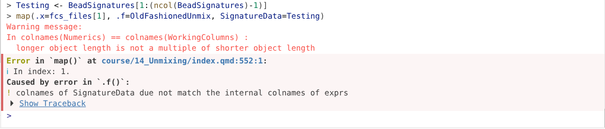
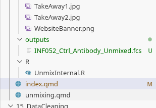
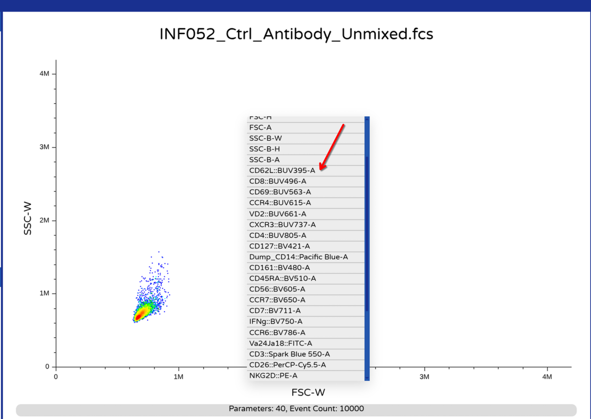
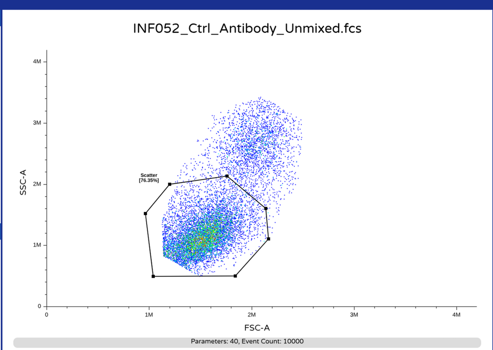
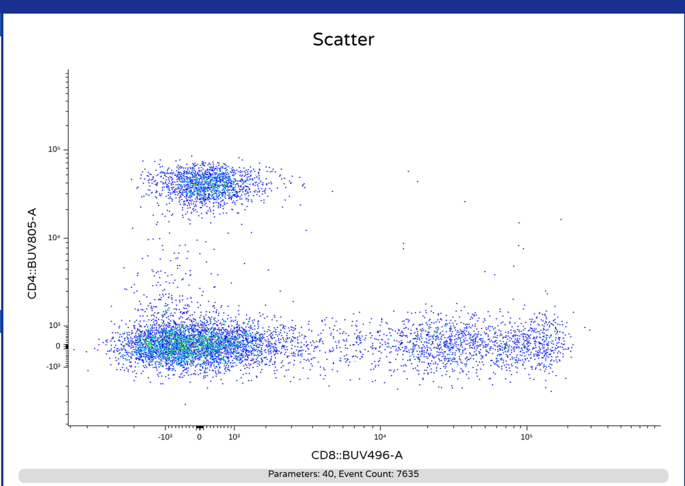

::: {style="text-align: right;"}
[](https://www.gnu.org/licenses/agpl-3.0.en.html) [](http://creativecommons.org/licenses/by-sa/4.0/)
:::

For the YouTube livestream schedule, see [here](https://www.youtube.com/@cytometryinr)

For screen-shot slides, click [here](/course/03_InsideFCSFile/slides.qmd)

<br>

---

# Background

Welcome to the [fourteenth](/Schedule.qmd#unmixing-in-r) week of the Cytometry in R course. In this walk-through, we will gather the various coding knowledge building blocks we have been tinkering with since [Week 09](/course/09_Functions/index.qmd), and attempt to unmix our raw full-stained .fcs files using the [spectral signature](/course/12_SpectralSignatures/index.qmd) matrices that we derived from our [unmixing controls](/course/SDY3080/SignatureMatrices.qmd) (both single-color and unstained). We will also make some necessary formatting changes to the unmixed .fcs files, to avoid visualizing our data as tiny distant dots if they are later opened using commercial software. 

More importantly, we hope to crack open what to many in the commmunity is seen as a [black box](https://en.wikipedia.org/wiki/Black_box). By understanding the underlying mechanics operating behind the curtain, we can gain a greater appreciation of the elements involved in the unmixing process (and hopefully assist with contextualizing/troubleshooting any unmixing errors we might encounter in the future). 

The goal of this [primary course walkthrough](/course/14_Unmixing/index.qmd) is focused on providing broad detailed look at the unmixing process. Additional details on unmixed .fcs file re-formatting are provided in a separate [bonus walk-through](/course/14_Unmixing/unmixing.qmd) for those that are interested. In the [upcoming week's primary walkthrough](/Schedule.qmd), we will cover how to systematically evaluate our unmixed .fcs files for unmixing errors, and make decisions on what signature variants to use for unmixing reattempts, etc. 

Additionally, there are two separate community walk-throughs (for [AutoSpectral](/course/community/AutoSpectral/index.qmd) and [TRU-OLS](/course/community/TRU-OLS/index.qmd) respectively) focusing on these alternative unmixing approaches already available. 

And with that, lets get started!

# Walk Through

For unmixing, we work with raw full-stained .fcs files, so we will need to retrieve these from the [SDY3080](https://www.immport.org/shared/search?text=SDY3080) ImmPort repository dataset that we have been using these last couple weeks. Since these original files can be massive in size, these were [downsampled](https://umgcccfcsr.github.io/CytometryInR/course/SDY3080/SetUp.html#downsampling) to allow for their sharing via GitHub without running into file size limit. These downsampled .fcs files can be found in this week's "data" folder.

In addition to our full-stained samples, we will need the [signature matrices](/course/SDY3080/SignatureMatrices.qmd) we derived from our unmixing controls (both single-colors and unstained) from the [previous walkthroughs](/course/SDY3080/SignatureMatrices.qmd). An important thing to note, we have not fully validated these signatures, so any unmixed .fcs files from today will likely have some unmixing errors. Since we plan to follow up in the [next session](/Schedule.qmd) on ways to evaluate how the different signatures included impacted our unmixing results, using these intermediate matrices should be fine for now. 

As always, you are also welcome to follow along using your own .fcs files. Main thing to watch for is that choice of keywords may be different from those shown if your .fcs files originated from a different manufacturers spectral flow cytometer. Similarly, the detector column name endings (ending in "-A" for this dataset) may also differ (showing as "-H", "-W", none at all, etc.).

Consequently, small changes may need to be carried out to the existing code to account for these differences. If you get stuck, or want to share your solutions for different manufacturers instruments so that others can benefit, please post on the [Discussions](https://github.com/UMGCCCFCSR/CytometryInR/discussions) page, and we can help you navigate for your own respective instruments configuration. 

And with that, let's begin this journey into the blackhole that is spectral unmixing. 

## Set Up

As always, we can start by attaching the various [R packages](/course/01_InstallingRPackages/) that we will need throughout today to our local environment. Since we have already derived the [signature matrices](/course/SDY3080/SignatureMatrices.qmd) and will not be creating new gates, the number of required packages is fewer compared to other weeks. 

```{r}
library(flowWorkspace)
library(Luciernaga)
library(dplyr)
library(purrr)
```

With this done, we can designate the `file.path()` to the location of both our storage and output folders. 

```{r}
#StorageLocation <- file.path("course", "14_Unmixing", "data")
StorageLocation <- file.path("data")

#OutputLocation <- file.path("course", "14_Unmixing", "outputs")
OutputLocation <- file.path("outputs")
```

With the storage location of our files established, we can then identify the .csv and .fcs files included in this week's dataset using `list.files()`.

```{r}
csv_files <- list.files(StorageLocation, pattern=".csv", full.names=TRUE)
csv_files
```

```{r}
fcs_files <- list.files(StorageLocation, pattern=".fcs", full.names=TRUE)
fcs_files
```

Lets go ahead and load in the individual .csv files containing the signature matrices for both Beads and Cells using `read.csv()`, saving each to its own object/variable. In the process, we can remove some of the unecessary metadata columns leftover from [processing](/course/SDY3080/SignatureMatrices.qmd), since in addition to the detector columns, we will only need the Fluorophore and Antigen information. 

```{r}
BeadSignatures <- read.csv(csv_files[1], check.names=FALSE)
BeadSignatures <- BeadSignatures |> select(-c(name, Type, Detector, Negative))
colnames(BeadSignatures)
```

```{r}
head(BeadSignatures, 3)
```

```{r}
CellSignatures <- read.csv(csv_files[2], check.names=FALSE)
CellSignatures <- CellSignatures |> select(-c(name, Type, Detector, Negative))
colnames(CellSignatures)
```

```{r}
head(CellSignatures, 3)
```

And with that, we have the main elements we will need for our unmixing. 

## Planning

Before diving straight in, it is often worthwhile to strategize what we are trying to accomplish first.

Over the last couple weeks, we have derived out [signature matrices](/course/SDY3080/SignatureMatrices.qmd) for our single-color controls (from both beads and cells). Similarly, we have an additional matrix that contains unstained signatures. These matrices in addition to the detector columns also contain metadata, in the form of the Fluorophore and Antigen columns. 

Separately, we have file.paths to the location of our individual raw .fcs files. Once these are loaded into R, we would have access to the `exprs()` matrices where the [raw measurement values](/course/03_InsideFCSFile/index.qmd#inside-an-fcs-file) are stored. After these are extracted, we need to provide these and the equivalent signature matrix columns to the function that carries out unmixing calculation and returns the respective fluorophore contributions. 

We consequently end up with a new matrix containing the calculated abundances of each fluorophore for a given cell. These in turn need to be swapped in for the `exprs()` slot within the "flowFrame" object. At this point, any corresponding changes to the `parameters()` and `keyword()` slots would need to be carried out, converting over the formatting from one typical of a raw .fcs file to that of an unmixed .fcs file. Some of these steps may overlap with the [Week 10](/course/10_Downsampling/concatenate.qmd) bonus material, so we may be able to reuse some of that code instead of writing from scratch. 

Lastly, we would then need to save our new .fcs file to a designated location. At which point, we can visualize it (to make sure no formatting mistakes were made in the coding process). If none are encountered, we would then be set so that [next time](/Schedule.qmd) we can start off by evaluating the unmixed .fcs file for unmixing errors that might affect the downstream analysis process. 

## Loading FCS files

To get started, lets create a basic [function](/course/09_Functions/index.qmd) skeleton. We can designate the function name as `OldFashionedUnmix()`. As always when building functions, individual arguments go inside the "()", and code being run goes within the "{}". 

```{r}
OldFashionedUnmix <- function(){
    # Our code eventually goes here
} 
```

In terms of what should be our `OldFashionedUnmix()` function's first argument, at the end of the day, we would want to simply provide to our function a vector containing the `file.path()`'s to where our .fcs files, and then stand back and let the function handle the rest of the process. 

So we will need to set it up to iterate (using either `purrr`'s `map()` or `walk()` functions, or base R equivalents). Consequently, lets simply use "x" as our first argument. We can add it to our function by placing the new argument name between the "()". 

Additionally, to help our future-selves out when we forget what each argument does next month (or who are we kidding, maybe tomorrow), lets also write out the arguments documentation in the `roxygen2` skeleton, by providing the name after "\@param", followed by a short description of purpose. 

We can select "Run Cell" on our code-block to run the function, which results in it being created in our local environment (appearing in Positron listed under Session tab in the right secondary sidebar). 

```{r}
#' This function unmixes our raw full-stained .fcs files using the 
#' signature matrix we provide.
#' 
#' @param x A file.path to a raw full-stained .fcs file we want to
#'  unmix. 
#' 
OldFashionedUnmix <- function(x){
    print(x) # to check output is working
}
```

With our `OldFashionedUnmix()` function now created, we can evaluate the output of the code inside by running the code block below using the `purrr` packages `walk()` function to iterate through our vector of .fcs file paths. 

```{r}
# After running the code chunk above to create the function, run 
# this code-block

walk(.x=fcs_files, .f=OldFashionedUnmix)
```

As we proceed and build out the rest of the function, remember to re-run the code block to refresh `OldFashionedUnmix()` in the local environment, so that you can see the effect of the changes that are made. 

Next up, we will need to load the designated .fcs file into our local environment from where it is being stored (as being designated by the iterated in file path stored in "x"). 

As we encountered in [Week 05](/course/05_GatingSets/index.qmd#flowframe), there are two ways we can approach this, loading the file in as either a 'flowFrame' or a 'cytoframe' object. The main difference between these two versions are whether the object is loaded immediately into rapid access memory (RAM) or not (via a pointer to the location). 

In the case of unmixing, we need access to the internals, are not planning to pre-gate, and are unmixing individual objects at a time. Because of this, lets use the `flowCore` packages `read.FCS()` function to load our raw .fcs file in directly as a `flowFrame()`. 

Since our function now depends on an external package, lets make a note of this by adding the "\@importFrom" line to our `roxygen2` skeleton, listing the parent package and function. Since we are not connecting to a Description/Namespace file at this point of the course, lets also add "flowCore::" before the functions name inside the code, so that this dependency is also noted in different context. From here, refresh the function and test the output. 

```{r}
#' This function unmixes our raw full-stained .fcs files using the 
#' signature matrix we provide.
#' 
#' @param x A file.path to a raw full-stained .fcs file we want to
#'  unmix. 
#' 
#' @importFrom flowCore read.FCS
#' 
OldFashionedUnmix <- function(x){
    TheRawFCS <- flowCore::read.FCS(filename=x,
     transformation=FALSE, truncate_max_range = FALSE)
    return(TheRawFCS)
}
```

```{r}
# After re-running the code chunk above to update the function,
#  run this code-block

# Using [1] to subset for the first file in the vector

map(.x=fcs_files[1], .f=OldFashionedUnmix)
```

Alright, we are getting back our [flowFrame](/course/03_InsideFCSFile/index.qmd) object as expected. We can now start gathering the actual components for the unmixing. 

### Retrieving exprs values

Next order of business is retrieving the `exprs()` slot content (containing the raw MFI values). This will contain our detector columns, as well as additional columns for "Time", "SSC" (off the violet laser), "FSC", and "SSC-B" (off the blue laser). 

```{r}
#' This function unmixes our raw full-stained .fcs files using the 
#' signature matrix we provide.
#' 
#' @param x A file.path to a raw full-stained .fcs file we want to
#'  unmix. 
#' 
#' @importFrom flowCore read.FCS exprs
#' 
OldFashionedUnmix <- function(x){
    TheRawFCS <- flowCore::read.FCS(filename=x,
     transformation=FALSE, truncate_max_range = FALSE)
    TheRawMatrix <- flowCore::exprs(TheRawFCS)
    return(TheRawMatrix)
}
```

```{r}
# After re-running the code chunk above to update the function,
#  run this code-block

# Using [1] to subset for the first file in the vector

Exprs <- map(.x=fcs_files[1], .f=OldFashionedUnmix)
head(Exprs[[1]], 3) # [[1]] breaking out of the list object
```

We get back from `exprs()` a "matrix" style object, we can convert this to a "data.frame" object to allow for easier selection of columns using the `dplyr` package. 

```{r}
#' This function unmixes our raw full-stained .fcs files using the
#'  signature matrix we provide.
#' 
#' @param x A file.path to a raw full-stained .fcs file we want to
#'  unmix. 
#' 
#' @importFrom flowCore read.FCS exprs
#' 
OldFashionedUnmix <- function(x){
    TheRawFCS <- flowCore::read.FCS(filename=x,
     transformation=FALSE, truncate_max_range = FALSE)
    TheRawMatrix <- flowCore::exprs(TheRawFCS)
    TheRawDataFrame <- data.frame(TheRawMatrix, check.names=FALSE)
    return(TheRawMatrix)
}
```

```{r}
# After re-running the code chunk above to update the function,
#  run this code-block

# Using [1] to subset for the first file in the vector
Exprs <- map(.x=fcs_files[1], .f=OldFashionedUnmix)
head(Exprs[[1]], 3) # [[1]] breaking out of the list object
```

With this done, we will need to isolate the detector columns (snce it will be their values we will need for unmixing) from the other columns ("Time", "SSC", "FSC" and "SSC-B"). We will still want to retain these columns, as following unmixing we will need to add them back to our unmixed .fcs file so we can gate based off scatter. 

 Rather than directly specifying which columns, we can use the `dplyr` packages `select()` and `matches()` functions in combination to grab any column whose column name matches a particular character string (or strings when separated by "|"). So for the case above, we could within `matches()` place "FSC|SSC|Time" to enable these columns to be grabbed. 

However, for certain instruments or cases, there could be other columns we might want to retain. Rather than needing to modify the function directly, we can set up a second argument ("retainThese"), and provide a default value ("FSC|SSC|Time"). That way we retain the ability to easily modify the pattern to handle the edge cases, without needing to specify the values each time when the default suffices. 

Lets go ahead and add the argument and it's default value between the "()", and update the `roxygen2` documentation for this new argument (and what it does). We also need to list the two `dplyr` functions in the roxygen, and add the "dplyr::" before the respective functions in the code to avoid dependency issues. 

```{r}
#' This function unmixes our raw full-stained .fcs files using the
#'  signature matrix we provide.
#' 
#' @param x A file.path to a raw full-stained .fcs file we want to 
#' unmix. 
#' @param retainThese Default "FSC|SSC|Time", used to separate out
#' columns not used for unmixing, but that should be retained for 
#' the final unmixed .fcs files. 
#' 
#' @importFrom flowCore read.FCS exprs
#' @importFrom dplyr select matches
#' 
OldFashionedUnmix <- function(x, retainThese="FSC|SSC|Time"){

    # Retrieve the underlying MFI values from exprs slot
    TheRawFCS <- flowCore::read.FCS(filename=x,
     transformation=FALSE, truncate_max_range = FALSE)
    TheRawMatrix <- flowCore::exprs(TheRawFCS)
    TheRawDataFrame <- data.frame(TheRawMatrix, check.names=FALSE)

    # Identify the detector columns
    StashedColumns <- TheRawDataFrame |>
         dplyr::select(dplyr::matches(retainThese)) 
    TheColNames <- colnames(StashedColumns)
    return(TheColNames)
}
```

```{r}
# After re-running the code chunk above to update the function,
#  run this code-block

# Using [1] to subset for the first file in the vector

map(.x=fcs_files[1], .f=OldFashionedUnmix)
```

Alright, we have a generalized way to designate which columns need to kept outside of the unmixing (but later placed back). By adding an "!" to that line of codes `select()`, we can also gather the non-stashed columns (which will mainly be our detector columns of interest). 

```{r}
#' This function unmixes our raw full-stained .fcs files using the
#'  signature matrix we provide.
#' 
#' @param x A file.path to a raw full-stained .fcs file we want to 
#' unmix. 
#' @param retainThese Default "FSC|SSC|Time", used to separate out
#' columns not used for unmixing, but that should be retained for 
#' the final unmixed .fcs files. 
#' 
#' @importFrom flowCore read.FCS exprs
#' @importFrom dplyr select matches
#' 
OldFashionedUnmix <- function(x, retainThese="FSC|SSC|Time"){

    # Retrieve the underlying MFI values from exprs slot
    TheRawFCS <- flowCore::read.FCS(filename=x,
     transformation=FALSE, truncate_max_range = FALSE)
    TheRawMatrix <- flowCore::exprs(TheRawFCS)
    TheRawDataFrame <- data.frame(TheRawMatrix, check.names=FALSE)

    # Identify the detector columns
    StashedColumns <- TheRawDataFrame |>
         dplyr::select(dplyr::matches(retainThese)) 
    WorkingColumns <- TheRawDataFrame |>
         dplyr::select(!dplyr::matches(retainThese)) 

    TheColNames <- colnames(WorkingColumns)
    return(TheColNames)
}
```

```{r}
# After re-running the code chunk above to update the function,
#  run this code-block

# Using [1] to subset for the first file in the vector

map(.x=fcs_files[1], .f=OldFashionedUnmix)
```

For the Cytek Aurora .fcs files in this example, this last line of code was sufficient to isolate the detector columns. However, this was in part to the instrument settings not having also acquired the "-H" or "-W" values for the various detectors. Since for some manufacturers instruments, these are also acquired by default, we maay need an additional step to designate whether the detector columns being selected for end in "-A", "-H", or "-W". 

To do this, we could use another argument where we either select the variant we want, or designate the variants we want to exclude. For now, lets go with the exclude approach, externalizing this in the form of a third argument ("detectorExclude") with a default value of "-H|-W". 

```{r}
#| code-fold: FALSE

#' This function unmixes our raw full-stained .fcs files using the
#'  signature matrix we provide.
#' 
#' @param x A file.path to a raw full-stained .fcs file we want to 
#' unmix. 
#' @param retainThese Default "FSC|SSC|Time", used to separate out
#' columns not used for unmixing, but that should be retained for 
#' the final unmixed .fcs files. 
#' @param detectorExclude Default is "-H|-W", intended to remove 
#' additional detector columns other than -A, adjust as needed for 
#' your own instruments configuration
#' 
#' @importFrom flowCore read.FCS exprs
#' @importFrom dplyr select matches
#' 
OldFashionedUnmix <- function(x, retainThese="FSC|SSC|Time", 
    detectorExclude="-H|-W"){

    # Retrieve the underlying MFI values from exprs slot
    TheRawFCS <- flowCore::read.FCS(filename=x,
     transformation=FALSE, truncate_max_range = FALSE)
    TheRawMatrix <- flowCore::exprs(TheRawFCS)
    TheRawDataFrame <- data.frame(TheRawMatrix, check.names=FALSE)

    # Identify the detector columns
    StashedColumns <- TheRawDataFrame |>
         dplyr::select(dplyr::matches(retainThese)) 
    WorkingColumns <- TheRawDataFrame |>
         dplyr::select(!dplyr::matches(retainThese)) 
    WorkingColumns <- WorkingColumns |> 
        dplyr::select(!dplyr::matches(detectorExclude)) 

    TheColNames <- colnames(WorkingColumns)
    return(TheColNames)
}
```

```{r}
# After re-running the code chunk above to update the function,
#  run this code-block

# Using [1] to subset for the first file in the vector

map(.x=fcs_files[1], .f=OldFashionedUnmix)
```

Having pre-empted a potential issue, and still retaining the detector columns of interest, lets swap the `return()` content to get back the "data.frame" rather than just the `colnames()` output, so that we can see the underlying `exprs()` values.

```{r}
#| code-fold: FALSE

#' This function unmixes our raw full-stained .fcs files using the
#'  signature matrix we provide.
#' 
#' @param x A file.path to a raw full-stained .fcs file we want to 
#' unmix. 
#' @param retainThese Default "FSC|SSC|Time", used to separate out
#' columns not used for unmixing, but that should be retained for 
#' the final unmixed .fcs files. 
#' @param detectorExclude Default is "-H|-W", intended to remove 
#' additional detector columns other than -A, adjust as needed for 
#' your own instruments configuration
#' 
#' @importFrom flowCore read.FCS exprs
#' @importFrom dplyr select matches
#' 
OldFashionedUnmix <- function(x, retainThese="FSC|SSC|Time", 
    detectorExclude="-H|-W"){

    # Retrieve the underlying MFI values from exprs slot
    TheRawFCS <- flowCore::read.FCS(filename=x,
     transformation=FALSE, truncate_max_range = FALSE)
    TheRawMatrix <- flowCore::exprs(TheRawFCS)
    TheRawDataFrame <- data.frame(TheRawMatrix, check.names=FALSE)

    # Identify the detector columns
    StashedColumns <- TheRawDataFrame |>
         dplyr::select(dplyr::matches(retainThese)) 
    WorkingColumns <- TheRawDataFrame |>
         dplyr::select(!dplyr::matches(retainThese)) 
    WorkingColumns <- WorkingColumns |> 
        dplyr::select(!dplyr::matches(detectorExclude)) 
    # TheColNames <- colnames(WorkingColumns)

    return(WorkingColumns)
}
```

```{r}
# After re-running the code chunk above to update the function, run this code-block

# Using [1] to subset for the first file in the vector

TheData <- map(.x=fcs_files[1], .f=OldFashionedUnmix)[[1]]
head(TheData, 3)
```

## Loading signature matrix

From our raw .fcs file, we have now retrieved `exprs()` values we will use for unmixing. Within this "data.frame", each row contains the detector measurements recorded for an individual cell. During unmixing, each row is unmixed vs. the reference signature matrix, which allows us to estimate the presence/abscence of each fluorophore, as well as its relative abundance. When unmixing is complete, we have a "matrix" object with the same number of cells, but instead of the detector columns, new columns for each fluorophore in the provided signature matrix. This "matrix" object is ultimately the one added back to the `exprs()` slot. 

Beyond providing the signature values that distinguish each fluorophore from each other, the signature matrix can also provides the source for the fluorophore and antigen names. Lets go ahead and load our signature matrix into our function via new argument ("SignatureData"). 

We can also retain the flexibility of either providing a "data.frame" or a file.path to a ".csv" file through the use of a conditional statement ("if", "else", "else if") depending on the type of object provided to "SignatureData" 

```{r}
#| code-fold: FALSE

#' This function unmixes our raw full-stained .fcs files using the
#'  signature matrix we provide.
#' 
#' @param x A file.path to a raw full-stained .fcs file we want to 
#' unmix. 
#' @param retainThese Default "FSC|SSC|Time", used to separate out
#' columns not used for unmixing, but that should be retained for 
#' the final unmixed .fcs files. 
#' @param detectorExclude Default is "-H|-W", intended to remove 
#' additional detector columns other than -A, adjust as needed for 
#' your own instruments configuration
#' @param SignatureData A data.frame containing a Fluorophore,
#'  Antigen and Detector columns. 
#' 
#' @importFrom flowCore read.FCS exprs
#' @importFrom dplyr select matches
#' @importFrom utils read.csv
#' 
OldFashionedUnmix <- function(x, retainThese="FSC|SSC|Time", 
    detectorExclude="-H|-W", SignatureData){

    # Retrieve the underlying MFI values from exprs slot
    TheRawFCS <- flowCore::read.FCS(filename=x,
     transformation=FALSE, truncate_max_range = FALSE)
    TheRawMatrix <- flowCore::exprs(TheRawFCS)
    TheRawDataFrame <- data.frame(TheRawMatrix, check.names=FALSE)

    # Identify the detector columns
    StashedColumns <- TheRawDataFrame |>
         dplyr::select(dplyr::matches(retainThese)) 
    WorkingColumns <- TheRawDataFrame |>
         dplyr::select(!dplyr::matches(retainThese)) 
    WorkingColumns <- WorkingColumns |> 
        dplyr::select(!dplyr::matches(detectorExclude)) 
    # TheColNames <- colnames(WorkingColumns)

    # Load the signature matrix

    if(is.data.frame(SignatureData)){
        Signatures <- SignatureData
    } else { 
        Signatures <-read.csv(SignatureData, check.names=FALSE)
    }

    return(Signatures)
}
```

```{r}
# After re-running the code chunk above to update the function,
#  run this code-block

# Using [1] to subset for the first file in the vector

Signatures <- map(.x=fcs_files[1], .f=OldFashionedUnmix,
 SignatureData=BeadSignatures)[[1]]

head(Signatures, 3)
```

### Separating Metadata

With this accomplished, we can separate our character columns (containing our metadata for Fluorophore and Antigen) from the numeric columns (i.e. the detector columns used during unmixing). 


We can then similarly separate out the character columns (being used for labeling) from the numeric columns (being used in the unmixing process). This can be accomplished through use of `select()`, `where()` and `is.numeric()` as we have previously encountered. 

```{r}
#| code-fold: FALSE

#' This function unmixes our raw full-stained .fcs files using the
#'  signature matrix we provide.
#' 
#' @param x A file.path to a raw full-stained .fcs file we want to 
#' unmix. 
#' @param retainThese Default "FSC|SSC|Time", used to separate out
#' columns not used for unmixing, but that should be retained for 
#' the final unmixed .fcs files. 
#' @param detectorExclude Default is "-H|-W", intended to remove 
#' additional detector columns other than -A, adjust as needed for 
#' your own instruments configuration
#' @param SignatureData A data.frame containing a Fluorophore,
#'  Antigen and Detector columns. 
#' 
#' @importFrom flowCore read.FCS exprs
#' @importFrom dplyr select matches where
#' @importFrom utils read.csv
#' 
OldFashionedUnmix <- function(x, retainThese="FSC|SSC|Time", 
    detectorExclude="-H|-W", SignatureData){

    # Retrieve the underlying MFI values from exprs slot
    TheRawFCS <- flowCore::read.FCS(filename=x,
     transformation=FALSE, truncate_max_range = FALSE)
    TheRawMatrix <- flowCore::exprs(TheRawFCS)
    TheRawDataFrame <- data.frame(TheRawMatrix, check.names=FALSE)

    # Identify the detector columns
    StashedColumns <- TheRawDataFrame |>
         dplyr::select(dplyr::matches(retainThese)) 
    WorkingColumns <- TheRawDataFrame |>
         dplyr::select(!dplyr::matches(retainThese)) 
    WorkingColumns <- WorkingColumns |> 
        dplyr::select(!dplyr::matches(detectorExclude)) 
    # TheColNames <- colnames(WorkingColumns)

    # Load the signature matrix

    if(is.data.frame(SignatureData)){
        Signatures <- SignatureData
    } else { 
        Signatures <-read.csv(SignatureData, check.names=FALSE)
    }

    Metadata <- Signatures |>
         dplyr::select(!dplyr::where(is.numeric))
    Numerics <- Signatures |>
         dplyr::select(dplyr::where(is.numeric))

    return(colnames(Numerics))
}
```

```{r}
map(.x=fcs_files[1], .f=OldFashionedUnmix,
 SignatureData=BeadSignatures)[[1]]
```

### Normalizing Check

Additionally, our signature retrieval functions can return either the raw values or normalized/scaled values that range from 0 to 1. For unmixing, we need the later. We can add an internal check through the use of another conditional statement, where if it is trigerred by the presence of a value greater than 1, it will proceed to normalize the values in the matrix before proceeding.

```{r}
#| code-fold: FALSE

#' This function unmixes our raw full-stained .fcs files using the
#'  signature matrix we provide.
#' 
#' @param x A file.path to a raw full-stained .fcs file we want to 
#' unmix. 
#' @param retainThese Default "FSC|SSC|Time", used to separate out
#' columns not used for unmixing, but that should be retained for 
#' the final unmixed .fcs files. 
#' @param detectorExclude Default is "-H|-W", intended to remove 
#' additional detector columns other than -A, adjust as needed for 
#' your own instruments configuration
#' @param SignatureData A data.frame containing a Fluorophore,
#'  Antigen and Detector columns. 
#' 
#' @importFrom flowCore read.FCS exprs
#' @importFrom dplyr select matches where
#' @importFrom utils read.csv
#' 
OldFashionedUnmix <- function(x, retainThese="FSC|SSC|Time", 
    detectorExclude="-H|-W", SignatureData){

    # Retrieve the underlying MFI values from exprs slot
    TheRawFCS <- flowCore::read.FCS(filename=x,
     transformation=FALSE, truncate_max_range = FALSE)
    TheRawMatrix <- flowCore::exprs(TheRawFCS)
    TheRawDataFrame <- data.frame(TheRawMatrix, check.names=FALSE)

    # Identify the detector columns
    StashedColumns <- TheRawDataFrame |>
         dplyr::select(dplyr::matches(retainThese)) 
    WorkingColumns <- TheRawDataFrame |>
         dplyr::select(!dplyr::matches(retainThese)) 
    WorkingColumns <- WorkingColumns |> 
        dplyr::select(!dplyr::matches(detectorExclude)) 
    # TheColNames <- colnames(WorkingColumns)

    # Load the signature matrix

    if(is.data.frame(SignatureData)){
        Signatures <- SignatureData
    } else { 
        Signatures <-read.csv(SignatureData, check.names=FALSE)
    }

    Metadata <- Signatures |>
         dplyr::select(!dplyr::where(is.numeric))
    Numerics <- Signatures |>
         dplyr::select(dplyr::where(is.numeric))

    if (any(Numerics > 1)) {
        message("Signature values greater than 1 detected, normalizing")
        n <- Numerics
        # n[n < 0] <- 0
        A <- do.call(pmax, n)
        Normalized <- n/A
        Numerics <- Normalized
    }

    return(Numerics)
}
```

```{r}
# After re-running the code chunk above to update the function,
#  run this code-block

# Using [1] to subset for the first file in the vector

Signatures <- map(.x=fcs_files[1], .f=OldFashionedUnmix,
 SignatureData=BeadSignatures)[[1]]

head(Signatures, 3)
```

### Dimensions Check

Before diving into unmixing, we should also make sure the number of detector columns present in our retrieved `exprs()` object matches the number of numeric columns retrieved from our signature matrix, to avoid having the code fail out. The simplest implementation would be with a conditional statement, using `all()` and `colnames()` as shown here to set up the check. 


```{r}
#| code-fold: FALSE

#' This function unmixes our raw full-stained .fcs files using the
#'  signature matrix we provide.
#' 
#' @param x A file.path to a raw full-stained .fcs file we want to 
#' unmix. 
#' @param retainThese Default "FSC|SSC|Time", used to separate out
#' columns not used for unmixing, but that should be retained for 
#' the final unmixed .fcs files. 
#' @param detectorExclude Default is "-H|-W", intended to remove 
#' additional detector columns other than -A, adjust as needed for 
#' your own instruments configuration
#' @param SignatureData A data.frame containing a Fluorophore,
#'  Antigen and Detector columns. 
#' 
#' @importFrom flowCore read.FCS exprs
#' @importFrom dplyr select matches where
#' @importFrom utils read.csv
#' 
OldFashionedUnmix <- function(x, retainThese="FSC|SSC|Time", 
    detectorExclude="-H|-W", SignatureData){

    # Retrieve the underlying MFI values from exprs slot
    TheRawFCS <- flowCore::read.FCS(filename=x,
     transformation=FALSE, truncate_max_range = FALSE)
    TheRawMatrix <- flowCore::exprs(TheRawFCS)
    TheRawDataFrame <- data.frame(TheRawMatrix, check.names=FALSE)

    # Identify the detector columns
    StashedColumns <- TheRawDataFrame |>
         dplyr::select(dplyr::matches(retainThese)) 
    WorkingColumns <- TheRawDataFrame |>
         dplyr::select(!dplyr::matches(retainThese)) 
    WorkingColumns <- WorkingColumns |> 
        dplyr::select(!dplyr::matches(detectorExclude)) 
    # TheColNames <- colnames(WorkingColumns)

    # Load the signature matrix

    if(is.data.frame(SignatureData)){
        Signatures <- SignatureData
    } else { 
        Signatures <-read.csv(SignatureData, check.names=FALSE)
    }

    Metadata <- Signatures |>
         dplyr::select(!dplyr::where(is.numeric))
    Numerics <- Signatures |>
         dplyr::select(dplyr::where(is.numeric))

    if (any(Numerics > 1)) {
        message("Signature values greater than 1 detected, normalizing")
        n <- Numerics
        # n[n < 0] <- 0
        A <- do.call(pmax, n)
        Normalized <- n/A
        Numerics <- Normalized
    }

    # Make sure dimensions match each other

    if (!all(colnames(Numerics) == colnames(WorkingColumns))){
        stop("colnames of SignatureData due not match the internal colnames of exprs")
    }

    return(Numerics)
}
```

```{r}
#| eval: FALSE

# After re-running the code chunk above to update the function,
#  run this code-block

# Using [1] to subset for the first file in the vector

Testing <- BeadSignatures[1:(ncol(BeadSignatures)-1)]

walk(.x=fcs_files[1], .f=OldFashionedUnmix,
 SignatureData=Testing)
```



With this check now implemented and our starting components collected, we are ready to proceed with the actual unmixing. 

## Ordinary Least Squares 

When unmixing, we need to go from the total signal measurements from the individual cells, and referencing the signature reference matrix, calculate out the abundance for each fluorophore that best fits the signal seen on the cell. 

This process is often mediated via various least squares methods, the more frequently encountered for spectral flow cytometry data being ordinary least squares. In R, this is implemented in the `lsfit()` function from base R `stats` package. 

To carry out its task, both the signature values and the sample values be in the "long" (more rows than columns) style format. Since both our data.frames are in the "wide" (more columns than rows) style format currently, we will need to swing/pivot them. 

To avoid issues, we can back up the `colnames()` corresponding to each detectors as a precaution, and then transpose (`t()`) each to swing to a long format matrix.

```{r}
#| code-fold: FALSE

#' This function unmixes our raw full-stained .fcs files using the
#'  signature matrix we provide.
#' 
#' @param x A file.path to a raw full-stained .fcs file we want to 
#' unmix. 
#' @param retainThese Default "FSC|SSC|Time", used to separate out
#' columns not used for unmixing, but that should be retained for 
#' the final unmixed .fcs files. 
#' @param detectorExclude Default is "-H|-W", intended to remove 
#' additional detector columns other than -A, adjust as needed for 
#' your own instruments configuration
#' @param SignatureData A data.frame containing a Fluorophore,
#'  Antigen and Detector columns. 
#' 
#' @importFrom flowCore read.FCS exprs
#' @importFrom dplyr select matches where
#' @importFrom utils read.csv
#' 
OldFashionedUnmix <- function(x, retainThese="FSC|SSC|Time", 
    detectorExclude="-H|-W", SignatureData){

    # Retrieve the underlying MFI values from exprs slot
    TheRawFCS <- flowCore::read.FCS(filename=x,
     transformation=FALSE, truncate_max_range = FALSE)
    TheRawMatrix <- flowCore::exprs(TheRawFCS)
    TheRawDataFrame <- data.frame(TheRawMatrix, check.names=FALSE)

    # Identify the detector columns
    StashedColumns <- TheRawDataFrame |>
         dplyr::select(dplyr::matches(retainThese)) 
    WorkingColumns <- TheRawDataFrame |>
         dplyr::select(!dplyr::matches(retainThese)) 
    WorkingColumns <- WorkingColumns |> 
        dplyr::select(!dplyr::matches(detectorExclude)) 
    # TheColNames <- colnames(WorkingColumns)

    # Load the signature matrix

    if(is.data.frame(SignatureData)){
        Signatures <- SignatureData
    } else { 
        Signatures <-read.csv(SignatureData, check.names=FALSE)
    }

    Metadata <- Signatures |>
         dplyr::select(!dplyr::where(is.numeric))
    Numerics <- Signatures |>
         dplyr::select(dplyr::where(is.numeric))

    if (any(Numerics > 1)) {
        message("Signature values greater than 1 detected, normalizing")
        n <- Numerics
        # n[n < 0] <- 0
        A <- do.call(pmax, n)
        Normalized <- n/A
        Numerics <- Normalized
    }

    # Make sure dimensions match each other

    if (!all(colnames(Numerics) == colnames(WorkingColumns))){
        stop("colnames of SignatureData due not match the internal colnames of exprs")
    }

    DetectorNameBackups <- colnames(Numerics)
    TransposedSignatureValues <- t(Numerics)

    TransposedSampleValues <- t(WorkingColumns)

    return(TransposedSampleValues)
}
```

```{r}
# After re-running the code chunk above to update the function,
#  run this code-block

# Using [1] to subset for the first file in the vector

Intermediate <- map(.x=fcs_files[1], .f=OldFashionedUnmix,
 SignatureData=BeadSignatures)

head(Intermediate[[1]], 3)[,1:10]
```

With both our signature and sample values now properly oriented, lets run `lsfit()` to carry out the unmixing.

```{r}
#| code-fold: FALSE

#' This function unmixes our raw full-stained .fcs files using the
#'  signature matrix we provide.
#' 
#' @param x A file.path to a raw full-stained .fcs file we want to 
#' unmix. 
#' @param retainThese Default "FSC|SSC|Time", used to separate out
#' columns not used for unmixing, but that should be retained for 
#' the final unmixed .fcs files. 
#' @param detectorExclude Default is "-H|-W", intended to remove 
#' additional detector columns other than -A, adjust as needed for 
#' your own instruments configuration
#' @param SignatureData A data.frame containing a Fluorophore,
#'  Antigen and Detector columns. 
#' 
#' @importFrom flowCore read.FCS exprs
#' @importFrom dplyr select matches where
#' @importFrom utils read.csv
#' 
OldFashionedUnmix <- function(x, retainThese="FSC|SSC|Time", 
    detectorExclude="-H|-W", SignatureData){

    # Retrieve the underlying MFI values from exprs slot
    TheRawFCS <- flowCore::read.FCS(filename=x,
     transformation=FALSE, truncate_max_range = FALSE)
    TheRawMatrix <- flowCore::exprs(TheRawFCS)
    TheRawDataFrame <- data.frame(TheRawMatrix, check.names=FALSE)

    # Identify the detector columns
    StashedColumns <- TheRawDataFrame |>
         dplyr::select(dplyr::matches(retainThese)) 
    WorkingColumns <- TheRawDataFrame |>
         dplyr::select(!dplyr::matches(retainThese)) 
    WorkingColumns <- WorkingColumns |> 
        dplyr::select(!dplyr::matches(detectorExclude)) 
    # TheColNames <- colnames(WorkingColumns)

    # Load the signature matrix

    if(is.data.frame(SignatureData)){
        Signatures <- SignatureData
    } else { 
        Signatures <-read.csv(SignatureData, check.names=FALSE)
    }

    Metadata <- Signatures |>
         dplyr::select(!dplyr::where(is.numeric))
    Numerics <- Signatures |>
         dplyr::select(dplyr::where(is.numeric))

    if (any(Numerics > 1)) {
        message("Signature values greater than 1 detected, normalizing")
        n <- Numerics
        # n[n < 0] <- 0
        A <- do.call(pmax, n)
        Normalized <- n/A
        Numerics <- Normalized
    }

    # Make sure dimensions match each other

    if (!all(colnames(Numerics) == colnames(WorkingColumns))){
        stop("colnames of SignatureData due not match the internal colnames of exprs")
    }

    DetectorNameBackups <- colnames(Numerics)
    TransposedSignatureValues <- t(Numerics)

    TransposedSampleValues <- t(WorkingColumns)

    # Unmixing 

    LeastSquares <- lsfit(x = TransposedSignatureValues,
     y = TransposedSampleValues, intercept = FALSE)

    return(LeastSquares)
}
```

The returned object is a named list, so using `names()` we can see what the returned elements consist of. 

```{r}
# After re-running the code chunk above to update the function,
#  run this code-block

# Using [1] to subset for the first file in the vector

TheUnmixedOutputs <- map(.x=fcs_files[1], .f=OldFashionedUnmix,
 SignatureData=BeadSignatures)[[1]]

names(TheUnmixedOutputs)
```


### Coefficients

From the unmixing returns we get back from `lsfit()`, the first entry in the list is the "coefficients". If we run `dim()` to check the dimensions, we get back

```{r}
dim(TheUnmixedOutputs$coefficients)
```

So rows correspond to the calculated fluorophores, while the columns are the individual cells. Not the usual presentation for our data in an .fcs file, but we can transpose it back to regular shape in a bit. Also, this was a 29-fluorophore panel, so it looks like we missed a fluorophore (likely Zombie NIR as it wasn't present in the bead reference controls). 

We can also quickly see a few rows via `head()` to just confirm everything looks normal, and that we didn't just get back a matrix with entirely NULL values. 

```{r}
head(TheUnmixedOutputs$coefficients, 3)[,1:20]
```

### Residuals

Next up, we have the "residuals". We can start by checking with `dim()`

```{r}
dim(TheUnmixedOutputs$residuals)
```

In this case, we have 64 rows, and 10000 columns, so these must track with the original detector columns that were provided. We will circle back and visualize these residuals shortly to get a better understanding of how they work. 

### Intercept

The next named entry is "intercept", which in the actual code line we set to FALSE. This is similarly case here, where it is storing that information for reference. 

```{r}
TheUnmixedOutputs$intercept
```

### qr

The final list entry is "qr", which is also a list. When we check the names of this nested list, we get back the following values, which are outside our range to follow up with for the time being.

```{r}
QR_components <- names(TheUnmixedOutputs$qr)
QR_components
```

## Residuals

So overall, its the "coefficient" values that we will need to grab, since these correspond to our unmixed fluorophore columns that need to go into the .fcs file. However, there is some additional useful information in the residuals that are worth taking a look at, since more complicated unmixing methods take advantage of these same values in their own calculations. 

First off, we need to a helper function `ResidualPlots()` to plot the underlying data.  This can take the `lsfit()` returned list and work from there, so we can set the only argument as "LeastSquaresFit". 

```{r}
#' Takes lsfit output, retrieves and plots the residuals
#' 
#' @param LeastSquaresList The returned list from lsfit
#' 
ResidualPlots <- function(LeastSquaresList){
    library(ggplot2)

    residuals <- LeastSquaresList$residual

    ResidualsDF <- data.frame(
    obs = seq_len(nrow(residuals)), # Vector length residual rows ("Detectors")
    rms = sqrt(rowMeans(residuals^2)) # root-mean-square of the fit residuals
    )

    Plot <- ggplot(ResidualsDF, aes(x = obs, y = rms)) +
    geom_segment(aes(xend = obs, yend = 0)) +
    labs(title = "RMS residual per observation",
     x = "Observation index", y = "RMS residual") +
    theme_minimal()
    Plot
}
```

At which point, we can add `ResidualPlots()` as the next line in `OldFashionedUnmix()`

```{r}
#| code-fold: FALSE

#' This function unmixes our raw full-stained .fcs files using the
#'  signature matrix we provide.
#' 
#' @param x A file.path to a raw full-stained .fcs file we want to 
#' unmix. 
#' @param retainThese Default "FSC|SSC|Time", used to separate out
#' columns not used for unmixing, but that should be retained for 
#' the final unmixed .fcs files. 
#' @param detectorExclude Default is "-H|-W", intended to remove 
#' additional detector columns other than -A, adjust as needed for 
#' your own instruments configuration
#' @param SignatureData A data.frame containing a Fluorophore,
#'  Antigen and Detector columns. 
#' 
#' @importFrom flowCore read.FCS exprs
#' @importFrom dplyr select matches where
#' @importFrom utils read.csv
#' 
OldFashionedUnmix <- function(x, retainThese="FSC|SSC|Time",
 detectorExclude="-H|-W", SignatureData){

    # Retrieve the underlying MFI values from exprs slot
    TheRawFCS <- flowCore::read.FCS(filename=x,
     transformation=FALSE, truncate_max_range = FALSE)
    TheRawMatrix <- flowCore::exprs(TheRawFCS)
    TheRawDataFrame <- data.frame(TheRawMatrix, check.names=FALSE)

    # Identify the detector columns
    StashedColumns <- TheRawDataFrame |>
         dplyr::select(dplyr::matches(retainThese)) 
    WorkingColumns <- TheRawDataFrame |>
         dplyr::select(!dplyr::matches(retainThese)) 
    WorkingColumns <- WorkingColumns |> 
        dplyr::select(!dplyr::matches(detectorExclude)) 
    # TheColNames <- colnames(WorkingColumns)

    # Load the signature matrix

    if(is.data.frame(SignatureData)){
        Signatures <- SignatureData
    } else { 
        Signatures <-read.csv(SignatureData, check.names=FALSE)
    }

    Metadata <- Signatures |>
         dplyr::select(!dplyr::where(is.numeric))
    Numerics <- Signatures |>
         dplyr::select(dplyr::where(is.numeric))

    if (any(Numerics > 1)) {
        message("Signature values greater than 1 detected, normalizing")
        n <- Numerics
        # n[n < 0] <- 0
        A <- do.call(pmax, n)
        Normalized <- n/A
        Numerics <- Normalized
    }

    # Make sure dimensions match each other

    if (!all(colnames(Numerics) == colnames(WorkingColumns))){
        stop("colnames of SignatureData due not match the internal colnames of exprs")
    }

    DetectorNameBackups <- colnames(Numerics)
    TransposedSignatureValues <- t(Numerics)

    TransposedSampleValues <- t(WorkingColumns)

    # Unmixing 

    LeastSquares <- lsfit(x = TransposedSignatureValues,
     y = TransposedSampleValues, intercept = FALSE)

    Plot <- ResidualPlots(LeastSquaresList = LeastSquares)

    return(Plot)
}
```

And lets go ahead and return the plots for all the fcs files for comparison

```{r}
# After re-running the code chunk above to update the function, run this code-block

# Using [1] to subset for the first file in the vector

ThePlots <- map(.x=fcs_files, .f=OldFashionedUnmix, SignatureData=BeadSignatures)

ThePlots
```

Alright, so in this case (where we forgot to include our Zombie NIR viability dye and unstained signatures in the reference matrix), the place where we see the most leftover residuals (signal that didn't fit into the calculation) occurs in roughly the same locations where those fluorophores are found. 

So, lets add them back in and see what happens. We can first retrieve the Unstained and Zombie Signatures to have them on hand.  

```{r}
AlternateCellSignatures <- read.csv(csv_files[3], check.names=FALSE)
AlternateCellSignatures <- AlternateCellSignatures |>
     select(-c(name, Type, Detector, Negative))
Unstained <- AlternateCellSignatures |>
     dplyr::filter(stringr::str_detect(Fluorophore, "PBMC_Unstained"))
Zombie <- AlternateCellSignatures |>
     dplyr::filter(stringr::str_detect(Fluorophore, "Zombie"))
```

And lets first add back the Zombie signature to the beads signature matrix, and compare vs. the previous residual plot when it wasn't included

```{r}
UpdatedCellReferences <- bind_rows(BeadSignatures, Zombie)

TheAlternatePlots <- map(.x=fcs_files, .f=OldFashionedUnmix, SignatureData=UpdatedCellReferences)
```

So before

```{r}
plotly::ggplotly(ThePlots[[1]])
```

And after

```{r}
plotly::ggplotly(TheAlternatePlots[[1]])
```

Alright, we no longer have the peak around what would have been the R8 detector. What if we also add back an unstained cell signature? 

```{r}
UpdatedCellReferences <- bind_rows(BeadSignatures, Zombie, Unstained)

TheAlternatePlots2 <- map(.x=fcs_files, .f=OldFashionedUnmix, SignatureData=UpdatedCellReferences)
```

Before with Zombie

```{r}
plotly::ggplotly(TheAlternatePlots[[1]])
```

After with both Unstained and Zombie

```{r}
plotly::ggplotly(TheAlternatePlots2[[1]])
```

Some shifts across the board, but the big dramatic shift in residuals was when we accounted for the previously missing Zombie NIR. 

Just to confirm, what if we removed something important?

```{r}
NoBUV805 <- UpdatedCellReferences[-7,] #BUV805 CD4

NoBUV805residuals <- map(.x=fcs_files, .f=OldFashionedUnmix, SignatureData=NoBUV805)
```

```{r}
plotly::ggplotly(NoBUV805residuals[[1]])
```

As you can start to see, even though not the main output we need from `lsfit()`, the residual output can be quite useful in determining whether all the signal was properly accounted for in the signature matrix or not (which is why other more complicated unmixing methods take advantage of it). 

Before we turn our focus back to the coefficients, (i.e., our unmixed outputs that were of our main reason for being here), lets add one more argument that would allow us to get back the `ResidualPlots()` if we wanted to in the future. We can call this argument "returnType", setting the default to "fcs", but also specifying a "residual" condition that return these plots if requested.  

```{r}
#| code-fold: FALSE

#' This function unmixes our raw full-stained .fcs files using the
#'  signature matrix we provide.
#' 
#' @param x A file.path to a raw full-stained .fcs file we want to 
#' unmix. 
#' @param retainThese Default "FSC|SSC|Time", used to separate out
#' columns not used for unmixing, but that should be retained for 
#' the final unmixed .fcs files. 
#' @param detectorExclude Default is "-H|-W", intended to remove 
#' additional detector columns other than -A, adjust as needed for 
#' your own instruments configuration
#' @param SignatureData A data.frame containing a Fluorophore,
#'  Antigen and Detector columns. 
#' @param returnType Default "fcs", for residual plots use "residual"
#' 
#' @importFrom flowCore read.FCS exprs
#' @importFrom dplyr select matches where
#' @importFrom utils read.csv
#' 
OldFashionedUnmix <- function(x, retainThese="FSC|SSC|Time",
 detectorExclude="-H|-W", SignatureData, returnType="fcs"){

    # Retrieve the underlying MFI values from exprs slot
    TheRawFCS <- flowCore::read.FCS(filename=x,
     transformation=FALSE, truncate_max_range = FALSE)
    TheRawMatrix <- flowCore::exprs(TheRawFCS)
    TheRawDataFrame <- data.frame(TheRawMatrix, check.names=FALSE)

    # Identify the detector columns
    StashedColumns <- TheRawDataFrame |>
         dplyr::select(dplyr::matches(retainThese)) 
    WorkingColumns <- TheRawDataFrame |>
         dplyr::select(!dplyr::matches(retainThese)) 
    WorkingColumns <- WorkingColumns |> 
        dplyr::select(!dplyr::matches(detectorExclude)) 
    # TheColNames <- colnames(WorkingColumns)
# Load the signature matrix

    if(is.data.frame(SignatureData)){
        Signatures <- SignatureData
    } else { 
        Signatures <-read.csv(SignatureData, check.names=FALSE)
    }

    Metadata <- Signatures |>
         dplyr::select(!dplyr::where(is.numeric))
    Numerics <- Signatures |>
         dplyr::select(dplyr::where(is.numeric))

    if (any(Numerics > 1)) {
        message("Signature values greater than 1 detected, normalizing")
        n <- Numerics
        # n[n < 0] <- 0
        A <- do.call(pmax, n)
        Normalized <- n/A
        Numerics <- Normalized
    }

    # Make sure dimensions match each other

    if (!all(colnames(Numerics) == colnames(WorkingColumns))){
        stop("colnames of SignatureData due not match the internal colnames of exprs")
    }

    DetectorNameBackups <- colnames(Numerics)
    TransposedSignatureValues <- t(Numerics)

    TransposedSampleValues <- t(WorkingColumns)

    # Unmixing 

    LeastSquares <- lsfit(x = TransposedSignatureValues,
     y = TransposedSampleValues, intercept = FALSE)

    # Residual Plot Fork

    if (returnType == "residuals"){
    Plot <- ResidualPlots(LeastSquaresList = LeastSquares)
    return(Plot)
    }

    return(LeastSquares)
}
```

```{r}
# After re-running the code chunk above to update the function,
#  run this code-block

# Using [1] to subset for the first file in the vector

ThePlots <- map(.x=fcs_files, .f=OldFashionedUnmix,
 SignatureData=BeadSignatures, returnType="residuals")

ThePlots[1]
```

```{r}
# After re-running the code chunk above to update the function,
#  run this code-block

# Using [1] to subset for the first file in the vector

TheUnmixedList <- map(.x=fcs_files[1], .f=OldFashionedUnmix,
 SignatureData=BeadSignatures, returnType="fcs")[[1]]

head(TheUnmixedList$coefficients, 3)[,1:20]
```

## Reassembly

Alright, back to our main reason for being here, the coefficients, i.e. our unmixed data, that now that we have derived we need to change back to a wider format more typical of an .fcs file. We can reverse down this route we earlier traveled by once again transposing (`t()`)

```{r}
#| code-fold: FALSE

#' This function unmixes our raw full-stained .fcs files using the
#'  signature matrix we provide.
#' 
#' @param x A file.path to a raw full-stained .fcs file we want to 
#' unmix. 
#' @param retainThese Default "FSC|SSC|Time", used to separate out
#' columns not used for unmixing, but that should be retained for 
#' the final unmixed .fcs files. 
#' @param detectorExclude Default is "-H|-W", intended to remove 
#' additional detector columns other than -A, adjust as needed for 
#' your own instruments configuration
#' @param SignatureData A data.frame containing a Fluorophore,
#'  Antigen and Detector columns. 
#' @param returnType Default "fcs", for residual plots use "residual"
#' 
#' @importFrom flowCore read.FCS exprs
#' @importFrom dplyr select matches where
#' @importFrom utils read.csv
#' 
OldFashionedUnmix <- function(x, retainThese="FSC|SSC|Time",
 detectorExclude="-H|-W", SignatureData, returnType="fcs"){

    # Retrieve the underlying MFI values from exprs slot
    TheRawFCS <- flowCore::read.FCS(filename=x,
     transformation=FALSE, truncate_max_range = FALSE)
    TheRawMatrix <- flowCore::exprs(TheRawFCS)
    TheRawDataFrame <- data.frame(TheRawMatrix, check.names=FALSE)

    # Identify the detector columns
    StashedColumns <- TheRawDataFrame |>
         dplyr::select(dplyr::matches(retainThese)) 
    WorkingColumns <- TheRawDataFrame |>
         dplyr::select(!dplyr::matches(retainThese)) 
    WorkingColumns <- WorkingColumns |> 
        dplyr::select(!dplyr::matches(detectorExclude)) 
    # TheColNames <- colnames(WorkingColumns)
# Load the signature matrix

    if(is.data.frame(SignatureData)){
        Signatures <- SignatureData
    } else { 
        Signatures <-read.csv(SignatureData, check.names=FALSE)
    }

    Metadata <- Signatures |>
         dplyr::select(!dplyr::where(is.numeric))
    Numerics <- Signatures |>
         dplyr::select(dplyr::where(is.numeric))

    if (any(Numerics > 1)) {
        message("Signature values greater than 1 detected, normalizing")
        n <- Numerics
        # n[n < 0] <- 0
        A <- do.call(pmax, n)
        Normalized <- n/A
        Numerics <- Normalized
    }

    # Make sure dimensions match each other

    if (!all(colnames(Numerics) == colnames(WorkingColumns))){
        stop("colnames of SignatureData due not match the internal colnames of exprs")
    }

    DetectorNameBackups <- colnames(Numerics)
    TransposedSignatureValues <- t(Numerics)

    TransposedSampleValues <- t(WorkingColumns)

    # Unmixing 

    LeastSquares <- lsfit(x = TransposedSignatureValues,
     y = TransposedSampleValues, intercept = FALSE)

    # Residual Plot Fork

    if (returnType == "residuals"){
    Plot <- ResidualPlots(LeastSquaresList = LeastSquares)
    return(Plot)
    }

    # Reassembly
    TransposedLeastSquares <- t(LeastSquares$coefficients)

    return(TransposedLeastSquares)
}
```

And before we go further, lets make sure we keep the updated signature matrix with both Zombie NIR and Unstained (ideally reorganized in correct sequence, and unstained renamed to AF). 

```{r}
UpdatedCellReferences |> pull(Fluorophore)
```

```{r}
RelocateElements <- function(data, from, after) {
  index <- seq_len(nrow(data))
  index <- index[index != from]
  insert_at <- which(index == after)
  index <- append(index, from, after = insert_at)
  data[index, ]
}

UpdatedBeadReferences <- RelocateElements(data=UpdatedCellReferences, from=29, after=27)

UpdatedBeadReferences <- UpdatedBeadReferences |> 
    mutate(Fluorophore=case_when(
        Fluorophore == "PBMC_Unstained" ~ "AF",
        TRUE ~ Fluorophore))

tail(UpdatedBeadReferences, 5)
```

```{r}
# After re-running the code chunk above to update the function,
#  run this code-block

# Using [1] to subset for the first file in the vector

Intermediate <- map(.x=fcs_files[1], .f=OldFashionedUnmix,
 SignatureData=UpdatedBeadReferences, returnType="fcs")
head(Intermediate[[1]], 3)
```

So we are now in the wide format, which is expected by `exprs()`. However, we don't have any `colnames()`, so its time to overwrite this a vector of the Fluorophore names. For Cytek Aurora instruments, the fluorophore names typically have a designated letter ("-A") appended at the end, giving the characteristic display seen in many unmixed .fcs files (FITC-A, etc.). 

We can try to generalize this process based on our kept column names, to avoid yet another argument to specify.

```{r}
#| code-fold: FALSE

#' This function unmixes our raw full-stained .fcs files using the
#'  signature matrix we provide.
#' 
#' @param x A file.path to a raw full-stained .fcs file we want to 
#' unmix. 
#' @param retainThese Default "FSC|SSC|Time", used to separate out
#' columns not used for unmixing, but that should be retained for 
#' the final unmixed .fcs files. 
#' @param detectorExclude Default is "-H|-W", intended to remove 
#' additional detector columns other than -A, adjust as needed for 
#' your own instruments configuration
#' @param SignatureData A data.frame containing a Fluorophore,
#'  Antigen and Detector columns. 
#' @param returnType Default "fcs", for residual plots use "residual"
#' 
#' @importFrom flowCore read.FCS exprs
#' @importFrom dplyr select matches where pull
#' @importFrom utils read.csv
#' 
OldFashionedUnmix <- function(x, retainThese="FSC|SSC|Time",
 detectorExclude="-H|-W", SignatureData, returnType="fcs"){

    # Retrieve the underlying MFI values from exprs slot
    TheRawFCS <- flowCore::read.FCS(filename=x,
     transformation=FALSE, truncate_max_range = FALSE)
    TheRawMatrix <- flowCore::exprs(TheRawFCS)
    TheRawDataFrame <- data.frame(TheRawMatrix, check.names=FALSE)

    # Identify the detector columns
    StashedColumns <- TheRawDataFrame |>
         dplyr::select(dplyr::matches(retainThese)) 
    WorkingColumns <- TheRawDataFrame |>
         dplyr::select(!dplyr::matches(retainThese)) 
    WorkingColumns <- WorkingColumns |> 
        dplyr::select(!dplyr::matches(detectorExclude)) 
    # TheColNames <- colnames(WorkingColumns)
# Load the signature matrix

    if(is.data.frame(SignatureData)){
        Signatures <- SignatureData
    } else { 
        Signatures <-read.csv(SignatureData, check.names=FALSE)
    }

    Metadata <- Signatures |>
         dplyr::select(!dplyr::where(is.numeric))
    Numerics <- Signatures |>
         dplyr::select(dplyr::where(is.numeric))

    if (any(Numerics > 1)) {
        message("Signature values greater than 1 detected, normalizing")
        n <- Numerics
        # n[n < 0] <- 0
        A <- do.call(pmax, n)
        Normalized <- n/A
        Numerics <- Normalized
    }

    # Make sure dimensions match each other

    if (!all(colnames(Numerics) == colnames(WorkingColumns))){
        stop("colnames of SignatureData due not match the internal colnames of exprs")
    }

    DetectorNameBackups <- colnames(Numerics)
    TransposedSignatureValues <- t(Numerics)

    TransposedSampleValues <- t(WorkingColumns)

    # Unmixing 

    LeastSquares <- lsfit(x = TransposedSignatureValues,
     y = TransposedSampleValues, intercept = FALSE)

    # Residual Plot Fork

    if (returnType == "residuals"){
    Plot <- ResidualPlots(LeastSquaresList = LeastSquares)
    return(Plot)
    }

    # Reassembly
    TransposedLeastSquares <- t(LeastSquares$coefficients)

    FluorophoreNames <- Metadata |> dplyr::pull(Fluorophore)
    TheDetectorColNames <- colnames(WorkingColumns)
    AppendThisLetter <- sub("^[^-]*", "", TheDetectorColNames) |> unique()
    FluorophoreNames <- paste0(FluorophoreNames, AppendThisLetter)
    colnames(TransposedLeastSquares) <- FluorophoreNames

    return(TransposedLeastSquares)
}
```

```{r}
# After re-running the code chunk above to update the function,
#  run this code-block

# Using [1] to subset for the first file in the vector

Intermediate <- map(.x=fcs_files[1], .f=OldFashionedUnmix,
 SignatureData=UpdatedBeadReferences, returnType="fcs")
head(Intermediate[[1]], 3)
```

With our unmixed fluorophore columns now set, we can put back the stashed columns for "Time", "SSC", "FSC" and "SSC-B".


```{r}
#| code-fold: FALSE

#' This function unmixes our raw full-stained .fcs files using the
#'  signature matrix we provide.
#' 
#' @param x A file.path to a raw full-stained .fcs file we want to 
#' unmix. 
#' @param retainThese Default "FSC|SSC|Time", used to separate out
#' columns not used for unmixing, but that should be retained for 
#' the final unmixed .fcs files. 
#' @param detectorExclude Default is "-H|-W", intended to remove 
#' additional detector columns other than -A, adjust as needed for 
#' your own instruments configuration
#' @param SignatureData A data.frame containing a Fluorophore,
#'  Antigen and Detector columns. 
#' @param returnType Default "fcs", for residual plots use "residual"
#' 
#' @importFrom flowCore read.FCS exprs
#' @importFrom dplyr select matches where pull bind_cols
#' @importFrom utils read.csv
#' 
OldFashionedUnmix <- function(x, retainThese="FSC|SSC|Time",
 detectorExclude="-H|-W", SignatureData, returnType="fcs"){

    # Retrieve the underlying MFI values from exprs slot
    TheRawFCS <- flowCore::read.FCS(filename=x,
     transformation=FALSE, truncate_max_range = FALSE)
    TheRawMatrix <- flowCore::exprs(TheRawFCS)
    TheRawDataFrame <- data.frame(TheRawMatrix, check.names=FALSE)

    # Identify the detector columns
    StashedColumns <- TheRawDataFrame |>
         dplyr::select(dplyr::matches(retainThese)) 
    WorkingColumns <- TheRawDataFrame |>
         dplyr::select(!dplyr::matches(retainThese)) 
    WorkingColumns <- WorkingColumns |> 
        dplyr::select(!dplyr::matches(detectorExclude)) 
    # TheColNames <- colnames(WorkingColumns)
# Load the signature matrix

    if(is.data.frame(SignatureData)){
        Signatures <- SignatureData
    } else { 
        Signatures <-read.csv(SignatureData, check.names=FALSE)
    }

    Metadata <- Signatures |>
         dplyr::select(!dplyr::where(is.numeric))
    Numerics <- Signatures |>
         dplyr::select(dplyr::where(is.numeric))

    if (any(Numerics > 1)) {
        message("Signature values greater than 1 detected, normalizing")
        n <- Numerics
        # n[n < 0] <- 0
        A <- do.call(pmax, n)
        Normalized <- n/A
        Numerics <- Normalized
    }

    # Make sure dimensions match each other

    if (!all(colnames(Numerics) == colnames(WorkingColumns))){
        stop("colnames of SignatureData due not match the internal colnames of exprs")
    }

    DetectorNameBackups <- colnames(Numerics)
    TransposedSignatureValues <- t(Numerics)

    TransposedSampleValues <- t(WorkingColumns)

    # Unmixing 

    LeastSquares <- lsfit(x = TransposedSignatureValues,
     y = TransposedSampleValues, intercept = FALSE)

    # Residual Plot Fork

    if (returnType == "residuals"){
    Plot <- ResidualPlots(LeastSquaresList = LeastSquares)
    return(Plot)
    }

    # Reassembly
    TransposedLeastSquares <- t(LeastSquares$coefficients)

    FluorophoreNames <- Metadata |> dplyr::pull(Fluorophore)
    TheDetectorColNames <- colnames(WorkingColumns)
    AppendThisLetter <- sub("^[^-]*", "", TheDetectorColNames) |> unique()
    FluorophoreNames <- paste0(FluorophoreNames, AppendThisLetter)
    colnames(TransposedLeastSquares) <- FluorophoreNames

    # Bind the stashed Time, SSC and FSC columns to the new fluorophore columns
    UnmixedData <- bind_cols(StashedColumns, TransposedLeastSquares)

    return(UnmixedData)
}
```

```{r}
# After re-running the code chunk above to update the function,
#  run this code-block

# Using [1] to subset for the first file in the vector

Intermediate <- map(.x=fcs_files[1], .f=OldFashionedUnmix,
 SignatureData=UpdatedBeadReferences, returnType="fcs")
head(Intermediate[[1]], 3)
```

And with that, congratulations, we now have our unmixed data in a format that can be returned to the `exprs()` slot. 

### UnmixInternal Extravaganza

At this point we have assembled a "data.frame" containing the unmixed data for each cell in our sample. However, if you remember the [Week 3](/course/03_InsideFCSFile/index.qmd#parameters) and [Week 10](/course/10_Downsampling/concatenate.qmd) walk-throughs, you may remember how interconnected the elements between the different flowFrame slots (`exprs()`, `parameters()`, `keyword()`) slots actually are. 

In this case, instead of creating a new .fcs file entirely from scratch, we need to retain certain aspects of the original raw .fcs files metadata. However, we need to also remove the metadata associated with the detector columns (which are no longer present), and add new metadata for our newly derived unmixed fluorophore columns. 

Since there are multiple moving pieces, this is the job for a nested internal function. For anyone who nerds out about .fcs file internals, you can find the additional details here in this [bonus walkthrough](/course/14_Unmixing/unmixing.qmd). For the majority who would rather not, the final function can be found in the code-chunk below (as well as in a ".R" file in this week's R folder for future use). 


```{r}
#| code-fold: TRUE

#' Internal function for OldFashinedUnmix, handles fixing the 
#' formatting going from raw to unmixed .fcs file
#' 
#' @param ff The original raw flowFrame (used for the initial metadata)
#' @param data The updated data.frame following unmixing
#' @param panel Metadata from the signature matrix, containing
#'  Fluorophore and Antigen
#' 
#' @importFrom flowCore parameters keyword
#' @importFrom dplyr filter mutate row_number relocate pull
#' select
#' @importFrom tibble rownames_to_column column_to_rownames
# 
UnmixInternal <- function(ff, data, panel){

    # Identify the retained columns

    TheOriginalColumns <- colnames(ff)
    TheNewColumns <- colnames(data)
    RetainedColumns <- intersect(TheOriginalColumns, TheNewColumns)

    # Retrieve original parameters data with "$P" rownames

    TheOriginalParameters <- flowCore::parameters(ff)@data

    # Identify "$P" rownames to eliminate or keep

    KeepThese <- TheOriginalParameters |>
         dplyr::filter(name %in% RetainedColumns)
    GetRidThese <- TheOriginalParameters |> 
        dplyr::filter(!name %in% RetainedColumns) |> rownames()

    # Identify existing keyword names

    TheOriginalDescription <- flowCore::keyword(ff)
    OriginalKeywordNames <- names(TheOriginalDescription)

    # Identification of keywords containing "$P"

    Escaped <- gsub("\\$", "\\\\$", GetRidThese)
    RegexFormatted <- paste0("^", Escaped, "($|[^0-9])")
    RegexCombinatorial <- paste(RegexFormatted, collapse = "|")

    IdentifiedElimination <- OriginalKeywordNames[
        grepl(RegexCombinatorial, OriginalKeywordNames)]
    IdentifiedRetention <- OriginalKeywordNames[
        !grepl(RegexCombinatorial, OriginalKeywordNames)]

    # Identification of keywords containing "flowCore_$P"

    SecondRegexPattern <- paste0("(?<!\\d)", Escaped, "(?!\\d)")
    SecondRegexCombinatorial <- paste(SecondRegexPattern, collapse = "|")

    SecondElimination <- IdentifiedRetention[
        grepl(SecondRegexCombinatorial, IdentifiedRetention, perl = TRUE)]
    SecondRetention <- IdentifiedRetention[
        !grepl(SecondRegexCombinatorial, IdentifiedRetention, perl = TRUE)]

    # Identification of keywords containing "PDisplay"

    NoDollars <- sub("^\\$", "", GetRidThese)
    NoDollarsRegex <- paste0("(?<!\\d)\\$?", NoDollars, "(?!\\d)")
    NoDollarsCombined <- paste(NoDollarsRegex, collapse = "|")

    ThirdElimination <- SecondRetention[
        grepl(NoDollarsCombined, SecondRetention, perl = TRUE)]
    ThirdRetention <- SecondRetention[
        !grepl(NoDollarsCombined, SecondRetention, perl = TRUE)]

    # Subset original description for keyword names we want to retain

    IntermediateDescription <- TheOriginalDescription[ThirdRetention]

    # Renumbering retained SSC, FSC, SSC-B columns in parameters

    IntermediateParameters <- KeepThese |>
         tibble::rownames_to_column("OriginalRowNumber") |>
       dplyr::mutate(NewRowNumber=paste0("$P", dplyr::row_number())) |>
       relocate(NewRowNumber, .before=1)

    # Renumbering the retained keywords with new "$P" row numbers

    NewRowNumbers <- IntermediateParameters |>
         dplyr::pull(NewRowNumber)
    OriginalRowNumbers <- IntermediateParameters |>
         dplyr::pull(OriginalRowNumber)

    ForLoopDescription <- IntermediateDescription

    # For-loop to renumber the retained keywords

    for (i in seq_along(NewRowNumbers)) {
    
        NewX <- NewRowNumbers[i]
        NewXNum <- sub("^\\$P", "", NewX)

        OldX <- OriginalRowNumbers[i]
        OldXNum <- sub("^\\$P", "", OldX)

        # Rename matching keywords with new row numbers

        InternalEscaped <- gsub("\\$", "\\\\$", OldX)
        InternalRegexFormatted <- paste0(
            "(?<!\\d)", InternalEscaped, "(?!\\d)")
        InternalRegexCombinatorial <- paste(
            InternalRegexFormatted, collapse = "|")

        InternalIdentifiedRename <- names(ForLoopDescription)[
            grepl(InternalRegexCombinatorial, 
            names(ForLoopDescription), perl = TRUE)]

        ## Actual renaming in action

        RenamePattern <- paste0("^(flowCore_)?(\\$)?P", OldXNum, "(.*)$")
        InternalRenamed <- sub(RenamePattern,
         paste0("\\1\\2P", NewXNum, "\\3"), InternalIdentifiedRename)

        names(ForLoopDescription)[match(InternalIdentifiedRename,
         names(ForLoopDescription))] <- InternalRenamed

        # Matching for rename the "PDisplay" keywords
        InternalNoDollars <- sub("^\\$", "", OldX)   # "P18"
        InternalNoDollarsRegex <- paste0(
            "(?<!\\d)\\$?", InternalNoDollars, "(?!\\d)")

        ThirdRename <- names(ForLoopDescription)[
        grepl(InternalNoDollarsRegex, names(ForLoopDescription),
         perl = TRUE)]

        # Final renaming in action for "PDisplay"

        DisplayRenamePattern <- paste0("^(\\$)?P", OldXNum, "(.*)$")
        ThirdRenamed <- sub(DisplayRenamePattern, 
        paste0("\\1P", NewXNum, "\\2"), ThirdRename)

        names(ForLoopDescription)[match(ThirdRename,
         names(ForLoopDescription))] <- ThirdRenamed
    }

    # Add the new parameter rows for the Unmixed Fluorophores

    IntermediateParameters <- IntermediateParameters |>
         dplyr::select(-OriginalRowNumber) |>
         tibble::column_to_rownames("NewRowNumber")

    UpdatedParameters <- UnmixedParameterUpdate(OldParameters=IntermediateParameters, NewExprs=data)
    TheAntigens <- panel |> pull(Antigen)
    UpdatedParameters$desc <- TheAntigens
    pd <- rbind(IntermediateParameters, UpdatedParameters)

    # Generate new keywords for the new fluorophore rows in parameters

    new_pid <- rownames(UpdatedParameters)
    new_kw <- ForLoopDescription

    for (i in new_pid){
        NoDollarCode <- sub("^\\$", "", i) # For "PDisplay keyword"
        new_kw[paste0(i,"B")] <- new_kw["$P1B"] # Bytes
        new_kw[paste0(i,"E")] <- "0,0"
        new_kw[paste0(i,"N")] <- pd[[i,1]] # Fluorophore Name
        new_kw[paste0(i,"R")] <- pd[[i,5]] # Range Default
        new_kw[paste0(i,"S")] <- pd[[i,2]] # Antigen Name
        new_kw[paste0(i,"TYPE")] <- "Unmixed_Fluorescence"
        new_kw[paste0(i,"V")] <- "0" # Voltage/Gain, unmixed default 0
        new_kw[paste0("flowCore_", i,"Rmax")] <- pd[[i,5]] # maxRange
        new_kw[paste0("flowCore_", i,"Rmin")] <- pd[[i,4]] # minRange
        new_kw[paste0(NoDollarCode,"DISPLAY")] <- "LOG"
    }

    # Order Keywords by default sequence

    new_kw <- new_kw[order(names(new_kw))]

    # Overwrite old parameters "data" with the new parameters 

    OriginalParameterSlot <- flowCore::parameters(ff)
    OriginalParameterSlot@data <- pd

    # Convert unmixed data.frame to unmixed matrix

    UnmixedMatrix <- as.matrix(data)

    # Last keyword overrides
    new_kw$`CREATOR` <- "CytometryInR version 1.0.0"

    TheColumnNames <- colnames(data)
    TheSpilloverNames <- TheColumnNames[!grepl("Time|FSC|SSC", TheColumnNames)]
    MatrixSize <- length(TheSpilloverNames)
    NewMatrix <- matrix(0, nrow = MatrixSize, ncol = MatrixSize, byrow = TRUE)
    diag(NewMatrix) <- 1
    colnames(NewMatrix) <- TheSpilloverNames
    new_kw$`$SPILLOVER` <- NewMatrix

    new_fcs <- new("flowFrame", exprs=UnmixedMatrix, parameters=OriginalParameterSlot,
                 description=new_kw)

    return(new_fcs)
}


#' Internal for UnmixInternal, creates the new parameter
#' data rows needed to properly integrate new fluorophore columns
#' in exprs matrix
#' 
#' @param OldParameters The parameter data.frame with 
#' modified row numbers
#' @param NewExprs The unmixed data that will eventually 
#' be placed back into exprs
#' 
#' @importFrom Biobase pData
#' @importFrom dplyr pull select
#' @importFrom tidyselect all_of
#'  
UnmixedParameterUpdate <- function(OldParameters, NewExprs){

    # Remove the Retaind
    OldNames <- OldParameters |> dplyr::pull(name) |> unname()
    Overlapped <- intersect(OldNames, colnames(NewExprs))
    NewExprs <- NewExprs |> select(-all_of(Overlapped))

    # Create new rows for the unmixed fluorophore columns

	NewColumnLength <- ncol(NewExprs)
	NewColumnNames <- colnames(NewExprs)
	NewParameter <- max(as.integer(gsub("\\$P", "", rownames(OldParameters)))) + 1
	NewParameter <- seq(NewParameter, length.out = NewColumnLength)
	NewParameter <- paste0("$P", NewParameter)

    # Provide Hard Coded Numbers for Range, minRange and maxRange
    SSCRange <- OldParameters[2,3] # Hard-Coded based on Cytek Aurora SpectroFlo unmixed value
    MinRange <- -111.0001 # Hard-Coded based on Cytek Aurora SpectroFlo unmixed value
    MaxRange <- 4192505.7500 # Hard-Coded based on Cytek Aurora SpectroFlo unmixed value
	
	UpdatedParameters <- do.call(rbind,  lapply(NewColumnNames, function(i){
						vec <- NewExprs[,i]
						rg <- range(vec)
						data.frame(name = i,
                       desc = NA,
                       range = SSCRange,
                       minRange = MinRange,
                       maxRange = MaxRange)
					}))
          
	rownames(UpdatedParameters) <- NewParameter
	return(UpdatedParameters)
}
```

And with that, add the line for `UnmixInternal()` into `OldFashionedUnmix()`, and see if it returns a properly formatted flowFrame. 

```{r}
#| code-fold: FALSE

#' This function unmixes our raw full-stained .fcs files using the
#'  signature matrix we provide.
#' 
#' @param x A file.path to a raw full-stained .fcs file we want to 
#' unmix. 
#' @param retainThese Default "FSC|SSC|Time", used to separate out
#' columns not used for unmixing, but that should be retained for 
#' the final unmixed .fcs files. 
#' @param detectorExclude Default is "-H|-W", intended to remove 
#' additional detector columns other than -A, adjust as needed for 
#' your own instruments configuration
#' @param SignatureData A data.frame containing a Fluorophore,
#'  Antigen and Detector columns. 
#' @param returnType Default "fcs", for residual plots use "residual"
#' 
#' @importFrom flowCore read.FCS exprs
#' @importFrom dplyr select matches where pull bind_cols
#' @importFrom utils read.csv
#' 
OldFashionedUnmix <- function(x, retainThese="FSC|SSC|Time",
 detectorExclude="-H|-W", SignatureData, returnType="fcs"){

    # Retrieve the underlying MFI values from exprs slot
    TheRawFCS <- flowCore::read.FCS(filename=x,
     transformation=FALSE, truncate_max_range = FALSE)
    TheRawMatrix <- flowCore::exprs(TheRawFCS)
    TheRawDataFrame <- data.frame(TheRawMatrix, check.names=FALSE)

    # Identify the detector columns
    StashedColumns <- TheRawDataFrame |>
         dplyr::select(dplyr::matches(retainThese)) 
    WorkingColumns <- TheRawDataFrame |>
         dplyr::select(!dplyr::matches(retainThese)) 
    WorkingColumns <- WorkingColumns |> 
        dplyr::select(!dplyr::matches(detectorExclude)) 
    # TheColNames <- colnames(WorkingColumns)
# Load the signature matrix

    if(is.data.frame(SignatureData)){
        Signatures <- SignatureData
    } else { 
        Signatures <-read.csv(SignatureData, check.names=FALSE)
    }

    Metadata <- Signatures |>
         dplyr::select(!dplyr::where(is.numeric))
    Numerics <- Signatures |>
         dplyr::select(dplyr::where(is.numeric))

    if (any(Numerics > 1)) {
        message("Signature values greater than 1 detected, normalizing")
        n <- Numerics
        # n[n < 0] <- 0
        A <- do.call(pmax, n)
        Normalized <- n/A
        Numerics <- Normalized
    }

    # Make sure dimensions match each other

    if (!all(colnames(Numerics) == colnames(WorkingColumns))){
        stop("colnames of SignatureData due not match the internal colnames of exprs")
    }

    DetectorNameBackups <- colnames(Numerics)
    TransposedSignatureValues <- t(Numerics)

    TransposedSampleValues <- t(WorkingColumns)

    # Unmixing 

    LeastSquares <- lsfit(x = TransposedSignatureValues,
     y = TransposedSampleValues, intercept = FALSE)

    # Residual Plot Fork

    if (returnType == "residuals"){
    Plot <- ResidualPlots(LeastSquaresList = LeastSquares)
    return(Plot)
    }

    # Reassembly
    TransposedLeastSquares <- t(LeastSquares$coefficients)

    FluorophoreNames <- Metadata |> dplyr::pull(Fluorophore)
    TheDetectorColNames <- colnames(WorkingColumns)
    AppendThisLetter <- sub("^[^-]*", "", TheDetectorColNames) |> unique()
    FluorophoreNames <- paste0(FluorophoreNames, AppendThisLetter)
    colnames(TransposedLeastSquares) <- FluorophoreNames

    # Bind the stashed Time, SSC and FSC columns to the new fluorophore columns
    UnmixedData <- bind_cols(StashedColumns, TransposedLeastSquares)

    # Return properly formatted flowFrame

    new_fcs <- UnmixInternal(ff=TheRawFCS, data=UnmixedData, panel=Metadata)

    return(new_fcs)
}
```

```{r}
# After re-running the code chunk above to update the function,
#  run this code-block

# Using [1] to subset for the first file in the vector

EndGame <- map(.x=fcs_files[1], .f=OldFashionedUnmix,
 SignatureData=UpdatedBeadReferences, returnType="fcs")
EndGame
```

And with that, we are in the final stretch!

## Final Push

With `UnmixInternal()` now taking our "Unmixed Fluorophore" "data.frame", and returning a properly formatted unmixed "flowFrame", all we need to do is any last minute formatting changes to our file name keywords, as well as designate where we want the .fcs file to be saved to on our computers. 

### Renaming

For renaming, lets give the option to rename on the basis of up to two existing keywords (handled via a new "sample.name" argument), as well as an "addon" argument that can be used to append "_Unmixed" before ".fcs" in the name. 

```{r}
#| code-fold: FALSE

#' This function unmixes our raw full-stained .fcs files using the
#'  signature matrix we provide.
#' 
#' @param x A file.path to a raw full-stained .fcs file we want to 
#' unmix. 
#' @param retainThese Default "FSC|SSC|Time", used to separate out
#' columns not used for unmixing, but that should be retained for 
#' the final unmixed .fcs files. 
#' @param detectorExclude Default is "-H|-W", intended to remove 
#' additional detector columns other than -A, adjust as needed for 
#' your own instruments configuration
#' @param SignatureData A data.frame containing a Fluorophore,
#'  Antigen and Detector columns. 
#' @param returnType Default "fcs", for residual plots use "residual"
#' @param sample.name Keywords to pull for the new name, Cytek Aurora
#' default keywords are c("GROUPNAME", "TUBENAME"). 
#' @param addon Default "Unmixed", added right before the ".fcs"
#' 
#' @importFrom flowCore read.FCS exprs keyword
#' @importFrom dplyr select matches where pull bind_cols
#' @importFrom utils read.csv
#' 
OldFashionedUnmix <- function(x, retainThese="FSC|SSC|Time",
 detectorExclude="-H|-W", SignatureData, returnType="fcs", 
 sample.name=c("GROUPNAME", "TUBENAME"), addon="Unmixed"){

    # Retrieve the underlying MFI values from exprs slot
    TheRawFCS <- flowCore::read.FCS(filename=x,
     transformation=FALSE, truncate_max_range = FALSE)
    TheRawMatrix <- flowCore::exprs(TheRawFCS)
    TheRawDataFrame <- data.frame(TheRawMatrix, check.names=FALSE)

    # Identify the detector columns
    StashedColumns <- TheRawDataFrame |>
         dplyr::select(dplyr::matches(retainThese)) 
    WorkingColumns <- TheRawDataFrame |>
         dplyr::select(!dplyr::matches(retainThese)) 
    WorkingColumns <- WorkingColumns |> 
        dplyr::select(!dplyr::matches(detectorExclude)) 
    # TheColNames <- colnames(WorkingColumns)
# Load the signature matrix

    if(is.data.frame(SignatureData)){
        Signatures <- SignatureData
    } else { 
        Signatures <-read.csv(SignatureData, check.names=FALSE)
    }

    Metadata <- Signatures |>
         dplyr::select(!dplyr::where(is.numeric))
    Numerics <- Signatures |>
         dplyr::select(dplyr::where(is.numeric))

    if (any(Numerics > 1)) {
        message("Signature values greater than 1 detected, normalizing")
        n <- Numerics
        # n[n < 0] <- 0
        A <- do.call(pmax, n)
        Normalized <- n/A
        Numerics <- Normalized
    }

    # Make sure dimensions match each other

    if (!all(colnames(Numerics) == colnames(WorkingColumns))){
        stop("colnames of SignatureData due not match the internal colnames of exprs")
    }

    DetectorNameBackups <- colnames(Numerics)
    TransposedSignatureValues <- t(Numerics)

    TransposedSampleValues <- t(WorkingColumns)

    # Unmixing 

    LeastSquares <- lsfit(x = TransposedSignatureValues,
     y = TransposedSampleValues, intercept = FALSE)

    # Residual Plot Fork

    if (returnType == "residuals"){
    Plot <- ResidualPlots(LeastSquaresList = LeastSquares)
    return(Plot)
    }

    # Reassembly
    TransposedLeastSquares <- t(LeastSquares$coefficients)

    FluorophoreNames <- Metadata |> dplyr::pull(Fluorophore)
    TheDetectorColNames <- colnames(WorkingColumns)
    AppendThisLetter <- sub("^[^-]*", "", TheDetectorColNames) |> unique()
    FluorophoreNames <- paste0(FluorophoreNames, AppendThisLetter)
    colnames(TransposedLeastSquares) <- FluorophoreNames

    # Bind the stashed Time, SSC and FSC columns to the new fluorophore columns
    UnmixedData <- dplyr::bind_cols(StashedColumns, TransposedLeastSquares)

    # Return properly formatted flowFrame

    new_fcs <- UnmixInternal(ff=TheRawFCS, data=UnmixedData, panel=Metadata)

    # Provide a new name to GUID and FIL

    if (length(sample.name) == 2){
        first <- sample.name[[1]]
        second <- sample.name[[2]]
        first <- keyword(new_fcs, first)
        second <- keyword(new_fcs, second)
        name <- paste(first, second, sep="_")
    } else {name <- keyword(new_fcs, sample.name)}

    if (!is.null(addon)){name <- paste0(name, "_", addon)}

    AssembledName <- paste0(name, ".fcs")

    new_fcs@description$GUID <- AssembledName
    new_fcs@description$`$FIL` <- AssembledName

    return(new_fcs)
}
```

```{r}
# After re-running the code chunk above to update the function,
#  run this code-block

# Using [1] to subset for the first file in the vector

EndGame <- map(.x=fcs_files[1], .f=OldFashionedUnmix,
 SignatureData=UpdatedBeadReferences, returnType="fcs")
EndGame
```

## Saving

And last, but definitely not least, we need to designate where to store the file. We can copy in some of the previous code we used as part of [Week 10](/course/10_Downsampling/index.qmd) to simplify this process.  

```{r}
#| code-fold: FALSE

#' This function unmixes our raw full-stained .fcs files using the
#'  signature matrix we provide.
#' 
#' @param x A file.path to a raw full-stained .fcs file we want to 
#' unmix. 
#' @param retainThese Default "FSC|SSC|Time", used to separate out
#' columns not used for unmixing, but that should be retained for 
#' the final unmixed .fcs files. 
#' @param detectorExclude Default is "-H|-W", intended to remove 
#' additional detector columns other than -A, adjust as needed for 
#' your own instruments configuration
#' @param SignatureData A data.frame containing a Fluorophore,
#'  Antigen and Detector columns. 
#' @param returnType Default "fcs", for residual plots use "residual"
#' @param sample.name Keywords to pull for the new name, Cytek Aurora
#' default keywords are c("GROUPNAME", "TUBENAME"). 
#' @param addon Default "Unmixed", added right before the ".fcs"
#' @param outpath File.path to where we want to store the .fcs files, 
#' Default is NULL, which results in being saved to working directory
#' 
#' @importFrom flowCore read.FCS exprs write.FCS keyword
#' @importFrom dplyr select matches where pull bind_cols
#' @importFrom utils read.csv
#' 
OldFashionedUnmix <- function(x, retainThese="FSC|SSC|Time",
 detectorExclude="-H|-W", SignatureData, returnType="fcs", 
 sample.name=c("GROUPNAME", "TUBENAME"), addon="Unmixed",
 outpath=NULL){

    # Retrieve the underlying MFI values from exprs slot
    TheRawFCS <- flowCore::read.FCS(filename=x,
     transformation=FALSE, truncate_max_range = FALSE)
    TheRawMatrix <- flowCore::exprs(TheRawFCS)
    TheRawDataFrame <- data.frame(TheRawMatrix, check.names=FALSE)

    # Identify the detector columns
    StashedColumns <- TheRawDataFrame |>
         dplyr::select(dplyr::matches(retainThese)) 
    WorkingColumns <- TheRawDataFrame |>
         dplyr::select(!dplyr::matches(retainThese)) 
    WorkingColumns <- WorkingColumns |> 
        dplyr::select(!dplyr::matches(detectorExclude)) 
    # TheColNames <- colnames(WorkingColumns)
# Load the signature matrix

    if(is.data.frame(SignatureData)){
        Signatures <- SignatureData
    } else { 
        Signatures <-read.csv(SignatureData, check.names=FALSE)
    }

    Metadata <- Signatures |>
         dplyr::select(!dplyr::where(is.numeric))
    Numerics <- Signatures |>
         dplyr::select(dplyr::where(is.numeric))

    if (any(Numerics > 1)) {
        message("Signature values greater than 1 detected, normalizing")
        n <- Numerics
        # n[n < 0] <- 0
        A <- do.call(pmax, n)
        Normalized <- n/A
        Numerics <- Normalized
    }

    # Make sure dimensions match each other

    if (!all(colnames(Numerics) == colnames(WorkingColumns))){
        stop("colnames of SignatureData due not match the internal colnames of exprs")
    }

    DetectorNameBackups <- colnames(Numerics)
    TransposedSignatureValues <- t(Numerics)

    TransposedSampleValues <- t(WorkingColumns)

    # Unmixing 

    LeastSquares <- lsfit(x = TransposedSignatureValues,
     y = TransposedSampleValues, intercept = FALSE)

    # Residual Plot Fork

    if (returnType == "residuals"){
    Plot <- ResidualPlots(LeastSquaresList = LeastSquares)
    return(Plot)
    }

    # Reassembly
    TransposedLeastSquares <- t(LeastSquares$coefficients)

    FluorophoreNames <- Metadata |> dplyr::pull(Fluorophore)
    TheDetectorColNames <- colnames(WorkingColumns)
    AppendThisLetter <- sub("^[^-]*", "", TheDetectorColNames) |> unique()
    FluorophoreNames <- paste0(FluorophoreNames, AppendThisLetter)
    colnames(TransposedLeastSquares) <- FluorophoreNames

    # Bind the stashed Time, SSC and FSC columns to the new fluorophore columns
    UnmixedData <- dplyr::bind_cols(StashedColumns, TransposedLeastSquares)

    # Return properly formatted flowFrame

    new_fcs <- UnmixInternal(ff=TheRawFCS, data=UnmixedData, panel=Metadata)

    # Provide a new name to GUID and FIL

    if (length(sample.name) == 2){
        first <- sample.name[[1]]
        second <- sample.name[[2]]
        first <- flowCore::keyword(new_fcs, first)
        second <- flowCore::keyword(new_fcs, second)
        name <- paste(first, second, sep="_")
    } else {name <- flowCore::keyword(new_fcs, sample.name)}

    if (!is.null(addon)){name <- paste0(name, "_", addon)}

    AssembledName <- paste0(name, ".fcs")

    new_fcs@description$GUID <- AssembledName
    new_fcs@description$`$FIL` <- AssembledName

    if (is.null(outpath)) {outpath <- getwd()}

    fileSpot <- file.path(outpath, AssembledName)

    if (returnType == "fcs") {
        flowCore::write.FCS(new_fcs, filename = fileSpot, delimiter="#")
    } else {return(new_fcs)}
}
```

```{r}
# After re-running the code chunk above to update the function,
#  run this code-block

# Using [1] to subset for the first file in the vector

EndGame <- map(.x=fcs_files[1], .f=OldFashionedUnmix,
 SignatureData=UpdatedBeadReferences, returnType="fcs",
 outpath=OutputLocation)
```

And if we check our designated output location...



Wooh! We have the .fcs file. 

## Evaluation

Alright, moment of truth. Let's open it in either [Floreada.io](/course/00_Floreada/index.qmd) or if you have a license your propietary software of choice, and see if it actually behaves like a unmixed .fcs file. 







Alright, no immediate red flags! It appears that we have been successful in our quest to unmix the raw .fcs files we retrieved from [ImmPort](/course/SDY3080/ImmPort.qmd) entirely within R from start to finish. 

As mentioned [earlier](/course/14_Unmixing/index.qmd#planning), we used a signature matrix for unmixing that we haven't fully optimized whether the signatures included were the best candidates, so we still need to evaluate how our unmixing looks, and based on any encountered unmixing errors update our decision making about what signatures we provide to the unmixing matrix. 

We will get to this in the next primary walkthrough, but for now, the main tool in our unmixing arsenal is now set up to handle whichever optimized signature matrix we ultimately decide to provide it with. 

Likewise, beyond using OLS, there are other methods via which we can also unmix. Some like non-negative least squares involve simply swapping out `lsfit()` for another R function. Others are more involved, and have different inputs, some of which was covered in the [Autospectral](/course/community/AutoSpectral/index.qmd) as well as [TRU-OLS](/course/community/TRU-OLS/index.qmd) community walkthroughs. 

# Take Away

In this walk-through, we have culminated some of the elements we have been building out over the last several sessions, and actually unmixed out our .fcs files. This is not something everyone can say that they have done, so congratulations on having made it this far. 

As you saw from the process, the main elements involved are actually processing the data needed to unmix, and after unmix, formatting to prepare the unmixed .fcs file with the new columns. The actual unmixing function at the heart is rather swapable. Likewise, it is possible to swap this step out entirely for faster implementations in lower-level programming languages like Fortran, C++ and Rust which is what several R packages do behind the scenes. 

Due to a conference break, we will resume the primary material in a couple weeks looking at algorithms that can help us screen our unmixed .fcs files for instrumental issues arising from fluidic and laser instability. We will also explore some additional comparison metrics in the form of spreading matrices and staining index in the bonus content over the next couple weeks. 

Until then, cheers! We are now half way through the original conception of our course. 


# Additional Resources

[Mathematics of spectral unmixing │Peter Mage │ Babraham Institute Spectral Symposium 2022](https://youtu.be/GozDzpuu3Ok?si=lpO3W6GQ84qPH6Lo)

[CytoBytes: Spectral cytometry have you feeling all mixed up? Let's get unmixed!](https://youtu.be/kqc700kBtHg?si=XnAwe4pE3wVd9l48)

[ChUG Cytometry Presents: Introduction to Spectral Unmixing](https://www.youtube.com/live/PbJXMBpaoQk?si=wm5TZbn6CZviKbrE)

[A comparison of spectral unmixing to conventional compensation for the calculation of fluorochrome abundances from flow cytometric data](https://onlinelibrary.wiley.com/doi/10.1002/cyto.a.24669)

[Generalized unmixing model for multispectral flow cytometry utilizing nonsquare compensation matrices](https://onlinelibrary.wiley.com/doi/10.1002/cyto.a.22272)


# Take-home Problems

:::{.callout-tip title="Problem 1"}
Modify `OldFashionedUnmix()`'s returnType argument to instead of returning a ".fcs" file or a "residual" plot, to also returned the Unmixed data.frame, as well as the flowFrame (since both can be useful!). Add any conditional statements or arguments as you deem necessary. 
:::

:::{.callout-tip title="Problem 2"}
We briefly looked at the residual plots, including a case where we left out BUV805 CD4 and saw corresponding increase on those detectors in the residual plot. Rerun this example with a signature matrix missing one of the fluorophores, selecting returnType = "residual" to get back the residual plot. At this point, rerun with returnType = "fcs", and generate a badly unmixed .fcs file. Then repeat this process with a signature matrix that contains all the signature references. Visualizing the two .fcs files, which fluorophores ended up having messed up unmixing due to the exclusion, and which ones were mostly unaffected?
:::

:::{.callout-tip title="Problem 3"}
One of the first packages that I encountered that implemented unmixing in R was Christopher Hall's [flowUnmix](https://github.com/hally166/flowUnmix) package. Since, several additional R packages have also implemented ways to unmix using various methods.  While how they process their unmixing controls to get their signature matrices often vary wildly, at the heart the basic unmixing steps are similar, with choice of unmixing method often just needing to swtich out `lsfit()` for another function that implements the other method. Since you may be interested in implementing one of these methods on your own in the future, lets go on a treasure hunt. 

For these 2 packages ([flowUnmix](https://github.com/hally166/flowUnmix/tree/main/R), and [Autospectral](https://github.com/DrCytometer/AutoSpectral/tree/master/R)), dive into their GitHub repositories and open their R folder. Check the .R files for any with an "unmixing-something-or-order" style name and examine it. Try reading your way through the code until you encounter the function that actually carries out the unmixing. Look up that functions original package, and check the help file. Take a screenshot, and report back. Feel free to repeat for any unmixing methods of interest (OLS, NNLS, WLS, etc.) 
:::

::: {style="text-align: right;"}
[](https://www.gnu.org/licenses/agpl-3.0.en.html) [](http://creativecommons.org/licenses/by-sa/4.0/)
:::