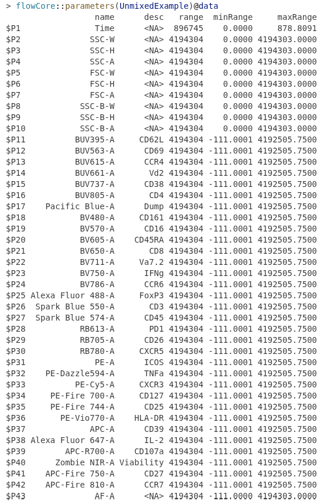

::: {style="text-align: right;"}
[](https://www.gnu.org/licenses/agpl-3.0.en.html) [](http://creativecommons.org/licenses/by-sa/4.0/)
:::

For the YouTube livestream schedule, see [here](https://www.youtube.com/@cytometryinr)

For screen-shot slides, click [here](/course/10_Downsampling/slides.qmd)

<br>

---

# Background

## Rationale

This walk-through is an extension of the [Week 14](/course/14_Unmixing/index.qmd) lesson, documenting how the `UnmixingInternals()` function was cobbled together from start to finish. This walk-through is optional, and has been separated out from the main [Unmixing](/course/14_Unmixing/index.qmd) lesson in a desire to avoid burning out those who would rather not know the tiny details of how to reformat the [flowFrame internals](/course/03_InsideFCSFile/index.qmd) to convert from a raw to an unmixed .fcs file. 

However, if [deep-diving](/course/10_Downsampling/concatenate.qmd) how .fcs file internals are formatted in R is your thing, then this walk-through is definitely for you, so feel free to continue reading :D

## Journey Thus Far

At this point in the [Week 14](/course/14_Unmixing/index.qmd) lesson, our `OldFashionedUnmixing()` function is fairly far along, taking as inputs a file.path to our raw full-stained .fcs file, and also a [signature matrix](), and currently returning as an output a data.frame containing the newly unmixed fluorophore columns.

```{r}
#| code-fold: TRUE

#' This function unmixes our raw full-stained .fcs files using the signature matrix we provide.
#' 
#' @param x A file.path to a raw full-stained .fcs file we want to unmix. 
#' @param retainThese Default "FSC|SSC|Time", used to separate out columns not used for unmixing,
#' but that should be retained for the final unmixed .fcs files. 
#' @param detectorExclude Default is "-H|-W", intended to remove additional detector columns other
#' than -A, adjust as needed for your own instruments configuration
#' @param SignatureData A data.frame containing a Fluorophore, Antigen and Detector columns. 
#' @param returnType Default "fcs", for residual plots use "residual"
#' 
#' @importFrom flowCore read.FCS exprs
#' @importFrom dplyr select matches where
#' @importFrom utils read.csv
#' 
OldFashionedUnmix <- function(x, retainThese="FSC|SSC|Time",
 detectorExclude="-H|-W", SignatureData, returnType="fcs"){

# Retrieve the Raw Data

    TheRawFCS <- flowCore::read.FCS(filename=x, transformation=FALSE, truncate_max_range = FALSE)
    TheRawMatrix <- flowCore::exprs(TheRawFCS)
    TheRawDataFrame <- data.frame(TheRawMatrix, check.names=FALSE)

    # Identify the Detector Columns

    StashedColumns <- TheRawDataFrame |> dplyr::select(dplyr::matches(retainThese)) 
    WorkingColumns <- TheRawDataFrame |> dplyr::select(!dplyr::matches(retainThese)) 
    WorkingColumns <- WorkingColumns |> dplyr::select(!dplyr::matches(detectorExclude)) 

    # Retrieve the Signature Matrix 

    if(is.data.frame(SignatureData)){
        Signatures <- SignatureData
    } else { 
        Signatures <-read.csv(SignatureData, check.names=FALSE)
    }

    # Separate Metadata from Detector Columns

    Metadata <- Signatures |> dplyr::select(!dplyr::where(is.numeric))
    Numerics <- Signatures |> dplyr::select(dplyr::where(is.numeric))

    # If not already normalized, scale the signature values

    if (any(Numerics > 1)) {
        message("Signature values greater than 1 detected, normalizing")
        n <- Numerics
        # n[n < 0] <- 0
        A <- do.call(pmax, n)
        Normalized <- n/A
        Numerics <- Normalized
    }

    # Verify your signature matrix and raw full-stained have the same number of columns

    if (!all(colnames(Numerics) == colnames(WorkingColumns))){
        stop("colnames of SignatureData due not match the internal colnames of exprs")
    }

    # Transpose both signature and full-stained matrices, and unmix with OLS

    DetectorNameBackups <- colnames(Numerics)
    TransposedSignatureValues <- t(Numerics)
    TransposedSampleValues <- t(WorkingColumns)
    LeastSquares <- lsfit(x = TransposedSignatureValues,
     y = TransposedSampleValues, intercept = FALSE)
    TransposedLeastSquares <- t(LeastSquares$coefficients)

    # Optional fork to return the residual plot instead
    if (returnType == "residuals"){
    Plot <- Hell3(LeastSquaresList = LeastSquares)
    return(Plot)
    }

    # Update the column names
    FluorophoreNames <- Metadata |> pull(Fluorophore)
    TheDetectorColNames <- colnames(WorkingColumns)
    AppendThisLetter <- sub("^[^-]*", "", TheDetectorColNames) |> unique()
    FluorophoreNames <- paste0(FluorophoreNames, AppendThisLetter)
    colnames(TransposedLeastSquares) <- FluorophoreNames

    # Bind the stashed Time, SSC and FSC columns to the new fluorophore columns
    UnmixedData <- bind_cols(StashedColumns, TransposedLeastSquares)

    return(UnmixedData)
}
```

Now that we have the unmixed fluorophore data, we need to integrate this data.frame object back into the `exprs()` matrix slot. However, as we encountered in the [Week 10](/course/10_Downsampling/concatenate.qmd) bonus material when adding metadata columns pre-concatenation, addition or removal of a column in the exprs starts a cascade of changes. Consequently, for both the `parameter()` and `keyword()` slots we will need to remove any column name that is no longer present (in this case, the detector columns), and then follow up by adding the corresponding equivalent columns for each of the new fluorophore columns that are now present. 

As we might anticipate, this means a lot of moving pieces, so this "Unmixing" bonus-walkthrough is going to be failry similar to the the "Concatenate" bonus-walkthrough from [Week 10](/course/10_Downsampling/concatenate.qmd) in scope. 

## Set Up

To get started, we need to recreate the local environment objects/variables that we had present in the original walk-through (index.qmd) before we relocated the rest of the `UnmixingInternals()` code to its own separate bonus walk-through (unmixing.qmd). Since its not easy to share things between quarto documents when rendering as a webpage, we will copy over the code-blocks we previously assembled, and re-run them so that we have all the previously present variables within our working environment so that we can continue assembling the `UnmixingInternal()` function.

As always, we can start by re-attaching the required R packages to our local environment via the `library()` call.

```{r}
library(flowWorkspace)
library(Luciernaga)
library(dplyr)
library(purrr)
```

Next up, lets designate the `file.path()` to both our storage and output folders. 

```{r}
#StorageLocation <- file.path("course", "14_Unmixing", "data")
StorageLocation <- file.path("data")

#OutputLocation <- file.path("course", "14_Unmixing", "outputs")
OutputLocation <- file.path("outputs")
```

We can then identify both the .csv and .fcs files that we have for this week's dataset using `list.files()`. 

```{r}
csv_files <- list.files(StorageLocation, pattern=".csv", full.names=TRUE)

fcs_files <- list.files(StorageLocation, pattern=".fcs", full.names=TRUE)
```

Once this is done, we can load the individual .csv files via `read.csv()` to have access to our [signature matrix]() datasets. We will also remove a few of the additional metadata columns that are no longer being used.

```{r}
BeadSignatures <- read.csv(csv_files[1], check.names=FALSE)
BeadSignatures <- BeadSignatures |>
     select(-c(name, Type, Detector, Negative))
colnames(BeadSignatures)
```

```{r}
BeadSignatures |> pull(Fluorophore)
```

```{r}
CellSignatures <- read.csv(csv_files[2], check.names=FALSE)
CellSignatures <- CellSignatures |>
     select(-c(name, Type, Detector, Negative))
CellSignatures <- CellSignatures |>
     dplyr::filter(!stringr::str_detect(Fluorophore, "_Unstained"))
colnames(CellSignatures)
```

```{r}
CellSignatures |> pull(Fluorophore)
```

Looking at the fluorophores present in each matrix, we can see we still need to add the signatures for both our "Zombie NIR" and "Unstained", so that we do not have issues for signal left unaccounted for inflating the residuals or being misatributed to the other fluorophores. We can combine `filter()` and `str_detect()` to isolate them out, allowing us to bing them out and bind the individual rows

```{r}
AlternateSignatures <- read.csv(csv_files[3], check.names=FALSE)
AlternateSignatures <- AlternateSignatures |>
     select(-c(name, Type, Detector, Negative))
Unstained <- AlternateSignatures |>
     dplyr::filter(stringr::str_detect(Fluorophore, "PBMC_Unstained"))
Zombie <- AlternateSignatures |> 
    dplyr::filter(stringr::str_detect(Fluorophore, "Zombie"))
UpdatedBeadReferences <- bind_rows(BeadSignatures, Unstained, Zombie)

UpdatedBeadReferences |> pull(Fluorophore)
```

Now, just to rearrange Zombie and Unstained into the correct row order. 

```{r}
RelocateElements <- function(data, from, after) {
  index <- seq_len(nrow(data))
  index <- index[index != from]
  insert_at <- which(index == after)
  index <- append(index, from, after = insert_at)
  data[index, ]
}

UpdatedBeadReferences <- RelocateElements(data=UpdatedBeadReferences, from=30, after=27)
UpdatedBeadReferences |> pull(Fluorophore)
```

And to make things easier, lets rename "PBMC_Unstained" to AF. 

```{r}
UpdatedBeadReferences <- UpdatedBeadReferences |> 
    mutate(Fluorophore=case_when(
        Fluorophore == "PBMC_Unstained" ~ "AF",
        TRUE ~ Fluorophore)
          )

tail(UpdatedBeadReferences, 5)
```

And with that, we should be at the equivalent point where we left off. 

```{r}
Intermediate <- map(.x=fcs_files[1], .f=OldFashionedUnmix, 
SignatureData=UpdatedBeadReferences, returnType="fcs")
head(Intermediate[[1]], 3)
```

# Walk-through

## Sketching a Plan

At this point in `OldFashionedUnmix()`, we get back our unmixed fluorophore data as a "data.frame" object. As this is handed to `UnmixInternal()`, other than converting it to a `matrix` object, we don't really need to do any additional changes before we can put it back into the "flowFrame"'s `exprs()` slot. 

However, as mentioned in the [Journey Thus Far](/course/14_Unmixing/unmixing.qmd#journey-thus-far), since the current "flowFrame" `parameter()` and `keyword()` slots contain values originally corresponding to the "Detector" columns that are no longer present, we will need to start off by identifying and removing these. 

Once these have been cleaned out, the `parameter()` "data" object, which contains the "\$P1", "\$P10" notation for the row numbers is likely to be out of sequence for the remaining Time, SSC and FSC columns that are retained going from the raw to the unmixed .fcs files. This will require recalculating their new row number, before updating the original `keyword()` to reflect these number changes. 

At this point, everything would be correctly formatted for the retained columns, and we can start adding in the new unmixed fluorophore columns. These would end up occupying new row entries in `paramater()` "data", and taking their new "\$P11"-style row number, new `keyword()`s would be created. 

Likewise, we would then need to do an additional bit of cleanup (switching the "$SPILLOVER" matrix from one using detectors to Fluorophores, modifying filenames, etc.) before taking the updated `exprs()`, `parameter()` and `keyword()` slots and using `new()` to reassemble a new unmixed flowFrame. 

At this point, this new unmixed flowFrame could be returned from `UnmixInternal()` to `OldFashionedUnmix()`, where the last conditional changes about what to call the file, and where to save/return it to can be specified. 

The main thing to keep in mind, is, that when possible, we should reuse code we have already written for similar tasks during the [Week 10](/course/10_Downsampling/concatenate.qmd) bonus walk-through, modifying it to the task at hand as needed. This saves us time from having to rewrite similar tasks from scratch. 

## UnmixInternal

As we start the handoff from `OldFashionedUnmix()` to our new nested function `UnmixInternal()`, we will be getting handed the unmixed "data.frame" object. However, we will ultimately also need the old "flowFrame" to access the existing metadata. Likewise, we will need some of the "panel" metadata from original signature matrix so that we can provide Fluorophore and Antigen information to the final .fcs file. 

### Skeleton

We can start with creating a function skeleton for `UnmixInternal`, and specify 3 arguments between the parenthesis ("ff", "data", "panel"). These we can then document in the `roxygen2` framework as far as what the expected object type is, so that when we forget two months from now, it is easier to recall. 

```{r}
#' Internal function for OldFashinedUnmix, handles fixing the formatting going from raw to unmixed .fcs file
#' 
#' @param ff The original raw flowFrame (used for the initial metadata)
#' @param data The updated data.frame following unmixing
#' @param panel Metadata from the signature matrix, containing Fluorophore and Antigen
# 
UnmixInternal <- function(ff, data, panel){
    # Code goes here
}
```

### Building Blocks

To avoid having to work two levels down inside a nested function, we can temporatily modify `OldFashionedUnmix()` to return to us these 3 objects ("ff", "data", "panel") via a `list()`, which will allow us to work with then directly in `UnmixInternal()`, simplifying the function writing process. After modifying the function, we need to re-run the code-block to make sure those changes are reflected in our local environment. 

```{r}
#| code-fold: TRUE

#'  This function unmixes our raw full-stained .fcs files using the signature
#' matrix we provide.
#' 
#' @param x A file.path to a raw full-stained .fcs file we want to unmix. 
#' @param retainThese Default "FSC|SSC|Time", used to separate out
#' columns not used for unmixing, but that should be retained for the final
#' unmixed .fcs files. 
#' @param detectorExclude Default is "-H|-W", intended to remove additional
#' detector columns other than -A, adjust as needed for your own instruments
#' configuration
#' @param SignatureData A data.frame containing a Fluorophore, Antigen and
#' Detector columns. 
#' @param returnType Default "fcs", for residual plots use "residual"
#' 
#' @importFrom flowCore read.FCS exprs
#' @importFrom dplyr select matches where
#' @importFrom utils read.csv
#' 
OldFashionedUnmix <- function(x, retainThese="FSC|SSC|Time",
 detectorExclude="-H|-W", SignatureData, returnType="fcs"){

    # Retrieve the Raw Data

    TheRawFCS <- flowCore::read.FCS(filename=x, transformation=FALSE,
     truncate_max_range = FALSE)
    TheRawMatrix <- flowCore::exprs(TheRawFCS)
    TheRawDataFrame <- data.frame(TheRawMatrix, check.names=FALSE)

    # Identify the Detector Columns

    StashedColumns <- TheRawDataFrame |> 
        dplyr::select(dplyr::matches(retainThese)) 
    WorkingColumns <- TheRawDataFrame |> 
        dplyr::select(!dplyr::matches(retainThese)) 
    WorkingColumns <- WorkingColumns |>
         dplyr::select(!dplyr::matches(detectorExclude)) 

    # Retrieve the Signature Matrix 

    if(is.data.frame(SignatureData)){
        Signatures <- SignatureData
    } else { 
        Signatures <-read.csv(SignatureData, check.names=FALSE)
    }

    # Separate Metadata from Detector Columns

    Metadata <- Signatures |> dplyr::select(!dplyr::where(is.numeric))
    Numerics <- Signatures |> dplyr::select(dplyr::where(is.numeric))

    # If not already normalized, scale the signature values

    if (any(Numerics > 1)) {
        message("Signature values greater than 1 detected, normalizing")
        n <- Numerics
        # n[n < 0] <- 0
        A <- do.call(pmax, n)
        Normalized <- n/A
        Numerics <- Normalized
    }

    # Verify your signature matrix and raw full-stained have the same number of columns

    if (!all(colnames(Numerics) == colnames(WorkingColumns))){
        stop("colnames of SignatureData due not match the internal colnames of exprs")
    }

    # Transpose both signature and full-stained matrices, and unmix with OLS

    DetectorNameBackups <- colnames(Numerics)
    TransposedSignatureValues <- t(Numerics)
    TransposedSampleValues <- t(WorkingColumns)
    LeastSquares <- lsfit(x = TransposedSignatureValues,
     y = TransposedSampleValues, intercept = FALSE)
    TransposedLeastSquares <- t(LeastSquares$coefficients)

    # Optional fork to return the residual plot instead
    if (returnType == "residuals"){
    Plot <- Hell3(LeastSquaresList = LeastSquares)
    return(Plot)
    }

    # Update the column names
    FluorophoreNames <- Metadata |> pull(Fluorophore)
    TheDetectorColNames <- colnames(WorkingColumns)
    AppendThisLetter <- sub("^[^-]*", "", TheDetectorColNames) |> unique()
    FluorophoreNames <- paste0(FluorophoreNames, AppendThisLetter)
    colnames(TransposedLeastSquares) <- FluorophoreNames

    # Bind the stashed Time, SSC and FSC columns to the new fluorophore columns
    UnmixedData <- bind_cols(StashedColumns, TransposedLeastSquares)

    # Temporary Modification
    TheList <- list(ff=TheRawFCS, data=UnmixedData, panel=Metadata)

    return(TheList)
}
```

At this point, we can run the function (for just the first .fcs file, as denoted by "fcs_files[1]"), escape out of the list format (via the "[[1]]"), and since the object is a "named list", used `names()` to see what we are working with. 

```{r}
TheList <- map(.x=fcs_files[1], .f=OldFashionedUnmix,
 SignatureData=UpdatedBeadReferences, returnType="fcs")
TheList <- TheList[[1]]
names(TheList)
```

With those names now identified, we can retrieve these from the list through the use of the $ accessor. Lets save them so that they have the same name as the expected arguments, making the function writing simpler to execute. 

```{r}
ff <- TheList$ff

data <- TheList$data

panel <- TheList$panel
```

We are now set to start building out `UnmixInternal()` in earnest. 

## Identifying Columns

To resituate ourselves, lets modify `return()` to give us back our "flowFrame". As always, re-run the code-block to refresh the function in our local environment

```{r}
#' Internal function for OldFashinedUnmix, handles fixing the
#'  formatting going from raw to unmixed .fcs file
#' 
#' @param ff The original raw flowFrame (used for the initial metadata)
#' @param data The updated data.frame following unmixing
#' @param panel Metadata from the signature matrix, containing
#'  Fluorophore and Antigen
# 
UnmixInternal <- function(ff, data, panel){
    return(ff)
}
```

And then run our output line (and rinse and repeat as we continue to make modifications)

```{r}
UnmixInternal(ff=ff, data=data, panel=panel)
```

Our printout of the 'flowFrame' is typical of what we see for raw spectral .fcs files on a 5-laser [Cytek Aurora](https://cytekbio.com/pages/aurora?utm_campaign=SO-Brand&utm_medium=cpc&utm_source=google&utm_term=cytek%20aurora&utm_matchtype=b&gad_source=1&gad_campaignid=18900962336&gbraid=0AAAAACTxieTqbrOSIPuDdu9M9IAt0aOFg&gclid=Cj0KCQjwm8bTBhDWARIsAC9Hi8kian-9PIHP0e2BMq_rd0yqYOZ60Ks6uB2FJVSuHeOvM9-96WKpphIaAqGZEALw_wcB)

Building off our[sketching a plan notes](/course/14_Unmixing/unmixing.qmd#sketching-a-plan), we can modify `UnmixInternal` to start off by identifying the `colnames()` of the original raw flowFrame

```{r}
#' Internal function for OldFashinedUnmix, handles fixing the 
#' formatting going from raw to unmixed .fcs file
#' 
#' @param ff The original raw flowFrame (used for the initial metadata)
#' @param data The updated data.frame following unmixing
#' @param panel Metadata from the signature matrix, containing
#'  Fluorophore and Antigen
# 
UnmixInternal <- function(ff, data, panel){
    TheOriginalColumns <- colnames(ff)
    return(TheOriginalColumns)
}
```

```{r}
UnmixInternal(ff=ff, data=data, panel=panel)
```

For the original columns, the starting column was "Time". This was then followed by a stretch of UV laser detector columns, before encountering the "SSC" columns ("SSC" off the violet-laser in this case). Beyond, there was a stretch of Violet laser detector columns, before encountering both the "FSC" and "SSC-B" ("SSC" off the blue-laser) detectors. After this we have the detectors for the blue, yellow-green and red lasers. 

The main things to note, all detector columns are denoted by only "-A" (Area) in this case, while SSC, FSC and SSC-B all have variants ("-W", "-H", -"A", corresponding to Width, Height and Area). Whether these are present in your own .fcs file will be both manufacturer as well as user selected preference specific, so we need to retain some flexibility in handling situations where the defaults are not "-A". 

We can proceed to run `colnames()` on our unmixed "data.frame", and modify `return()` so that we can see the contents when the function is run. 

```{r}
#' Internal function for OldFashinedUnmix, handles fixing the 
#' formatting going from raw to unmixed .fcs file
#' 
#' @param ff The original raw flowFrame (used for the initial metadata)
#' @param data The updated data.frame following unmixing
#' @param panel Metadata from the signature matrix, containing
#'  Fluorophore and Antigen
# 
UnmixInternal <- function(ff, data, panel){
    TheOriginalColumns <- colnames(ff)
    TheNewColumns <- colnames(data)
    return(TheNewColumns)
}
```

```{r}
UnmixInternal(ff=ff, data=data, panel=panel)
```

At first glance, it appears the ordering for "Time", "SSC", "FSC" and "SSC-B" was maintained. After these, we have the individual newly unmixed fluorophore columns. 

As mentioned in our [sketching a plan notes](/course/14_Unmixing/unmixing.qmd#sketching-a-plan), we fortunately do not need to modify much to be able to swap "data" into the `exprs()` matrix slot.

However, we will need to modify `parameter()` and `keyword()` slots rather extensively. For the **retained columns** ("SSC", "FSC", etc.) all their associated values would remain the same, but the names they are stored under will need to be updated to reflect their new "\$P" row number.  For the **new fluorophore columns**, they will need to be assigned new "\$P" numeric values, and the associated `parameter()` and `keyword()` components generated. And for the **detector columns** that were removed from `exprs()`, we will need to also remove their associated `parameter()` and `keyword()` entries. 

To go about this, we can identify which columns were retained between our raw and unmixed data using `intersect()`. 

```{r}
#| code-fold: TRUE

#' Internal function for OldFashinedUnmix, handles fixing the
#'  formatting going from raw to unmixed .fcs file
#' 
#' @param ff The original raw flowFrame (used for the initial metadata)
#' @param data The updated data.frame following unmixing
#' @param panel Metadata from the signature matrix, containing
#'  Fluorophore and Antigen
# 
UnmixInternal <- function(ff, data, panel){

    # Identify the retained columns

    TheOriginalColumns <- colnames(ff)
    TheNewColumns <- colnames(data)
    RetainedColumns <- intersect(TheOriginalColumns, TheNewColumns)

    return(RetainedColumns)
}
```

```{r}
UnmixInternal(ff=ff, data=data, panel=panel)
```

As anticipated, we get back the "Time", "SSC", "FSC" and "SSC-B" columns. Next up, lets retrieve the original `parameters()` "data" object. Since this will use the `flowCore` packages `paramaters()` function, we add it to the roxygen2 skeleton under the "importFrom" tag for [documentation](/course/09_Functions/index.qmd), and add the package name plus ":::" before the function itself, which enables it to be correctly assigned at this point in the course (in the absence of a Namespace file, which we will cover later).

```{r}
#| code-fold: TRUE

#' Internal function for OldFashinedUnmix, handles fixing the
#'  formatting going from raw to unmixed .fcs file
#' 
#' @param ff The original raw flowFrame (used for the initial metadata)
#' @param data The updated data.frame following unmixing
#' @param panel Metadata from the signature matrix, containing
#'  Fluorophore and Antigen
#' 
#' @importFrom flowCore parameters
# 
UnmixInternal <- function(ff, data, panel){

    # Identify the retained columns

    TheOriginalColumns <- colnames(ff)
    TheNewColumns <- colnames(data)
    RetainedColumns <- intersect(TheOriginalColumns, TheNewColumns)

    # Retrieve original parameters data with "$P" rownames

    TheOriginalParameters <- flowCore::parameters(ff)@data
    
    return(TheOriginalParameters)
}
```

```{r}
UnmixInternal(ff=ff, data=data, panel=panel)
```

As we can see, all the detectors are still showing as their own row entries. We can `filter()` the "name" column to isolate just the rows corresponding to our retained columns, so that we know based on the `row.names()` what keywords should be kept/renamed instead of deleted.

```{r}
#| code-fold: TRUE

#' Internal function for OldFashinedUnmix, handles fixing the 
#' formatting going from raw to unmixed .fcs file
#' 
#' @param ff The original raw flowFrame (used for the initial metadata)
#' @param data The updated data.frame following unmixing
#' @param panel Metadata from the signature matrix, containing 
#' Fluorophore and Antigen
#' 
#' @importFrom flowCore parameters
#' @importFrom dplyr filter
# 
UnmixInternal <- function(ff, data, panel){

    # Identify the retained columns

    TheOriginalColumns <- colnames(ff)
    TheNewColumns <- colnames(data)
    RetainedColumns <- intersect(TheOriginalColumns, TheNewColumns)

    # Retrieve original parameters data with "$P" rownames

    TheOriginalParameters <- flowCore::parameters(ff)@data

    # Identify "$P" rownames to eliminate or keep

    KeepThese <- TheOriginalParameters |>
         dplyr::filter(name %in% RetainedColumns)
    
    return(KeepThese)
}
```

```{r}
UnmixInternal(ff=ff, data=data, panel=panel)
```

By modifying that line of code in adding an "!", we can also `filter()` for the column names that were not retained, which allows us to target their respective `keyword()` entries for deletion later on.  

```{r}
#| code-fold: TRUE

#' Internal function for OldFashinedUnmix, handles fixing the 
#' formatting going from raw to unmixed .fcs file
#' 
#' @param ff The original raw flowFrame (used for the initial metadata)
#' @param data The updated data.frame following unmixing
#' @param panel Metadata from the signature matrix, containing 
#' Fluorophore and Antigen
#' 
#' @importFrom flowCore parameters
#' @importFrom dplyr filter
#' 
UnmixInternal <- function(ff, data, panel){

    # Identify the retained columns

    TheOriginalColumns <- colnames(ff)
    TheNewColumns <- colnames(data)
    RetainedColumns <- intersect(TheOriginalColumns, TheNewColumns)

    # Retrieve original parameters data with "$P" rownames

    TheOriginalParameters <- flowCore::parameters(ff)@data

    # Identify "$P" rownames to eliminate or keep

    KeepThese <- TheOriginalParameters |>
         dplyr::filter(name %in% RetainedColumns)
    GetRidThese <- TheOriginalParameters |> 
        dplyr::filter(!name %in% RetainedColumns) |> rownames()
    
    return(GetRidThese)
}
```

```{r}
UnmixInternal(ff=ff, data=data, panel=panel)
```

## Removing Excess Keywords

We are now ready to go ahead and retrieve from the raw "flowFrame" the `keyword()` slot, so that we can start modifying the existing description list accordingly. 

```{r}
#| code-fold: TRUE

#' Internal function for OldFashinedUnmix, handles fixing the 
#' formatting going from raw to unmixed .fcs file
#' 
#' @param ff The original raw flowFrame (used for the initial metadata)
#' @param data The updated data.frame following unmixing
#' @param panel Metadata from the signature matrix, containing 
#' Fluorophore and Antigen
#' 
#' @importFrom flowCore parameters keyword
#' @importFrom dplyr filter
#' 
UnmixInternal <- function(ff, data, panel){

    # Identify the retained columns

    TheOriginalColumns <- colnames(ff)
    TheNewColumns <- colnames(data)
    RetainedColumns <- intersect(TheOriginalColumns, TheNewColumns)

    # Retrieve original parameters data with "$P" rownames

    TheOriginalParameters <- flowCore::parameters(ff)@data

    # Identify "$P" rownames to eliminate or keep

    KeepThese <- TheOriginalParameters |>
         dplyr::filter(name %in% RetainedColumns)
    GetRidThese <- TheOriginalParameters |> 
        dplyr::filter(!name %in% RetainedColumns) |> rownames()

    # Identify existing keyword names

    TheOriginalDescription <- flowCore::keyword(ff)
    
    return(TheOriginalDescription)
}
```

```{r}
OriginalList <- UnmixInternal(ff=ff, data=data, panel=panel)
OriginalList[1:20]
```

Within `UnmixInternal()`, we have the "GetRidThese" variable, which stores the "\$P" `row.names()` values that we will be matching for (and subsequently removing) from the description list. To do this matching, lets run `names()` to get back the keyword names. Because of the [special character](https://youtu.be/NAqPg31fn80?si=QNnW2gXKUcGFclZ6) nature of the dollar sign followed by variable numbers, we will need to also create a [regex](https://en.wikipedia.org/wiki/Regular_expression) pattern to match for. We can do this via `gsub()` and `paste()`.
 

```{r}
#| code-fold: TRUE

#' Internal function for OldFashinedUnmix, handles fixing the 
#' formatting going from raw to unmixed .fcs file
#' 
#' @param ff The original raw flowFrame (used for the initial metadata)
#' @param data The updated data.frame following unmixing
#' @param panel Metadata from the signature matrix, containing
#'  Fluorophore and Antigen
#' 
#' @importFrom flowCore parameters keyword
#' @importFrom dplyr filter
#' 
UnmixInternal <- function(ff, data, panel){
    # Identify the retained columns

    TheOriginalColumns <- colnames(ff)
    TheNewColumns <- colnames(data)
    RetainedColumns <- intersect(TheOriginalColumns, TheNewColumns)

    # Retrieve original parameters data with "$P" rownames

    TheOriginalParameters <- flowCore::parameters(ff)@data

    # Identify "$P" rownames to eliminate or keep

    KeepThese <- TheOriginalParameters |>
         dplyr::filter(name %in% RetainedColumns)
    GetRidThese <- TheOriginalParameters |> 
        dplyr::filter(!name %in% RetainedColumns) |> rownames()

    # Identify existing keyword names

    TheOriginalDescription <- flowCore::keyword(ff)
    OriginalKeywordNames <- names(TheOriginalDescription)

    # Identification of keywords containing "$P"

    Escaped <- gsub("\\$", "\\\\$", GetRidThese)
    RegexFormatted <- paste0("^", Escaped, "($|[^0-9])")
    RegexCombinatorial <- paste(RegexFormatted, collapse = "|")
 
    return(RegexCombinatorial)
}
```

```{r}
UnmixInternal(ff=ff, data=data, panel=panel)
```

At this point, using `grepl()` to pattern match, we can subset out the matches using the base R [] approach to get back a vector of keyword names from the list that need to be excluded. 

```{r}
#| code-fold: TRUE

#' Internal function for OldFashinedUnmix, handles fixing the 
#' formatting going from raw to unmixed .fcs file
#' 
#' @param ff The original raw flowFrame (used for the initial metadata)
#' @param data The updated data.frame following unmixing
#' @param panel Metadata from the signature matrix, containing
#'  Fluorophore and Antigen
#' 
#' @importFrom flowCore parameters keyword
#' @importFrom dplyr filter
#'  
UnmixInternal <- function(ff, data, panel){

    # Identify the retained columns

    TheOriginalColumns <- colnames(ff)
    TheNewColumns <- colnames(data)
    RetainedColumns <- intersect(TheOriginalColumns, TheNewColumns)

    # Retrieve original parameters data with "$P" rownames

    TheOriginalParameters <- flowCore::parameters(ff)@data

    # Identify "$P" rownames to eliminate or keep

    KeepThese <- TheOriginalParameters |>
         dplyr::filter(name %in% RetainedColumns)
    GetRidThese <- TheOriginalParameters |> 
        dplyr::filter(!name %in% RetainedColumns) |> rownames()

    # Identify existing keyword names

    TheOriginalDescription <- flowCore::keyword(ff)
    OriginalKeywordNames <- names(TheOriginalDescription)

    # Identification of keywords containing "$P"

    Escaped <- gsub("\\$", "\\\\$", GetRidThese)
    RegexFormatted <- paste0("^", Escaped, "($|[^0-9])")
    RegexCombinatorial <- paste(RegexFormatted, collapse = "|")

    IdentifiedElimination <- OriginalKeywordNames[
        grepl(RegexCombinatorial, OriginalKeywordNames)]
 
    return(IdentifiedElimination)
}
```

```{r}
UnmixInternal(ff=ff, data=data, panel=panel)
```

Likewise, with a well-placed "!" we can also denote those being retained. 

```{r}
#| code-fold: TRUE

#' Internal function for OldFashinedUnmix, handles fixing the 
#' formatting going from raw to unmixed .fcs file
#' 
#' @param ff The original raw flowFrame (used for the initial metadata)
#' @param data The updated data.frame following unmixing
#' @param panel Metadata from the signature matrix, containing 
#' Fluorophore and Antigen
#' 
#' @importFrom flowCore parameters keyword
#' @importFrom dplyr filter
#' 
UnmixInternal <- function(ff, data, panel){

    # Identify the retained columns

    TheOriginalColumns <- colnames(ff)
    TheNewColumns <- colnames(data)
    RetainedColumns <- intersect(TheOriginalColumns, TheNewColumns)

    # Retrieve original parameters data with "$P" rownames

    TheOriginalParameters <- flowCore::parameters(ff)@data

    # Identify "$P" rownames to eliminate or keep

    KeepThese <- TheOriginalParameters |>
         dplyr::filter(name %in% RetainedColumns)
    GetRidThese <- TheOriginalParameters |> 
        dplyr::filter(!name %in% RetainedColumns) |> rownames()

    # Identify existing keyword names

    TheOriginalDescription <- flowCore::keyword(ff)
    OriginalKeywordNames <- names(TheOriginalDescription)

    # Identification of keywords containing "$P"

    Escaped <- gsub("\\$", "\\\\$", GetRidThese)
    RegexFormatted <- paste0("^", Escaped, "($|[^0-9])")
    RegexCombinatorial <- paste(RegexFormatted, collapse = "|")

    IdentifiedElimination <- OriginalKeywordNames[
        grepl(RegexCombinatorial, OriginalKeywordNames)]
    IdentifiedRetention <- OriginalKeywordNames[
        !grepl(RegexCombinatorial, OriginalKeywordNames)]
 
    return(IdentifiedRetention)
}
```

```{r}
UnmixInternal(ff=ff, data=data, panel=panel)
```

Looking at the respective vectors of names to exclude/retain, we can see that the keywords containing "\$P" in their names have been correctly designated. However, we stll have keyword names corresponding to the "flowCore_" and "PDISPLAY" varieties that contain equivalent rowname "\$P72" or "P72" values that didn't pattern match, and were not appropiately handled. 

Rather than try to write an all-encompassing argument (and end up in the 7th circle of RegEx hell), we can instead run our intermediate retrieved vector through subsequent pattern matching rounds for these sequentially. This will ensure that cleanup is carried out correctly, and also provide ability to troubleshoot more effectively if needed. 

```{r}
#| code-fold: TRUE

#' Internal function for OldFashinedUnmix, handles fixing the 
#' formatting going from raw to unmixed .fcs file
#' 
#' @param ff The original raw flowFrame (used for the initial metadata)
#' @param data The updated data.frame following unmixing
#' @param panel Metadata from the signature matrix, containing 
#' Fluorophore and Antigen
#' 
#' @importFrom flowCore parameters keyword
#' @importFrom dplyr filter
#' 
UnmixInternal <- function(ff, data, panel){

    # Identify the retained columns

    TheOriginalColumns <- colnames(ff)
    TheNewColumns <- colnames(data)
    RetainedColumns <- intersect(TheOriginalColumns, TheNewColumns)

    # Retrieve original parameters data with "$P" rownames

    TheOriginalParameters <- flowCore::parameters(ff)@data

    # Identify "$P" rownames to eliminate or keep

    KeepThese <- TheOriginalParameters |>
         dplyr::filter(name %in% RetainedColumns)
    GetRidThese <- TheOriginalParameters |> 
        dplyr::filter(!name %in% RetainedColumns) |> rownames()

    # Identify existing keyword names

    TheOriginalDescription <- flowCore::keyword(ff)
    OriginalKeywordNames <- names(TheOriginalDescription)

    # Identification of keywords containing "$P"

    Escaped <- gsub("\\$", "\\\\$", GetRidThese)
    RegexFormatted <- paste0("^", Escaped, "($|[^0-9])")
    RegexCombinatorial <- paste(RegexFormatted, collapse = "|")

    IdentifiedElimination <- OriginalKeywordNames[
        grepl(RegexCombinatorial, OriginalKeywordNames)]
    IdentifiedRetention <- OriginalKeywordNames[
        !grepl(RegexCombinatorial, OriginalKeywordNames)]

    # Identification of keywords containing "flowCore_$P"

    SecondRegexPattern <- paste0("(?<!\\d)", Escaped, "(?!\\d)")
    SecondRegexCombinatorial <- paste(SecondRegexPattern, collapse = "|")

    SecondElimination <- IdentifiedRetention[
        grepl(SecondRegexCombinatorial, IdentifiedRetention, perl = TRUE)]
    SecondRetention <- IdentifiedRetention[
        !grepl(SecondRegexCombinatorial, IdentifiedRetention, perl = TRUE)]
 
    return(SecondRetention)
}
```

```{r}
UnmixInternal(ff=ff, data=data, panel=panel)
```

The extra "flowCore_$P" keywords leftover from the original "Detector" columns have now been removed. Now, we just need to repeat the process for the "PDisplay" style keywords. 

```{r}
#| code-fold: TRUE

#' Internal function for OldFashinedUnmix, handles fixing the 
#' formatting going from raw to unmixed .fcs file
#' 
#' @param ff The original raw flowFrame (used for the initial metadata)
#' @param data The updated data.frame following unmixing
#' @param panel Metadata from the signature matrix, containing 
#' Fluorophore and Antigen
#' 
#' @importFrom flowCore parameters keyword
#' @importFrom dplyr filter
#' 
UnmixInternal <- function(ff, data, panel){

     # Identify the retained columns

    TheOriginalColumns <- colnames(ff)
    TheNewColumns <- colnames(data)
    RetainedColumns <- intersect(TheOriginalColumns, TheNewColumns)

    # Retrieve original parameters data with "$P" rownames

    TheOriginalParameters <- flowCore::parameters(ff)@data

    # Identify "$P" rownames to eliminate or keep

    KeepThese <- TheOriginalParameters |>
         dplyr::filter(name %in% RetainedColumns)
    GetRidThese <- TheOriginalParameters |> 
        dplyr::filter(!name %in% RetainedColumns) |> rownames()

    # Identify existing keyword names

    TheOriginalDescription <- flowCore::keyword(ff)
    OriginalKeywordNames <- names(TheOriginalDescription)

    # Identification of keywords containing "$P"

    Escaped <- gsub("\\$", "\\\\$", GetRidThese)
    RegexFormatted <- paste0("^", Escaped, "($|[^0-9])")
    RegexCombinatorial <- paste(RegexFormatted, collapse = "|")

    IdentifiedElimination <- OriginalKeywordNames[
        grepl(RegexCombinatorial, OriginalKeywordNames)]
    IdentifiedRetention <- OriginalKeywordNames[
        !grepl(RegexCombinatorial, OriginalKeywordNames)]

    # Identification of keywords containing "flowCore_$P"

    SecondRegexPattern <- paste0("(?<!\\d)", Escaped, "(?!\\d)")
    SecondRegexCombinatorial <- paste(SecondRegexPattern, collapse = "|")

    SecondElimination <- IdentifiedRetention[
        grepl(SecondRegexCombinatorial, IdentifiedRetention, perl = TRUE)]
    SecondRetention <- IdentifiedRetention[
        !grepl(SecondRegexCombinatorial, IdentifiedRetention, perl = TRUE)]

    # Identification of keywords containing "PDisplay"

    NoDollars <- sub("^\\$", "", GetRidThese)
    NoDollarsRegex <- paste0("(?<!\\d)\\$?", NoDollars, "(?!\\d)")
    NoDollarsCombined <- paste(NoDollarsRegex, collapse = "|")

    ThirdElimination <- SecondRetention[
        grepl(NoDollarsCombined, SecondRetention, perl = TRUE)]
    ThirdRetention <- SecondRetention[
        !grepl(NoDollarsCombined, SecondRetention, perl = TRUE)]

    return(ThirdRetention)
}
```

```{r}
UnmixInternal(ff=ff, data=data, panel=panel)
```

And with this, we are left with a vector of names containing just the keywords we are interested in retaining. We can go ahead and subset these out from the original description list using the [] approach. 

```{r}
#| code-fold: TRUE

#' Internal function for OldFashinedUnmix, handles fixing the 
#' formatting going from raw to unmixed .fcs file
#' 
#' @param ff The original raw flowFrame (used for the initial metadata)
#' @param data The updated data.frame following unmixing
#' @param panel Metadata from the signature matrix, containing
#'  Fluorophore and Antigen
#' 
#' @importFrom flowCore parameters keyword
#' @importFrom dplyr filter
#' 
UnmixInternal <- function(ff, data, panel){

     # Identify the retained columns

    TheOriginalColumns <- colnames(ff)
    TheNewColumns <- colnames(data)
    RetainedColumns <- intersect(TheOriginalColumns, TheNewColumns)

    # Retrieve original parameters data with "$P" rownames

    TheOriginalParameters <- flowCore::parameters(ff)@data

    # Identify "$P" rownames to eliminate or keep

    KeepThese <- TheOriginalParameters |>
         dplyr::filter(name %in% RetainedColumns)
    GetRidThese <- TheOriginalParameters |> 
        dplyr::filter(!name %in% RetainedColumns) |> rownames()

    # Identify existing keyword names

    TheOriginalDescription <- flowCore::keyword(ff)
    OriginalKeywordNames <- names(TheOriginalDescription)

    # Identification of keywords containing "$P"

    Escaped <- gsub("\\$", "\\\\$", GetRidThese)
    RegexFormatted <- paste0("^", Escaped, "($|[^0-9])")
    RegexCombinatorial <- paste(RegexFormatted, collapse = "|")

    IdentifiedElimination <- OriginalKeywordNames[
        grepl(RegexCombinatorial, OriginalKeywordNames)]
    IdentifiedRetention <- OriginalKeywordNames[
        !grepl(RegexCombinatorial, OriginalKeywordNames)]

    # Identification of keywords containing "flowCore_$P"

    SecondRegexPattern <- paste0("(?<!\\d)", Escaped, "(?!\\d)")
    SecondRegexCombinatorial <- paste(SecondRegexPattern, collapse = "|")

    SecondElimination <- IdentifiedRetention[
        grepl(SecondRegexCombinatorial, IdentifiedRetention, perl = TRUE)]
    SecondRetention <- IdentifiedRetention[
        !grepl(SecondRegexCombinatorial, IdentifiedRetention, perl = TRUE)]

    # Identification of keywords containing "PDisplay"

    NoDollars <- sub("^\\$", "", GetRidThese)
    NoDollarsRegex <- paste0("(?<!\\d)\\$?", NoDollars, "(?!\\d)")
    NoDollarsCombined <- paste(NoDollarsRegex, collapse = "|")

    ThirdElimination <- SecondRetention[
        grepl(NoDollarsCombined, SecondRetention, perl = TRUE)]
    ThirdRetention <- SecondRetention[
        !grepl(NoDollarsCombined, SecondRetention, perl = TRUE)]

    # Subset original description for keyword names we want to retain

    IntermediateDescription <- TheOriginalDescription[ThirdRetention]

    return(IntermediateDescription)
}
```

```{r}
DescriptionIntermediate <- UnmixInternal(ff=ff, data=data, panel=panel)
DescriptionIntermediate[20:30]
```

## Renaming retained keywords

With the "detector" `parameter()` and `keyword()` entries now removed, we still need to renumber and rename the retained "SSC", "FSC" and "SSC-B" entries that were retained going from a raw to unmixed .fcs file. By renumbering, we ensure everything is sequential, and that the new unmixed fluorophore entries don't accidentally overwrite our "FSC" entries due to old numbering. 

### Renumbering parameters data

We can start using `tibble` packages `rownames_to_column()` function to shift the `rownames()` containing the current "\$P" to their own column ("OriginalRowNumber"). We can then pipe through to `dplyr`'s `mutate()` function, and identifying what the new "NewRowNumber" value would be through the combination of `paste0()` and `row_number()` functions. We can then `relocate()` "NewRowNumber" to the first column position. We update the `roxygen2` skeleton and add appropiate "::" entries as we go. 

```{r}
#| code-fold: TRUE

#' Internal function for OldFashinedUnmix, handles fixing the 
#' formatting going from raw to unmixed .fcs file
#' 
#' @param ff The original raw flowFrame (used for the initial metadata)
#' @param data The updated data.frame following unmixing
#' @param panel Metadata from the signature matrix, containing
#'  Fluorophore and Antigen
#' 
#' @importFrom flowCore parameters keyword
#' @importFrom dplyr filter mutate row_number relocate
#' @importFrom tibble rownames_to_column
# 
UnmixInternal <- function(ff, data, panel){

    # Identify the retained columns

    TheOriginalColumns <- colnames(ff)
    TheNewColumns <- colnames(data)
    RetainedColumns <- intersect(TheOriginalColumns, TheNewColumns)

    # Retrieve original parameters data with "$P" rownames

    TheOriginalParameters <- flowCore::parameters(ff)@data

    # Identify "$P" rownames to eliminate or keep

    KeepThese <- TheOriginalParameters |>
         dplyr::filter(name %in% RetainedColumns)
    GetRidThese <- TheOriginalParameters |> 
        dplyr::filter(!name %in% RetainedColumns) |> rownames()

    # Identify existing keyword names

    TheOriginalDescription <- flowCore::keyword(ff)
    OriginalKeywordNames <- names(TheOriginalDescription)

    # Identification of keywords containing "$P"

    Escaped <- gsub("\\$", "\\\\$", GetRidThese)
    RegexFormatted <- paste0("^", Escaped, "($|[^0-9])")
    RegexCombinatorial <- paste(RegexFormatted, collapse = "|")

    IdentifiedElimination <- OriginalKeywordNames[
        grepl(RegexCombinatorial, OriginalKeywordNames)]
    IdentifiedRetention <- OriginalKeywordNames[
        !grepl(RegexCombinatorial, OriginalKeywordNames)]

    # Identification of keywords containing "flowCore_$P"

    SecondRegexPattern <- paste0("(?<!\\d)", Escaped, "(?!\\d)")
    SecondRegexCombinatorial <- paste(SecondRegexPattern, collapse = "|")

    SecondElimination <- IdentifiedRetention[
        grepl(SecondRegexCombinatorial, IdentifiedRetention, perl = TRUE)]
    SecondRetention <- IdentifiedRetention[
        !grepl(SecondRegexCombinatorial, IdentifiedRetention, perl = TRUE)]

    # Identification of keywords containing "PDisplay"

    NoDollars <- sub("^\\$", "", GetRidThese)
    NoDollarsRegex <- paste0("(?<!\\d)\\$?", NoDollars, "(?!\\d)")
    NoDollarsCombined <- paste(NoDollarsRegex, collapse = "|")

    ThirdElimination <- SecondRetention[
        grepl(NoDollarsCombined, SecondRetention, perl = TRUE)]
    ThirdRetention <- SecondRetention[
        !grepl(NoDollarsCombined, SecondRetention, perl = TRUE)]

    # Subset original description for keyword names we want to retain

    IntermediateDescription <- TheOriginalDescription[ThirdRetention]

    # Renumbering retained SSC, FSC, SSC-B columns in parameters

    IntermediateParameters <- KeepThese |>
         tibble::rownames_to_column("OriginalRowNumber") |>
       dplyr::mutate(NewRowNumber=paste0("$P", dplyr::row_number())) |>
       relocate(NewRowNumber, .before=1)

    return(IntermediateParameters)
}
```

```{r}
UnmixInternal(ff=ff, data=data, panel=panel)
```

Having generated the new "\$P" rownumbers, we will need need to match for the "OriginalRowNumber" entries is the `keyword()` description list, and swap in the new rownumber name without changing the underlying data. Since there are two moving pieces (old rownumber, new row number), and they are actively modifying names in a single list, this is more suited for the use of a "for-loop". 

We can first `pull()` both the old and new row numbers and save them to their own vectors. To avoid accidents while coding out the for-loop, lets also duplicate the current list. 

```{r}
#| code-fold: TRUE

#' Internal function for OldFashinedUnmix, handles fixing the 
#' formatting going from raw to unmixed .fcs file
#' 
#' @param ff The original raw flowFrame (used for the initial metadata)
#' @param data The updated data.frame following unmixing
#' @param panel Metadata from the signature matrix, containing
#'  Fluorophore and Antigen
#' 
#' @importFrom flowCore parameters keyword
#' @importFrom dplyr filter mutate row_number relocate pull
#' @importFrom tibble rownames_to_column
# 
UnmixInternal <- function(ff, data, panel){

    # Identify the retained columns

    TheOriginalColumns <- colnames(ff)
    TheNewColumns <- colnames(data)
    RetainedColumns <- intersect(TheOriginalColumns, TheNewColumns)

    # Retrieve original parameters data with "$P" rownames

    TheOriginalParameters <- flowCore::parameters(ff)@data

    # Identify "$P" rownames to eliminate or keep

    KeepThese <- TheOriginalParameters |>
         dplyr::filter(name %in% RetainedColumns)
    GetRidThese <- TheOriginalParameters |> 
        dplyr::filter(!name %in% RetainedColumns) |> rownames()

    # Identify existing keyword names

    TheOriginalDescription <- flowCore::keyword(ff)
    OriginalKeywordNames <- names(TheOriginalDescription)

    # Identification of keywords containing "$P"

    Escaped <- gsub("\\$", "\\\\$", GetRidThese)
    RegexFormatted <- paste0("^", Escaped, "($|[^0-9])")
    RegexCombinatorial <- paste(RegexFormatted, collapse = "|")

    IdentifiedElimination <- OriginalKeywordNames[
        grepl(RegexCombinatorial, OriginalKeywordNames)]
    IdentifiedRetention <- OriginalKeywordNames[
        !grepl(RegexCombinatorial, OriginalKeywordNames)]

    # Identification of keywords containing "flowCore_$P"

    SecondRegexPattern <- paste0("(?<!\\d)", Escaped, "(?!\\d)")
    SecondRegexCombinatorial <- paste(SecondRegexPattern, collapse = "|")

    SecondElimination <- IdentifiedRetention[
        grepl(SecondRegexCombinatorial, IdentifiedRetention, perl = TRUE)]
    SecondRetention <- IdentifiedRetention[
        !grepl(SecondRegexCombinatorial, IdentifiedRetention, perl = TRUE)]

    # Identification of keywords containing "PDisplay"

    NoDollars <- sub("^\\$", "", GetRidThese)
    NoDollarsRegex <- paste0("(?<!\\d)\\$?", NoDollars, "(?!\\d)")
    NoDollarsCombined <- paste(NoDollarsRegex, collapse = "|")

    ThirdElimination <- SecondRetention[
        grepl(NoDollarsCombined, SecondRetention, perl = TRUE)]
    ThirdRetention <- SecondRetention[
        !grepl(NoDollarsCombined, SecondRetention, perl = TRUE)]

    # Subset original description for keyword names we want to retain

    IntermediateDescription <- TheOriginalDescription[ThirdRetention]

    # Renumbering retained SSC, FSC, SSC-B columns in parameters

    IntermediateParameters <- KeepThese |>
         tibble::rownames_to_column("OriginalRowNumber") |>
       dplyr::mutate(NewRowNumber=paste0("$P", dplyr::row_number())) |>
       relocate(NewRowNumber, .before=1)

    # Renumbering the retained keywords with new "$P" row numbers

    NewRowNumbers <- IntermediateParameters |>
         dplyr::pull(NewRowNumber)
    OriginalRowNumbers <- IntermediateParameters |>
         dplyr::pull(OriginalRowNumber)

    ForLoopDescription <- IntermediateDescription

    return(NewRowNumbers)
}
```

```{r}
UnmixInternal(ff=ff, data=data, panel=panel)
```

Unlike other cases of iteration we have seen with `map2()`, for-loops typically iterate through a single vector. We can work around this by having the for-loop iterate through index positions using the `seq_along()` function which identifies the length of our vector. For these retrieved index positions ("i"), we can then inside the for-loop subset the vectors for NewRowNumbers and OldRowNumbers via the [i] approach. We can set up an equivalent value without the "\$P" component for later use. 

Since this can be complicated, we can run an output `print()` line to check that everything is working as expected at this stage. 

```{r}
#| code-fold: TRUE

#' Internal function for OldFashinedUnmix, handles fixing the 
#' formatting going from raw to unmixed .fcs file
#' 
#' @param ff The original raw flowFrame (used for the initial metadata)
#' @param data The updated data.frame following unmixing
#' @param panel Metadata from the signature matrix, containing
#'  Fluorophore and Antigen
#' 
#' @importFrom flowCore parameters keyword
#' @importFrom dplyr filter mutate row_number relocate pull
#' @importFrom tibble rownames_to_column
# 
UnmixInternal <- function(ff, data, panel){

    # Identify the retained columns

    TheOriginalColumns <- colnames(ff)
    TheNewColumns <- colnames(data)
    RetainedColumns <- intersect(TheOriginalColumns, TheNewColumns)

    # Retrieve original parameters data with "$P" rownames

    TheOriginalParameters <- flowCore::parameters(ff)@data

    # Identify "$P" rownames to eliminate or keep

    KeepThese <- TheOriginalParameters |>
         dplyr::filter(name %in% RetainedColumns)
    GetRidThese <- TheOriginalParameters |> 
        dplyr::filter(!name %in% RetainedColumns) |> rownames()

    # Identify existing keyword names

    TheOriginalDescription <- flowCore::keyword(ff)
    OriginalKeywordNames <- names(TheOriginalDescription)

    # Identification of keywords containing "$P"

    Escaped <- gsub("\\$", "\\\\$", GetRidThese)
    RegexFormatted <- paste0("^", Escaped, "($|[^0-9])")
    RegexCombinatorial <- paste(RegexFormatted, collapse = "|")

    IdentifiedElimination <- OriginalKeywordNames[
        grepl(RegexCombinatorial, OriginalKeywordNames)]
    IdentifiedRetention <- OriginalKeywordNames[
        !grepl(RegexCombinatorial, OriginalKeywordNames)]

    # Identification of keywords containing "flowCore_$P"

    SecondRegexPattern <- paste0("(?<!\\d)", Escaped, "(?!\\d)")
    SecondRegexCombinatorial <- paste(SecondRegexPattern, collapse = "|")

    SecondElimination <- IdentifiedRetention[
        grepl(SecondRegexCombinatorial, IdentifiedRetention, perl = TRUE)]
    SecondRetention <- IdentifiedRetention[
        !grepl(SecondRegexCombinatorial, IdentifiedRetention, perl = TRUE)]

    # Identification of keywords containing "PDisplay"

    NoDollars <- sub("^\\$", "", GetRidThese)
    NoDollarsRegex <- paste0("(?<!\\d)\\$?", NoDollars, "(?!\\d)")
    NoDollarsCombined <- paste(NoDollarsRegex, collapse = "|")

    ThirdElimination <- SecondRetention[
        grepl(NoDollarsCombined, SecondRetention, perl = TRUE)]
    ThirdRetention <- SecondRetention[
        !grepl(NoDollarsCombined, SecondRetention, perl = TRUE)]

    # Subset original description for keyword names we want to retain

    IntermediateDescription <- TheOriginalDescription[ThirdRetention]

    # Renumbering retained SSC, FSC, SSC-B columns in parameters

    IntermediateParameters <- KeepThese |>
         tibble::rownames_to_column("OriginalRowNumber") |>
       dplyr::mutate(NewRowNumber=paste0("$P", dplyr::row_number())) |>
       relocate(NewRowNumber, .before=1)

    # Renumbering the retained keywords with new "$P" row numbers

    NewRowNumbers <- IntermediateParameters |>
         dplyr::pull(NewRowNumber)
    OriginalRowNumbers <- IntermediateParameters |>
         dplyr::pull(OriginalRowNumber)

    ForLoopDescription <- IntermediateDescription

    # For-loop to renumber the retained keywords

    for (i in seq_along(NewRowNumbers)) {
    
        NewX <- NewRowNumbers[i]
        NewXNum <- sub("^\\$P", "", NewX)

        OldX <- OriginalRowNumbers[i]
        OldXNum <- sub("^\\$P", "", OldX)

        print(paste("NewX is", NewX, ", OldX is", OldX))

    }

    return(NewRowNumbers)
}
```

```{r}
UnmixInternal(ff=ff, data=data, panel=panel)
```

From our output to the console window, we can see the for-loop is grabbing the New and Old Row Number values as we were expecting it to. Now it is time to check the names in our list, and match any that have the corresponding values present (similar to how we did our eliminate/retain matching earlier). We can take advantage of our previous code, and set it with the goal of renaming the matches instead of removing them. 

We can do this by first setting up a "RegEx" pattern via `paste0()` and `gsub()`, before matching using retrieved `names()` through the use of [] and `grepl()` pattern matching (with the perl argument set to TRUE) 

```{r}
#| code-fold: TRUE

#' Internal function for OldFashinedUnmix, handles fixing the 
#' formatting going from raw to unmixed .fcs file
#' 
#' @param ff The original raw flowFrame (used for the initial metadata)
#' @param data The updated data.frame following unmixing
#' @param panel Metadata from the signature matrix, containing
#'  Fluorophore and Antigen
#' 
#' @importFrom flowCore parameters keyword
#' @importFrom dplyr filter mutate row_number relocate pull
#' @importFrom tibble rownames_to_column
# 
UnmixInternal <- function(ff, data, panel){

    # Identify the retained columns

    TheOriginalColumns <- colnames(ff)
    TheNewColumns <- colnames(data)
    RetainedColumns <- intersect(TheOriginalColumns, TheNewColumns)

    # Retrieve original parameters data with "$P" rownames

    TheOriginalParameters <- flowCore::parameters(ff)@data

    # Identify "$P" rownames to eliminate or keep

    KeepThese <- TheOriginalParameters |>
         dplyr::filter(name %in% RetainedColumns)
    GetRidThese <- TheOriginalParameters |> 
        dplyr::filter(!name %in% RetainedColumns) |> rownames()

    # Identify existing keyword names

    TheOriginalDescription <- flowCore::keyword(ff)
    OriginalKeywordNames <- names(TheOriginalDescription)

    # Identification of keywords containing "$P"

    Escaped <- gsub("\\$", "\\\\$", GetRidThese)
    RegexFormatted <- paste0("^", Escaped, "($|[^0-9])")
    RegexCombinatorial <- paste(RegexFormatted, collapse = "|")

    IdentifiedElimination <- OriginalKeywordNames[
        grepl(RegexCombinatorial, OriginalKeywordNames)]
    IdentifiedRetention <- OriginalKeywordNames[
        !grepl(RegexCombinatorial, OriginalKeywordNames)]

    # Identification of keywords containing "flowCore_$P"

    SecondRegexPattern <- paste0("(?<!\\d)", Escaped, "(?!\\d)")
    SecondRegexCombinatorial <- paste(SecondRegexPattern, collapse = "|")

    SecondElimination <- IdentifiedRetention[
        grepl(SecondRegexCombinatorial, IdentifiedRetention, perl = TRUE)]
    SecondRetention <- IdentifiedRetention[
        !grepl(SecondRegexCombinatorial, IdentifiedRetention, perl = TRUE)]

    # Identification of keywords containing "PDisplay"

    NoDollars <- sub("^\\$", "", GetRidThese)
    NoDollarsRegex <- paste0("(?<!\\d)\\$?", NoDollars, "(?!\\d)")
    NoDollarsCombined <- paste(NoDollarsRegex, collapse = "|")

    ThirdElimination <- SecondRetention[
        grepl(NoDollarsCombined, SecondRetention, perl = TRUE)]
    ThirdRetention <- SecondRetention[
        !grepl(NoDollarsCombined, SecondRetention, perl = TRUE)]

    # Subset original description for keyword names we want to retain

    IntermediateDescription <- TheOriginalDescription[ThirdRetention]

    # Renumbering retained SSC, FSC, SSC-B columns in parameters

    IntermediateParameters <- KeepThese |>
         tibble::rownames_to_column("OriginalRowNumber") |>
       dplyr::mutate(NewRowNumber=paste0("$P", dplyr::row_number())) |>
       relocate(NewRowNumber, .before=1)

    # Renumbering the retained keywords with new "$P" row numbers

    NewRowNumbers <- IntermediateParameters |>
         dplyr::pull(NewRowNumber)
    OriginalRowNumbers <- IntermediateParameters |>
         dplyr::pull(OriginalRowNumber)

    ForLoopDescription <- IntermediateDescription

    # For-loop to renumber the retained keywords

    for (i in seq_along(NewRowNumbers)) {
    
        NewX <- NewRowNumbers[i]
        NewXNum <- sub("^\\$P", "", NewX)

        OldX <- OriginalRowNumbers[i]
        OldXNum <- sub("^\\$P", "", OldX)

        # Rename matching keywords with new row numbers

        InternalEscaped <- gsub("\\$", "\\\\$", OldX)
        InternalRegexFormatted <- paste0(
            "(?<!\\d)", InternalEscaped, "(?!\\d)")
        InternalRegexCombinatorial <- paste(
            InternalRegexFormatted, collapse = "|")

        InternalIdentifiedRename <- names(ForLoopDescription)[
            grepl(InternalRegexCombinatorial, 
            names(ForLoopDescription), perl = TRUE)]

    }

    return(InternalIdentifiedRename)
}
```

```{r}
UnmixInternal(ff=ff, data=data, panel=panel)
```

Looking at the last output line, the for-loop identified both the "\$P" and "flowCore_$P" keywords that matched the old row number "\$P". Now that these keywords are identified, we can use a combination of `names()`, `match()` and "[]" to identify the "\$P" portion, which will be overwritten by the new value held within "InternalRenamed"


```{r}
#| code-fold: TRUE

#' Internal function for OldFashinedUnmix, handles fixing the 
#' formatting going from raw to unmixed .fcs file
#' 
#' @param ff The original raw flowFrame (used for the initial metadata)
#' @param data The updated data.frame following unmixing
#' @param panel Metadata from the signature matrix, containing
#'  Fluorophore and Antigen
#' 
#' @importFrom flowCore parameters keyword
#' @importFrom dplyr filter mutate row_number relocate pull
#' @importFrom tibble rownames_to_column
# 
UnmixInternal <- function(ff, data, panel){

    # Identify the retained columns

    TheOriginalColumns <- colnames(ff)
    TheNewColumns <- colnames(data)
    RetainedColumns <- intersect(TheOriginalColumns, TheNewColumns)

    # Retrieve original parameters data with "$P" rownames

    TheOriginalParameters <- flowCore::parameters(ff)@data

    # Identify "$P" rownames to eliminate or keep

    KeepThese <- TheOriginalParameters |>
         dplyr::filter(name %in% RetainedColumns)
    GetRidThese <- TheOriginalParameters |> 
        dplyr::filter(!name %in% RetainedColumns) |> rownames()

    # Identify existing keyword names

    TheOriginalDescription <- flowCore::keyword(ff)
    OriginalKeywordNames <- names(TheOriginalDescription)

    # Identification of keywords containing "$P"

    Escaped <- gsub("\\$", "\\\\$", GetRidThese)
    RegexFormatted <- paste0("^", Escaped, "($|[^0-9])")
    RegexCombinatorial <- paste(RegexFormatted, collapse = "|")

    IdentifiedElimination <- OriginalKeywordNames[
        grepl(RegexCombinatorial, OriginalKeywordNames)]
    IdentifiedRetention <- OriginalKeywordNames[
        !grepl(RegexCombinatorial, OriginalKeywordNames)]

    # Identification of keywords containing "flowCore_$P"

    SecondRegexPattern <- paste0("(?<!\\d)", Escaped, "(?!\\d)")
    SecondRegexCombinatorial <- paste(SecondRegexPattern, collapse = "|")

    SecondElimination <- IdentifiedRetention[
        grepl(SecondRegexCombinatorial, IdentifiedRetention, perl = TRUE)]
    SecondRetention <- IdentifiedRetention[
        !grepl(SecondRegexCombinatorial, IdentifiedRetention, perl = TRUE)]

    # Identification of keywords containing "PDisplay"

    NoDollars <- sub("^\\$", "", GetRidThese)
    NoDollarsRegex <- paste0("(?<!\\d)\\$?", NoDollars, "(?!\\d)")
    NoDollarsCombined <- paste(NoDollarsRegex, collapse = "|")

    ThirdElimination <- SecondRetention[
        grepl(NoDollarsCombined, SecondRetention, perl = TRUE)]
    ThirdRetention <- SecondRetention[
        !grepl(NoDollarsCombined, SecondRetention, perl = TRUE)]

    # Subset original description for keyword names we want to retain

    IntermediateDescription <- TheOriginalDescription[ThirdRetention]

    # Renumbering retained SSC, FSC, SSC-B columns in parameters

    IntermediateParameters <- KeepThese |>
         tibble::rownames_to_column("OriginalRowNumber") |>
       dplyr::mutate(NewRowNumber=paste0("$P", dplyr::row_number())) |>
       relocate(NewRowNumber, .before=1)

    # Renumbering the retained keywords with new "$P" row numbers

    NewRowNumbers <- IntermediateParameters |>
         dplyr::pull(NewRowNumber)
    OriginalRowNumbers <- IntermediateParameters |>
         dplyr::pull(OriginalRowNumber)

    ForLoopDescription <- IntermediateDescription

    # For-loop to renumber the retained keywords

    for (i in seq_along(NewRowNumbers)) {
    
        NewX <- NewRowNumbers[i]
        NewXNum <- sub("^\\$P", "", NewX)

        OldX <- OriginalRowNumbers[i]
        OldXNum <- sub("^\\$P", "", OldX)

        # Rename matching keywords with new row numbers

        InternalEscaped <- gsub("\\$", "\\\\$", OldX)
        InternalRegexFormatted <- paste0(
            "(?<!\\d)", InternalEscaped, "(?!\\d)")
        InternalRegexCombinatorial <- paste(
            InternalRegexFormatted, collapse = "|")

        InternalIdentifiedRename <- names(ForLoopDescription)[
            grepl(InternalRegexCombinatorial, 
            names(ForLoopDescription), perl = TRUE)]

        ## Actual renaming in action

        RenamePattern <- paste0("^(flowCore_)?(\\$)?P", OldXNum, "(.*)$")
        InternalRenamed <- sub(RenamePattern,
         paste0("\\1\\2P", NewXNum, "\\3"), InternalIdentifiedRename)

        names(ForLoopDescription)[match(InternalIdentifiedRename,
         names(ForLoopDescription))] <- InternalRenamed
    }

    return(names(ForLoopDescription))
}
```

```{r}
UnmixInternal(ff=ff, data=data, panel=panel)
```

From our returned `names()`, the retained "\$P" and "flowCore" style keywords have had their original row number values updated with the new ones. This leaves only the "PDisplay" style ones left to rename. We can modify our previous code example to try to similar match the existing keywords with the old rownumber values in this format. 

```{r}
#| code-fold: TRUE

#' Internal function for OldFashinedUnmix, handles fixing the 
#' formatting going from raw to unmixed .fcs file
#' 
#' @param ff The original raw flowFrame (used for the initial metadata)
#' @param data The updated data.frame following unmixing
#' @param panel Metadata from the signature matrix, containing
#'  Fluorophore and Antigen
#' 
#' @importFrom flowCore parameters keyword
#' @importFrom dplyr filter mutate row_number relocate pull
#' @importFrom tibble rownames_to_column
# 
UnmixInternal <- function(ff, data, panel){

    # Identify the retained columns

    TheOriginalColumns <- colnames(ff)
    TheNewColumns <- colnames(data)
    RetainedColumns <- intersect(TheOriginalColumns, TheNewColumns)

    # Retrieve original parameters data with "$P" rownames

    TheOriginalParameters <- flowCore::parameters(ff)@data

    # Identify "$P" rownames to eliminate or keep

    KeepThese <- TheOriginalParameters |>
         dplyr::filter(name %in% RetainedColumns)
    GetRidThese <- TheOriginalParameters |> 
        dplyr::filter(!name %in% RetainedColumns) |> rownames()

    # Identify existing keyword names

    TheOriginalDescription <- flowCore::keyword(ff)
    OriginalKeywordNames <- names(TheOriginalDescription)

    # Identification of keywords containing "$P"

    Escaped <- gsub("\\$", "\\\\$", GetRidThese)
    RegexFormatted <- paste0("^", Escaped, "($|[^0-9])")
    RegexCombinatorial <- paste(RegexFormatted, collapse = "|")

    IdentifiedElimination <- OriginalKeywordNames[
        grepl(RegexCombinatorial, OriginalKeywordNames)]
    IdentifiedRetention <- OriginalKeywordNames[
        !grepl(RegexCombinatorial, OriginalKeywordNames)]

    # Identification of keywords containing "flowCore_$P"

    SecondRegexPattern <- paste0("(?<!\\d)", Escaped, "(?!\\d)")
    SecondRegexCombinatorial <- paste(SecondRegexPattern, collapse = "|")

    SecondElimination <- IdentifiedRetention[
        grepl(SecondRegexCombinatorial, IdentifiedRetention, perl = TRUE)]
    SecondRetention <- IdentifiedRetention[
        !grepl(SecondRegexCombinatorial, IdentifiedRetention, perl = TRUE)]

    # Identification of keywords containing "PDisplay"

    NoDollars <- sub("^\\$", "", GetRidThese)
    NoDollarsRegex <- paste0("(?<!\\d)\\$?", NoDollars, "(?!\\d)")
    NoDollarsCombined <- paste(NoDollarsRegex, collapse = "|")

    ThirdElimination <- SecondRetention[
        grepl(NoDollarsCombined, SecondRetention, perl = TRUE)]
    ThirdRetention <- SecondRetention[
        !grepl(NoDollarsCombined, SecondRetention, perl = TRUE)]

    # Subset original description for keyword names we want to retain

    IntermediateDescription <- TheOriginalDescription[ThirdRetention]

    # Renumbering retained SSC, FSC, SSC-B columns in parameters

    IntermediateParameters <- KeepThese |>
         tibble::rownames_to_column("OriginalRowNumber") |>
       dplyr::mutate(NewRowNumber=paste0("$P", dplyr::row_number())) |>
       relocate(NewRowNumber, .before=1)

    # Renumbering the retained keywords with new "$P" row numbers

    NewRowNumbers <- IntermediateParameters |>
         dplyr::pull(NewRowNumber)
    OriginalRowNumbers <- IntermediateParameters |>
         dplyr::pull(OriginalRowNumber)

    ForLoopDescription <- IntermediateDescription

    # For-loop to renumber the retained keywords

    for (i in seq_along(NewRowNumbers)) {
    
        NewX <- NewRowNumbers[i]
        NewXNum <- sub("^\\$P", "", NewX)

        OldX <- OriginalRowNumbers[i]
        OldXNum <- sub("^\\$P", "", OldX)

        # Rename matching keywords with new row numbers

        InternalEscaped <- gsub("\\$", "\\\\$", OldX)
        InternalRegexFormatted <- paste0(
            "(?<!\\d)", InternalEscaped, "(?!\\d)")
        InternalRegexCombinatorial <- paste(
            InternalRegexFormatted, collapse = "|")

        InternalIdentifiedRename <- names(ForLoopDescription)[
            grepl(InternalRegexCombinatorial, 
            names(ForLoopDescription), perl = TRUE)]

        ## Actual renaming in action

        RenamePattern <- paste0("^(flowCore_)?(\\$)?P", OldXNum, "(.*)$")
        InternalRenamed <- sub(RenamePattern,
         paste0("\\1\\2P", NewXNum, "\\3"), InternalIdentifiedRename)

        names(ForLoopDescription)[match(InternalIdentifiedRename,
         names(ForLoopDescription))] <- InternalRenamed

        # Matching for rename the "PDisplay" keywords
        InternalNoDollars <- sub("^\\$", "", OldX)   # "P18"
        InternalNoDollarsRegex <- paste0(
            "(?<!\\d)\\$?", InternalNoDollars, "(?!\\d)")

        ThirdRename <- names(ForLoopDescription)[
        grepl(InternalNoDollarsRegex, names(ForLoopDescription),
         perl = TRUE)]

    }

    return(ThirdRename)
}
```

```{r}
UnmixInternal(ff=ff, data=data, panel=panel)
```

With the respective keywords correctly identified, we can extend the same `names()`, `match()` and "[]" strategy to replace the old row number with the corresponding new value. 

```{r}
#| code-fold: TRUE

#' Internal function for OldFashinedUnmix, handles fixing the 
#' formatting going from raw to unmixed .fcs file
#' 
#' @param ff The original raw flowFrame (used for the initial metadata)
#' @param data The updated data.frame following unmixing
#' @param panel Metadata from the signature matrix, containing
#'  Fluorophore and Antigen
#' 
#' @importFrom flowCore parameters keyword
#' @importFrom dplyr filter mutate row_number relocate pull
#' @importFrom tibble rownames_to_column
# 
UnmixInternal <- function(ff, data, panel){

    # Identify the retained columns

    TheOriginalColumns <- colnames(ff)
    TheNewColumns <- colnames(data)
    RetainedColumns <- intersect(TheOriginalColumns, TheNewColumns)

    # Retrieve original parameters data with "$P" rownames

    TheOriginalParameters <- flowCore::parameters(ff)@data

    # Identify "$P" rownames to eliminate or keep

    KeepThese <- TheOriginalParameters |>
         dplyr::filter(name %in% RetainedColumns)
    GetRidThese <- TheOriginalParameters |> 
        dplyr::filter(!name %in% RetainedColumns) |> rownames()

    # Identify existing keyword names

    TheOriginalDescription <- flowCore::keyword(ff)
    OriginalKeywordNames <- names(TheOriginalDescription)

    # Identification of keywords containing "$P"

    Escaped <- gsub("\\$", "\\\\$", GetRidThese)
    RegexFormatted <- paste0("^", Escaped, "($|[^0-9])")
    RegexCombinatorial <- paste(RegexFormatted, collapse = "|")

    IdentifiedElimination <- OriginalKeywordNames[
        grepl(RegexCombinatorial, OriginalKeywordNames)]
    IdentifiedRetention <- OriginalKeywordNames[
        !grepl(RegexCombinatorial, OriginalKeywordNames)]

    # Identification of keywords containing "flowCore_$P"

    SecondRegexPattern <- paste0("(?<!\\d)", Escaped, "(?!\\d)")
    SecondRegexCombinatorial <- paste(SecondRegexPattern, collapse = "|")

    SecondElimination <- IdentifiedRetention[
        grepl(SecondRegexCombinatorial, IdentifiedRetention, perl = TRUE)]
    SecondRetention <- IdentifiedRetention[
        !grepl(SecondRegexCombinatorial, IdentifiedRetention, perl = TRUE)]

    # Identification of keywords containing "PDisplay"

    NoDollars <- sub("^\\$", "", GetRidThese)
    NoDollarsRegex <- paste0("(?<!\\d)\\$?", NoDollars, "(?!\\d)")
    NoDollarsCombined <- paste(NoDollarsRegex, collapse = "|")

    ThirdElimination <- SecondRetention[
        grepl(NoDollarsCombined, SecondRetention, perl = TRUE)]
    ThirdRetention <- SecondRetention[
        !grepl(NoDollarsCombined, SecondRetention, perl = TRUE)]

    # Subset original description for keyword names we want to retain

    IntermediateDescription <- TheOriginalDescription[ThirdRetention]

    # Renumbering retained SSC, FSC, SSC-B columns in parameters

    IntermediateParameters <- KeepThese |>
         tibble::rownames_to_column("OriginalRowNumber") |>
       dplyr::mutate(NewRowNumber=paste0("$P", dplyr::row_number())) |>
       relocate(NewRowNumber, .before=1)

    # Renumbering the retained keywords with new "$P" row numbers

    NewRowNumbers <- IntermediateParameters |>
         dplyr::pull(NewRowNumber)
    OriginalRowNumbers <- IntermediateParameters |>
         dplyr::pull(OriginalRowNumber)

    ForLoopDescription <- IntermediateDescription

    # For-loop to renumber the retained keywords

    for (i in seq_along(NewRowNumbers)) {
    
        NewX <- NewRowNumbers[i]
        NewXNum <- sub("^\\$P", "", NewX)

        OldX <- OriginalRowNumbers[i]
        OldXNum <- sub("^\\$P", "", OldX)

        # Rename matching keywords with new row numbers

        InternalEscaped <- gsub("\\$", "\\\\$", OldX)
        InternalRegexFormatted <- paste0(
            "(?<!\\d)", InternalEscaped, "(?!\\d)")
        InternalRegexCombinatorial <- paste(
            InternalRegexFormatted, collapse = "|")

        InternalIdentifiedRename <- names(ForLoopDescription)[
            grepl(InternalRegexCombinatorial, 
            names(ForLoopDescription), perl = TRUE)]

        ## Actual renaming in action

        RenamePattern <- paste0("^(flowCore_)?(\\$)?P", OldXNum, "(.*)$")
        InternalRenamed <- sub(RenamePattern,
         paste0("\\1\\2P", NewXNum, "\\3"), InternalIdentifiedRename)

        names(ForLoopDescription)[match(InternalIdentifiedRename,
         names(ForLoopDescription))] <- InternalRenamed

        # Matching for rename the "PDisplay" keywords
        InternalNoDollars <- sub("^\\$", "", OldX)   # "P18"
        InternalNoDollarsRegex <- paste0(
            "(?<!\\d)\\$?", InternalNoDollars, "(?!\\d)")

        ThirdRename <- names(ForLoopDescription)[
        grepl(InternalNoDollarsRegex, names(ForLoopDescription),
         perl = TRUE)]

        # Final renaming in action for "PDisplay"

        DisplayRenamePattern <- paste0("^(\\$)?P", OldXNum, "(.*)$")
        ThirdRenamed <- sub(DisplayRenamePattern, 
        paste0("\\1P", NewXNum, "\\2"), ThirdRename)

        names(ForLoopDescription)[match(ThirdRename,
         names(ForLoopDescription))] <- ThirdRenamed
    }

    return(names(ForLoopDescription))
}
```

```{r}
UnmixInternal(ff=ff, data=data, panel=panel)
```

And with that, woohoo! We have cleaned out the `keyword()` description list of all the old "Detector" associated keywords, and updated the retained ones to reflect the new row number that is tied to their `parameters()` entry. 

## Adding Fluorophores to Parameters. 

We can now switch gears and tackle adding new row entries to the `parameters()` "data", corresponding to each of the new fluorophore columns that can be found in our unmixed data.frame. 

Since we no longer need to keep the old row number entries, lets remove them from the data.frame using `select()` and return the new row numbers to `rownames()` location using the `tibble()` packages `column_to_rownames()`  function.

```{r}
#| code-fold: TRUE

#' Internal function for OldFashinedUnmix, handles fixing the 
#' formatting going from raw to unmixed .fcs file
#' 
#' @param ff The original raw flowFrame (used for the initial metadata)
#' @param data The updated data.frame following unmixing
#' @param panel Metadata from the signature matrix, containing
#'  Fluorophore and Antigen
#' 
#' @importFrom flowCore parameters keyword
#' @importFrom dplyr filter mutate row_number relocate pull
#' select
#' @importFrom tibble rownames_to_column column_to_rownames
# 
UnmixInternal <- function(ff, data, panel){

    # Identify the retained columns

    TheOriginalColumns <- colnames(ff)
    TheNewColumns <- colnames(data)
    RetainedColumns <- intersect(TheOriginalColumns, TheNewColumns)

    # Retrieve original parameters data with "$P" rownames

    TheOriginalParameters <- flowCore::parameters(ff)@data

    # Identify "$P" rownames to eliminate or keep

    KeepThese <- TheOriginalParameters |>
         dplyr::filter(name %in% RetainedColumns)
    GetRidThese <- TheOriginalParameters |> 
        dplyr::filter(!name %in% RetainedColumns) |> rownames()

    # Identify existing keyword names

    TheOriginalDescription <- flowCore::keyword(ff)
    OriginalKeywordNames <- names(TheOriginalDescription)

    # Identification of keywords containing "$P"

    Escaped <- gsub("\\$", "\\\\$", GetRidThese)
    RegexFormatted <- paste0("^", Escaped, "($|[^0-9])")
    RegexCombinatorial <- paste(RegexFormatted, collapse = "|")

    IdentifiedElimination <- OriginalKeywordNames[
        grepl(RegexCombinatorial, OriginalKeywordNames)]
    IdentifiedRetention <- OriginalKeywordNames[
        !grepl(RegexCombinatorial, OriginalKeywordNames)]

    # Identification of keywords containing "flowCore_$P"

    SecondRegexPattern <- paste0("(?<!\\d)", Escaped, "(?!\\d)")
    SecondRegexCombinatorial <- paste(SecondRegexPattern, collapse = "|")

    SecondElimination <- IdentifiedRetention[
        grepl(SecondRegexCombinatorial, IdentifiedRetention, perl = TRUE)]
    SecondRetention <- IdentifiedRetention[
        !grepl(SecondRegexCombinatorial, IdentifiedRetention, perl = TRUE)]

    # Identification of keywords containing "PDisplay"

    NoDollars <- sub("^\\$", "", GetRidThese)
    NoDollarsRegex <- paste0("(?<!\\d)\\$?", NoDollars, "(?!\\d)")
    NoDollarsCombined <- paste(NoDollarsRegex, collapse = "|")

    ThirdElimination <- SecondRetention[
        grepl(NoDollarsCombined, SecondRetention, perl = TRUE)]
    ThirdRetention <- SecondRetention[
        !grepl(NoDollarsCombined, SecondRetention, perl = TRUE)]

    # Subset original description for keyword names we want to retain

    IntermediateDescription <- TheOriginalDescription[ThirdRetention]

    # Renumbering retained SSC, FSC, SSC-B columns in parameters

    IntermediateParameters <- KeepThese |>
         tibble::rownames_to_column("OriginalRowNumber") |>
       dplyr::mutate(NewRowNumber=paste0("$P", dplyr::row_number())) |>
       relocate(NewRowNumber, .before=1)

    # Renumbering the retained keywords with new "$P" row numbers

    NewRowNumbers <- IntermediateParameters |>
         dplyr::pull(NewRowNumber)
    OriginalRowNumbers <- IntermediateParameters |>
         dplyr::pull(OriginalRowNumber)

    ForLoopDescription <- IntermediateDescription

    # For-loop to renumber the retained keywords

    for (i in seq_along(NewRowNumbers)) {
    
        NewX <- NewRowNumbers[i]
        NewXNum <- sub("^\\$P", "", NewX)

        OldX <- OriginalRowNumbers[i]
        OldXNum <- sub("^\\$P", "", OldX)

        # Rename matching keywords with new row numbers

        InternalEscaped <- gsub("\\$", "\\\\$", OldX)
        InternalRegexFormatted <- paste0(
            "(?<!\\d)", InternalEscaped, "(?!\\d)")
        InternalRegexCombinatorial <- paste(
            InternalRegexFormatted, collapse = "|")

        InternalIdentifiedRename <- names(ForLoopDescription)[
            grepl(InternalRegexCombinatorial, 
            names(ForLoopDescription), perl = TRUE)]

        ## Actual renaming in action

        RenamePattern <- paste0("^(flowCore_)?(\\$)?P", OldXNum, "(.*)$")
        InternalRenamed <- sub(RenamePattern,
         paste0("\\1\\2P", NewXNum, "\\3"), InternalIdentifiedRename)

        names(ForLoopDescription)[match(InternalIdentifiedRename,
         names(ForLoopDescription))] <- InternalRenamed

        # Matching for rename the "PDisplay" keywords
        InternalNoDollars <- sub("^\\$", "", OldX)   # "P18"
        InternalNoDollarsRegex <- paste0(
            "(?<!\\d)\\$?", InternalNoDollars, "(?!\\d)")

        ThirdRename <- names(ForLoopDescription)[
        grepl(InternalNoDollarsRegex, names(ForLoopDescription),
         perl = TRUE)]

        # Final renaming in action for "PDisplay"

        DisplayRenamePattern <- paste0("^(\\$)?P", OldXNum, "(.*)$")
        ThirdRenamed <- sub(DisplayRenamePattern, 
        paste0("\\1P", NewXNum, "\\2"), ThirdRename)

        names(ForLoopDescription)[match(ThirdRename,
         names(ForLoopDescription))] <- ThirdRenamed
    }

    # Updating Parameters with the new row names
    IntermediateParameters <- IntermediateParameters |>
         dplyr::select(-OriginalRowNumber) |>
         tibble::column_to_rownames("NewRowNumber")

    return(IntermediateParameters)
}
```

```{r}
UnmixInternal(ff=ff, data=data, panel=panel)
```

At this point, we just need to add the new fluorophore entries as new columns. If you completed the [Week 10](/course/10_Downsampling/concatenate.qmd#helper-function---parameterupdate) bonus walk-through, you may remember that the `ParameterUpdate()` function roughly took over at this point in adding new row entries for the metadata columns that we are adding in as part of `Concatenate()`. While we are trying to add "Fluorophore" rows, we can pull this previous function to refresh our memory of how it worked.  


```{r}
#| code-fold: TRUE

#' Internal for Concatenate, creates the new parameter
#' data rows needed to properly integrate new keyword columns
#' in exprs matrix
#' 
#' @param flowFrame A flowframe object (source of the
#'  original parameters that will be modified)
#' @param NewColumns A matrix containing the new keyword columns
#' that will be appended to the exprs matrix, that need
#' to be represented in parameters as new row entries.
#' 
#' @importFrom Biobase pData
#' @importFrom flowCore parameters
#'  
ParameterUpdate <- function(flowFrame, NewColumns){
	NewColumnLength <- ncol(NewColumns)
	NewColumnNames <- colnames(NewColumns)
	OldParameters <- Biobase::pData(flowCore::parameters(flowFrame))
	NewParameter <- max(as.integer(gsub("\\$P", "", rownames(OldParameters)))) + 1
	NewParameter <- seq(NewParameter, length.out = NewColumnLength)
	NewParameter <- paste0("$P", NewParameter)
	
	UpdatedParameters <- do.call(rbind,  lapply(NewColumnNames, function(i){
						vec <- NewColumns[,i]
						rg <- range(vec)
						data.frame(name = i,
                       desc = NA,
                       range = diff(rg) + 1,
                       minRange = rg[1],
                       maxRange = rg[2])
					}))
          
	rownames(UpdatedParameters) <- NewParameter
	return(UpdatedParameters)
}
```

In the case `ParameterUpdate()`, it looks like it was calculating from scratch the range entries that were placed within the `parameters()` data. Given the variable number of entries that would be associated with individual metadata columns, this made sense in that context.

Let's go ahead and duplicate, and rename it to `UnmixedParameterUpdate()`, in this case taking two arguments,  the OldParameters (with modified names) and the unmixed data. 


```{r}
#| code-fold: TRUE

#' Internal for UnmixInternal, creates the new parameter
#' data rows needed to properly integrate new fluorophore columns
#' in exprs matrix
#' 
#' @param OldParameters The parameter data.frame with 
#' modified row numbers
#' @param NewExprs The unmixed data that will eventually 
#' be placed back into exprs
#' 
#' @importFrom Biobase pData
#'  
UnmixedParameterUpdate <- function(OldParameters, NewExprs){
	NewColumnLength <- ncol(NewExprs)
	NewColumnNames <- colnames(NewExprs)
	NewParameter <- max(as.integer(gsub("\\$P", "", rownames(OldParameters)))) + 1
	NewParameter <- seq(NewParameter, length.out = NewColumnLength)
	NewParameter <- paste0("$P", NewParameter)
	
	UpdatedParameters <- do.call(rbind,  lapply(NewColumnNames, function(i){
						vec <- NewExprs[,i]
						rg <- range(vec)
						data.frame(name = i,
                       desc = NA,
                       range = diff(rg) + 1,
                       minRange = rg[1],
                       maxRange = rg[2])
					}))
          
	rownames(UpdatedParameters) <- NewParameter
	return(UpdatedParameters)
}
```

We can then run `UnmixedParameterUpdate()` as the next line in `UnmixInternal()`, allowing us to reuse the existing testing code line to see if our modifications work or not. 

```{r}
#| code-fold: TRUE

#' Internal function for OldFashinedUnmix, handles fixing the 
#' formatting going from raw to unmixed .fcs file
#' 
#' @param ff The original raw flowFrame (used for the initial metadata)
#' @param data The updated data.frame following unmixing
#' @param panel Metadata from the signature matrix, containing
#'  Fluorophore and Antigen
#' 
#' @importFrom flowCore parameters keyword
#' @importFrom dplyr filter mutate row_number relocate pull
#' select
#' @importFrom tibble rownames_to_column column_to_rownames
# 
UnmixInternal <- function(ff, data, panel){

    # Identify the retained columns

    TheOriginalColumns <- colnames(ff)
    TheNewColumns <- colnames(data)
    RetainedColumns <- intersect(TheOriginalColumns, TheNewColumns)

    # Retrieve original parameters data with "$P" rownames

    TheOriginalParameters <- flowCore::parameters(ff)@data

    # Identify "$P" rownames to eliminate or keep

    KeepThese <- TheOriginalParameters |>
         dplyr::filter(name %in% RetainedColumns)
    GetRidThese <- TheOriginalParameters |> 
        dplyr::filter(!name %in% RetainedColumns) |> rownames()

    # Identify existing keyword names

    TheOriginalDescription <- flowCore::keyword(ff)
    OriginalKeywordNames <- names(TheOriginalDescription)

    # Identification of keywords containing "$P"

    Escaped <- gsub("\\$", "\\\\$", GetRidThese)
    RegexFormatted <- paste0("^", Escaped, "($|[^0-9])")
    RegexCombinatorial <- paste(RegexFormatted, collapse = "|")

    IdentifiedElimination <- OriginalKeywordNames[
        grepl(RegexCombinatorial, OriginalKeywordNames)]
    IdentifiedRetention <- OriginalKeywordNames[
        !grepl(RegexCombinatorial, OriginalKeywordNames)]

    # Identification of keywords containing "flowCore_$P"

    SecondRegexPattern <- paste0("(?<!\\d)", Escaped, "(?!\\d)")
    SecondRegexCombinatorial <- paste(SecondRegexPattern, collapse = "|")

    SecondElimination <- IdentifiedRetention[
        grepl(SecondRegexCombinatorial, IdentifiedRetention, perl = TRUE)]
    SecondRetention <- IdentifiedRetention[
        !grepl(SecondRegexCombinatorial, IdentifiedRetention, perl = TRUE)]

    # Identification of keywords containing "PDisplay"

    NoDollars <- sub("^\\$", "", GetRidThese)
    NoDollarsRegex <- paste0("(?<!\\d)\\$?", NoDollars, "(?!\\d)")
    NoDollarsCombined <- paste(NoDollarsRegex, collapse = "|")

    ThirdElimination <- SecondRetention[
        grepl(NoDollarsCombined, SecondRetention, perl = TRUE)]
    ThirdRetention <- SecondRetention[
        !grepl(NoDollarsCombined, SecondRetention, perl = TRUE)]

    # Subset original description for keyword names we want to retain

    IntermediateDescription <- TheOriginalDescription[ThirdRetention]

    # Renumbering retained SSC, FSC, SSC-B columns in parameters

    IntermediateParameters <- KeepThese |>
         tibble::rownames_to_column("OriginalRowNumber") |>
       dplyr::mutate(NewRowNumber=paste0("$P", dplyr::row_number())) |>
       relocate(NewRowNumber, .before=1)

    # Renumbering the retained keywords with new "$P" row numbers

    NewRowNumbers <- IntermediateParameters |>
         dplyr::pull(NewRowNumber)
    OriginalRowNumbers <- IntermediateParameters |>
         dplyr::pull(OriginalRowNumber)

    ForLoopDescription <- IntermediateDescription

    # For-loop to renumber the retained keywords

    for (i in seq_along(NewRowNumbers)) {
    
        NewX <- NewRowNumbers[i]
        NewXNum <- sub("^\\$P", "", NewX)

        OldX <- OriginalRowNumbers[i]
        OldXNum <- sub("^\\$P", "", OldX)

        # Rename matching keywords with new row numbers

        InternalEscaped <- gsub("\\$", "\\\\$", OldX)
        InternalRegexFormatted <- paste0(
            "(?<!\\d)", InternalEscaped, "(?!\\d)")
        InternalRegexCombinatorial <- paste(
            InternalRegexFormatted, collapse = "|")

        InternalIdentifiedRename <- names(ForLoopDescription)[
            grepl(InternalRegexCombinatorial, 
            names(ForLoopDescription), perl = TRUE)]

        ## Actual renaming in action

        RenamePattern <- paste0("^(flowCore_)?(\\$)?P", OldXNum, "(.*)$")
        InternalRenamed <- sub(RenamePattern,
         paste0("\\1\\2P", NewXNum, "\\3"), InternalIdentifiedRename)

        names(ForLoopDescription)[match(InternalIdentifiedRename,
         names(ForLoopDescription))] <- InternalRenamed

        # Matching for rename the "PDisplay" keywords
        InternalNoDollars <- sub("^\\$", "", OldX)   # "P18"
        InternalNoDollarsRegex <- paste0(
            "(?<!\\d)\\$?", InternalNoDollars, "(?!\\d)")

        ThirdRename <- names(ForLoopDescription)[
        grepl(InternalNoDollarsRegex, names(ForLoopDescription),
         perl = TRUE)]

        # Final renaming in action for "PDisplay"

        DisplayRenamePattern <- paste0("^(\\$)?P", OldXNum, "(.*)$")
        ThirdRenamed <- sub(DisplayRenamePattern, 
        paste0("\\1P", NewXNum, "\\2"), ThirdRename)

        names(ForLoopDescription)[match(ThirdRename,
         names(ForLoopDescription))] <- ThirdRenamed
    }

    # Updating Parameters with the new row names
    IntermediateParameters <- IntermediateParameters |>
         dplyr::select(-OriginalRowNumber) |>
         tibble::column_to_rownames("NewRowNumber")

    # Add the new parameter rows for the Unmixed Fluorophores

    UpdatedParameters <- UnmixedParameterUpdate(OldParameters=IntermediateParameters, NewExprs=data)

    return(UpdatedParameters)
}
```

```{r}
UnmixInternal(ff=ff, data=data, panel=panel)
```

While we get back the fluorophore rows, our `rownames()` start off at "\$P11". So close, but looks like we will need to modify `UnmixedParameterUpdate()` to first exclude retained column names (Time through SSC-B) from consideration. 

```{r}
#| code-fold: TRUE

#' Internal for UnmixInternal, creates the new parameter
#' data rows needed to properly integrate new fluorophore columns
#' in exprs matrix
#' 
#' @param OldParameters The parameter data.frame with 
#' modified row numbers
#' @param NewExprs The unmixed data that will eventually 
#' be placed back into exprs
#' 
#' @importFrom Biobase pData
#' @importFrom dplyr pull select
#' @importFrom tidyselect all_of
#'  
UnmixedParameterUpdate <- function(OldParameters, NewExprs){

    # Remove the retained
    OldNames <- OldParameters |> dplyr::pull(name) |> unname()
    Overlapped <- intersect(OldNames, colnames(NewExprs))
    NewExprs <- NewExprs |> 
        dplyr::select(-tidyselect::all_of(Overlapped))

    # Create new rows for the unmixed fluorophore columns

	NewColumnLength <- ncol(NewExprs)
	NewColumnNames <- colnames(NewExprs)
	NewParameter <- max(as.integer(
        gsub("\\$P", "", rownames(OldParameters)))) + 1
	NewParameter <- seq(NewParameter,
     length.out = NewColumnLength)
	NewParameter <- paste0("$P", NewParameter)
	
	UpdatedParameters <- do.call(rbind, lapply(NewColumnNames, function(i){
						vec <- NewExprs[,i]
						rg <- range(vec)
						data.frame(name = i,
                       desc = NA,
                       range = diff(rg) + 1,
                       minRange = rg[1],
                       maxRange = rg[2])
					}))
          
	rownames(UpdatedParameters) <- NewParameter
	return(UpdatedParameters)
}
```

After re-running the code block to refresh the function in our local environment, lets try the output line of code again. 

```{r}
UnmixInternal(ff=ff, data=data, panel=panel)
```

In this case, the retained are no longer included, so the first fluorophore is listed at the expected starting row number ("\$P11", right after the last "SSC-B" column in "OldParameters"). 

### Comparison to Instrument Unmixed

Before we go too far, lets make sure whether the range, minRange and maxRange values are going to be comparable to those present in the unmixed .fcs file if we had unmixed on the Cytek Aurora using SpectroFlo. Let's write a `file.path()` to the data folder from [Week 08](), which had unmixed .fcs file acquired and unmixed on the same instrument as the ones we are working with today (just for a different panel). 

```{r}
#| eval: FALSE
UnmixedFiles <- file.path("course", "08_WaysToGate", "data")
UnmixedFCS <- list.files(UnmixedFiles, pattern=".fcs", full.names=TRUE)
UnmixedExample <- flowCore::read.FCS(UnmixedFCS[1])
UnmixedExample
```

```{r}
#| eval: FALSE
flowCore::parameters(UnmixedExample)@data
```



```{r}
#| eval: FALSE
flowCore::keyword(UnmixedExample)[260:310]
```

Looking at these examples, we can see that for the unmixed fluorophores, we get a different pattern for range, minRange, and maxRange, as all the values are kind of default in their appearance. 


Parsing what we can see, range appears to be the same for both the scatters and the fluorophores (4194304). minRange however is lower for the Fluorophores (-111.0001), as is the maxRange (4192505.7500). While our approach to dynamically calculate these worked well for the metadata columns, lets not rock the boat too much on this unmixing attempt (since we want to be able to take these files back into commercial software if we want, and don't want [unexpected bugs](https://umgcccfcsr.github.io/CytometryInR/course/community/AutoSpectral/#ols) on the visualization). Since we are trying to faithfully replicate for now, lets adjust those internal assignments so that we don't calculate out range, minRange and maxRange, but instead append the expected values. 

```{r}
#| code-fold: TRUE

#' Internal for UnmixInternal, creates the new parameter
#' data rows needed to properly integrate new fluorophore columns
#' in exprs matrix
#' 
#' @param OldParameters The parameter data.frame with 
#' modified row numbers
#' @param NewExprs The unmixed data that will eventually 
#' be placed back into exprs
#' 
#' @importFrom Biobase pData
#' @importFrom dplyr pull select
#' @importFrom tidyselect all_of
#'  
UnmixedParameterUpdate <- function(OldParameters, NewExprs){

    # Remove the Retaind
    OldNames <- OldParameters |> dplyr::pull(name) |> unname()
    Overlapped <- intersect(OldNames, colnames(NewExprs))
    NewExprs <- NewExprs |> select(-all_of(Overlapped))

    # Create new rows for the unmixed fluorophore columns

	NewColumnLength <- ncol(NewExprs)
	NewColumnNames <- colnames(NewExprs)
	NewParameter <- max(as.integer(gsub("\\$P", "", rownames(OldParameters)))) + 1
	NewParameter <- seq(NewParameter, length.out = NewColumnLength)
	NewParameter <- paste0("$P", NewParameter)

    # Provide Hard Coded Numbers for Range, minRange and maxRange
    SSCRange <- OldParameters[2,3] # Hard-Coded based on Cytek Aurora SpectroFlo unmixed value
    MinRange <- -111.0001 # Hard-Coded based on Cytek Aurora SpectroFlo unmixed value
    MaxRange <- 4192505.7500 # Hard-Coded based on Cytek Aurora SpectroFlo unmixed value
	
	UpdatedParameters <- do.call(rbind,  lapply(NewColumnNames, function(i){
						vec <- NewExprs[,i]
						rg <- range(vec)
						data.frame(name = i,
                       desc = NA,
                       range = SSCRange,
                       minRange = MinRange,
                       maxRange = MaxRange)
					}))
          
	rownames(UpdatedParameters) <- NewParameter
	return(UpdatedParameters)
}
```

```{r}
UnmixInternal(ff=ff, data=data, panel=panel)
```

Close enough for this attempt. One thing to note, for "desc", we don't have any of the antigen names listed yet. We can get these corresponding values from the third "panel" argument for `UnmixInternal`, which so far we have specified and not yet used. Let's go ahead and change that. 

```{r}
#| code-fold: TRUE

#' Internal function for OldFashinedUnmix, handles fixing the 
#' formatting going from raw to unmixed .fcs file
#' 
#' @param ff The original raw flowFrame (used for the initial metadata)
#' @param data The updated data.frame following unmixing
#' @param panel Metadata from the signature matrix, containing
#'  Fluorophore and Antigen
#' 
#' @importFrom flowCore parameters keyword
#' @importFrom dplyr filter mutate row_number relocate pull
#' select
#' @importFrom tibble rownames_to_column column_to_rownames
# 
UnmixInternal <- function(ff, data, panel){

    # Identify the retained columns

    TheOriginalColumns <- colnames(ff)
    TheNewColumns <- colnames(data)
    RetainedColumns <- intersect(TheOriginalColumns, TheNewColumns)

    # Retrieve original parameters data with "$P" rownames

    TheOriginalParameters <- flowCore::parameters(ff)@data

    # Identify "$P" rownames to eliminate or keep

    KeepThese <- TheOriginalParameters |>
         dplyr::filter(name %in% RetainedColumns)
    GetRidThese <- TheOriginalParameters |> 
        dplyr::filter(!name %in% RetainedColumns) |> rownames()

    # Identify existing keyword names

    TheOriginalDescription <- flowCore::keyword(ff)
    OriginalKeywordNames <- names(TheOriginalDescription)

    # Identification of keywords containing "$P"

    Escaped <- gsub("\\$", "\\\\$", GetRidThese)
    RegexFormatted <- paste0("^", Escaped, "($|[^0-9])")
    RegexCombinatorial <- paste(RegexFormatted, collapse = "|")

    IdentifiedElimination <- OriginalKeywordNames[
        grepl(RegexCombinatorial, OriginalKeywordNames)]
    IdentifiedRetention <- OriginalKeywordNames[
        !grepl(RegexCombinatorial, OriginalKeywordNames)]

    # Identification of keywords containing "flowCore_$P"

    SecondRegexPattern <- paste0("(?<!\\d)", Escaped, "(?!\\d)")
    SecondRegexCombinatorial <- paste(SecondRegexPattern, collapse = "|")

    SecondElimination <- IdentifiedRetention[
        grepl(SecondRegexCombinatorial, IdentifiedRetention, perl = TRUE)]
    SecondRetention <- IdentifiedRetention[
        !grepl(SecondRegexCombinatorial, IdentifiedRetention, perl = TRUE)]

    # Identification of keywords containing "PDisplay"

    NoDollars <- sub("^\\$", "", GetRidThese)
    NoDollarsRegex <- paste0("(?<!\\d)\\$?", NoDollars, "(?!\\d)")
    NoDollarsCombined <- paste(NoDollarsRegex, collapse = "|")

    ThirdElimination <- SecondRetention[
        grepl(NoDollarsCombined, SecondRetention, perl = TRUE)]
    ThirdRetention <- SecondRetention[
        !grepl(NoDollarsCombined, SecondRetention, perl = TRUE)]

    # Subset original description for keyword names we want to retain

    IntermediateDescription <- TheOriginalDescription[ThirdRetention]

    # Renumbering retained SSC, FSC, SSC-B columns in parameters

    IntermediateParameters <- KeepThese |>
         tibble::rownames_to_column("OriginalRowNumber") |>
       dplyr::mutate(NewRowNumber=paste0("$P", dplyr::row_number())) |>
       relocate(NewRowNumber, .before=1)

    # Renumbering the retained keywords with new "$P" row numbers

    NewRowNumbers <- IntermediateParameters |>
         dplyr::pull(NewRowNumber)
    OriginalRowNumbers <- IntermediateParameters |>
         dplyr::pull(OriginalRowNumber)

    ForLoopDescription <- IntermediateDescription

    # For-loop to renumber the retained keywords

    for (i in seq_along(NewRowNumbers)) {
    
        NewX <- NewRowNumbers[i]
        NewXNum <- sub("^\\$P", "", NewX)

        OldX <- OriginalRowNumbers[i]
        OldXNum <- sub("^\\$P", "", OldX)

        # Rename matching keywords with new row numbers

        InternalEscaped <- gsub("\\$", "\\\\$", OldX)
        InternalRegexFormatted <- paste0(
            "(?<!\\d)", InternalEscaped, "(?!\\d)")
        InternalRegexCombinatorial <- paste(
            InternalRegexFormatted, collapse = "|")

        InternalIdentifiedRename <- names(ForLoopDescription)[
            grepl(InternalRegexCombinatorial, 
            names(ForLoopDescription), perl = TRUE)]

        ## Actual renaming in action

        RenamePattern <- paste0("^(flowCore_)?(\\$)?P", OldXNum, "(.*)$")
        InternalRenamed <- sub(RenamePattern,
         paste0("\\1\\2P", NewXNum, "\\3"), InternalIdentifiedRename)

        names(ForLoopDescription)[match(InternalIdentifiedRename,
         names(ForLoopDescription))] <- InternalRenamed

        # Matching for rename the "PDisplay" keywords
        InternalNoDollars <- sub("^\\$", "", OldX)   # "P18"
        InternalNoDollarsRegex <- paste0(
            "(?<!\\d)\\$?", InternalNoDollars, "(?!\\d)")

        ThirdRename <- names(ForLoopDescription)[
        grepl(InternalNoDollarsRegex, names(ForLoopDescription),
         perl = TRUE)]

        # Final renaming in action for "PDisplay"

        DisplayRenamePattern <- paste0("^(\\$)?P", OldXNum, "(.*)$")
        ThirdRenamed <- sub(DisplayRenamePattern, 
        paste0("\\1P", NewXNum, "\\2"), ThirdRename)

        names(ForLoopDescription)[match(ThirdRename,
         names(ForLoopDescription))] <- ThirdRenamed
    }

    # Updating Parameters with the new row names
    IntermediateParameters <- IntermediateParameters |>
         dplyr::select(-OriginalRowNumber) |>
         tibble::column_to_rownames("NewRowNumber")

    # Add the new parameter rows for the Unmixed Fluorophores

    UpdatedParameters <- UnmixedParameterUpdate(
        OldParameters=IntermediateParameters, NewExprs=data)

    TheAntigens <- panel |> dplyr::pull(Antigen)
    UpdatedParameters$desc <- TheAntigens

    return(UpdatedParameters)
}
```

```{r}
UnmixInternal(ff=ff, data=data, panel=panel)
```

Alright, the new `parameter()` data rows corresponding to the unmixed fluorophores have been generated, which we can bind with the old parameters (containing "Time", "SSC", "FSC", and "SSC-B") using either `rbind()` or `bind_rows()`. We can now move forward and for each row generate out the corresponding sets of `keyword()` that will go into the description list. For [Week 10](/course/10_Downsampling/index.qmd) when writing `Concatenate()`, we handled this through the use of a for-loop that would create these in sequence for each "\$P" rownumber provided. We can copy this existing code over, and modify it so that the outputs match what is expected for the unmixed .fcs file. 

```{r}
#| code-fold: TRUE

#' Internal function for OldFashinedUnmix, handles fixing the 
#' formatting going from raw to unmixed .fcs file
#' 
#' @param ff The original raw flowFrame (used for the initial metadata)
#' @param data The updated data.frame following unmixing
#' @param panel Metadata from the signature matrix, containing
#'  Fluorophore and Antigen
#' 
#' @importFrom flowCore parameters keyword
#' @importFrom dplyr filter mutate row_number relocate pull
#' select
#' @importFrom tibble rownames_to_column column_to_rownames
# 
UnmixInternal <- function(ff, data, panel){

    # Identify the retained columns

    TheOriginalColumns <- colnames(ff)
    TheNewColumns <- colnames(data)
    RetainedColumns <- intersect(TheOriginalColumns, TheNewColumns)

    # Retrieve original parameters data with "$P" rownames

    TheOriginalParameters <- flowCore::parameters(ff)@data

    # Identify "$P" rownames to eliminate or keep

    KeepThese <- TheOriginalParameters |>
         dplyr::filter(name %in% RetainedColumns)
    GetRidThese <- TheOriginalParameters |> 
        dplyr::filter(!name %in% RetainedColumns) |> rownames()

    # Identify existing keyword names

    TheOriginalDescription <- flowCore::keyword(ff)
    OriginalKeywordNames <- names(TheOriginalDescription)

    # Identification of keywords containing "$P"

    Escaped <- gsub("\\$", "\\\\$", GetRidThese)
    RegexFormatted <- paste0("^", Escaped, "($|[^0-9])")
    RegexCombinatorial <- paste(RegexFormatted, collapse = "|")

    IdentifiedElimination <- OriginalKeywordNames[
        grepl(RegexCombinatorial, OriginalKeywordNames)]
    IdentifiedRetention <- OriginalKeywordNames[
        !grepl(RegexCombinatorial, OriginalKeywordNames)]

    # Identification of keywords containing "flowCore_$P"

    SecondRegexPattern <- paste0("(?<!\\d)", Escaped, "(?!\\d)")
    SecondRegexCombinatorial <- paste(SecondRegexPattern, collapse = "|")

    SecondElimination <- IdentifiedRetention[
        grepl(SecondRegexCombinatorial, IdentifiedRetention, perl = TRUE)]
    SecondRetention <- IdentifiedRetention[
        !grepl(SecondRegexCombinatorial, IdentifiedRetention, perl = TRUE)]

    # Identification of keywords containing "PDisplay"

    NoDollars <- sub("^\\$", "", GetRidThese)
    NoDollarsRegex <- paste0("(?<!\\d)\\$?", NoDollars, "(?!\\d)")
    NoDollarsCombined <- paste(NoDollarsRegex, collapse = "|")

    ThirdElimination <- SecondRetention[
        grepl(NoDollarsCombined, SecondRetention, perl = TRUE)]
    ThirdRetention <- SecondRetention[
        !grepl(NoDollarsCombined, SecondRetention, perl = TRUE)]

    # Subset original description for keyword names we want to retain

    IntermediateDescription <- TheOriginalDescription[ThirdRetention]

    # Renumbering retained SSC, FSC, SSC-B columns in parameters

    IntermediateParameters <- KeepThese |>
         tibble::rownames_to_column("OriginalRowNumber") |>
       dplyr::mutate(NewRowNumber=paste0("$P", dplyr::row_number())) |>
       relocate(NewRowNumber, .before=1)

    # Renumbering the retained keywords with new "$P" row numbers

    NewRowNumbers <- IntermediateParameters |>
         dplyr::pull(NewRowNumber)
    OriginalRowNumbers <- IntermediateParameters |>
         dplyr::pull(OriginalRowNumber)

    ForLoopDescription <- IntermediateDescription

    # For-loop to renumber the retained keywords

    for (i in seq_along(NewRowNumbers)) {
    
        NewX <- NewRowNumbers[i]
        NewXNum <- sub("^\\$P", "", NewX)

        OldX <- OriginalRowNumbers[i]
        OldXNum <- sub("^\\$P", "", OldX)

        # Rename matching keywords with new row numbers

        InternalEscaped <- gsub("\\$", "\\\\$", OldX)
        InternalRegexFormatted <- paste0(
            "(?<!\\d)", InternalEscaped, "(?!\\d)")
        InternalRegexCombinatorial <- paste(
            InternalRegexFormatted, collapse = "|")

        InternalIdentifiedRename <- names(ForLoopDescription)[
            grepl(InternalRegexCombinatorial, 
            names(ForLoopDescription), perl = TRUE)]

        ## Actual renaming in action

        RenamePattern <- paste0("^(flowCore_)?(\\$)?P", OldXNum, "(.*)$")
        InternalRenamed <- sub(RenamePattern,
         paste0("\\1\\2P", NewXNum, "\\3"), InternalIdentifiedRename)

        names(ForLoopDescription)[match(InternalIdentifiedRename,
         names(ForLoopDescription))] <- InternalRenamed

        # Matching for rename the "PDisplay" keywords
        InternalNoDollars <- sub("^\\$", "", OldX)   # "P18"
        InternalNoDollarsRegex <- paste0(
            "(?<!\\d)\\$?", InternalNoDollars, "(?!\\d)")

        ThirdRename <- names(ForLoopDescription)[
        grepl(InternalNoDollarsRegex, names(ForLoopDescription),
         perl = TRUE)]

        # Final renaming in action for "PDisplay"

        DisplayRenamePattern <- paste0("^(\\$)?P", OldXNum, "(.*)$")
        ThirdRenamed <- sub(DisplayRenamePattern, 
        paste0("\\1P", NewXNum, "\\2"), ThirdRename)

        names(ForLoopDescription)[match(ThirdRename,
         names(ForLoopDescription))] <- ThirdRenamed
    }

    # Updating Parameters with the new row names
    IntermediateParameters <- IntermediateParameters |>
         dplyr::select(-OriginalRowNumber) |>
         tibble::column_to_rownames("NewRowNumber")

    # Add the new parameter rows for the Unmixed Fluorophores
    UpdatedParameters <- UnmixedParameterUpdate(
        OldParameters=IntermediateParameters, NewExprs=data)

    TheAntigens <- panel |> pull(Antigen)
    UpdatedParameters$desc <- TheAntigens
    pd <- rbind(IntermediateParameters, UpdatedParameters)

    # Generate new keywords for the new fluorophore rows in parameters

    new_pid <- rownames(UpdatedParameters)
    new_kw <- ForLoopDescription

    for (i in new_pid){
        NoDollarCode <- sub("^\\$", "", i) # For "PDisplay keyword"
        new_kw[paste0(i,"B")] <- new_kw["$P1B"] # Bytes
        new_kw[paste0(i,"E")] <- "0,0"
        new_kw[paste0(i,"N")] <- pd[[i,1]] # Fluorophore Name
        new_kw[paste0(i,"R")] <- pd[[i,5]] # Range Default
        new_kw[paste0(i,"S")] <- pd[[i,2]] # Antigen Name
        new_kw[paste0(i,"TYPE")] <- "Unmixed_Fluorescence"
        new_kw[paste0(i,"V")] <- "0" # Voltage/Gain, unmixed default 0
        new_kw[paste0("flowCore_", i,"Rmax")] <- pd[[i,5]] # maxRange
        new_kw[paste0("flowCore_", i,"Rmin")] <- pd[[i,4]] # minRange
        new_kw[paste0(NoDollarCode,"DISPLAY")] <- "LOG"
    }

    return(names(new_kw))
}
```

```{r}
UnmixInternal(ff=ff, data=data, panel=panel)
```

One thing we can do now that the new `keyword()` entries have been generated, is to use the `order()` and "[]" functions to rearrange them. We can also overwrite the existing `parameters()` "data" slot with our updated parameters data.frame, and convert the unmixed data to a matrix for eventual incorporation into `exprs()`

```{r}
#| code-fold: TRUE

#' Internal function for OldFashinedUnmix, handles fixing the 
#' formatting going from raw to unmixed .fcs file
#' 
#' @param ff The original raw flowFrame (used for the initial metadata)
#' @param data The updated data.frame following unmixing
#' @param panel Metadata from the signature matrix, containing
#'  Fluorophore and Antigen
#' 
#' @importFrom flowCore parameters keyword
#' @importFrom dplyr filter mutate row_number relocate pull
#' select
#' @importFrom tibble rownames_to_column column_to_rownames
# 
UnmixInternal <- function(ff, data, panel){

    # Identify the retained columns

    TheOriginalColumns <- colnames(ff)
    TheNewColumns <- colnames(data)
    RetainedColumns <- intersect(TheOriginalColumns, TheNewColumns)

    # Retrieve original parameters data with "$P" rownames

    TheOriginalParameters <- flowCore::parameters(ff)@data

    # Identify "$P" rownames to eliminate or keep

    KeepThese <- TheOriginalParameters |>
         dplyr::filter(name %in% RetainedColumns)
    GetRidThese <- TheOriginalParameters |> 
        dplyr::filter(!name %in% RetainedColumns) |> rownames()

    # Identify existing keyword names

    TheOriginalDescription <- flowCore::keyword(ff)
    OriginalKeywordNames <- names(TheOriginalDescription)

    # Identification of keywords containing "$P"

    Escaped <- gsub("\\$", "\\\\$", GetRidThese)
    RegexFormatted <- paste0("^", Escaped, "($|[^0-9])")
    RegexCombinatorial <- paste(RegexFormatted, collapse = "|")

    IdentifiedElimination <- OriginalKeywordNames[
        grepl(RegexCombinatorial, OriginalKeywordNames)]
    IdentifiedRetention <- OriginalKeywordNames[
        !grepl(RegexCombinatorial, OriginalKeywordNames)]

    # Identification of keywords containing "flowCore_$P"

    SecondRegexPattern <- paste0("(?<!\\d)", Escaped, "(?!\\d)")
    SecondRegexCombinatorial <- paste(SecondRegexPattern, collapse = "|")

    SecondElimination <- IdentifiedRetention[
        grepl(SecondRegexCombinatorial, IdentifiedRetention, perl = TRUE)]
    SecondRetention <- IdentifiedRetention[
        !grepl(SecondRegexCombinatorial, IdentifiedRetention, perl = TRUE)]

    # Identification of keywords containing "PDisplay"

    NoDollars <- sub("^\\$", "", GetRidThese)
    NoDollarsRegex <- paste0("(?<!\\d)\\$?", NoDollars, "(?!\\d)")
    NoDollarsCombined <- paste(NoDollarsRegex, collapse = "|")

    ThirdElimination <- SecondRetention[
        grepl(NoDollarsCombined, SecondRetention, perl = TRUE)]
    ThirdRetention <- SecondRetention[
        !grepl(NoDollarsCombined, SecondRetention, perl = TRUE)]

    # Subset original description for keyword names we want to retain

    IntermediateDescription <- TheOriginalDescription[ThirdRetention]

    # Renumbering retained SSC, FSC, SSC-B columns in parameters

    IntermediateParameters <- KeepThese |>
         tibble::rownames_to_column("OriginalRowNumber") |>
       dplyr::mutate(NewRowNumber=paste0("$P", dplyr::row_number())) |>
       relocate(NewRowNumber, .before=1)

    # Renumbering the retained keywords with new "$P" row numbers

    NewRowNumbers <- IntermediateParameters |>
         dplyr::pull(NewRowNumber)
    OriginalRowNumbers <- IntermediateParameters |>
         dplyr::pull(OriginalRowNumber)

    ForLoopDescription <- IntermediateDescription

    # For-loop to renumber the retained keywords

    for (i in seq_along(NewRowNumbers)) {
    
        NewX <- NewRowNumbers[i]
        NewXNum <- sub("^\\$P", "", NewX)

        OldX <- OriginalRowNumbers[i]
        OldXNum <- sub("^\\$P", "", OldX)

        # Rename matching keywords with new row numbers

        InternalEscaped <- gsub("\\$", "\\\\$", OldX)
        InternalRegexFormatted <- paste0(
            "(?<!\\d)", InternalEscaped, "(?!\\d)")
        InternalRegexCombinatorial <- paste(
            InternalRegexFormatted, collapse = "|")

        InternalIdentifiedRename <- names(ForLoopDescription)[
            grepl(InternalRegexCombinatorial, 
            names(ForLoopDescription), perl = TRUE)]

        ## Actual renaming in action

        RenamePattern <- paste0("^(flowCore_)?(\\$)?P", OldXNum, "(.*)$")
        InternalRenamed <- sub(RenamePattern,
         paste0("\\1\\2P", NewXNum, "\\3"), InternalIdentifiedRename)

        names(ForLoopDescription)[match(InternalIdentifiedRename,
         names(ForLoopDescription))] <- InternalRenamed

        # Matching for rename the "PDisplay" keywords
        InternalNoDollars <- sub("^\\$", "", OldX)   # "P18"
        InternalNoDollarsRegex <- paste0(
            "(?<!\\d)\\$?", InternalNoDollars, "(?!\\d)")

        ThirdRename <- names(ForLoopDescription)[
        grepl(InternalNoDollarsRegex, names(ForLoopDescription),
         perl = TRUE)]

        # Final renaming in action for "PDisplay"

        DisplayRenamePattern <- paste0("^(\\$)?P", OldXNum, "(.*)$")
        ThirdRenamed <- sub(DisplayRenamePattern, 
        paste0("\\1P", NewXNum, "\\2"), ThirdRename)

        names(ForLoopDescription)[match(ThirdRename,
         names(ForLoopDescription))] <- ThirdRenamed
    }

    # Add the new parameter rows for the Unmixed Fluorophores

    IntermediateParameters <- IntermediateParameters |>
         dplyr::select(-OriginalRowNumber) |>
         tibble::column_to_rownames("NewRowNumber")

    UpdatedParameters <- UnmixedParameterUpdate(OldParameters=IntermediateParameters, NewExprs=data)
    TheAntigens <- panel |> pull(Antigen)
    UpdatedParameters$desc <- TheAntigens
    pd <- rbind(IntermediateParameters, UpdatedParameters)

    # Generate new keywords for the new fluorophore rows in parameters

    new_pid <- rownames(UpdatedParameters)
    new_kw <- ForLoopDescription

    for (i in new_pid){
        NoDollarCode <- sub("^\\$", "", i) # For "PDisplay keyword"
        new_kw[paste0(i,"B")] <- new_kw["$P1B"] # Bytes
        new_kw[paste0(i,"E")] <- "0,0"
        new_kw[paste0(i,"N")] <- pd[[i,1]] # Fluorophore Name
        new_kw[paste0(i,"R")] <- pd[[i,5]] # Range Default
        new_kw[paste0(i,"S")] <- pd[[i,2]] # Antigen Name
        new_kw[paste0(i,"TYPE")] <- "Unmixed_Fluorescence"
        new_kw[paste0(i,"V")] <- "0" # Voltage/Gain, unmixed default 0
        new_kw[paste0("flowCore_", i,"Rmax")] <- pd[[i,5]] # maxRange
        new_kw[paste0("flowCore_", i,"Rmin")] <- pd[[i,4]] # minRange
        new_kw[paste0(NoDollarCode,"DISPLAY")] <- "LOG"
    }

    # Order Keywords by default sequence

    new_kw <- new_kw[order(names(new_kw))]

    # Overwrite old parameters "data" with the new parameters 

    OriginalParameterSlot <- flowCore::parameters(ff)
    OriginalParameterSlot@data <- pd

    # Convert unmixed data.frame to unmixed matrix

    UnmixedMatrix <- as.matrix(data)

    return(UnmixedMatrix)
}
```

```{r}
Matrix <- UnmixInternal(ff=ff, data=data, panel=panel)
class(Matrix)
```

One last major thing, within `keyword()`, we have a "$SPILLOVER" keyword that contains a spillover matrix. While we are unlikely to need it, we should go ahead and convert it from the current entry which has detector columns to one that has fluorophore columns to ensure compatability. 

```{r}
#| code-fold: TRUE

#' Internal function for OldFashinedUnmix, handles fixing the 
#' formatting going from raw to unmixed .fcs file
#' 
#' @param ff The original raw flowFrame (used for the initial metadata)
#' @param data The updated data.frame following unmixing
#' @param panel Metadata from the signature matrix, containing
#'  Fluorophore and Antigen
#' 
#' @importFrom flowCore parameters keyword
#' @importFrom dplyr filter mutate row_number relocate pull
#' select
#' @importFrom tibble rownames_to_column column_to_rownames
# 
UnmixInternal <- function(ff, data, panel){

    # Identify the retained columns

    TheOriginalColumns <- colnames(ff)
    TheNewColumns <- colnames(data)
    RetainedColumns <- intersect(TheOriginalColumns, TheNewColumns)

    # Retrieve original parameters data with "$P" rownames

    TheOriginalParameters <- flowCore::parameters(ff)@data

    # Identify "$P" rownames to eliminate or keep

    KeepThese <- TheOriginalParameters |>
         dplyr::filter(name %in% RetainedColumns)
    GetRidThese <- TheOriginalParameters |> 
        dplyr::filter(!name %in% RetainedColumns) |> rownames()

    # Identify existing keyword names

    TheOriginalDescription <- flowCore::keyword(ff)
    OriginalKeywordNames <- names(TheOriginalDescription)

    # Identification of keywords containing "$P"

    Escaped <- gsub("\\$", "\\\\$", GetRidThese)
    RegexFormatted <- paste0("^", Escaped, "($|[^0-9])")
    RegexCombinatorial <- paste(RegexFormatted, collapse = "|")

    IdentifiedElimination <- OriginalKeywordNames[
        grepl(RegexCombinatorial, OriginalKeywordNames)]
    IdentifiedRetention <- OriginalKeywordNames[
        !grepl(RegexCombinatorial, OriginalKeywordNames)]

    # Identification of keywords containing "flowCore_$P"

    SecondRegexPattern <- paste0("(?<!\\d)", Escaped, "(?!\\d)")
    SecondRegexCombinatorial <- paste(SecondRegexPattern, collapse = "|")

    SecondElimination <- IdentifiedRetention[
        grepl(SecondRegexCombinatorial, IdentifiedRetention, perl = TRUE)]
    SecondRetention <- IdentifiedRetention[
        !grepl(SecondRegexCombinatorial, IdentifiedRetention, perl = TRUE)]

    # Identification of keywords containing "PDisplay"

    NoDollars <- sub("^\\$", "", GetRidThese)
    NoDollarsRegex <- paste0("(?<!\\d)\\$?", NoDollars, "(?!\\d)")
    NoDollarsCombined <- paste(NoDollarsRegex, collapse = "|")

    ThirdElimination <- SecondRetention[
        grepl(NoDollarsCombined, SecondRetention, perl = TRUE)]
    ThirdRetention <- SecondRetention[
        !grepl(NoDollarsCombined, SecondRetention, perl = TRUE)]

    # Subset original description for keyword names we want to retain

    IntermediateDescription <- TheOriginalDescription[ThirdRetention]

    # Renumbering retained SSC, FSC, SSC-B columns in parameters

    IntermediateParameters <- KeepThese |>
         tibble::rownames_to_column("OriginalRowNumber") |>
       dplyr::mutate(NewRowNumber=paste0("$P", dplyr::row_number())) |>
       relocate(NewRowNumber, .before=1)

    # Renumbering the retained keywords with new "$P" row numbers

    NewRowNumbers <- IntermediateParameters |>
         dplyr::pull(NewRowNumber)
    OriginalRowNumbers <- IntermediateParameters |>
         dplyr::pull(OriginalRowNumber)

    ForLoopDescription <- IntermediateDescription

    # For-loop to renumber the retained keywords

    for (i in seq_along(NewRowNumbers)) {
    
        NewX <- NewRowNumbers[i]
        NewXNum <- sub("^\\$P", "", NewX)

        OldX <- OriginalRowNumbers[i]
        OldXNum <- sub("^\\$P", "", OldX)

        # Rename matching keywords with new row numbers

        InternalEscaped <- gsub("\\$", "\\\\$", OldX)
        InternalRegexFormatted <- paste0(
            "(?<!\\d)", InternalEscaped, "(?!\\d)")
        InternalRegexCombinatorial <- paste(
            InternalRegexFormatted, collapse = "|")

        InternalIdentifiedRename <- names(ForLoopDescription)[
            grepl(InternalRegexCombinatorial, 
            names(ForLoopDescription), perl = TRUE)]

        ## Actual renaming in action

        RenamePattern <- paste0("^(flowCore_)?(\\$)?P", OldXNum, "(.*)$")
        InternalRenamed <- sub(RenamePattern,
         paste0("\\1\\2P", NewXNum, "\\3"), InternalIdentifiedRename)

        names(ForLoopDescription)[match(InternalIdentifiedRename,
         names(ForLoopDescription))] <- InternalRenamed

        # Matching for rename the "PDisplay" keywords
        InternalNoDollars <- sub("^\\$", "", OldX)   # "P18"
        InternalNoDollarsRegex <- paste0(
            "(?<!\\d)\\$?", InternalNoDollars, "(?!\\d)")

        ThirdRename <- names(ForLoopDescription)[
        grepl(InternalNoDollarsRegex, names(ForLoopDescription),
         perl = TRUE)]

        # Final renaming in action for "PDisplay"

        DisplayRenamePattern <- paste0("^(\\$)?P", OldXNum, "(.*)$")
        ThirdRenamed <- sub(DisplayRenamePattern, 
        paste0("\\1P", NewXNum, "\\2"), ThirdRename)

        names(ForLoopDescription)[match(ThirdRename,
         names(ForLoopDescription))] <- ThirdRenamed
    }

    # Add the new parameter rows for the Unmixed Fluorophores

    IntermediateParameters <- IntermediateParameters |>
         dplyr::select(-OriginalRowNumber) |>
         tibble::column_to_rownames("NewRowNumber")

    UpdatedParameters <- UnmixedParameterUpdate(OldParameters=IntermediateParameters, NewExprs=data)
    TheAntigens <- panel |> pull(Antigen)
    UpdatedParameters$desc <- TheAntigens
    pd <- rbind(IntermediateParameters, UpdatedParameters)

    # Generate new keywords for the new fluorophore rows in parameters

    new_pid <- rownames(UpdatedParameters)
    new_kw <- ForLoopDescription

    for (i in new_pid){
        NoDollarCode <- sub("^\\$", "", i) # For "PDisplay keyword"
        new_kw[paste0(i,"B")] <- new_kw["$P1B"] # Bytes
        new_kw[paste0(i,"E")] <- "0,0"
        new_kw[paste0(i,"N")] <- pd[[i,1]] # Fluorophore Name
        new_kw[paste0(i,"R")] <- pd[[i,5]] # Range Default
        new_kw[paste0(i,"S")] <- pd[[i,2]] # Antigen Name
        new_kw[paste0(i,"TYPE")] <- "Unmixed_Fluorescence"
        new_kw[paste0(i,"V")] <- "0" # Voltage/Gain, unmixed default 0
        new_kw[paste0("flowCore_", i,"Rmax")] <- pd[[i,5]] # maxRange
        new_kw[paste0("flowCore_", i,"Rmin")] <- pd[[i,4]] # minRange
        new_kw[paste0(NoDollarCode,"DISPLAY")] <- "LOG"
    }

    # Order Keywords by default sequence

    new_kw <- new_kw[order(names(new_kw))]

    # Overwrite old parameters "data" with the new parameters 

    OriginalParameterSlot <- flowCore::parameters(ff)
    OriginalParameterSlot@data <- pd

    # Convert unmixed data.frame to unmixed matrix

    UnmixedMatrix <- as.matrix(data)

    # Last keyword overrides
    new_kw$`CREATOR` <- "CytometryInR version 1.0.0"

    TheColumnNames <- colnames(data)
    TheSpilloverNames <- TheColumnNames[!grepl("Time|FSC|SSC", TheColumnNames)]
    MatrixSize <- length(TheSpilloverNames)
    NewMatrix <- matrix(0, nrow = MatrixSize, ncol = MatrixSize, byrow = TRUE)
    diag(NewMatrix) <- 1
    colnames(NewMatrix) <- TheSpilloverNames
    new_kw$`$SPILLOVER` <- NewMatrix

    return(new_kw$`$SPILLOVER`)
}
```

```{r}
UnmixInternal(ff=ff, data=data, panel=panel)
```

And with that, everything in the `exprs()`, `parameters()` and `keyword()` slots has been converted over to match the expected unmixed .fcs file format. All that we need to do is cobble them together into a new flowFrame, which we can do via `new()`. At that point, at long last, we can return the new unmixed flowFrame back to `OldFashionedUnmix()`, where any last customization steps (as well as decisions where to store the .fcs file to)  can occur without having a nested function layer to deal with. 

```{r}
#| code-fold: TRUE

#' Internal function for OldFashinedUnmix, handles fixing the 
#' formatting going from raw to unmixed .fcs file
#' 
#' @param ff The original raw flowFrame (used for the initial metadata)
#' @param data The updated data.frame following unmixing
#' @param panel Metadata from the signature matrix, containing
#'  Fluorophore and Antigen
#' 
#' @importFrom flowCore parameters keyword
#' @importFrom dplyr filter mutate row_number relocate pull
#' select
#' @importFrom tibble rownames_to_column column_to_rownames
# 
UnmixInternal <- function(ff, data, panel){

    # Identify the retained columns

    TheOriginalColumns <- colnames(ff)
    TheNewColumns <- colnames(data)
    RetainedColumns <- intersect(TheOriginalColumns, TheNewColumns)

    # Retrieve original parameters data with "$P" rownames

    TheOriginalParameters <- flowCore::parameters(ff)@data

    # Identify "$P" rownames to eliminate or keep

    KeepThese <- TheOriginalParameters |>
         dplyr::filter(name %in% RetainedColumns)
    GetRidThese <- TheOriginalParameters |> 
        dplyr::filter(!name %in% RetainedColumns) |> rownames()

    # Identify existing keyword names

    TheOriginalDescription <- flowCore::keyword(ff)
    OriginalKeywordNames <- names(TheOriginalDescription)

    # Identification of keywords containing "$P"

    Escaped <- gsub("\\$", "\\\\$", GetRidThese)
    RegexFormatted <- paste0("^", Escaped, "($|[^0-9])")
    RegexCombinatorial <- paste(RegexFormatted, collapse = "|")

    IdentifiedElimination <- OriginalKeywordNames[
        grepl(RegexCombinatorial, OriginalKeywordNames)]
    IdentifiedRetention <- OriginalKeywordNames[
        !grepl(RegexCombinatorial, OriginalKeywordNames)]

    # Identification of keywords containing "flowCore_$P"

    SecondRegexPattern <- paste0("(?<!\\d)", Escaped, "(?!\\d)")
    SecondRegexCombinatorial <- paste(SecondRegexPattern, collapse = "|")

    SecondElimination <- IdentifiedRetention[
        grepl(SecondRegexCombinatorial, IdentifiedRetention, perl = TRUE)]
    SecondRetention <- IdentifiedRetention[
        !grepl(SecondRegexCombinatorial, IdentifiedRetention, perl = TRUE)]

    # Identification of keywords containing "PDisplay"

    NoDollars <- sub("^\\$", "", GetRidThese)
    NoDollarsRegex <- paste0("(?<!\\d)\\$?", NoDollars, "(?!\\d)")
    NoDollarsCombined <- paste(NoDollarsRegex, collapse = "|")

    ThirdElimination <- SecondRetention[
        grepl(NoDollarsCombined, SecondRetention, perl = TRUE)]
    ThirdRetention <- SecondRetention[
        !grepl(NoDollarsCombined, SecondRetention, perl = TRUE)]

    # Subset original description for keyword names we want to retain

    IntermediateDescription <- TheOriginalDescription[ThirdRetention]

    # Renumbering retained SSC, FSC, SSC-B columns in parameters

    IntermediateParameters <- KeepThese |>
         tibble::rownames_to_column("OriginalRowNumber") |>
       dplyr::mutate(NewRowNumber=paste0("$P", dplyr::row_number())) |>
       relocate(NewRowNumber, .before=1)

    # Renumbering the retained keywords with new "$P" row numbers

    NewRowNumbers <- IntermediateParameters |>
         dplyr::pull(NewRowNumber)
    OriginalRowNumbers <- IntermediateParameters |>
         dplyr::pull(OriginalRowNumber)

    ForLoopDescription <- IntermediateDescription

    # For-loop to renumber the retained keywords

    for (i in seq_along(NewRowNumbers)) {
    
        NewX <- NewRowNumbers[i]
        NewXNum <- sub("^\\$P", "", NewX)

        OldX <- OriginalRowNumbers[i]
        OldXNum <- sub("^\\$P", "", OldX)

        # Rename matching keywords with new row numbers

        InternalEscaped <- gsub("\\$", "\\\\$", OldX)
        InternalRegexFormatted <- paste0(
            "(?<!\\d)", InternalEscaped, "(?!\\d)")
        InternalRegexCombinatorial <- paste(
            InternalRegexFormatted, collapse = "|")

        InternalIdentifiedRename <- names(ForLoopDescription)[
            grepl(InternalRegexCombinatorial, 
            names(ForLoopDescription), perl = TRUE)]

        ## Actual renaming in action

        RenamePattern <- paste0("^(flowCore_)?(\\$)?P", OldXNum, "(.*)$")
        InternalRenamed <- sub(RenamePattern,
         paste0("\\1\\2P", NewXNum, "\\3"), InternalIdentifiedRename)

        names(ForLoopDescription)[match(InternalIdentifiedRename,
         names(ForLoopDescription))] <- InternalRenamed

        # Matching for rename the "PDisplay" keywords
        InternalNoDollars <- sub("^\\$", "", OldX)   # "P18"
        InternalNoDollarsRegex <- paste0(
            "(?<!\\d)\\$?", InternalNoDollars, "(?!\\d)")

        ThirdRename <- names(ForLoopDescription)[
        grepl(InternalNoDollarsRegex, names(ForLoopDescription),
         perl = TRUE)]

        # Final renaming in action for "PDisplay"

        DisplayRenamePattern <- paste0("^(\\$)?P", OldXNum, "(.*)$")
        ThirdRenamed <- sub(DisplayRenamePattern, 
        paste0("\\1P", NewXNum, "\\2"), ThirdRename)

        names(ForLoopDescription)[match(ThirdRename,
         names(ForLoopDescription))] <- ThirdRenamed
    }

    # Add the new parameter rows for the Unmixed Fluorophores

    IntermediateParameters <- IntermediateParameters |>
         dplyr::select(-OriginalRowNumber) |>
         tibble::column_to_rownames("NewRowNumber")

    UpdatedParameters <- UnmixedParameterUpdate(OldParameters=IntermediateParameters, NewExprs=data)
    TheAntigens <- panel |> pull(Antigen)
    UpdatedParameters$desc <- TheAntigens
    pd <- rbind(IntermediateParameters, UpdatedParameters)

    # Generate new keywords for the new fluorophore rows in parameters

    new_pid <- rownames(UpdatedParameters)
    new_kw <- ForLoopDescription

    for (i in new_pid){
        NoDollarCode <- sub("^\\$", "", i) # For "PDisplay keyword"
        new_kw[paste0(i,"B")] <- new_kw["$P1B"] # Bytes
        new_kw[paste0(i,"E")] <- "0,0"
        new_kw[paste0(i,"N")] <- pd[[i,1]] # Fluorophore Name
        new_kw[paste0(i,"R")] <- pd[[i,5]] # Range Default
        new_kw[paste0(i,"S")] <- pd[[i,2]] # Antigen Name
        new_kw[paste0(i,"TYPE")] <- "Unmixed_Fluorescence"
        new_kw[paste0(i,"V")] <- "0" # Voltage/Gain, unmixed default 0
        new_kw[paste0("flowCore_", i,"Rmax")] <- pd[[i,5]] # maxRange
        new_kw[paste0("flowCore_", i,"Rmin")] <- pd[[i,4]] # minRange
        new_kw[paste0(NoDollarCode,"DISPLAY")] <- "LOG"
    }

    # Order Keywords by default sequence

    new_kw <- new_kw[order(names(new_kw))]

    # Overwrite old parameters "data" with the new parameters 

    OriginalParameterSlot <- flowCore::parameters(ff)
    OriginalParameterSlot@data <- pd

    # Convert unmixed data.frame to unmixed matrix

    UnmixedMatrix <- as.matrix(data)

    # Last keyword overrides
    new_kw$`CREATOR` <- "CytometryInR version 1.0.0"

    TheColumnNames <- colnames(data)
    TheSpilloverNames <- TheColumnNames[!grepl("Time|FSC|SSC", TheColumnNames)]
    MatrixSize <- length(TheSpilloverNames)
    NewMatrix <- matrix(0, nrow = MatrixSize, ncol = MatrixSize, byrow = TRUE)
    diag(NewMatrix) <- 1
    colnames(NewMatrix) <- TheSpilloverNames
    new_kw$`$SPILLOVER` <- NewMatrix

    new_fcs <- new("flowFrame", exprs=UnmixedMatrix, parameters=OriginalParameterSlot,
                 description=new_kw)

    return(new_fcs)
}
```

```{r}
UnmixInternal(ff=ff, data=data, panel=panel)
```

And with that, everything in the `exprs()`, `parameters()` and `keyword()` slots has been converted over to match the expected unmixed .fcs file format. All that we need to do is cobble them together into a new flowFrame, which we can do via `new()`. At that point, at long last, we can return the new unmixed flowFrame back to `OldFashionedUnmix()`, where any last customization steps (as well as decisions where to store the .fcs file to)  can occur without having a nested function layer to deal with. 

# Take Away

In this bonus-walkthrough, we took our unmixed fluorophore outputs, and figured out how to modify the original raw .fcs file to remove the no longer needed elements related to the detector columns, reformat those elements that were retained, and then add in new elements related to each of the new fluorophores. This resulted in the creation of a new .fcs file that matched the typical formatting of an unmixed .fcs file. 

To return to the main unmixing walk-through, click [here](/course/14_Unmixing/index.qmd#internal-extravaganza)


::: {style="text-align: right;"}
[](https://www.gnu.org/licenses/agpl-3.0.en.html) [](http://creativecommons.org/licenses/by-sa/4.0/)
:::