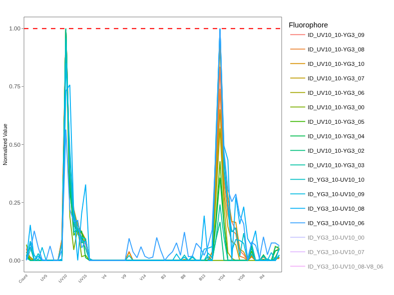

::: {style="text-align: right;"}
[](https://www.gnu.org/licenses/agpl-3.0.en.html) [](http://creativecommons.org/licenses/by-sa/4.0/)
:::

For the YouTube livestream schedule, see [here](https://www.youtube.com/@cytometryinr)

For screen-shot slides, click [here]()

<br>

---

# Background

In the [previous](/course/SDY3080/SignatureMatrices.qmd) bonus walk-through, we generated signature matrices for both our bead and cell single-color unmixing controls using the `flowGate` and `Luciernaga` R packages. The normalized fluorescent signatures were generated by extracting cells (or beads) that fell within our peak detector gates, taking the median measurement across each detector, subtracting out the equivalent background autofluorescence, and then normalizing (scaling) the values to range from 0 to 1. The normalized fluorescent signatures from all the fluorophores were then assembled together into a signature matrix. 

Overall, this workflow is representative of the approach taken within most commercial softwares in the steps leading up to unmixing. Unfortunately, relying on a summary measurement (median in this case) often limits what we are able to perceive, and when it comes to the unmixing controls, there is plenty of additional information that can be gleaned.

During [Week 12](/course/12_SpectralSignatures/index.qmd#single-color-signatures-from-individual-cells), we showcased the use of the `Luciernaga` packages `LuciernagaIntegration()` function, which allowed us to identify the tandem degradation from APC-Fire 810 to APC that was occuring in the cell single color controls (but not the bead single color control prepared from the same antibody vial). 

In this walk-through, we will take a look at the other 29-fluorophores in the panel, and identify other frequently encountered patterns that can be found when we look at our unmixing controls with such a granular view. We will also explore how to leverage this information to better inform which signatures we incorporate into the final fluorophore signature matrix for use in [unmixing](/Schedule.qmd#unmixing-in-r) the full-stained samples. 

# Walk Through

## Set Up

### Retrieving GatingSet

We will begin by loading the R packages we need today to our local environment, via the `library()` call. As a [reminder](/course/SDY3080/SignatureMatrices.qmd#checking-package-versions), we will need to have at least `Luciernaga` version 0.99.10 installed to use the functions (for reasons covered during the [last](/course/SDY3080/SignatureMatrices.qmd#checking-package-versions) walk-through). 

```{r}
library(dplyr)
library(purrr)
library(flowWorkspace)
library(Luciernaga)
library(ggplot2)
```

Next up, specify the storage (currently containing our .fcs files) and output (currently containing our intermediate .gs folder) locations (if you are following the courses organization scheme). 

```{r}
StorageLocation <- file.path("course", "SDY3080", "data", "SDY3080")
#StorageLocation <- file.path("data", "SDY3080")

OutputLocation <- file.path("course", "SDY3080", "outputs")
#OutputLocation <- file.path("outputs")
```

With this done, lets proceed to load our CellSC_GatingSet back into the local environment from its .gs folder. This would be the "Amplified" version, where the peak detector gates had been created, checked and corrected. 

```{r}
CellSCPath <- file.path(OutputLocation, "CellsSC_GS_Amplified.gs")
CellsSC_GatingSet <- load_gs(CellSCPath)
```

And lets go ahead and plot the gates, just to make sure everything remains as it should be. 

```{r}
#| eval: TRUE
plot(CellsSC_GatingSet)
```

### Assembling Template

Since `LuciernagaIntegration()` relies on the use of a template for matching the individual single-color control specimen with the corresponding peak detector gate, let's reasseble it by retrieving the updated metadata using `pData()`. Typically when loading back in a GatingSet, the metadata columns get rearranged, so lets also reorganize the columns into the expected order. 

```{r}
Template <- pData(CellsSC_GatingSet)
Template <- Template |> relocate(Fluorophore, Antigen, Type, Detector, Negative, .after="name")
```

```{r}
head(Template, 3)
```

We can also optionally remove the 3 samples that we previously choose not to investigate using the `dplyr` packages `filter()` function on the data.frame object. We can save this subsetted output as a new object/variable, "KeptCells". 

```{r}
KeptCells <- Template |>
     filter(!name %in% "DTR_2023_ILT_01-Reference Group-DR_Dump_CD19 Pacific Blue (Cells).1235702.fcs") |>
     filter(!name %in% "DTR_2023_ILT_01-Reference Group-DR_Viability_PMA Zombie NIR (Cells).1235709.fcs") |>
     filter(!name %in% "DTR_2023_ILT_01-Reference Group-DR_CD3 Alexa Fluor 488 (Cells).1235688.fcs") 
```

```{r}
#| eval: TRUE
KeptCells
```

### Rearranging by Detector

Before diving too far in, you may notice our current template is not exactly ordered in terms of peak detector order. The simplest way too fix this would be to provide a vector listing the detectors in the correct order by laser and emission wavelength, `factor()` the column so that correct ordering is recognized, and then use the `dplyr` packages `arrange()` function to shuffle the rows to match the designated order. 

```{r}
DetectorOrder <- c("UV1", "UV2", "UV3", "UV4", "UV5", "UV6", "UV7", "UV8",
               "UV9", "UV10", "UV11", "UV12", "UV13", "UV14", "UV15", "UV16",
               "V1", "V2", "V3", "V4", "V5", "V6", "V7", "V8",
               "V9", "V10", "V11","V12", "V13", "V14", "V15", "V16",
               "B1", "B2", "B3", "B4", "B5", "B6", "B7", "B8",
               "B9", "B10", "B11", "B12", "B13", "B14",
               "YG1", "YG2", "YG3", "YG4", "YG5", "YG6", "YG7", "YG8", "YG9", "YG10",
               "R1", "R2", "R3", "R4", "R5", "R6", "R7", "R8")

KeptCells$Detector <- factor(KeptCells$Detector, levels=DetectorOrder)

KeptCells <- KeptCells |> arrange(Detector)
```

```{r}
KeptCells
```

This in turn means when we use base R notation for rows, the fluorophores in our panel will show up sequentially as we work through the panel

```{r}
KeptCells[1,]
```

```{r}
KeptCells[29,]
```

## Cell Single-Color Controls

Before getting started, lets quickly recall which fluorophores we have for this 29-fluorophore panel

```{r}
Panel <- KeptCells |> select(Fluorophore, Antigen) |> mutate(Day=1)
Table <- FluorophoreMatrix(data=Panel, NumberDetectors = 64) # Aurora 5-laser
```

```{r}
Table
```

An important thing to remember, what we (and our cytometers) perceive as brightness is a combination of

- The fluorophores capacity to efficiently emit photons back when the correct laser shines on it (and also our instruments ability to capture this signal)

- The antigen density on the cell surface that our antibody-conjugated fluorophores will bind to. 

- Some additional amount of background autofluorescence (from our cell or bead)

- Some additional amount of uncertainty or noise for good measure.

We will likely revisit many of these points in finer detail as we navigate through this walk-through. Let's get started!


### UltraViolet

#### BUV395

Lets start with our [BUV395]() single-color control, which is conjugated to [CD62L](https://en.wikipedia.org/wiki/L-selectin), running our GatingSet object and the corresponding row of "KeptCells" through `LuciernagaIntegration()`

```{r}
BUV395 <- LuciernagaIntegration(template=KeptCells[1,], 
  gs=CellsSC_GatingSet, GuessSimilar=TRUE)[[1]] # Square brackets to loose list notation
```

This in turn returns to us a list type object

```{r}
class(BUV395)
```

Which contains both data.frames and ggplot2 objects, corresponding to various `Luciernaga` outputs. 

```{r}
names(BUV395)
```

Lets first take a look at the returned "LinearSlices_Plot", to see what effect would have been on the signature if we had split the region we had grabbed in our "positive" gate into 10% bins across. 

```{r}
Plot <- BUV395$LinearSlices_Plot
plotly::ggplotly(Plot)
```

Glancing, we can see that for the 10% bins containing the cells with dimmer MFI, we have what looks to be an increasing amount of retained autofluorescence present. Thisis in part due to the step-ladder signal appearance that is occuring onr the detectors we typically associte with autofluorescence (V7-A, and lesser extent B3-A). 

Having noted this, lets check out the output stored under "LuciernagaQC_Signatures", which contains the return from the `LuciernagaQC()` function that groups normalized signatures of the individual cells. 

```{r}
Plot <- BUV395$LuciernagaQC_Signatures
plotly::ggplotly(Plot)
```

Right off the back, it seems quite obvious that this is one of the fluorophores where the combination of antigen x fluorophore brightness is not terribly bright, which leaves the BUV395 at risk of residual autofluorescence contamination. 

Lets visualize this same plot in an alternative fashion, checking to see where the median signature ends up by comparison. 

```{r}
Plot <- BUV395$LuciernagaQC_AmalgamatedPlot
plotly::ggplotly(Plot)
```

So as we can see, cumulatively, ends up somewhere half up the step ladder. From this view, the contribution of the UV7 autofluorescence is also visible as a shoulder. 

Lets retrieve the underlying data for this plot, and keep the Average, as well as variants with minimal and maxinum autofluorescence contribution of the autofluorescence peak. 

```{r}
Data <- BUV395$AveragedSignature_Data |>
   filter(Cluster %in% c("UV2_10", "Average", "UV2_10-V7_07-B3_02"))
```

Lets pass these individually to `QC_SimilarFluorophores()` and gage the difference. 

```{r}
QC_WhatsThis(x="UV2_10", columnname="Cluster", data=Data, NumberHits=5, NumberDetectors=64, returnPlots=FALSE)
```

```{r}
QC_WhatsThis(x="Average", columnname="Cluster", data=Data, NumberHits=5, NumberDetectors=64, returnPlots=FALSE)
```

```{r}
QC_WhatsThis(x="UV2_10-V7_07-B3_02", columnname="Cluster", data=Data, NumberHits=5, NumberDetectors=64, returnPlots=FALSE)
```

As we can see in this case, we go from a close match to the reference BUV395 for our "UV2_10" (i.e. 'single peak at UV2, height 1.0') with a cosine value of 0.99, which then drifts to a value of 0.93 for the "Average" signature. This in turn dramatically drops for the dimmest staining cells with the "UV2_10-V7_07-B3_02" (i.e. peak detector at UV2, height 1.0; second peak at V7, relative height 0.7 to main peak, third peak at B3, relative height of 0.2 to main peak), where the cosine value reaches 0.71. 

If we visualized the difference in these angles, we would see the following

```{r}
#| code-fold: TRUE
cos_vals <- c(1, 0.99, 0.93, 0.71)
theta <- acos(cos_vals)

df <- data.frame(
  label = paste0("cos = ", cos_vals),
  angle_deg = round(theta * 180 / pi, 1),
  x = sin(theta),
  y = cos(theta)
)

ggplot(df) +
  geom_segment(aes(x = 0, y = 0, xend = x, yend = y, color = label),
               arrow = arrow(length = unit(0.25, "cm")),
               linewidth = 1) +
  coord_fixed(xlim = c(-0.1, 1), ylim = c(-0.1, 1.1)) +
  geom_hline(yintercept = 0, color = "grey80") +
  geom_vline(xintercept = 0, color = "grey80") +
  labs(x = NULL, y = NULL, color = "Vector",
       title = NULL) +
  theme_bw()
```

Before we go on, lets evaluate the proportion of cells within our positive gated region as distributed across our signature variants

```{r}
Plot <- BUV395$ProportionPlot
plotly::ggplotly(Plot)
```

:::{.callout-caution title="Caution"}
So, 2% of the cells being a BUV395 signature match, 26% matching the average, and 1% matching the dimmest. In terms of improved unmixing, if we could shift our original positive gate to the right (retaining brighter cells) the unmixing might improve overall. 
:::

#### BUV496

Lets next tackle one of our most autofluorescently similar fluorophores, BUV496, conjugated in this case to CD8. Given it is a primary marker and how we gated, we can at least be reasonably confident that it should be relatively bright. 

```{r}
BUV496 <- LuciernagaIntegration(template=KeptCells[2,], gs=CellsSC_GatingSet, GuessSimilar=TRUE)[[1]] # Square brackets to loose list notation
```

Lets first take a look at the "LinearSlices_Plot", to see what effect would have been on the signature if we had split the region we had grabbed in our "positive" gate into 10% bins across. 

```{r}
Plot <- BUV496$LinearSlices_Plot
plotly::ggplotly(Plot)
```

As anticipated, the antigen-fluorophore combination alongside our gate placement on the bulk of the CD8 T cells means that there was little difference across 10% bins in terms of the overall signature. 

Having noted this, lets check out the `LuciernagaQC()` grouped individual cell normalized signatures output stored under "LuciernagaQC_Signatures". 

```{r}
Plot <- BUV496$LuciernagaQC_Signatures
plotly::ggplotly(Plot)
```

`LuciernagaQC()` only returns two variant signatures, the main diffeence being slightly different secondary V6 peaks. The difference between the two is likely attributable to the rounding applied to each detector by the function behind the scenes (values of 0.24 rounding down to 0.2, values of 0.25 rounding up to 0.3). 

Seeing as we only have two signature variants, want to guess where the median signature ends up at? 

```{r}
Plot <- BUV496$LuciernagaQC_AmalgamatedPlot
plotly::ggplotly(Plot)
```

Lets retrieve the underlying data for this plot for subsequent steps, no need to filter since we only have three signatures when you include the "Average".

```{r}
Data <- BUV496$AveragedSignature_Data
```

Lets pass these signatures individually to `QC_SimilarFluorophores()` and gage the difference. 

```{r}
QC_WhatsThis(x="UV7_10-V6_02", columnname="Cluster", data=Data, NumberHits=5, NumberDetectors=64, returnPlots=FALSE)
```

```{r}
QC_WhatsThis(x="Average", columnname="Cluster", data=Data, NumberHits=5, NumberDetectors=64, returnPlots=FALSE)
```

```{r}
QC_WhatsThis(x="UV7_10-V6_03", columnname="Cluster", data=Data, NumberHits=5, NumberDetectors=64, returnPlots=FALSE)
```

The first two return as cosine values of 1.00, while the last returns as 0.99 vs. the reference BUV496. Lets visualized the difference in these angles

```{r}
#| code-fold: TRUE
cos_vals <- c(1, 0.99)
theta <- acos(cos_vals)

df <- data.frame(
  label = paste0("cos = ", cos_vals),
  angle_deg = round(theta * 180 / pi, 1),
  x = sin(theta),
  y = cos(theta)
)

ggplot(df) +
  geom_segment(aes(x = 0, y = 0, xend = x, yend = y, color = label),
               arrow = arrow(length = unit(0.25, "cm")),
               linewidth = 1) +
  coord_fixed(xlim = c(-0.1, 1), ylim = c(-0.1, 1.1)) +
  geom_hline(yintercept = 0, color = "grey80") +
  geom_vline(xintercept = 0, color = "grey80") +
  labs(x = NULL, y = NULL, color = "Vector",
       title = NULL) +
  theme_bw()
```

Before we go on, lets evaluate the proportion of cells within our positive gated region as distributed across our signature variants

```{r}
Plot <- BUV496$ProportionPlot
plotly::ggplotly(Plot)
```

:::{.callout-tip title="Pass"}
In this case, most of the variants are showing a signature reflective of the reference control. No change to our gate is required in this case. 
:::


#### BUV563

Next up, we are tackling BUV563, which is conjugated to CD69. One thing to note, this was one of the single-color controls that was prepared with PMA-ionomycin activated cells. The `LuciernagaIntegration()` default is still to use internal negative with minimal fluorophore peak detector contribution, so we will see how this behaves compared to the previous fluorophores. 

```{r}
BUV563 <- LuciernagaIntegration(template=KeptCells[3,], gs=CellsSC_GatingSet, GuessSimilar=TRUE)[[1]] # Square brackets to loose list notation
```

Lets first take a look at the "LinearSlices_Plot", to see what effect would have been on the signature if we had split the region we had grabbed in our "positive" gate into 10% bins across. 

```{r}
Plot <- BUV563$LinearSlices_Plot
plotly::ggplotly(Plot)
```

Glancing at the resulting plot, there is a smidge of difference across the V7 detector as we compare the variant signatures across the bins, but overall the difference appears relatively minor compared to what we saw with BUV395. 

Having noted this, lets check out the `LuciernagaQC()` grouped individual cell normalized signatures output stored under "LuciernagaQC_Signatures". 

```{r}
Plot <- BUV563$LuciernagaQC_Signatures
plotly::ggplotly(Plot)
```

The observation we saw is born out with the outputs from `LuciernagaQC()`, as we have four variant signatures, but similar to the case with BUV496, they appear to be noise related to the rounding of the relative heights of the secondary and third peaks.

Lets visualize this same plot in an alternative fashion, checking to see where the median signature ends up by comparison. 

```{r}
Plot <- BUV563$LuciernagaQC_AmalgamatedPlot
plotly::ggplotly(Plot)
```

At this point, it feels unecesary to dive further, but we can check the "Average" signature using `QC_WhatsThis()` for final verification. 

```{r}
Data <- BUV563$AveragedSignature_Data
```

```{r}
QC_WhatsThis(x="Average", columnname="Cluster", data=Data, NumberHits=5, NumberDetectors=64, returnPlots=FALSE)
```

:::{.callout-tip title="Pass"}
For BUV563, we didn't find any substantial signature variants, so our gate is likely fine as placed, and we can move on to screening the next fluorophore. 
:::

#### BUV615

Next up, we have BUV615, which is conjugated to CCR4. If we are classifying in terms of marker expression, this is more on the chemokine side, so we may encounter some lower antigen density issues compared to the primary markers like CD8. 

```{r}
BUV615 <- LuciernagaIntegration(template=KeptCells[4,], gs=CellsSC_GatingSet, GuessSimilar=TRUE)[[1]] # Square brackets to loose list notation
```

Lets first take a look at the "LinearSlices_Plot", to see what effect would have been on the signature if we had split the region we had grabbed in our "positive" gate into 10% bins across. 

```{r}
Plot <- BUV615$LinearSlices_Plot
plotly::ggplotly(Plot)
```

Right off the bat, we can already see a step-ladder arising out of the typical autofluorescence peaks (V7, UV7, B3). This should prove an interesting fluorophore to screen if nothing else!

Having noted this, lets check out the `LuciernagaQC()` grouped individual cell normalized signatures output stored under "LuciernagaQC_Signatures". 

```{r}
Plot <- BUV615$LuciernagaQC_Signatures
plotly::ggplotly(Plot)
```

What in the world? We have a fuzzy caterpillar! If we unclick the lower signature variants, we eventually end up with the following plot



We can tell that among the grouped individual cell normalized signature variants, everyone seems to be relatively uniform for the UV10 peak, but, there is a distinct gradient appearance to the YG3 peak. This may be a signal that the tandem is decoupling back into its respective components. 

Lets visualize this same plot in an alternative fashion, checking to see where the median signature ends up by comparison, to better help us gage the extent that this may be happening at 

```{r}
Plot <- BUV615$LuciernagaQC_AmalgamatedPlot
plotly::ggplotly(Plot)
```

Still appears variable. Lets check what the reference signature appears like for context. 

```{r}
Plot <- QC_ReferenceLibrary("BUV615", returnPlots=TRUE, NumberDetectors=64)[[2]]
plotly::ggplotly(Plot)
```

So overall, the reference has a YG3 detector closer to 0.8, so we have signature variants appearing both below and above it. 

Lets retrieve the underlying data for this plot, and keep the Average, as well as variants with minimal and maxinum autofluorescence contribution of the autofluorescence peak. 

```{r}
Data <- BUV615$AveragedSignature_Data |>
   filter(Cluster %in% c("UV10_10-YG3_02", "Average", "UV10_10-YG3_10"))
```

Lets pass these individually to `QC_SimilarFluorophores()` and gage the difference. 

```{r}
QC_WhatsThis(x="UV10_10-YG3_02", columnname="Cluster", data=Data, NumberHits=5, NumberDetectors=64, returnPlots=FALSE)
```

```{r}
QC_WhatsThis(x="Average", columnname="Cluster", data=Data, NumberHits=5, NumberDetectors=64, returnPlots=FALSE)
```

```{r}
QC_WhatsThis(x="UV10_10-YG3_10", columnname="Cluster", data=Data, NumberHits=5, NumberDetectors=64, returnPlots=FALSE)
```

Interesting, the signature with the lower YG3 peak relative to UV10 appears to be the degraded fluorophore signature variant, coming in at a cosine value of 0.76 vs. the BUV615 reference. By contrast, the "average" is 0.97, and the one with brightest BUV615 is at 0.98.  Lets visualize these angles. 

```{r}
#| code-fold: TRUE
cos_vals <- c(1, 0.99, 0.98, 0.76)
theta <- acos(cos_vals)

df <- data.frame(
  label = paste0("cos = ", cos_vals),
  angle_deg = round(theta * 180 / pi, 1),
  x = sin(theta),
  y = cos(theta)
)

ggplot(df) +
  geom_segment(aes(x = 0, y = 0, xend = x, yend = y, color = label),
               arrow = arrow(length = unit(0.25, "cm")),
               linewidth = 1) +
  coord_fixed(xlim = c(-0.1, 1), ylim = c(-0.1, 1.1)) +
  geom_hline(yintercept = 0, color = "grey80") +
  geom_vline(xintercept = 0, color = "grey80") +
  labs(x = NULL, y = NULL, color = "Vector",
       title = NULL) +
  theme_bw()
```

In terms of neither "Average" or "UV10_10-YG3_10" matching the reference signature, this is not uncommon, as tandem fluorophore batches often can vary in their assembly (as well as the reference itself may have similarly been affected, or had some individual instrument acquisition variance)

Before we go on, lets evaluate the proportion of cells within our positive gated region as distributed across our signature variants

```{r}
Plot <- BUV615$ProportionPlot
plotly::ggplotly(Plot)
```

:::{.callout-warning title="Fail"}
Overall, 11% of the individual cells had signatures similar to the "Average". Fully degraded on the YG3 detector was around 5%. We also had 13% where the YG3 detector was co-equal to the UV10 peak.  

In this case, we have some clear signs of tandem degradation occuring within this single-color control. Whether this is a cell subset specific thing occuring in-vitro like we encountered previously with APC-Fire 810, or something at the level of the entire vial of antibody would be something we should investigate further. 
:::

#### BUV661

Continuing with our journey through the UV fluorophores, lets check out the BUV661 fluorophore, which was conjugated to V-delta-2. In the context of the [original study](https://www.frontiersin.org/journals/immunology/articles/10.3389/fimmu.2025.1628145/full), the Vγ9Vδ2 T cells cells were one the main subsets of interest. However, given their frequency can vary person to person, they screened in advanced to make sure the donor used for PBMCs had high enough percentage to use cells as the single-color control. 

```{r}
BUV661 <- LuciernagaIntegration(template=KeptCells[5,], gs=CellsSC_GatingSet, GuessSimilar=TRUE)[[1]] # Square brackets to loose list notation
```

Lets first take a look at the "LinearSlices_Plot", to see what effect would have been on the signature if we had split the region we had grabbed in our "positive" gate into 10% bins across. 

```{r}
Plot <- BUV661$LinearSlices_Plot
plotly::ggplotly(Plot)
```


There is some variation on V7 across the 10% bins, but it is much more reminiscent of what we encountered for BUV563. 

Having noted this, lets check out the `LuciernagaQC()` grouped individual cell normalized signatures output stored under "LuciernagaQC_Signatures". 

```{r}
Plot <- BUV661$LuciernagaQC_Signatures
plotly::ggplotly(Plot)
```

Two signatures, slightly different at R1 and R2. Want to guess where the median ends up at?  

```{r}
Plot <- BUV661$LuciernagaQC_AmalgamatedPlot
plotly::ggplotly(Plot)
```

Since this antigen-fluorophore combination appears to be behaving, lets wrap up by checking the average vs. the reference signature. 

```{r}
Data <- BUV661$AveragedSignature_Data
```

```{r}
Plots <- QC_WhatsThis(x="Average", columnname="Cluster", data=Data, NumberHits=5, NumberDetectors=64, returnPlots=TRUE)

Plots[[1]]
```

```{r}
plotly::ggplotly(Plots[[2]])
```

:::{.callout-tip title="Pass"}
Overall, a little different compared to the reference signature (likely due to a bit of the residual autofluorescence around V7). We may want to adjust a bit the gate positioning to the right to reduce this contribution, but overall, not particularly far off from where it should be. 
:::

#### BUV737

Next up, we have BUV737, conjugated to CXCR3. Seeing as it is a ligand, we note before starting that this may be similar scenario as what we anticipated encountering for CD62L or CCR4. 

```{r}
BUV737 <- LuciernagaIntegration(template=KeptCells[6,], gs=CellsSC_GatingSet, GuessSimilar=TRUE)[[1]] # Square brackets to loose list notation
```

Lets first take a look at the "LinearSlices_Plot", to see what effect would have been on the signature if we had split the region we had grabbed in our "positive" gate into 10% bins across. 

```{r}
Plot <- BUV737$LinearSlices_Plot
plotly::ggplotly(Plot)
```

It is immediately obvious we have step-ladder peaks for V7, B3 and UV7, something that we haven't quite seen to this extent for the previous fluorophores. Main thing to note is that the fluorophores two peaks (UV14 and R5) are remaining consistent. This is often what we see for particularly dim antigen-fluorophore combinations where the autofluorescence residual is substantial portion of the final area under the curve. 

Lets break out `LuciernagaQC()` to group the individual cell normalized signatures, as stored in the "LuciernagaQC_Signatures" output in the list. 

```{r}
Plot <- BUV737$LuciernagaQC_Signatures
plotly::ggplotly(Plot)
```

Wait a second, where did the autofluorescence peaks go? Well, there respective regions now look awfully flat, so it looks like after subtraction they ended up with negative values that ended up rounded to 0 (we can raise whether this was correct approach with the package maintainer). 

Regardless, similar to CCR4, the primary detector peak UV14 appears consistent, but the R5 detector appears to similarly be experiencing step ladder, suggestive that the tandem is degrading. 

Lets visualize this same plot in an alternative fashion, checking to see where the median signature ends up by comparison. 

```{r}
Plot <- BUV737$LuciernagaQC_AmalgamatedPlot
plotly::ggplotly(Plot)
```

Some of the signatures appear erratic (generally typical of when few cells are present to begin with). Lets retrieve the underlying data for this plot, and keep the Average, as well as variants with reasonable appearing minimal and maxinum autofluorescence contribution of the R5 detector

```{r}
Data <- BUV737$AveragedSignature_Data |>
   filter(Cluster %in% c("UV14_10-R5_03-B11_00","Average", "UV14_10-R5_07-B11_02"))
```

Lets pass these individually to `QC_SimilarFluorophores()` and gage the difference. 

```{r}
QC_WhatsThis(x="UV14_10-R5_03-B11_00", columnname="Cluster", data=Data, NumberHits=5, NumberDetectors=64, returnPlots=FALSE)
```

```{r}
QC_WhatsThis(x="Average", columnname="Cluster", data=Data, NumberHits=5, NumberDetectors=64, returnPlots=FALSE)
```

```{r}
QC_WhatsThis(x="UV14_10-R5_07-B11_02", columnname="Cluster", data=Data, NumberHits=5, NumberDetectors=64, returnPlots=FALSE)
```

Overall, looking like the average is comparable to the reference control, with the R5 variants being similar to less extents. If we visualized the difference in these angles, we would see the following

```{r}
#| code-fold: TRUE
cos_vals <- c(1, 0.91, 0.97)
theta <- acos(cos_vals)

df <- data.frame(
  label = paste0("cos = ", cos_vals),
  angle_deg = round(theta * 180 / pi, 1),
  x = sin(theta),
  y = cos(theta)
)

ggplot(df) +
  geom_segment(aes(x = 0, y = 0, xend = x, yend = y, color = label),
               arrow = arrow(length = unit(0.25, "cm")),
               linewidth = 1) +
  coord_fixed(xlim = c(-0.1, 1), ylim = c(-0.1, 1.1)) +
  geom_hline(yintercept = 0, color = "grey80") +
  geom_vline(xintercept = 0, color = "grey80") +
  labs(x = NULL, y = NULL, color = "Vector",
       title = NULL) +
  theme_bw()
```

One thing to remember however, is that due to the rounding of the negatives, this is not necessarily what the signature looks like in practice, as there are negative peaks that would render the fluorophore very unsimilar to the reference had the negative values been left intact. 

Before we go on, lets evaluate the proportion of cells within our positive gated region as distributed across our signature variants

```{r}
Plot <- BUV737$ProportionPlot
plotly::ggplotly(Plot)
```

:::{.callout-warning}
So, while degraded products are present, at first glance looking at the proportions, it looks like this fluorophore has enough fluorophore in good shape to allow it to continue. However, as noted, not full story, since the autofluorescence peaks appeared to vanish entirely (do to `LuciernagaQC()` handling of negative values by default) showing limitation to the the generic `LuciernagaIntegration()` approach in this case. 

In the actual panel implementation, as soon as this cell unmixing control was swapped to its bead unmixing control equivalent, panel unmixing substantially improved. 
:::

#### BUV805

And wrapping up our exploration of the UV laser fluorophores, lets check out the BUV805 fluorophore, which is conjugated to CD4. Given antigen density on a CD4 T cell, this should prove less complicated than the last couple fluors we have encountered.

```{r}
# Bugged
BUV805 <- LuciernagaIntegration(template=KeptCells[7,], gs=CellsSC_GatingSet, GuessSimilar=TRUE)[[1]] # Square brackets to loose list notation
```

Lets first take a look at the "LinearSlices_Plot", to see what effect would have been on the signature if we had split the region we had grabbed in our "positive" gate into 10% bins across. 

```{r}
Plot <- BUV805$LinearSlices_Plot
plotly::ggplotly(Plot)
```

Pretty much no difference on the autofluorescence detectors, so very similar to what we saw for BUV496 CD8. Lets check out the `LuciernagaQC()` grouped individual cell normalized signatures output stored under "LuciernagaQC_Signatures". 

```{r}
Plot <- BUV805$LuciernagaQC_Signatures
plotly::ggplotly(Plot)
```

Two signatures, one with slightly more autofluorescence residual. Lets visualize this same plot in an alternative fashion, checking to see where the median signature ends up by comparison. 

```{r}
Plot <- BUV805$LuciernagaQC_AmalgamatedPlot
plotly::ggplotly(Plot)
```

And for completionist sake, lets compare the "Average" signature to the reference using `QC_WhatsThis()`

```{r}
Data <- BUV805$AveragedSignature_Data 
```

```{r}
QC_WhatsThis(x="Average", columnname="Cluster", data=Data, NumberHits=5, NumberDetectors=64, returnPlots=FALSE)
```

```{r}
Plot <- BUV805$ProportionPlot
plotly::ggplotly(Plot)
```

:::{.callout-tip title="Pass"}
Overall, in good shape, although interesting proportion splits across the two signature variants, might be worth adjusting the gate slightly to the right overall. 
:::

### Violet

We proceed to the the fluorophores whose primary peak detectors are on the violet laser. One thing to keep in mind is that most cells also have autofluorescence that peaks around V7/V8 detector on a Cytek Aurora, although rarer cell populations may have peaks on V3 or V10. We will circle back to this point should we encounter anything particular odd when profiling grouped normalized signatures of individual cells. 

#### BV421

First fluorophore on the Violets is BV421, conjugated with CD127 for this panel. Lets go ahead and dive right in an see what information we can glean from this cell single-color control.

```{r}
#| eval: FALSE

UpdatedAFOVerlap <- data.frame(Fluorophore=c("Unstained", "BV421"),
                               MainDetector=c("UV7-A, V7-A, B3-A", "V3-A"))


BV421 <- LuciernagaIntegration(template=KeptCells[8,], gs=CellsSC_GatingSet,
 GuessSimilar=TRUE, AFOverlap=UpdatedAFOVerlap)[[1]] # Square brackets to loose list notation

plotly::ggplotly(BV421$LinearSlices_Plot)

#devtools::document("/home/david/Documents/Luciernaga")
#devtools::load_all("/home/david/Documents/Luciernaga")
```

What in the world? .... (this will require a `LuciernagaQC()` deep dive). But essentially, this single-color control was one left accidentally unstained. 


#### Pacific Blue

Following that deep-dive, lets move on to the next Fluorophore, Pacific Blue, which in this case was conjugated with CD14. Consequently, it is going to be found primarily on the monocytes. Since its using an internal gate, we may potentially encounter issues of discrepant autofluorescences, since within that gate, cells that are CD14- are either non-classical monocytes or some dendritic cell subsets, which may have their own autofluorescences. 

```{r}
#| eval: FALSE
UpdatedAFOVerlap <- data.frame(Fluorophore=c("Unstained", "Pacific Blue"),
                               MainDetector=c("UV7-A, V7-A, B3-A", "V3-A"))

PacificBlue <- LuciernagaIntegration(template=KeptCells[9,], gs=CellsSC_GatingSet, GuessSimilar=TRUE)[[1]] # Square brackets to loose list notation
```

Also bugged, on to the next for now!


#### BV480

Next up, we have BV480, which was direct conjugated to CD161. While a lot of T and NK cells will be positive for CD161, Mucosal-associated Invariant Cells would be bright for this marker. However, like other innate-like T cells, their abundance will vary from donor to donor, so without prior information, we don't know how many we will encounter for this adult PBMC donor. 

```{r}
BV480 <- LuciernagaIntegration(template=KeptCells[10,], gs=CellsSC_GatingSet, GuessSimilar=TRUE)[[1]] # Square brackets to loose list notation
```

Lets first take a look at the "LinearSlices_Plot", to see what effect would have been on the signature if we had split the region we had grabbed in our "positive" gate into 10% bins across. 

```{r}
Plot <- BV480$LinearSlices_Plot
plotly::ggplotly(Plot)
```

Looking at the signatures taken from each 10% bin, we can see that most appear relatively similar, with only some small impact from residual autofluorescence at the usual spots, similar to what we have previously seen for CD69 and Vdelta2.

Having noted this, lets check out the `LuciernagaQC()` grouped individual cell normalized signatures output stored under "LuciernagaQC_Signatures". 

```{r}
Plot <- BV480$LuciernagaQC_Signatures
plotly::ggplotly(Plot)
```

As anticipated, upon the `LuciernagaQC()` rounding, these small differenes end up producing two variant signatures. Lets visualize this same plot in an alternative fashion, checking to see where the median signature ends up by comparison. 

```{r}
Plot <- BV480$LuciernagaQC_AmalgamatedPlot
plotly::ggplotly(Plot)
```

Which likely aligns with proportion of cells within our positive gated region as distributed across our signature variants

```{r}
Plot <- BV480$ProportionPlot
plotly::ggplotly(Plot)
```

And before moving on, lets see how the "Average" compares to the reference signature using `QC_WhatsThis()`

```{r}
Data <- BV480$AveragedSignature_Data 
```

```{r}
QC_WhatsThis(x="Average", columnname="Cluster", data=Data, NumberHits=5, NumberDetectors=64, returnPlots=FALSE)
```

:::{.callout-tip title="Pass"}
No issues were found with this particular fluorophore, everything in terms of the normalized signature appearing relatively uniform and consistent. 
:::


#### BV510

Next up, we have BV510, which is conjugated to CD45RA. Normally, this fluorophore alongside BUV496 is the most similar to autofluorescence, so any variation that occurs is likely to affect it. However, being paired with CD45RA, it will be fairly bright across the board. We will see if we can find anything interesting while exploring it.  

```{r}
#| eval: FALSE
UpdatedAFOVerlap <- data.frame(Fluorophore=c("Unstained", "BV510"),
                               MainDetector=c("UV7-A, V7-A, B3-A", "V7-A"))

BV510 <- LuciernagaIntegration(template=KeptCells[11,], gs=CellsSC_GatingSet, GuessSimilar=TRUE)[[1]] # Square brackets to loose list notation
```


#### BV605

Next up, we have BV605, which is conjugated to CD56. Given the presence of Natural Killer (NK) cells in the samples, this should be bright, but similar to what we saw for CD161, the proportion of the bright population might vary across particular donors. 

```{r}
BV605 <- LuciernagaIntegration(template=KeptCells[12,], gs=CellsSC_GatingSet, GuessSimilar=TRUE)[[1]] # Square brackets to loose list notation
```

Lets first take a look at the "LinearSlices_Plot", to see what effect would have been on the signature if we had split the region we had grabbed in our "positive" gate into 10% bins across. 

```{r}
Plot <- BV605$LinearSlices_Plot
plotly::ggplotly(Plot)
```

From the signatures we retrieve from the 10% bins, we can see some autofluorescence residual being left in the shoulder of the BV605 primary detector, ranging from roughly the V5 through V8 detectors. While not as neglible as what we saw for BUV563 CD69, it's not quite a step ladder appearance as we saw for BUV395 CD62L. 

Having noted this, lets check out the `LuciernagaQC()` grouped individual cell normalized signatures output stored under "LuciernagaQC_Signatures". 

```{r}
Plot <- BV605$LuciernagaQC_Signatures
plotly::ggplotly(Plot)
```

Glancing at the retrieved signatures, we find "V10_10-YG3_04-UV10_03" is behaving fluorophore like, while "V10_10-YG3_04-UV9_02" is showing more residual autofluorescence contribution. Interestingly, the "V10_10-YG3_04-UV10_02" signature variant is showing a ... "Count" column. Cleanup for that data.frame being passed please! 

Lets visualize this same plot in an alternative fashion, checking to see where the median signature ends up by comparison. 

```{r}
Plot <- BV605$LuciernagaQC_AmalgamatedPlot
plotly::ggplotly(Plot)
```

So the average is a little above the "V10_10-YG3_04-UV10_03", which likely reflects proportion of cells within our positive gated region as they were distributed across our signature variants. 

```{r}
Plot <- BV605$ProportionPlot
plotly::ggplotly(Plot)
```

Lets retrieve the underlying data for this plot, and keep the Average, as well as variants with minimal and maxinum autofluorescence contribution of the autofluorescence peak. 

```{r}
Data <- BV605$AveragedSignature_Data |>
   filter(Cluster %in% c("V10_10-YG3_04-UV10_03", "Average", "V10_10-YG3_04-UV9_02"))
```

Lets pass these individually to `QC_SimilarFluorophores()` and gage the difference. 

```{r}
QC_WhatsThis(x="V10_10-YG3_04-UV10_03", columnname="Cluster", data=Data, NumberHits=5, NumberDetectors=64, returnPlots=FALSE)
```

```{r}
QC_WhatsThis(x="Average", columnname="Cluster", data=Data, NumberHits=5, NumberDetectors=64, returnPlots=FALSE)
```

```{r}
QC_WhatsThis(x="V10_10-YG3_04-UV9_02", columnname="Cluster", data=Data, NumberHits=5, NumberDetectors=64, returnPlots=FALSE)
```

So compared to the standard reference, the signatures go from 0.97, 0.96 to 0.89 for the signature variant incorporating residual autofluorescence. When we compare our signature to the reference, we can see there is still substantially more signal present from V1 through V8. Whether this is still residual left over from autofluorescence, or something due to the tandem batch, is what we will need to determine at the time of unmixing.

```{r}
Plot <- QC_WhatsThis(x="V10_10-YG3_04-UV10_03", columnname="Cluster", data=Data, NumberHits=5, NumberDetectors=64, returnPlots=TRUE)
plotly::ggplotly(Plot[[2]])
```

Before we go, lets visualized the difference in these angles, to better understand visually the difference in cosine values. 

```{r}
#| code-fold: TRUE
cos_vals <- c(1, 0.97, 0.96, 0.89)
theta <- acos(cos_vals)

df <- data.frame(
  label = paste0("cos = ", cos_vals),
  angle_deg = round(theta * 180 / pi, 1),
  x = sin(theta),
  y = cos(theta)
)

ggplot(df) +
  geom_segment(aes(x = 0, y = 0, xend = x, yend = y, color = label),
               arrow = arrow(length = unit(0.25, "cm")),
               linewidth = 1) +
  coord_fixed(xlim = c(-0.1, 1), ylim = c(-0.1, 1.1)) +
  geom_hline(yintercept = 0, color = "grey80") +
  geom_vline(xintercept = 0, color = "grey80") +
  labs(x = NULL, y = NULL, color = "Vector",
       title = NULL) +
  theme_bw()
```

:::{.callout-caution title="Caution"}
While not our main priority, this combination of antigen x fluorophore based on how we gated seems a little dim, which is leaving it sucescptible to autofluorescence residuals sinking into the signature. One thing we can attempt to ameliorate the issue would be to shift the gate further to the right (or increasing the antibody concentration a bit) to try to reduce this possibility. 
:::


#### BV650

Next up, we have BV650, conjugated to CCR7. With it's primary detector on V10, it is out of the range for most of the autofluorescence, so we should start seeing any autofluorescence residual peaks more clearly going forward. 

```{r}
BV650 <- LuciernagaIntegration(template=KeptCells[13,], gs=CellsSC_GatingSet, GuessSimilar=TRUE)[[1]] # Square brackets to loose list notation
```

Lets first take a look at the "LinearSlices_Plot", to see what effect would have been on the signature if we had split the region we had grabbed in our "positive" gate into 10% bins across. 

```{r}
Plot <- BV650$LinearSlices_Plot
plotly::ggplotly(Plot)
```

As we have seen for the other fluorophores, consistent signal across the board for the fluorophore peaks, with a bit of step-ladder appearance for the V7 detector where the autofluorescent peak can be found for the cells in this intracellular staining panel. 


Having noted this, lets check out the `LuciernagaQC()` grouped individual cell normalized signatures output stored under "LuciernagaQC_Signatures". 

```{r}
Plot <- BV650$LuciernagaQC_Signatures
plotly::ggplotly(Plot)
```

All things said and done, after passing through `LuciernagaQC()` everything round up or down to reflect two signature variants for V7.


Lets visualize this same plot in an alternative fashion, checking to see where the median signature ends up by comparison. 

```{r}
Plot <- BV650$LuciernagaQC_AmalgamatedPlot
plotly::ggplotly(Plot)
```

Which in turn, reflects the proportion of cells within our positive gate that were grouped together on the basis of shared signature at the individual cell level. 

```{r}
Plot <- BV650$ProportionPlot
plotly::ggplotly(Plot)
```


Lets go ahead and compare both signature variants vs. each other using `QC_WhatsThis()`. 

```{r}
Data <- BV650$AveragedSignature_Data
```

```{r}
QC_WhatsThis(x="V11_10-YG4_03-UV11_02", columnname="Cluster", data=Data, NumberHits=5, NumberDetectors=64, returnPlots=FALSE)
```

```{r}
QC_WhatsThis(x="Average", columnname="Cluster", data=Data, NumberHits=5, NumberDetectors=64, returnPlots=FALSE)
```

```{r}
QC_WhatsThis(x="V11_10-YG4_02-UV11_02", columnname="Cluster", data=Data, NumberHits=5, NumberDetectors=64, returnPlots=FALSE)
```

Consistently a cosine of 0.98 across the board.

```{r}
Plot <- QC_WhatsThis(x="Average", columnname="Cluster", data=Data, NumberHits=5, NumberDetectors=64, returnPlots=TRUE)
plotly::ggplotly(Plot[[2]])
```


 If we visualized the difference in these angles, we would see the following

```{r}
#| code-fold: TRUE
cos_vals <- c(1, 0.98)
theta <- acos(cos_vals)

df <- data.frame(
  label = paste0("cos = ", cos_vals),
  angle_deg = round(theta * 180 / pi, 1),
  x = sin(theta),
  y = cos(theta)
)

ggplot(df) +
  geom_segment(aes(x = 0, y = 0, xend = x, yend = y, color = label),
               arrow = arrow(length = unit(0.25, "cm")),
               linewidth = 1) +
  coord_fixed(xlim = c(-0.1, 1), ylim = c(-0.1, 1.1)) +
  geom_hline(yintercept = 0, color = "grey80") +
  geom_vline(xintercept = 0, color = "grey80") +
  labs(x = NULL, y = NULL, color = "Vector",
       title = NULL) +
  theme_bw()
```

:::{.callout-tip title="Pass"}
Overall, fluorophore is in consistent shape. It is showing some low level autofluorescence residuals vs. the reference, but will likely have a minor effect on a panel of this size. 
:::


#### BV711

Continuing into the increasingly whacky world of Violet tandem dyes, we have BV711, which is conjugated to CD7. CD7 should be bright for both T cells and NK cells. 

```{r}
BV711 <- LuciernagaIntegration(template=KeptCells[14,], gs=CellsSC_GatingSet, GuessSimilar=TRUE)[[1]] # Square brackets to loose list notation
```

Lets first take a look at the "LinearSlices_Plot", to see what effect would have been on the signature if we had split the region we had grabbed in our "positive" gate into 10% bins across. 

```{r}
Plot <- BV711$LinearSlices_Plot
plotly::ggplotly(Plot)
```

As expected for this antigen x fluorophore combination, everything is bright, so any autofluorescence residual leftovers contribute little to the overall signature. 

Having noted this, lets check out the `LuciernagaQC()` grouped individual cell normalized signatures output stored under "LuciernagaQC_Signatures". 

```{r}
Plot <- BV711$LuciernagaQC_Signatures
plotly::ggplotly(Plot)
```

As expected, the little autofluorescence variation we saw was minor, and is reflected by the retrieval of only two variant signatures that are likely result of the rounding approach taken by `LuciernagaQC()`. 

```{r}
Plot <- BV711$LuciernagaQC_AmalgamatedPlot
plotly::ggplotly(Plot)
```

To wrap up, lets compare vs. the reference signature using `QC_WhatsThis()`

```{r}
Data <- BV711$AveragedSignature_Data
```

```{r}
Plots <- QC_WhatsThis(x="Average", columnname="Cluster", data=Data, NumberHits=5, NumberDetectors=64, returnPlots=TRUE)
Plots[[1]]
plotly::ggplotly(Plots[[2]])
```

:::{.callout-tip title="Pass"}
Only minor differences noticed vs. the reference, and everything in terms of the signature of the cells within our gated region appears to be consistent. 
:::

#### BV750

Next up, we have BV750, which is conjugated to IFNg. Given that this cell single-color control was prepared with adult donor PBMCs, stimulated with PMA-ionomycin, we expect the signal to be bright. 

```{r}
BV750 <- LuciernagaIntegration(template=KeptCells[15,], gs=CellsSC_GatingSet, GuessSimilar=TRUE)[[1]] # Square brackets to loose list notation
```

Lets first take a look at the "LinearSlices_Plot", to see what effect would have been on the signature if we had split the region we had grabbed in our "positive" gate into 10% bins across. 

```{r}
Plot <- BV750$LinearSlices_Plot
plotly::ggplotly(Plot)
```

The 10% bins within our gated region show minimal differences in signature. Lets go ahead and verify this via the `LuciernagaQC()` grouped individual cell normalized signatures output stored under "LuciernagaQC_Signatures". 

```{r}
Plot <- BV750$LuciernagaQC_Signatures
plotly::ggplotly(Plot)
```

Lets visualize this same plot in an alternative fashion, checking to see where the median signature ends up by comparison. 

```{r}
Plot <- BV750$LuciernagaQC_AmalgamatedPlot
plotly::ggplotly(Plot)
```

And for completionist sake, lets compare vs. the reference signature. 
 
```{r}
Data <- BV750$AveragedSignature_Data
```

```{r}
Plot <- QC_WhatsThis(x="Average", columnname="Cluster", data=Data, NumberHits=5, NumberDetectors=64, returnPlots=TRUE)
Plot[[1]]
plotly::ggplotly(Plot[[2]])
```

:::{.callout-tip title="Pass"}
The signature we retrieved from our gate matches that of the reference signature, and we saw minimal variation. So this fluorophore appears to be in good condition. 
:::

#### BV786

Last in the violet fluorophores, we have BV786, conjugated with CCR6. CCR6 while not as high density as other markers, will still be bright for the cells that express it, but may vary in proportion depending on the donor. 

```{r}
BV786 <- LuciernagaIntegration(template=KeptCells[16,], gs=CellsSC_GatingSet, GuessSimilar=TRUE)[[1]] # Square brackets to loose list notation
```

Lets first take a look at the "LinearSlices_Plot", to see what effect would have been on the signature if we had split the region we had grabbed in our "positive" gate into 10% bins across. 

```{r}
Plot <- BV786$LinearSlices_Plot
plotly::ggplotly(Plot)
```

From the 10% bins, we can see a bit of variation around the V7 detector from residual autofluorescence, but still on the minor end overall. 

Having noted this, lets check out the `LuciernagaQC()` grouped individual cell normalized signatures output stored under "LuciernagaQC_Signatures". 

```{r}
Plot <- BV786$LuciernagaQC_Signatures
plotly::ggplotly(Plot)
```

We get a step-ladder appearance to out signature variance, with the "V15_10-V7_03-UV15_02" showing the most contribution from the leftover autofluorescence. 

Lets visualize this same plot in an alternative fashion, checking to see where the median signature ends up by comparison. 

```{r}
Plot <- BV786$LuciernagaQC_AmalgamatedPlot
plotly::ggplotly(Plot)
```

So it looks like the average ends up between the signature variants. Let's verify the proportion of cells within our positive gated region as distributed across our signature variants

```{r}
Plot <- BV786$ProportionPlot
plotly::ggplotly(Plot)
```

Lets retrieve the underlying data for this plot, and keep the Average, as well as variants with minimal and maxinum autofluorescence contribution of the autofluorescence peak. 

```{r}
Data <- BV786$AveragedSignature_Data |>
   filter(Cluster %in% c("V15_10-UV15_02", "Average"))
```

Lets pass these individually to `QC_SimilarFluorophores()` and gage the difference. 

```{r}
QC_WhatsThis(x="V15_10-UV15_02", columnname="Cluster", data=Data, NumberHits=5, NumberDetectors=64, returnPlots=FALSE)
```

```{r}
Plot <- QC_WhatsThis(x="Average", columnname="Cluster", data=Data, NumberHits=5, NumberDetectors=64, returnPlots=TRUE)
Plot[[1]]
plotly::ggplotly(Plot[[2]])
```

If we visualized the difference in these angles, we would see the following

```{r}
#| code-fold: TRUE
cos_vals <- c(1, 0.98, 0.97)
theta <- acos(cos_vals)

df <- data.frame(
  label = paste0("cos = ", cos_vals),
  angle_deg = round(theta * 180 / pi, 1),
  x = sin(theta),
  y = cos(theta)
)

ggplot(df) +
  geom_segment(aes(x = 0, y = 0, xend = x, yend = y, color = label),
               arrow = arrow(length = unit(0.25, "cm")),
               linewidth = 1) +
  coord_fixed(xlim = c(-0.1, 1), ylim = c(-0.1, 1.1)) +
  geom_hline(yintercept = 0, color = "grey80") +
  geom_vline(xintercept = 0, color = "grey80") +
  labs(x = NULL, y = NULL, color = "Vector",
       title = NULL) +
  theme_bw()
```

:::{.callout-tip title="Pass"}
Fluorophore is in good condition overall, with minor autofluorescence residuals compared to the reference present. Good enough for now. 
:::


### Blue

Two lasers down, 3 more to go. We are now on to the Blue laser. We still have a little bit of autofluorescence to track around the B3 detector, but from there things get simpler, and we mainly are concerned with identifying degrading tandems, and insufficiently bright antigens. 

#### FITC

```{r}
#| eval: FALSE
# bugged
FITC <- LuciernagaIntegration(template=KeptCells[17,], gs=CellsSC_GatingSet, GuessSimilar=TRUE)[[1]] # Square brackets to loose list notation
```

Lets first take a look at the "LinearSlices_Plot", to see what effect would have been on the signature if we had split the region we had grabbed in our "positive" gate into 10% bins across. 

```{r}
#| eval: FALSE
Plot <- FITC$LinearSlices_Plot
plotly::ggplotly(Plot)
```

Having noted this, lets check out the `LuciernagaQC()` grouped individual cell normalized signatures output stored under "LuciernagaQC_Signatures". 

```{r}
#| eval: FALSE
Plot <- FITC$LuciernagaQC_Signatures
plotly::ggplotly(Plot)
```

Lets visualize this same plot in an alternative fashion, checking to see where the median signature ends up by comparison. 

```{r}
#| eval: FALSE
Plot <- FITC$LuciernagaQC_AmalgamatedPlot
plotly::ggplotly(Plot)
```


Lets retrieve the underlying data for this plot, and keep the Average, as well as variants with minimal and maxinum autofluorescence contribution of the autofluorescence peak. 

```{r}
#| eval: FALSE
Data <- FITC$AveragedSignature_Data |>
   filter(Cluster %in% c())
```

Lets pass these individually to `QC_SimilarFluorophores()` and gage the difference. 

```{r}
#| eval: FALSE
QC_WhatsThis(x="", columnname="Cluster", data=Data, NumberHits=5, NumberDetectors=64, returnPlots=FALSE)
```

```{r}
#| eval: FALSE
QC_WhatsThis(x="Average", columnname="Cluster", data=Data, NumberHits=5, NumberDetectors=64, returnPlots=FALSE)
```

```{r}
#| eval: FALSE
QC_WhatsThis(x="", columnname="Cluster", data=Data, NumberHits=5, NumberDetectors=64, returnPlots=FALSE)
```

If we visualized the difference in these angles, we would see the following

```{r}
#| eval: FALSE
#| code-fold: TRUE
cos_vals <- c(1)
theta <- acos(cos_vals)

df <- data.frame(
  label = paste0("cos = ", cos_vals),
  angle_deg = round(theta * 180 / pi, 1),
  x = sin(theta),
  y = cos(theta)
)

ggplot(df) +
  geom_segment(aes(x = 0, y = 0, xend = x, yend = y, color = label),
               arrow = arrow(length = unit(0.25, "cm")),
               linewidth = 1) +
  coord_fixed(xlim = c(-0.1, 1), ylim = c(-0.1, 1.1)) +
  geom_hline(yintercept = 0, color = "grey80") +
  geom_vline(xintercept = 0, color = "grey80") +
  labs(x = NULL, y = NULL, color = "Vector",
       title = NULL) +
  theme_bw()
```

Before we go on, lets evaluate the proportion of cells within our positive gated region as distributed across our signature variants

```{r}
#| eval: FALSE
Plot <- FITC$ProportionPlot
plotly::ggplotly(Plot)
```

#### Spark Blue 550

Next up, Spark Blue 550, conjugated with CD3. This combination should be relatively bright, but also some potential contribution from autofluorescence as they share the B3 detector. 

```{r}
SparkBlue550 <- LuciernagaIntegration(template=KeptCells[18,], gs=CellsSC_GatingSet, GuessSimilar=TRUE)[[1]] # Square brackets to loose list notation
```

Lets first take a look at the "LinearSlices_Plot", to see what effect would have been on the signature if we had split the region we had grabbed in our "positive" gate into 10% bins across. 

```{r}
Plot <- SparkBlue550$LinearSlices_Plot
plotly::ggplotly(Plot)
```

Almost no impact across the 10% bins. Having noted this, lets check out the `LuciernagaQC()` grouped individual cell normalized signatures output stored under "LuciernagaQC_Signatures". 

```{r}
Plot <- SparkBlue550$LuciernagaQC_Signatures
plotly::ggplotly(Plot)
```

As we have anticipated, these minor differences end up being rounded up and down, to produce the two variant signatures. Lets visualize this same plot in an alternative fashion, checking to see where the median signature ends up by comparison. 

```{r}
Plot <- SparkBlue550$LuciernagaQC_AmalgamatedPlot
plotly::ggplotly(Plot)
```

For completionist sake, lets check vs. the reference. 

```{r}
Data <- SparkBlue550$AveragedSignature_Data
```

```{r}
Plot <- QC_WhatsThis(x="Average", columnname="Cluster", data=Data, NumberHits=5, NumberDetectors=64, returnPlots=TRUE)
Plot[[1]]
plotly::ggplotly(Plot[[2]])
```


:::{.callout-tip title="Pass"}
Across the board, the fluorophore looks good, with some minor autofluorescence residual present. If we really wanted, we could shift the gate slightly to the right to reduce this contribution overall.
:::

#### PerCP-Cy5.5

Alright, on to the worst fluorophore ever. PerCP-Cy5.5, conjugated in this case with CD26. CD26 should be present on subsets of T cells, that should be sufficiently present to make it bright. However, the overall brightness of PerCP-Cy5.5 could also potentially come into play depending on the individual fluorophore vial. 

```{r}
WorstFluorophore <- LuciernagaIntegration(template=KeptCells[19,], gs=CellsSC_GatingSet, GuessSimilar=TRUE)[[1]] # Square brackets to loose list notation
```

Lets first take a look at the "LinearSlices_Plot", to see what effect would have been on the signature if we had split the region we had grabbed in our "positive" gate into 10% bins across. 

```{r}
Plot <- WorstFluorophore$LinearSlices_Plot
plotly::ggplotly(Plot)
```

At this point, quite distinct step-ladder appearance on the V7, UV7 and B3 peaks. The PerCP-Cy5.5 peaks B9, YG7 and R3 peaks appear consistent, although the V12 peak also appears to be showing variation, similar to what we saw for the APC-Fire 810 fluorophore during [Week 12](). 

Having noted this, lets check out the `LuciernagaQC()` grouped individual cell normalized signatures output stored under "LuciernagaQC_Signatures". 

```{r}
Plot <- WorstFluorophore$LuciernagaQC_Signatures
plotly::ggplotly(Plot)
```

And uff, we have a fuzzy caterpillar. We have lost the autofluorescence contribution due to rounding of the negative values by `LuciernagaQC()`, but we also have step-ladders on three of the PerCP-Cy5.5 peaks, suggesting substantial tandem degradation occuring for the antibody-fluorophores that are attaching to their antigen on the individual cells. 

Lets visualize this same plot in an alternative fashion, checking to see where the median signature ends up by comparison. 

```{r}
Plot <- WorstFluorophore$LuciernagaQC_AmalgamatedPlot
plotly::ggplotly(Plot)
```

Gritting our teeth, lets check how within the gated region, the proportion of cells that are matched to each of these variants. 

```{r}
Plot <- WorstFluorophore$ProportionPlot
plotly::ggplotly(Plot)
```

A general gradient, across the board. Lets retrieve the Average, two of the peaks with the most varied YG7 signatures, and what appears to be a by-product of just the B9 detector. Lets pass these individually to `QC_WhatsThis()` and gage the difference.

```{r}
Data <- WorstFluorophore$AveragedSignature_Data |>
   filter(Cluster %in% c("B9_10-YG6_05-R3_03","Average", "B9_10-YG6_00-R3_00", "B9_10-YG6_05-R3_02"))
```

```{r}
QC_WhatsThis(x="Average", columnname="Cluster", data=Data, NumberHits=5, NumberDetectors=64, returnPlots=FALSE)
```

```{r}
QC_WhatsThis(x="B9_10-YG6_05-R3_03", columnname="Cluster", data=Data, NumberHits=5, NumberDetectors=64, returnPlots=FALSE)
```

```{r}
QC_WhatsThis(x="B9_10-YG6_05-R3_02", columnname="Cluster", data=Data, NumberHits=5, NumberDetectors=64, returnPlots=FALSE)
```

And checking what appears to be a single part of the tandem

```{r}
Plots <- QC_WhatsThis(x="B9_10-YG6_00-R3_00", columnname="Cluster", data=Data, NumberHits=5, NumberDetectors=64, returnPlots=TRUE)
Plots[[1]]
plotly::ggplotly(Plots[[2]])
```

If we visualized the difference in these angles, we would see the following

```{r}
#| code-fold: TRUE
cos_vals <- c(1, 0.99, 0.96, 0.94, 0.49)
theta <- acos(cos_vals)

df <- data.frame(
  label = paste0("cos = ", cos_vals),
  angle_deg = round(theta * 180 / pi, 1),
  x = sin(theta),
  y = cos(theta)
)

ggplot(df) +
  geom_segment(aes(x = 0, y = 0, xend = x, yend = y, color = label),
               arrow = arrow(length = unit(0.25, "cm")),
               linewidth = 1) +
  coord_fixed(xlim = c(-0.1, 1), ylim = c(-0.1, 1.1)) +
  geom_hline(yintercept = 0, color = "grey80") +
  geom_vline(xintercept = 0, color = "grey80") +
  labs(x = NULL, y = NULL, color = "Vector",
       title = NULL) +
  theme_bw()
```

And finally, lets check average vs. the reference signature

```{r}
Plot <- QC_WhatsThis(x="Average", columnname="Cluster", data=Data, NumberHits=5, NumberDetectors=64, returnPlots=TRUE)
Plot[[1]]
plotly::ggplotly(Plot[[2]])
```

A little bit different, but this could also be how this tandem batch was formulated, so we would need to check several other examples for PerCP-Cy5.5 to be sure. 

:::{.callout-caution title="Caution"}
Overall, the average signature is close to where it needs to be, but there are also some clear signs of tandem degradation. For this particular single color, I would shift the gate to the right to try to ensure we are getting more of the intact fluorophore to avoid some of these issues. 
:::


### YellowGreen

We now jump to the Yellow-green laser (as this 29-color panel was originally intended for a 4-laser system so didn't take full advantage of the blue laser detectors). As many of these fluorophores are PE conjugates, the main cause of concern for cells is non-specific staining arising from antigen-presenting cells tendency to latch-on/endocytose the PE. We will see if we can spot any of these cases as we move through the cell single-color controls. 

#### PE

First off on the Yellow-green, we have our PE fluorophore, conjugated in this case to NKG2D. This marker is well expressed on the NK cells, so will likely be a bright antigen x fluorophore combination. 

```{r}
PE <- LuciernagaIntegration(template=KeptCells[20,], gs=CellsSC_GatingSet, GuessSimilar=TRUE)[[1]] # Square brackets to loose list notation
```

Lets first take a look at the "LinearSlices_Plot", to see what effect would have been on the signature if we had split the region we had grabbed in our "positive" gate into 10% bins across. 

```{r}
Plot <- PE$LinearSlices_Plot
plotly::ggplotly(Plot)
```

Looking at the signatures retrieved from the 10% bins across our "positive" gate, we can see the typical pattern of the two fluorophore peaks (YG1, B4) appearing consistent, with a bit of a step ladder appearance from autofluorescence residuals around the V8 detector

Having noted this, lets check out the `LuciernagaQC()` grouped individual cell normalized signatures output stored under "LuciernagaQC_Signatures". 

```{r}
Plot <- PE$LuciernagaQC_Signatures
plotly::ggplotly(Plot)
```

So overall, probably not quite as bright a combination as we originally anticipated. We will need to check vs. the reference signature to determine whether we are expecting the PE to have some emission on the V8. 

```{r}
Plots <- QC_ReferenceLibrary("PE$", 64, returnPlots=TRUE)
plotly::ggplotly(Plots[[2]])
```

So yep, we are expecting some contribution from the fluorophore, but relatively around V8 (not soo much of the shoulder detectors)

Lets visualize this same plot in an alternative fashion, checking to see where the median signature ends up by comparison. 

```{r}
Plot <- PE$LuciernagaQC_AmalgamatedPlot
plotly::ggplotly(Plot)
```


Lets retrieve the underlying data for this plot, and keep the Average, as well as variants with minimal and maxinum autofluorescence contribution of the autofluorescence peak. 

```{r}
Data <- PE$AveragedSignature_Data |>
   filter(Cluster %in% c("Average", "YG1_10-B4_08-V8_04", "YG1_10-B4_07-V8_05"))
```

Lets pass these individually to `QC_SimilarFluorophores()` and gage the difference. 

```{r}
QC_WhatsThis(x="YG1_10-B4_08-V8_04", columnname="Cluster", data=Data, NumberHits=5, NumberDetectors=64, returnPlots=FALSE)
```

```{r}
QC_WhatsThis(x="Average", columnname="Cluster", data=Data, NumberHits=5, NumberDetectors=64, returnPlots=FALSE)
```

```{r}
QC_WhatsThis(x="YG1_10-B4_07-V8_05", columnname="Cluster", data=Data, NumberHits=5, NumberDetectors=64, returnPlots=FALSE)
```

So average is the closest with a cosine of 0.98, then 0.94, and 0.90. 

```{r}
Plot <- QC_WhatsThis(x="Average", columnname="Cluster", data=Data, NumberHits=5, NumberDetectors=64, returnPlots=TRUE)
plotly::ggplotly(Plot[[2]])
```

If we visualized the difference in these angles, we would see the following

```{r}
#| code-fold: TRUE
cos_vals <- c(1, 0.98, 0.94, 0.9)
theta <- acos(cos_vals)

df <- data.frame(
  label = paste0("cos = ", cos_vals),
  angle_deg = round(theta * 180 / pi, 1),
  x = sin(theta),
  y = cos(theta)
)

ggplot(df) +
  geom_segment(aes(x = 0, y = 0, xend = x, yend = y, color = label),
               arrow = arrow(length = unit(0.25, "cm")),
               linewidth = 1) +
  coord_fixed(xlim = c(-0.1, 1), ylim = c(-0.1, 1.1)) +
  geom_hline(yintercept = 0, color = "grey80") +
  geom_vline(xintercept = 0, color = "grey80") +
  labs(x = NULL, y = NULL, color = "Vector",
       title = NULL) +
  theme_bw()
```

Before we go on, lets evaluate the proportion of cells within our positive gated region as distributed across our signature variants

```{r}
Plot <- PE$ProportionPlot
plotly::ggplotly(Plot)
```

:::{.callout-tip = "Pass"}
Overall, our average is fairly close to what we expect to see for the reference signature. A couple things to note, the secondary peak B4 is higher than the reference. Whether this is due to instrument-specific gain settings (or because something clipping the main YG1) would be something we should check vs. other PE signatures. We can also attempt to clean up some of the autofluorescence residual sholder by shifting the gate slightly to the right to reduce the contribution by including additional bright for PE cells. 
:::

#### PE-Dazzle 594

Next up, we have PE-Dazzle 594, which is conjugated to TNFa. Seeing as the cell single-color control used adult PBMCs stimulated with PMA-ionomycin, we expect this signal to be bright. However, it is on a tandem, so it may yet prove interesting. 

```{r}
PEDazzle594 <- LuciernagaIntegration(template=KeptCells[21,], gs=CellsSC_GatingSet, GuessSimilar=TRUE)[[1]] # Square brackets to loose list notation
```

Lets first take a look at the "LinearSlices_Plot", to see what effect would have been on the signature if we had split the region we had grabbed in our "positive" gate into 10% bins across. 

```{r}
Plot <- PEDazzle594$LinearSlices_Plot
plotly::ggplotly(Plot)
```

Nice! Almost no variation whatsoever across any of the 10% bins. Having noted this, lets check out the `LuciernagaQC()` grouped individual cell normalized signatures output stored under "LuciernagaQC_Signatures". 

```{r}
Plot <- PEDazzle594$LuciernagaQC_Signatures
plotly::ggplotly(Plot)
```

Alright, barely any variant signatures by the `LuciernagaQC()` approach. Lets wrap this up and move to the next fluorophore

```{r}
Plot <- PEDazzle594$LuciernagaQC_AmalgamatedPlot
plotly::ggplotly(Plot)
```
```{r}
Data <- PEDazzle594$AveragedSignature_Data 
```

```{r}
Plots <- QC_WhatsThis(x="Average", columnname="Cluster", data=Data, NumberHits=5, NumberDetectors=64, returnPlots=TRUE)
Plots[[1]]
plotly::ggplotly(Plots[[2]])
```

:::{.callout-tip title="Pass"}
Fluorophore is in good condition, and the combination of antigen x fluorophore means we are getting a consistent signature for our gating region. Next!
:::


#### PE-Cy5

Next up, we have PE-Cy5, conjugated to CD25. As the high-affinity IL-2 receptor, this antigen will be a little more distributed among the individual cell subsets, so lets see how this combination performs for this panel. 

```{r}
PECy5 <- LuciernagaIntegration(template=KeptCells[22,], gs=CellsSC_GatingSet, GuessSimilar=TRUE)[[1]] # Square brackets to loose list notation
```

Lets first take a look at the "LinearSlices_Plot", to see what effect would have been on the signature if we had split the region we had grabbed in our "positive" gate into 10% bins across. 

```{r}
Plot <- PECy5$LinearSlices_Plot
plotly::ggplotly(Plot)
```

Oh no! As we place 10% bins across our "Positive" gate, we can already see that the signatures from each bin show a step-ladder for the autofluorescence peak detectors. Worse, they are already approaching the height of PE-Cy5's secondary peak (B8), suggesting this combination is really dim. Somehow, not what I expect when I hear the words PE-Cy5 normally. 

Having noted this, lets check out the `LuciernagaQC()` grouped individual cell normalized signatures output stored under "LuciernagaQC_Signatures". 

```{r}
Plot <- PECy5$LuciernagaQC_Signatures
plotly::ggplotly(Plot)
```

And once again, the appearance appears to be not so bad (until we remember this is `LuciernagaQC()` getting rid of the resulting negatives). However, we can see that the B8 detector upon normalization appears like a step-ladder, which suggest we are having some tandem degradation occuring for this particular fluorophore. 

Lets visualize this same plot in an alternative fashion, checking to see where the median signature ends up by comparison. 

```{r}
Plot <- PECy5$LuciernagaQC_AmalgamatedPlot
plotly::ggplotly(Plot)
```

So overall, the B8 peak is about halfway between the low MFI and High MFI variants. Lets check the proportion plots to see how cells are distributed across the signature variants

```{r}
Plot <- PECy5$ProportionPlot
plotly::ggplotly(Plot)
```

So most are still where they roughly need to be at, fortunately. But not seeing what is happening to the negatives may be painting a rosy picture. 

Lets retrieve the underlying data for this plot, and keep the Average, as well as variants with minimal and maxinum autofluorescence contribution of the autofluorescence peak. 

```{r}
Data <- PECy5$AveragedSignature_Data |>
   filter(Cluster %in% c("YG5_10-B8_04", "Average", "YG5_10-B8_08"))
```

Lets pass these individually to `QC_SimilarFluorophores()` and gage the difference. 

```{r}
QC_WhatsThis(x="YG5_10-B8_04", columnname="Cluster", data=Data, NumberHits=5, NumberDetectors=64, returnPlots=FALSE)
```

```{r}
QC_WhatsThis(x="Average", columnname="Cluster", data=Data, NumberHits=5, NumberDetectors=64, returnPlots=FALSE)
```

```{r}
QC_WhatsThis(x="YG5_10-B8_08", columnname="Cluster", data=Data, NumberHits=5, NumberDetectors=64, returnPlots=FALSE)
```

So 0.86, 0.96 and 0.96 for the cosine values. 

If we visualized the difference in these angles, we would see the following. 

```{r}
#| code-fold: TRUE
cos_vals <- c(1, 0.86, 0.96)
theta <- acos(cos_vals)

df <- data.frame(
  label = paste0("cos = ", cos_vals),
  angle_deg = round(theta * 180 / pi, 1),
  x = sin(theta),
  y = cos(theta)
)

ggplot(df) +
  geom_segment(aes(x = 0, y = 0, xend = x, yend = y, color = label),
               arrow = arrow(length = unit(0.25, "cm")),
               linewidth = 1) +
  coord_fixed(xlim = c(-0.1, 1), ylim = c(-0.1, 1.1)) +
  geom_hline(yintercept = 0, color = "grey80") +
  geom_vline(xintercept = 0, color = "grey80") +
  labs(x = NULL, y = NULL, color = "Vector",
       title = NULL) +
  theme_bw()
```

And if we contrast the average against the reference signature. 

```{r}
Plot <- QC_WhatsThis(x="Average", columnname="Cluster", data=Data, NumberHits=5, NumberDetectors=64, returnPlots=TRUE)
Plot[[1]]
plotly::ggplotly(Plot[[2]])
```

:::{.callout-warning title="Fail"}
So while the regular "Average" signature at first glance appears similar enough to the PE-Cy5 reference, there are clear signs of tandem degradation occuring for this fluorophore, additionally, the unmodified `LuciernagaQC()` argument is removing the negative values, so painting a rosy picture. In actual practice, when we replaced this cell single-color control with the bead single-color control, our unmixing ended up improving substantially. Not a good combination in actual practice, despite PE-Cy5's reputation as being bright. 
:::


#### PE-Vio770

And last in our yellow-green laser, we have PE-Vio 770, conjugated to PD1. Antigen wise, not likely going to be spectacularly bright given the sample type, but the fluorophore is relatively bright. So we shall see. 

```{r}
PEVio770 <- LuciernagaIntegration(template=KeptCells[23,], gs=CellsSC_GatingSet, GuessSimilar=TRUE)[[1]] # Square brackets to loose list notation
```

Lets first take a look at the "LinearSlices_Plot", to see what effect would have been on the signature if we had split the region we had grabbed in our "positive" gate into 10% bins across. 

```{r}
Plot <- PEVio770$LinearSlices_Plot
plotly::ggplotly(Plot)
```

Alright, not bad overall, a step ladder for V7, but we have seen worse. Also some clipping to the secondary B13 peak, so might have a bit of tandem degradation in the system. 

Having noted this, lets check out the `LuciernagaQC()` grouped individual cell normalized signatures output stored under "LuciernagaQC_Signatures". 

```{r}
Plot <- PEVio770$LuciernagaQC_Signatures
plotly::ggplotly(Plot)
```

Alright, so a definite step-ladder for the V7 detector, but there is still fluorophore in the system that looks relatively intact. Lets check the proportion plots to see how cells are distributed across the variant signatures. 

```{r}
Plot <- PEVio770$ProportionPlot
plotly::ggplotly(Plot)
```

Lets visualize this same plot in an alternative fashion, checking to see where the median signature ends up by comparison. 

```{r}
Plot <- PEVio770$LuciernagaQC_AmalgamatedPlot
plotly::ggplotly(Plot)
```

So overall, a little bit of the residual autofluorescence is ending up in the fluorophore signature after the background is subtracted, but not horrid amounts. 

Lets retrieve the underlying data for this plot, and keep the Average, as well as variants with minimal and maxinum autofluorescence contribution of the autofluorescence peak. 

```{r}
Data <- PEVio770$AveragedSignature_Data |>
   filter(Cluster %in% c("YG9_10-B13_06-V15_02", "Average", "YG9_10-B13_06-V7_05"))
```

Lets pass these individually to `QC_SimilarFluorophores()` and gage the difference. 

```{r}
QC_WhatsThis(x="YG9_10-B13_06-V15_02", columnname="Cluster", data=Data, NumberHits=5, NumberDetectors=64, returnPlots=FALSE)
```

```{r}
QC_WhatsThis(x="Average", columnname="Cluster", data=Data, NumberHits=5, NumberDetectors=64, returnPlots=FALSE)
```

```{r}
QC_WhatsThis(x="YG9_10-B13_06-V7_05", columnname="Cluster", data=Data, NumberHits=5, NumberDetectors=64, returnPlots=FALSE)
```

So cosine wise, 0.99, 0.97 and 0.85. If we visualized the difference in these angles, we would see the following

```{r}
#| code-fold: TRUE
cos_vals <- c(1, 0.99, 0.97, 0.85)
theta <- acos(cos_vals)

df <- data.frame(
  label = paste0("cos = ", cos_vals),
  angle_deg = round(theta * 180 / pi, 1),
  x = sin(theta),
  y = cos(theta)
)

ggplot(df) +
  geom_segment(aes(x = 0, y = 0, xend = x, yend = y, color = label),
               arrow = arrow(length = unit(0.25, "cm")),
               linewidth = 1) +
  coord_fixed(xlim = c(-0.1, 1), ylim = c(-0.1, 1.1)) +
  geom_hline(yintercept = 0, color = "grey80") +
  geom_vline(xintercept = 0, color = "grey80") +
  labs(x = NULL, y = NULL, color = "Vector",
       title = NULL) +
  theme_bw()
```

:::{.callout-caution title="Caution"}
So definitely not a bright antigen x fluorophore combination, and some potential start of tandem degradation, but the vast majority of the fluorophore appears to be in good condition. I would reposition the positive gate to the right to improve the overall unmixing going forward. 
:::

### Red

#### APC

```{r}
#| eval: FALSE
# Bugged
APC <- LuciernagaIntegration(template=KeptCells[24,], gs=CellsSC_GatingSet, GuessSimilar=TRUE)[[1]] # Square brackets to loose list notation
```

Lets first take a look at the "LinearSlices_Plot", to see what effect would have been on the signature if we had split the region we had grabbed in our "positive" gate into 10% bins across. 

```{r}
#| eval: FALSE
Plot <- APC$LinearSlices_Plot
plotly::ggplotly(Plot)
```

Having noted this, lets check out the `LuciernagaQC()` grouped individual cell normalized signatures output stored under "LuciernagaQC_Signatures". 

```{r}
#| eval: FALSE
Plot <- APC$LuciernagaQC_Signatures
plotly::ggplotly(Plot)
```

Lets visualize this same plot in an alternative fashion, checking to see where the median signature ends up by comparison. 

```{r}
#| eval: FALSE
Plot <- APC$LuciernagaQC_AmalgamatedPlot
plotly::ggplotly(Plot)
```


Lets retrieve the underlying data for this plot, and keep the Average, as well as variants with minimal and maxinum autofluorescence contribution of the autofluorescence peak. 

```{r}
#| eval: FALSE
Data <- APC$AveragedSignature_Data |>
   filter(Cluster %in% c())
```

Lets pass these individually to `QC_SimilarFluorophores()` and gage the difference. 

```{r}
#| eval: FALSE
QC_WhatsThis(x="", columnname="Cluster", data=Data, NumberHits=5, NumberDetectors=64, returnPlots=FALSE)
```

```{r}
#| eval: FALSE
QC_WhatsThis(x="Average", columnname="Cluster", data=Data, NumberHits=5, NumberDetectors=64, returnPlots=FALSE)
```

```{r}
#| eval: FALSE
QC_WhatsThis(x="", columnname="Cluster", data=Data, NumberHits=5, NumberDetectors=64, returnPlots=FALSE)
```

If we visualized the difference in these angles, we would see the following

```{r}
#| eval: FALSE
#| code-fold: TRUE
cos_vals <- c(1)
theta <- acos(cos_vals)

df <- data.frame(
  label = paste0("cos = ", cos_vals),
  angle_deg = round(theta * 180 / pi, 1),
  x = sin(theta),
  y = cos(theta)
)

ggplot(df) +
  geom_segment(aes(x = 0, y = 0, xend = x, yend = y, color = label),
               arrow = arrow(length = unit(0.25, "cm")),
               linewidth = 1) +
  coord_fixed(xlim = c(-0.1, 1), ylim = c(-0.1, 1.1)) +
  geom_hline(yintercept = 0, color = "grey80") +
  geom_vline(xintercept = 0, color = "grey80") +
  labs(x = NULL, y = NULL, color = "Vector",
       title = NULL) +
  theme_bw()
```

Before we go on, lets evaluate the proportion of cells within our positive gated region as distributed across our signature variants

```{r}
#| eval: FALSE
Plot <- APC$ProportionPlot
plotly::ggplotly(Plot)
```

#### Alexa Fluor 647

Next on the roster is Alexa Fluor 647, conjugated to Va7.2. This would be found on subsets of T cells, as well as Mucosal-associated invariant T cells. 

```{r}
#| eval: FALSE
# bugged
AF647 <- LuciernagaIntegration(template=KeptCells[25,], gs=CellsSC_GatingSet, GuessSimilar=TRUE)[[1]] # Square brackets to loose list notation
```

Lets first take a look at the "LinearSlices_Plot", to see what effect would have been on the signature if we had split the region we had grabbed in our "positive" gate into 10% bins across. 

```{r}
#| eval: FALSE
Plot <- AF647$LinearSlices_Plot
plotly::ggplotly(Plot)
```

Having noted this, lets check out the `LuciernagaQC()` grouped individual cell normalized signatures output stored under "LuciernagaQC_Signatures". 

```{r}
#| eval: FALSE
Plot <- AF647$LuciernagaQC_Signatures
plotly::ggplotly(Plot)
```

Lets visualize this same plot in an alternative fashion, checking to see where the median signature ends up by comparison. 

```{r}
#| eval: FALSE
Plot <- AF647$LuciernagaQC_AmalgamatedPlot
plotly::ggplotly(Plot)
```


Lets retrieve the underlying data for this plot, and keep the Average, as well as variants with minimal and maxinum autofluorescence contribution of the autofluorescence peak. 

```{r}
#| eval: FALSE
Data <- AF647$AveragedSignature_Data |>
   filter(Cluster %in% c())
```

Lets pass these individually to `QC_SimilarFluorophores()` and gage the difference. 

```{r}
#| eval: FALSE
QC_WhatsThis(x="", columnname="Cluster", data=Data, NumberHits=5, NumberDetectors=64, returnPlots=FALSE)
```

```{r}
#| eval: FALSE
QC_WhatsThis(x="Average", columnname="Cluster", data=Data, NumberHits=5, NumberDetectors=64, returnPlots=FALSE)
```

```{r}
#| eval: FALSE
QC_WhatsThis(x="", columnname="Cluster", data=Data, NumberHits=5, NumberDetectors=64, returnPlots=FALSE)
```

If we visualized the difference in these angles, we would see the following

```{r}
#| eval: FALSE
#| code-fold: TRUE
cos_vals <- c(1)
theta <- acos(cos_vals)

df <- data.frame(
  label = paste0("cos = ", cos_vals),
  angle_deg = round(theta * 180 / pi, 1),
  x = sin(theta),
  y = cos(theta)
)

ggplot(df) +
  geom_segment(aes(x = 0, y = 0, xend = x, yend = y, color = label),
               arrow = arrow(length = unit(0.25, "cm")),
               linewidth = 1) +
  coord_fixed(xlim = c(-0.1, 1), ylim = c(-0.1, 1.1)) +
  geom_hline(yintercept = 0, color = "grey80") +
  geom_vline(xintercept = 0, color = "grey80") +
  labs(x = NULL, y = NULL, color = "Vector",
       title = NULL) +
  theme_bw()
```

Before we go on, lets evaluate the proportion of cells within our positive gated region as distributed across our signature variants

```{r}
#| eval: FALSE
Plot <- AF647$ProportionPlot
plotly::ggplotly(Plot)
```

#### APC-R700

Next up, we have APC-R700, which is conjugated to CD107A (LAMP-1). This one should prove interesting, as it was an antibody that was added to the cells during the stimulation with PMA-ionomycin. Any cells that would have degranulated in response to stimulation would expose CD107a on their surface, and ended up picking up being stained for the antibody. However, there is also the risk that the additional exposure in culture may have resulted in non-specific acquisition of the fluorophore, as well as potential degradation of the fluorophore itself. So if nothing else, this should be interesting to see what information can be gleaned from this single-color control. 

```{r}
APCR700 <- LuciernagaIntegration(template=KeptCells[26,], gs=CellsSC_GatingSet, GuessSimilar=TRUE)[[1]] # Square brackets to loose list notation
```

Lets first take a look at the "LinearSlices_Plot", to see what effect would have been on the signature if we had split the region we had grabbed in our "positive" gate into 10% bins across. 

```{r}
Plot <- APCR700$LinearSlices_Plot
plotly::ggplotly(Plot)
```

Alright, so far, on the basis of the 10% bins across our gated area, no immediately obvious damage to the fluorophore, just an autofluorescence step ladder on the V7 detector. 

Having noted this, lets check out the `LuciernagaQC()` grouped individual cell normalized signatures output stored under "LuciernagaQC_Signatures". 

```{r}
Plot <- APCR700$LuciernagaQC_Signatures
plotly::ggplotly(Plot)
```

As anticipated, we end up with a small step ladder in the individual normalized signatures, but most of the signatures appear to have minimal contribution from these autofluorescence residuals. 

Lets visualize this same plot in an alternative fashion, checking to see where the median signature ends up by comparison. 

```{r}
Plot <- APCR700$LuciernagaQC_AmalgamatedPlot
plotly::ggplotly(Plot)
```

Yep, the two more autofluorescence heavy variants appear to be relative rare, since they didn't drag the average up by much. We can verify this by checking the proportion plot. 

```{r}
Plot <- APCR700$ProportionPlot
plotly::ggplotly(Plot)
```

The V13 as secondary peak signatures make up 60% of the cells in our gated region overall, with the slightly more autofluorescence added representing another 38%. 

Lets retrieve the underlying data for this plot, and keep the Average, as well as variants with minimal and maxinum autofluorescence contribution of the autofluorescence peak. 

```{r}
Data <- APCR700$AveragedSignature_Data |>
   filter(Cluster %in% c("R4_10-YG7_05-V13_02", "Average", "R4_10-YG7_05-V7_03"))
```

Lets pass these individually to `QC_SimilarFluorophores()` and gage the difference. 

```{r}
QC_WhatsThis(x="R4_10-YG7_05-V13_02", columnname="Cluster", data=Data, NumberHits=5, NumberDetectors=64, returnPlots=FALSE)
```

```{r}
QC_WhatsThis(x="Average", columnname="Cluster", data=Data, NumberHits=5, NumberDetectors=64, returnPlots=FALSE)
```

```{r}
QC_WhatsThis(x="R4_10-YG7_05-V7_03", columnname="Cluster", data=Data, NumberHits=5, NumberDetectors=64, returnPlots=FALSE)
```

So cosines of 0.99, 0.99 and 0.95 respectively.  If we visualized the difference in these angles, we would see the following

```{r}
#| code-fold: TRUE
cos_vals <- c(1, 0.99, 0.95)
theta <- acos(cos_vals)

df <- data.frame(
  label = paste0("cos = ", cos_vals),
  angle_deg = round(theta * 180 / pi, 1),
  x = sin(theta),
  y = cos(theta)
)

ggplot(df) +
  geom_segment(aes(x = 0, y = 0, xend = x, yend = y, color = label),
               arrow = arrow(length = unit(0.25, "cm")),
               linewidth = 1) +
  coord_fixed(xlim = c(-0.1, 1), ylim = c(-0.1, 1.1)) +
  geom_hline(yintercept = 0, color = "grey80") +
  geom_vline(xintercept = 0, color = "grey80") +
  labs(x = NULL, y = NULL, color = "Vector",
       title = NULL) +
  theme_bw()
```

:::{.callout-tip title="Pass"}
Overall, in good shape, with the bulk of the cells in the positive gate expressing a single signature. We could as a precaution move the gate a little to the left to cut out potential contribution from the autofluorescence residual variant, but for now everything appears to be good.
:::

#### Zombie NIR

Alright, Zombie NIR, so its viability dye! Using internal will likely not quite work here, so we may need to consider providing a separate autofluorescence stand in. 

```{r}
ZombieNIR <- LuciernagaIntegration(template=KeptCells[27,], gs=CellsSC_GatingSet, GuessSimilar=TRUE)[[1]] # Square brackets to loose list notation
```

Lets first take a look at the "LinearSlices_Plot", to see what effect would have been on the signature if we had split the region we had grabbed in our "positive" gate into 10% bins across. 

```{r}
Plot <- ZombieNIR$LinearSlices_Plot
plotly::ggplotly(Plot)
```

Alright, so staining is bright, only minor bits of autofluorescence from V7. 

Having noted this, lets check out the `LuciernagaQC()` grouped individual cell normalized signatures output stored under "LuciernagaQC_Signatures". 

```{r}
Plot <- ZombieNIR$LuciernagaQC_Signatures
plotly::ggplotly(Plot)
```

Similar as we anticipated, relatively minor impact from autofluorescence from a couple signatures, but take a closer look at the peak detector, there is a split between usage of R6 or R7 detector as the peak. 

Lets visualize this same plot in an alternative fashion, checking to see where the median signature ends up by comparison. 

```{r}
Plot <- ZombieNIR$LuciernagaQC_AmalgamatedPlot
plotly::ggplotly(Plot)
```

Lets evaluate the proportion of cells within our positive gated region as distributed across our signature variants

```{r}
Plot <- ZombieNIR$ProportionPlot
plotly::ggplotly(Plot)
```

So around 15% of our cells are showing up as R7 detector, while 85% retain the expected R6 detector. Contribution from instrumental noise? 

Lets retrieve the underlying data for this plot, and keep the Average, as well as variants with minimal and maxinum autofluorescence contribution of the autofluorescence peak. 

```{r}
Data <- ZombieNIR$AveragedSignature_Data |>
   filter(Cluster %in% c("R6_10-B13_02-V14_03", "Average", "R7_10-R6_10-B13_03"))
```

Lets pass these individually to `QC_SimilarFluorophores()` and gage the difference. 

```{r}
QC_WhatsThis(x="R6_10-B13_02-V14_03", columnname="Cluster", data=Data, NumberHits=5, NumberDetectors=64, returnPlots=FALSE)
```

```{r}
QC_WhatsThis(x="Average", columnname="Cluster", data=Data, NumberHits=5, NumberDetectors=64, returnPlots=FALSE)
```

```{r}
QC_WhatsThis(x="R7_10-R6_10-B13_03", columnname="Cluster", data=Data, NumberHits=5, NumberDetectors=64, returnPlots=FALSE)
```

All across the board, the small shifts between R6 and R7 do not appear to have changed things substantially the overall signature as everything comes back as 1.0 on the cosine.

:::{.callout-tip title="Pass"}
All things said and done, our viability dye single-color control appears to be consistent and in good condition. Next!
:::

#### APC-Fire 750

And last of the unexplored, we have APC-Fire 750, which is conjugated with CD27. Since CD27 is found on a lot of T cells, we will likely have bright signal, but we will need to watch out for potential tandem degradation. 

```{r}
APCFire750 <- LuciernagaIntegration(template=KeptCells[28,], gs=CellsSC_GatingSet, GuessSimilar=TRUE)[[1]] # Square brackets to loose list notation
```

Lets first take a look at the "LinearSlices_Plot", to see what effect would have been on the signature if we had split the region we had grabbed in our "positive" gate into 10% bins across. 

```{r}
Plot <- APCFire750$LinearSlices_Plot
plotly::ggplotly(Plot)
```

Right off the back, we see a distinct step ladder on V7 (up to 0.33 relative to the primary peak). However, we also have a step-ladder appearance on the R2 detector, which is reminiscent of the tandem degradation issues we saw for APC-Fire 810 back during the [Week 12]() walk-through. 

Having noted this, lets check out the `LuciernagaQC()` grouped individual cell normalized signatures output stored under "LuciernagaQC_Signatures". 

```{r}
Plot <- APCFire750$LuciernagaQC_Signatures
plotly::ggplotly(Plot)
```

Wooh! After digging through all these fluorophores, we have found a fun one! When looking at the grouped normalized signatures of individual cells, we can see that we have some cells showing substantial amounts of R1 (aligning with a degradation back to APC). Likewise, as more of the fluorophore on the individual cell is degraded to APC's R1 detector, the less bright it is for the R7 detector, which leaves the autofluorescence residual peak occupying a more substantial amount of the area under the signature curve. 

Lets visualize this same plot in an alternative fashion, checking to see where the median signature ends up by comparison. 

```{r}
Plot <- APCFire750$LuciernagaQC_AmalgamatedPlot
plotly::ggplotly(Plot)
```

Lets check the proportion plots within our positive gated region as distributed across our signature variants

```{r}
Plot <- APCFire750$ProportionPlot
plotly::ggplotly(Plot)
```

So yeah, overall, within our gated region, substantial portion of cells have the autofluorescence as their third peak detector instead of the YG9 detector, which is what we see materialize in the amalgamated plot

Lets retrieve the underlying data for this plot, and keep the Average, as well as variants with minimal and maxinum autofluorescence contribution of the autofluorescence peak. Lets pass these individually to `QC_WhatsThis_()` and gage the difference. 

```{r}
Data <- APCFire750$AveragedSignature_Data |>
   filter(Cluster %in% c("R7_10-R8_08-YG9_02", "Average", "R7_10-R8_08-V7_06"))
```

```{r}
QC_WhatsThis(x="R7_10-R8_08-YG9_02", columnname="Cluster", data=Data, NumberHits=5, NumberDetectors=64, returnPlots=FALSE)
```

```{r}
QC_WhatsThis(x="Average", columnname="Cluster", data=Data, NumberHits=5, NumberDetectors=64, returnPlots=FALSE)
```

```{r}
QC_WhatsThis(x="R7_10-R8_08-V7_06", columnname="Cluster", data=Data, NumberHits=10, NumberDetectors=64, returnPlots=FALSE)
```

If we visualized the difference in these angles, we would see the following

```{r}
#| code-fold: TRUE
cos_vals <- c(1, 0.97, 0.94, 0.71)
theta <- acos(cos_vals)

df <- data.frame(
  label = paste0("cos = ", cos_vals),
  angle_deg = round(theta * 180 / pi, 1),
  x = sin(theta),
  y = cos(theta)
)

ggplot(df) +
  geom_segment(aes(x = 0, y = 0, xend = x, yend = y, color = label),
               arrow = arrow(length = unit(0.25, "cm")),
               linewidth = 1) +
  coord_fixed(xlim = c(-0.1, 1), ylim = c(-0.1, 1.1)) +
  geom_hline(yintercept = 0, color = "grey80") +
  geom_vline(xintercept = 0, color = "grey80") +
  labs(x = NULL, y = NULL, color = "Vector",
       title = NULL) +
  theme_bw()
```

Before we call it, lets compare the best signature against the reference signature

```{r}
Plot <- QC_WhatsThis(x="Average", columnname="Cluster", data=Data, NumberHits=5, NumberDetectors=64, returnPlots=TRUE)
Plot[1]
plotly::ggplotly(Plot[[2]])
```

:::{.callout-caution title="Caution"}
Overall, clear signs that the APC-Fire 750 fluorophore is starting to degrade on this single-color control. However, the overall proportion of cells with mostly intact fluorophore is still high enough that we can get a clean signature from them. The average signature does not have as much of the R1 signature, but does show a peak of V7 detector, so if we shifted the gate to the right, we might decrease this contribution overall. 
:::


#### APC-Fire 810

And back to where we started, let's revisit the fluorophore from our [Week 12]() walk-through. APC-Fire 810, conjugated to CD38, should be bright given its use of cord blood mononuclear cells for the single-color control, should be bright. Should. 

```{r}
APCFire810 <- LuciernagaIntegration(template=KeptCells[29,], gs=CellsSC_GatingSet, GuessSimilar=TRUE)[[1]] # Square brackets to loose list notation
```

Lets first take a look at the "LinearSlices_Plot", to see what effect would have been on the signature if we had split the region we had grabbed in our "positive" gate into 10% bins across. 

```{r}
Plot <- APCFire810$LinearSlices_Plot
plotly::ggplotly(Plot)
```

Once again, minor step ladder, but also the warning signs for the R1/R2 detector where we see a similar pattern. 

Having noted this, lets check out the `LuciernagaQC()` grouped individual cell normalized signatures output stored under "LuciernagaQC_Signatures". 

```{r}
Plot <- APCFire810$LuciernagaQC_Signatures
plotly::ggplotly(Plot)
```

And without a doubt, still the most dramatic example of tandem degradation we have encountered for this panel. Lets visualize this same plot in an alternative fashion, checking to see where the median signature ends up by comparison. 

```{r}
Plot <- APCFire810$LuciernagaQC_AmalgamatedPlot
plotly::ggplotly(Plot)
```

Substantial amount of tandem degradation ending up in the overall signature (in contrast to APC-Fire 750 where although present, wasn't as prevalent overall). Lets evaluate the proportion of cells within our positive gated region as distributed across our signature variants

```{r}
Plot <- APCFire810$ProportionPlot
plotly::ggplotly(Plot)
```

And yeah, overall, quite a distribution across the board for the signature variants for the cells in our gated region. 

Lets retrieve the underlying data for this plot, and keep the Average, as well as variants with minimal and maxinum autofluorescence contribution of the autofluorescence peak. 

```{r}
Data <- APCFire810$AveragedSignature_Data |>
   filter(Cluster %in% c("R8_10-R2_02-YG4_01", "Average", "R8_10-R2_09-YG4_05"))
```

Lets pass these individually to `QC_SimilarFluorophores()` and gage the difference. 

```{r}
QC_WhatsThis(x="R8_10-R2_02-YG4_01", columnname="Cluster", data=Data, NumberHits=5, NumberDetectors=64, returnPlots=FALSE)
```

```{r}
QC_WhatsThis(x="Average", columnname="Cluster", data=Data, NumberHits=5, NumberDetectors=64, returnPlots=FALSE)
```

```{r}
QC_WhatsThis(x="R8_10-R2_09-YG4_05", columnname="Cluster", data=Data, NumberHits=5, NumberDetectors=64, returnPlots=FALSE)
```

If we visualized the difference in these angles, we would see the following

```{r}
#| code-fold: TRUE
cos_vals <- c(1, 0.96, 0.89, 0.87)
theta <- acos(cos_vals)

df <- data.frame(
  label = paste0("cos = ", cos_vals),
  angle_deg = round(theta * 180 / pi, 1),
  x = sin(theta),
  y = cos(theta)
)

ggplot(df) +
  geom_segment(aes(x = 0, y = 0, xend = x, yend = y, color = label),
               arrow = arrow(length = unit(0.25, "cm")),
               linewidth = 1) +
  coord_fixed(xlim = c(-0.1, 1), ylim = c(-0.1, 1.1)) +
  geom_hline(yintercept = 0, color = "grey80") +
  geom_vline(xintercept = 0, color = "grey80") +
  labs(x = NULL, y = NULL, color = "Vector",
       title = NULL) +
  theme_bw()
```

And finally contrasting "Best" signature across the reference

```{r}
Plot <- QC_WhatsThis(x="Average", columnname="Cluster", data=Data, NumberHits=5, NumberDetectors=64, returnPlots=TRUE)
Plot[1]
plotly::ggplotly(Plot[[2]])
```

:::{.callout-warning title="Fail"}
Too many warning signs for this fluorophore, the average signature ends up having way too much of contributions from both autofluorescence as well as the tandem degradation contribution from APC. Even the best signature still has elements of both, so we would likely be better replacing the single-color control with a better quality one for this particular experiment
:::


## Unstained Controls

```{r}
Unstained_GatingSet <- load_gs("outputs/CellsUnstained_GS_Amplified.gs")

Updated <- pData(Unstained_GatingSet) |>  mutate(Type="Cells", Fluorophore="scatter",
 Antigen="Autofluorescence", Detector="V7", Negative="NoSubtraction")
```


### CBMC

```{r}
INF052Ctrl <- LuciernagaIntegration(template=Updated[1,], gs=Unstained_GatingSet, GuessSimilar=FALSE,
  Unstained=TRUE, inverse.transform=FALSE)

INF052Ctrl$LuciernagaQC_Signatures

INF052Ctrl$LuciernagaQC_AmalgamatedPlot

INF052Ctrl$GuessSimilar_Plot

INF052Ctrl$ProportionPlot

INF052Ctrl$CosineSimilarityPlot

INF052Ctrl$LinearSlices_Plot
```

```{r}
INF052PMA <- LuciernagaIntegration(template=Updated[2,], gs=Unstained_GatingSet, GuessSimilar=FALSE,
  Unstained=TRUE, inverse.transform=FALSE)

INF052PMA$LuciernagaQC_Signatures

INF052PMA$LuciernagaQC_AmalgamatedPlot

INF052PMA$GuessSimilar_Plot

INF052PMA$ProportionPlot

INF052PMA$CosineSimilarityPlot

INF052PMA$LinearSlices_Plot
```

```{r}
INF171Ctrl <- LuciernagaIntegration(template=Updated[3,], gs=Unstained_GatingSet, GuessSimilar=FALSE,
  Unstained=TRUE, inverse.transform=FALSE)

INF171Ctrl$LuciernagaQC_Signatures

INF171Ctrl$LuciernagaQC_AmalgamatedPlot

INF171Ctrl$GuessSimilar_Plot

INF171Ctrl$ProportionPlot

INF171Ctrl$CosineSimilarityPlot

INF171Ctrl$LinearSlices_Plot
```

```{r}
INF171PMA <- LuciernagaIntegration(template=Updated[4,], gs=Unstained_GatingSet, GuessSimilar=FALSE,
  Unstained=TRUE, inverse.transform=FALSE)

INF171PMA$LuciernagaQC_Signatures

INF171PMA$LuciernagaQC_AmalgamatedPlot

INF171PMA$GuessSimilar_Plot

INF171PMA$ProportionPlot

INF171PMA$CosineSimilarityPlot

INF171PMA$LinearSlices_Plot
```

```{r}
INF182Ctrl <- LuciernagaIntegration(template=Updated[5,], gs=Unstained_GatingSet, GuessSimilar=FALSE,
  Unstained=TRUE, inverse.transform=FALSE)

INF182Ctrl$LuciernagaQC_Signatures

INF182Ctrl$LuciernagaQC_AmalgamatedPlot

INF182Ctrl$GuessSimilar_Plot

INF182Ctrl$ProportionPlot

INF182Ctrl$CosineSimilarityPlot

INF182Ctrl$LinearSlices_Plot
```

```{r}
INF182PMA <- LuciernagaIntegration(template=Updated[6,], gs=Unstained_GatingSet, GuessSimilar=FALSE,
  Unstained=TRUE, inverse.transform=FALSE)

INF182PMA$LuciernagaQC_Signatures

INF182PMA$LuciernagaQC_AmalgamatedPlot

INF182PMA$GuessSimilar_Plot

INF182PMA$ProportionPlot

INF182PMA$CosineSimilarityPlot

INF182PMA$LinearSlices_Plot
```

```{r}
INF281Ctrl <- LuciernagaIntegration(template=Updated[7,], gs=Unstained_GatingSet, GuessSimilar=FALSE,
  Unstained=TRUE, inverse.transform=FALSE)

INF281Ctrl$LuciernagaQC_Signatures

INF281Ctrl$LuciernagaQC_AmalgamatedPlot

INF281Ctrl$GuessSimilar_Plot

INF281Ctrl$ProportionPlot

INF281Ctrl$CosineSimilarityPlot

INF281Ctrl$LinearSlices_Plot
```

```{r}
INF281PMA <- LuciernagaIntegration(template=Updated[8,], gs=Unstained_GatingSet, GuessSimilar=FALSE,
  Unstained=TRUE, inverse.transform=FALSE)

INF281PMA$LuciernagaQC_Signatures

INF281PMA$LuciernagaQC_AmalgamatedPlot

INF281PMA$GuessSimilar_Plot

INF281PMA$ProportionPlot

INF281PMA$CosineSimilarityPlot

INF281PMA$LinearSlices_Plot
```

### PBMC

```{r}
ND006Ctrl <- LuciernagaIntegration(template=Updated[9,], gs=Unstained_GatingSet, GuessSimilar=FALSE,
  Unstained=TRUE, inverse.transform=FALSE)

ND006Ctrl$LuciernagaQC_Signatures

ND006Ctrl$LuciernagaQC_AmalgamatedPlot

ND006Ctrl$GuessSimilar_Plot

ND006Ctrl$ProportionPlot

ND006Ctrl$CosineSimilarityPlot

ND006Ctrl$LinearSlices_Plot
```

```{r}
ND006PMA <- LuciernagaIntegration(template=Updated[10,], gs=Unstained_GatingSet, GuessSimilar=FALSE,
  Unstained=TRUE, inverse.transform=FALSE)

ND006PMA$LuciernagaQC_Signatures

ND006PMA$LuciernagaQC_AmalgamatedPlot

ND006PMA$GuessSimilar_Plot

ND006PMA$ProportionPlot

ND006PMA$CosineSimilarityPlot

ND006PMA$LinearSlices_Plot
```

```{r}
ND050Ctrl <- LuciernagaIntegration(template=Updated[11,], gs=Unstained_GatingSet, GuessSimilar=FALSE,
  Unstained=TRUE, inverse.transform=FALSE)

ND050Ctrl$LuciernagaQC_Signatures

ND050Ctrl$LuciernagaQC_AmalgamatedPlot

ND050Ctrl$GuessSimilar_Plot

ND050Ctrl$ProportionPlot

ND050Ctrl$CosineSimilarityPlot

ND050Ctrl$LinearSlices_Plot
```


```{r}
ND050PMA <- LuciernagaIntegration(template=Updated[12,], gs=Unstained_GatingSet, GuessSimilar=FALSE,
  Unstained=TRUE, inverse.transform=FALSE)

ND050PMA$LuciernagaQC_Signatures

ND050PMA$LuciernagaQC_AmalgamatedPlot

ND050PMA$GuessSimilar_Plot

ND050PMA$ProportionPlot

ND050PMA$CosineSimilarityPlot

ND050PMA$LinearSlices_Plot
```

# Take Away

# Additional Resources

[Examples]()

::: {style="text-align: right;"}
[](https://www.gnu.org/licenses/agpl-3.0.en.html) [](http://creativecommons.org/licenses/by-sa/4.0/)
:::


