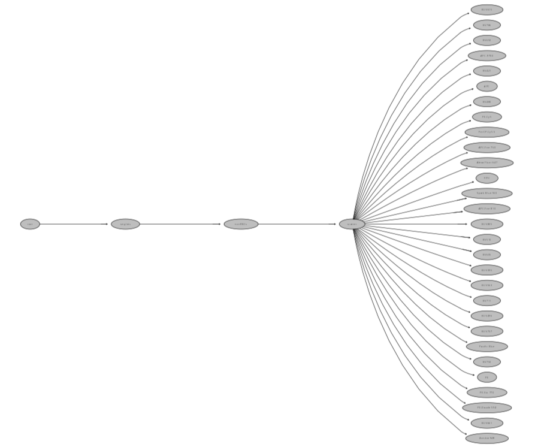

::: {style="text-align: right;"}
[](https://www.gnu.org/licenses/agpl-3.0.en.html) [](http://creativecommons.org/licenses/by-sa/4.0/)
:::

For the YouTube livestream schedule, see [here](https://www.youtube.com/@cytometryinr)

For screen-shot slides, click [here]()

<br>

---

# Background

In the [previous]() walk-through, we generated signature matrices for both bead and cell controls using the `flowGate` and `Luciernaga` R packages. The normalized fluorescent signatures were generated by extracting cells (or beads) from the peak detector gates, taking the median measurement across these, subtracting out the equivalent background, and then normalizing (scaling) the values to range from 0 to 1. The signatures from all the fluorophores were then assembled into a signature matrix. This workflow is representative of the approach taken within most commercial softwares in the steps leading up to unmixing. 

Unfortunately, relying on a summary measurement (median in this case) often limits what we are able to perceive, and when it comes to the unmixing controls, there is plenty of additional information that can be gleaned. During [Week 12](), we showcased the use `Luciernaga` packages `LuciernagaIntegration()` to identify the tandem degradation from APC-Fire 810 to APC that was occuring in the cell single color control (but not the bead single color control prepared from the same antibody vial). 

In this walk-through, we will take a look at the other 29-fluorophores in the panel, and see other frequently encountered patterns when we take a granular look at our unmixing control contents. We will also explore how to leverage this information to take these outputs and use them as replacements in the fluorophore matrix. 

# Walk Through

## Set Up

### Retrieving GatingSet

We will begin by loading the R packages we need today to our local environment, via the `library()` call. As a [reminder](), we will need to have at least `Luciernaga` version 0.99.10 installed to use the functions (as covered last walk-through). 

```{r}
library(dplyr)
library(purrr)
library(flowWorkspace)
library(Luciernaga)
library(ggplot2)
```

Next up, specify the storage (.fcs files) and output (.gs folder) locations (if you are following the courses organization scheme). 

```{r}
#StorageLocation <- file.path("course", "SDY3080", "data", "SDY3080")
StorageLocation <- file.path("data", "SDY3080")

#OutputLocation <- file.path("course", "SDY3080", "outputs")
OutputLocation <- file.path("outputs")
```

With this done, lets proceed to load our CellSC GatingSet back into the local environment from its .gs folder. As a reminder, this is the one where the peak detector gates had been created, checked and corrected. 

```{r}
CellSCPath <- file.path(OutputLocation, "CellsSC_GS_Amplified.gs")
CellsSC_GatingSet <- load_gs(CellSCPath)
```

```{r}
#| eval: TRUE
plot(CellsSC_GatingSet)
```



### Assembling Template

Since `LuciernagaIntegration()` relies on the use of a template for matching the individual single-color control specimen with the corresponding peak detector gate, let's reasseble it by retrieving the updated metadata using `pData()`, and reorganize the columns into the expected order. 

```{r}
Template <- pData(CellsSC_GatingSet)
Template <- Template |> relocate(Fluorophore, Antigen, Type, Detector, Negative, .after="name")
```

We can also optionally remove the 3 samples that we choose not to investigate using the `dplyr` packages `filter()` function on the data.frame object. We can save this output as our KeptCells object/variable

```{r}
KeptCells <- Template |>
     filter(!name %in% "DTR_2023_ILT_01-Reference Group-DR_Dump_CD19 Pacific Blue (Cells).1235702.fcs") |>
     filter(!name %in% "DTR_2023_ILT_01-Reference Group-DR_Viability_PMA Zombie NIR (Cells).1235709.fcs") |>
     filter(!name %in% "DTR_2023_ILT_01-Reference Group-DR_CD3 Alexa Fluor 488 (Cells).1235688.fcs") 
```

```{r}
#| eval: TRUE
KeptCells
```

### Rearranging by Detector

Before diving too far in, you may notice our current template is not exactly ordered in terms of peak detector order. The simplest way too fix this would be to provide the detectors in the correct order as a vector, factor the column, and then use the `dplyr` packages `arrange()` function to shuffle the rows to match. 

```{r}
DetectorOrder <- c("UV1", "UV2", "UV3", "UV4", "UV5", "UV6", "UV7", "UV8",
               "UV9", "UV10", "UV11", "UV12", "UV13", "UV14", "UV15", "UV16",
               "V1", "V2", "V3", "V4", "V5", "V6", "V7", "V8",
               "V9", "V10", "V11","V12", "V13", "V14", "V15", "V16",
               "B1", "B2", "B3", "B4", "B5", "B6", "B7", "B8",
               "B9", "B10", "B11", "B12", "B13", "B14",
               "YG1", "YG2", "YG3", "YG4", "YG5", "YG6", "YG7", "YG8", "YG9", "YG10",
               "R1", "R2", "R3", "R4", "R5", "R6", "R7", "R8")

KeptCells$Detector <- factor(KeptCells$Detector, levels=DetectorOrder)

KeptCells <- KeptCells |> arrange(Detector)
```

```{r}
KeptCells
```

## Cell Single-Color Controls

Lets start, working our way sequentially through individual fluorophores by laser. 

```{r}
Panel <- KeptCells |> select(Fluorophore, Antigen) |> mutate(Day=1)
Table <- FluorophoreMatrix(data=Panel, NumberDetectors = 64) # Aurora 5-laser
```

```{r}
Table
```


### UltraViolet

#### BUV395

Lets start with our BUV395 single-color control, which is conjugated to [CD62L](). 

```{r}
BUV395 <- LuciernagaIntegration(template=KeptCells[1,], 
  gs=CellsSC_GatingSet, GuessSimilar=TRUE)[[1]] # Square brackets to loose list notation
```

Lets first take a look at the "LinearSlices_Plot", to see what effect would have been on the signature if we had split the region we had grabbed in our "positive" gate into 10% bins across. 

```{r}
Plot <- BUV395$LinearSlices_Plot
plotly::ggplotly(Plot)
```

Glancing, we can see similar pattern where including the dimmer cells, we have an increasing amount of retained autofluorescence present for the detectors we typically associte with autofluorescence (V7, and lesser extent B3). 

Having noted this, lets check out the `LuciernagaQC()` grouped individual cell normalized signatures output stored under "LuciernagaQC_Signatures". 

```{r}
Plot <- BUV395$LuciernagaQC_Signatures
plotly::ggplotly(Plot)
```

Right off the back, it seems quite obvious that this is one of the fluorophores where the combination of antigen x fluorophore brightness is not terribly bright, which leaves the BUV395 at risk of residual autofluorescence contamination. 

Lets visualize this same plot in an alternative fashion, checking to see where the median signature ends up by comparison. 

```{r}
Plot <- BUV395$LuciernagaQC_AmalgamatedPlot
plotly::ggplotly(Plot)
```

So as we can see, cumulatively, ends up somewhere half up the step ladder. From this view, the contribution of the UV7 autofluorescence is also visible as a shoulder. 

Lets retrieve the underlying data for this plot, and keep the Average, as well as variants with minimal and maxinum autofluorescence contribution of the autofluorescence peak. 

```{r}
Data <- BUV395$AveragedSignature_Data |>
   filter(Cluster %in% c("UV2_10", "Average", "UV2_10-V7_07-B3_02"))
```

Lets pass these individually to `QC_SimilarFluorophores()` and gage the difference. 

```{r}
QC_WhatsThis(x="UV2_10", columnname="Cluster", data=Data, NumberHits=5, NumberDetectors=64, returnPlots=FALSE)
```

```{r}
QC_WhatsThis(x="Average", columnname="Cluster", data=Data, NumberHits=5, NumberDetectors=64, returnPlots=FALSE)
```

```{r}
QC_WhatsThis(x="UV2_10-V7_07-B3_02", columnname="Cluster", data=Data, NumberHits=5, NumberDetectors=64, returnPlots=FALSE)
```

As we can see in this case, we go from a close match to the reference BUV395 for our "UV2_10" (i.e. 'single peak at UV2, height 1.0') with a cosine value of 0.99, which then drifts to a value of 0.93 for the "Average" signature. This in turn dramatically drops for the dimmest staining cells with the "UV2_10-V7_07-B3_02" (i.e. peak detector at UV2, height 1.0; second peak at V7, relative height 0.7 to main peak, third peak at B3, relative height of 0.2 to main peak), where the cosine value reaches 0.71. 

If we visualized the difference in these angles, we would see the following

```{r}
#| code-fold: TRUE
cos_vals <- c(1, 0.99, 0.93, 0.71)
theta <- acos(cos_vals)

df <- data.frame(
  label = paste0("cos = ", cos_vals),
  angle_deg = round(theta * 180 / pi, 1),
  x = sin(theta),
  y = cos(theta)
)

ggplot(df) +
  geom_segment(aes(x = 0, y = 0, xend = x, yend = y, color = label),
               arrow = arrow(length = unit(0.25, "cm")),
               linewidth = 1) +
  coord_fixed(xlim = c(-0.1, 1), ylim = c(-0.1, 1.1)) +
  geom_hline(yintercept = 0, color = "grey80") +
  geom_vline(xintercept = 0, color = "grey80") +
  labs(x = NULL, y = NULL, color = "Vector",
       title = NULL) +
  theme_bw()
```

Before we go on, lets evaluate the proportion of cells within our positive gated region as distributed across our signature variants

```{r}
Plot <- BUV395$ProportionPlot
plotly::ggplotly(Plot)
```

:::{.callout-caution title="Caution"}
So, 2% of the cells being a BUV395 signature match, 26% matching the average, and 1% matching the dimmest. In terms of improved unmixing, if we could shift our original positive gate to the right (retaining brighter cells) the unmixing might improve overall. 
:::

#### BUV496

Lets next tackle one of our most autofluorescently similar fluorophores, BUV496, conjugated in this case to CD8. Given it is a primary marker and how we gated, we can at least be reasonably confident that it should be relatively bright. 

```{r}
BUV496 <- LuciernagaIntegration(template=KeptCells[2,], gs=CellsSC_GatingSet, GuessSimilar=TRUE)[[1]] # Square brackets to loose list notation
```

Lets first take a look at the "LinearSlices_Plot", to see what effect would have been on the signature if we had split the region we had grabbed in our "positive" gate into 10% bins across. 

```{r}
Plot <- BUV496$LinearSlices_Plot
plotly::ggplotly(Plot)
```

As anticipated, the antigen-fluorophore combination alongside our gate placement on the bulk of the CD8 T cells means that there was little difference across 10% bins in terms of the overall signature. 

Having noted this, lets check out the `LuciernagaQC()` grouped individual cell normalized signatures output stored under "LuciernagaQC_Signatures". 

```{r}
Plot <- BUV496$LuciernagaQC_Signatures
plotly::ggplotly(Plot)
```

`LuciernagaQC()` only returns two variant signatures, the main diffeence being slightly different secondary V6 peaks. The difference between the two is likely attributable to the rounding applied to each detector by the function behind the scenes (values of 0.24 rounding down to 0.2, values of 0.25 rounding up to 0.3). 

Seeing as we only have two signature variants, want to guess where the median signature ends up at? 

```{r}
Plot <- BUV496$LuciernagaQC_AmalgamatedPlot
plotly::ggplotly(Plot)
```

Lets retrieve the underlying data for this plot for subsequent steps, no need to filter since we only have three signatures when you include the "Average".

```{r}
Data <- BUV496$AveragedSignature_Data
```

Lets pass these signatures individually to `QC_SimilarFluorophores()` and gage the difference. 

```{r}
QC_WhatsThis(x="UV7_10-V6_02", columnname="Cluster", data=Data, NumberHits=5, NumberDetectors=64, returnPlots=FALSE)
```

```{r}
QC_WhatsThis(x="Average", columnname="Cluster", data=Data, NumberHits=5, NumberDetectors=64, returnPlots=FALSE)
```

```{r}
QC_WhatsThis(x="UV7_10-V6_03", columnname="Cluster", data=Data, NumberHits=5, NumberDetectors=64, returnPlots=FALSE)
```

The first two return as cosine values of 1.00, while the last returns as 0.99 vs. the reference BUV496. Lets visualized the difference in these angles

```{r}
#| code-fold: TRUE
cos_vals <- c(1, 0.99)
theta <- acos(cos_vals)

df <- data.frame(
  label = paste0("cos = ", cos_vals),
  angle_deg = round(theta * 180 / pi, 1),
  x = sin(theta),
  y = cos(theta)
)

ggplot(df) +
  geom_segment(aes(x = 0, y = 0, xend = x, yend = y, color = label),
               arrow = arrow(length = unit(0.25, "cm")),
               linewidth = 1) +
  coord_fixed(xlim = c(-0.1, 1), ylim = c(-0.1, 1.1)) +
  geom_hline(yintercept = 0, color = "grey80") +
  geom_vline(xintercept = 0, color = "grey80") +
  labs(x = NULL, y = NULL, color = "Vector",
       title = NULL) +
  theme_bw()
```

Before we go on, lets evaluate the proportion of cells within our positive gated region as distributed across our signature variants

```{r}
Plot <- BUV496$ProportionPlot
plotly::ggplotly(Plot)
```

:::{.callout-tip title="Pass"}
In this case, most of the variants are showing a signature reflective of the reference control. No change to our gate is required in this case. 
:::


#### BUV563

Next up, we are tackling BUV563, which is conjugated to CD69. One thing to note, this was one of the single-color controls that was prepared with PMA-ionomycin activated cells. The `LuciernagaIntegration()` default is still to use internal negative with minimal fluorophore peak detector contribution, so we will see how this behaves compared to the previous fluorophores. 

```{r}
BUV563 <- LuciernagaIntegration(template=KeptCells[3,], gs=CellsSC_GatingSet, GuessSimilar=TRUE)[[1]] # Square brackets to loose list notation
```

Lets first take a look at the "LinearSlices_Plot", to see what effect would have been on the signature if we had split the region we had grabbed in our "positive" gate into 10% bins across. 

```{r}
Plot <- BUV563$LinearSlices_Plot
plotly::ggplotly(Plot)
```

Glancing at the resulting plot, there is a smidge of difference across the V7 detector as we compare the variant signatures across the bins, but overall the difference appears relatively minor compared to what we saw with BUV395. 

Having noted this, lets check out the `LuciernagaQC()` grouped individual cell normalized signatures output stored under "LuciernagaQC_Signatures". 

```{r}
Plot <- BUV563$LuciernagaQC_Signatures
plotly::ggplotly(Plot)
```

The observation we saw is born out with the outputs from `LuciernagaQC()`, as we have four variant signatures, but similar to the case with BUV496, they appear to be noise related to the rounding of the relative heights of the secondary and third peaks.

Lets visualize this same plot in an alternative fashion, checking to see where the median signature ends up by comparison. 

```{r}
Plot <- BUV563$LuciernagaQC_AmalgamatedPlot
plotly::ggplotly(Plot)
```

At this point, it feels unecesary to dive further, but we can check the "Average" signature using `QC_WhatsThis()` for final verification. 

```{r}
Data <- BUV563$AveragedSignature_Data
```

```{r}
QC_WhatsThis(x="Average", columnname="Cluster", data=Data, NumberHits=5, NumberDetectors=64, returnPlots=FALSE)
```

:::{.callout-tip title="Pass"}
For BUV563, we didn't find any substantial signature variants, so our gate is likely fine as placed, and we can move on to screening the next fluorophore. 
:::

#### BUV615

Next up, we have BUV615, which is conjugated to CCR4. If we are classifying in terms of marker expression, this is more on the chemokine side, so we may encounter some lower antigen density issues compared to the primary markers like CD8. 

```{r}
BUV615 <- LuciernagaIntegration(template=KeptCells[4,], gs=CellsSC_GatingSet, GuessSimilar=TRUE)[[1]] # Square brackets to loose list notation
```

Lets first take a look at the "LinearSlices_Plot", to see what effect would have been on the signature if we had split the region we had grabbed in our "positive" gate into 10% bins across. 

```{r}
Plot <- BUV615$LinearSlices_Plot
plotly::ggplotly(Plot)
```

Right off the bat, we can already see a step-ladder arising out of the typical autofluorescence peaks (V7, UV7, B3). This should prove an interesting fluorophore to screen if nothing else!

Having noted this, lets check out the `LuciernagaQC()` grouped individual cell normalized signatures output stored under "LuciernagaQC_Signatures". 

```{r}
Plot <- BUV615$LuciernagaQC_Signatures
plotly::ggplotly(Plot)
```

What in the world? We have a fuzzy caterpillar! If we unclick the lower signature variants, we eventually end up with the following plot


We can tell that among the grouped individual cell normalized signature variants, everyone seems to be relatively uniform for the UV10 peak, but, there is a distinct gradient appearance to the YG3 peak. This may be a signal that the tandem is decoupling back into its respective components. 

Lets visualize this same plot in an alternative fashion, checking to see where the median signature ends up by comparison, to better help us gage the extent that this may be happening at 

```{r}
Plot <- BUV615$LuciernagaQC_AmalgamatedPlot
plotly::ggplotly(Plot)
```

Still appears variable. Lets check what the reference signature appears like for context. 

```{r}
Plot <- QC_ReferenceLibrary("BUV615", returnPlots=TRUE, NumberDetectors=64)[[2]]
plotly::ggplotly(Plot)
```

So overall, the reference has a YG3 detector closer to 0.8, so we have signature variants appearing both below and above it. 

Lets retrieve the underlying data for this plot, and keep the Average, as well as variants with minimal and maxinum autofluorescence contribution of the autofluorescence peak. 

```{r}
Data <- BUV615$AveragedSignature_Data |>
   filter(Cluster %in% c("UV10_10-YG3_02", "Average", "UV10_10-YG3_10"))
```

Lets pass these individually to `QC_SimilarFluorophores()` and gage the difference. 

```{r}
QC_WhatsThis(x="UV10_10-YG3_02", columnname="Cluster", data=Data, NumberHits=5, NumberDetectors=64, returnPlots=FALSE)
```

```{r}
QC_WhatsThis(x="Average", columnname="Cluster", data=Data, NumberHits=5, NumberDetectors=64, returnPlots=FALSE)
```

```{r}
QC_WhatsThis(x="UV10_10-YG3_10", columnname="Cluster", data=Data, NumberHits=5, NumberDetectors=64, returnPlots=FALSE)
```

Interesting, the signature with the lower YG3 peak relative to UV10 appears to be the degraded fluorophore signature variant, coming in at a cosine value of 0.76 vs. the BUV615 reference. By contrast, the "average" is 0.97, and the one with brightest BUV615 is at 0.98.  Lets visualize these angles. 

```{r}
#| code-fold: TRUE
cos_vals <- c(1, 0.99, 0.98, 0.76)
theta <- acos(cos_vals)

df <- data.frame(
  label = paste0("cos = ", cos_vals),
  angle_deg = round(theta * 180 / pi, 1),
  x = sin(theta),
  y = cos(theta)
)

ggplot(df) +
  geom_segment(aes(x = 0, y = 0, xend = x, yend = y, color = label),
               arrow = arrow(length = unit(0.25, "cm")),
               linewidth = 1) +
  coord_fixed(xlim = c(-0.1, 1), ylim = c(-0.1, 1.1)) +
  geom_hline(yintercept = 0, color = "grey80") +
  geom_vline(xintercept = 0, color = "grey80") +
  labs(x = NULL, y = NULL, color = "Vector",
       title = NULL) +
  theme_bw()
```

In terms of neither "Average" or "UV10_10-YG3_10" matching the reference signature, this is not uncommon, as tandem fluorophore batches often can vary in their assembly (as well as the reference itself may have similarly been affected, or had some individual instrument acquisition variance)

Before we go on, lets evaluate the proportion of cells within our positive gated region as distributed across our signature variants

```{r}
Plot <- BUV615$ProportionPlot
plotly::ggplotly(Plot)
```

:::{.callout-warning title="Fail"}
Overall, 11% of the individual cells had signatures similar to the "Average". Fully degraded on the YG3 detector was around 5%. We also had 13% where the YG3 detector was co-equal to the UV10 peak.  

In this case, we have some clear signs of tandem degradation occuring within this single-color control. Whether this is a cell subset specific thing occuring in-vitro like we encountered previously with APC-Fire 810, or something at the level of the entire vial of antibody would be something we should investigate further. 
:::

#### BUV661

Continuing with our journey through the UV fluorophores, lets check out the BUV661 fluorophore, which was conjugated to V-delta-2. In the context of the [original study](https://www.frontiersin.org/journals/immunology/articles/10.3389/fimmu.2025.1628145/full), the Vγ9Vδ2 T cells cells were one the main subsets of interest. However, given their frequency can vary person to person, they screened in advanced to make sure the donor used for PBMCs had high enough percentage to use cells as the single-color control. 

```{r}
BUV661 <- LuciernagaIntegration(template=KeptCells[5,], gs=CellsSC_GatingSet, GuessSimilar=TRUE)[[1]] # Square brackets to loose list notation
```

Lets first take a look at the "LinearSlices_Plot", to see what effect would have been on the signature if we had split the region we had grabbed in our "positive" gate into 10% bins across. 

```{r}
Plot <- BUV661$LinearSlices_Plot
plotly::ggplotly(Plot)
```


There is some variation on V7 across the 10% bins, but it is much more reminiscent of what we encountered for BUV563. 

Having noted this, lets check out the `LuciernagaQC()` grouped individual cell normalized signatures output stored under "LuciernagaQC_Signatures". 

```{r}
Plot <- BUV661$LuciernagaQC_Signatures
plotly::ggplotly(Plot)
```

Two signatures, slightly different at R1 and R2. Want to guess where the median ends up at?  

```{r}
Plot <- BUV661$LuciernagaQC_AmalgamatedPlot
plotly::ggplotly(Plot)
```

Since this antigen-fluorophore combination appears to be behaving, lets wrap up by checking the average vs. the reference signature. 

```{r}
Data <- BUV661$AveragedSignature_Data
```

```{r}
Plots <- QC_WhatsThis(x="Average", columnname="Cluster", data=Data, NumberHits=5, NumberDetectors=64, returnPlots=TRUE)

Plots[[1]]
```

```{r}
plotly::ggplotly(Plots[[2]])
```

:::{.callout-tip title="Pass"}
Overall, a little different compared to the reference signature (likely due to a bit of the residual autofluorescence around V7). We may want to adjust a bit the gate positioning to the right to reduce this contribution, but overall, not particularly far off from where it should be. 
:::

#### BUV737

Next up, we have BUV737, conjugated to CXCR3. Seeing as it is a ligand, we note before starting that this may be similar scenario as what we anticipated encountering for CD62L or CCR4. 

```{r}
BUV737 <- LuciernagaIntegration(template=KeptCells[6,], gs=CellsSC_GatingSet, GuessSimilar=TRUE)[[1]] # Square brackets to loose list notation
```

Lets first take a look at the "LinearSlices_Plot", to see what effect would have been on the signature if we had split the region we had grabbed in our "positive" gate into 10% bins across. 

```{r}
Plot <- BUV737$LinearSlices_Plot
plotly::ggplotly(Plot)
```

It is immediately obvious we have step-ladder peaks for V7, B3 and UV7, something that we haven't quite seen to this extent for the previous fluorophores. Main thing to note is that the fluorophores two peaks (UV14 and R5) are remaining consistent. This is often what we see for particularly dim antigen-fluorophore combinations where the autofluorescence residual is substantial portion of the final area under the curve. 

Lets break out `LuciernagaQC()` to group the individual cell normalized signatures, as stored in the "LuciernagaQC_Signatures" output in the list. 

```{r}
Plot <- BUV737$LuciernagaQC_Signatures
plotly::ggplotly(Plot)
```

Wait a second, where did the autofluorescence peaks go? Well, there respective regions now look awfully flat, so it looks like after subtraction they ended up with negative values that ended up rounded to 0 (we can raise whether this was correct approach with the package maintainer). 

Regardless, similar to CCR4, the primary detector peak UV14 appears consistent, but the R5 detector appears to similarly be experiencing step ladder, suggestive that the tandem is degrading. 

Lets visualize this same plot in an alternative fashion, checking to see where the median signature ends up by comparison. 

```{r}
Plot <- BUV737$LuciernagaQC_AmalgamatedPlot
plotly::ggplotly(Plot)
```

Some of the signatures appear erratic (generally typical of when few cells are present to begin with). Lets retrieve the underlying data for this plot, and keep the Average, as well as variants with reasonable appearing minimal and maxinum autofluorescence contribution of the R5 detector

```{r}
Data <- BUV737$AveragedSignature_Data |>
   filter(Cluster %in% c("UV14_10-R5_03-B11_00","Average", "UV14_10-R5_07-B11_02"))
```

Lets pass these individually to `QC_SimilarFluorophores()` and gage the difference. 

```{r}
QC_WhatsThis(x="UV14_10-R5_03-B11_00", columnname="Cluster", data=Data, NumberHits=5, NumberDetectors=64, returnPlots=FALSE)
```

```{r}
QC_WhatsThis(x="Average", columnname="Cluster", data=Data, NumberHits=5, NumberDetectors=64, returnPlots=FALSE)
```

```{r}
QC_WhatsThis(x="UV14_10-R5_07-B11_02", columnname="Cluster", data=Data, NumberHits=5, NumberDetectors=64, returnPlots=FALSE)
```

Overall, looking like the average is comparable to the reference control, with the R5 variants being similar to less extents. If we visualized the difference in these angles, we would see the following

```{r}
#| code-fold: TRUE
cos_vals <- c(1, 0.91, 0.97)
theta <- acos(cos_vals)

df <- data.frame(
  label = paste0("cos = ", cos_vals),
  angle_deg = round(theta * 180 / pi, 1),
  x = sin(theta),
  y = cos(theta)
)

ggplot(df) +
  geom_segment(aes(x = 0, y = 0, xend = x, yend = y, color = label),
               arrow = arrow(length = unit(0.25, "cm")),
               linewidth = 1) +
  coord_fixed(xlim = c(-0.1, 1), ylim = c(-0.1, 1.1)) +
  geom_hline(yintercept = 0, color = "grey80") +
  geom_vline(xintercept = 0, color = "grey80") +
  labs(x = NULL, y = NULL, color = "Vector",
       title = NULL) +
  theme_bw()
```

One thing to remember however, is that due to the rounding of the negatives, this is not necessarily what the signature looks like in practice, as there are negative peaks that would render the fluorophore very unsimilar to the reference had the negative values been left intact. 

Before we go on, lets evaluate the proportion of cells within our positive gated region as distributed across our signature variants

```{r}
Plot <- BUV737$ProportionPlot
plotly::ggplotly(Plot)
```

:::{.callout-warning}
So, while degraded products are present, at first glance looking at the proportions, it looks like this fluorophore has enough fluorophore in good shape to allow it to continue. However, as noted, not full story, since the autofluorescence peaks appeared to vanish entirely (do to `LuciernagaQC()` handling of negative values by default) showing limitation to the the generic `LuciernagaIntegration()` approach in this case. 

In the actual panel implementation, as soon as this cell unmixing control was swapped to its bead unmixing control equivalent, panel unmixing substantially improved. 
:::

#### BUV805

And wrapping up our exploration of the UV laser fluorophores, lets check out the BUV805 fluorophore, which is conjugated to CD4. Given antigen density on a CD4 T cell, this should prove less complicated than the last couple fluors we have encountered.

```{r}
BUV805 <- LuciernagaIntegration(template=KeptCells[7,], gs=CellsSC_GatingSet, GuessSimilar=TRUE)[[1]] # Square brackets to loose list notation
```

Lets first take a look at the "LinearSlices_Plot", to see what effect would have been on the signature if we had split the region we had grabbed in our "positive" gate into 10% bins across. 

```{r}
Plot <- BUV805$LinearSlices_Plot
plotly::ggplotly(Plot)
```

Pretty much no difference on the autofluorescence detectors, so very similar to what we saw for BUV496 CD8. Lets check out the `LuciernagaQC()` grouped individual cell normalized signatures output stored under "LuciernagaQC_Signatures". 

```{r}
Plot <- BUV805$LuciernagaQC_Signatures
plotly::ggplotly(Plot)
```

Two signatures, one with slightly more autofluorescence residual. Lets visualize this same plot in an alternative fashion, checking to see where the median signature ends up by comparison. 

```{r}
Plot <- BUV805$LuciernagaQC_AmalgamatedPlot
plotly::ggplotly(Plot)
```

And for completionist sake, lets compare the "Average" signature to the reference using `QC_WhatsThis()`

```{r}
Data <- BUV805$AveragedSignature_Data 
```

```{r}
QC_WhatsThis(x="Average", columnname="Cluster", data=Data, NumberHits=5, NumberDetectors=64, returnPlots=FALSE)
```

```{r}
Plot <- BUV805$ProportionPlot
plotly::ggplotly(Plot)
```

:::{.callout-tip title="Pass"}
Overall, in good shape, although interesting proportion splits across the two signature variants, might be worth adjusting the gate slightly to the right overall. 
:::

# To Be Continued

::: {style="text-align: right;"}
[](https://www.gnu.org/licenses/agpl-3.0.en.html) [](http://creativecommons.org/licenses/by-sa/4.0/)
:::


